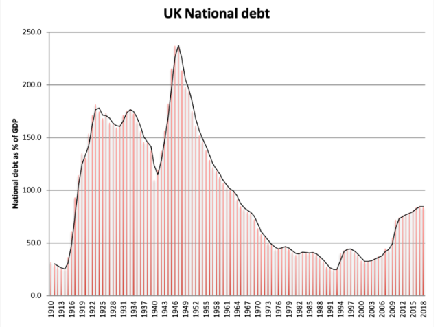

---
output:
  pdf_document: default
  html_document: default
---
# CHAPTER 1: REVOLUTIONS IN THE MINDS OF MEN

Let's go on a voyage through time. Imagine you had a magic carpet that allowed you to flit across the continents and centuries at will, and that you set out to see first-hand how some of the cornerstone ideas of our economic system came into being. Ready? Let's have a look around...

# 1.1 In the Beginning Came Adam

UNDER STARRY SKIES, distant in time and space from our present-day fishermen, sits a learned professor, beavering away at his manuscript. The year is 1773; the location, Kirkaldy, a small town in Scotland; the author, Adam Smith (1723-90). The full title of Smith's great work would be 'An Inquiry into the Nature and Causes of the Wealth of Nations.'

On this cool and starlit night, Smith was writing the fifth and final book of the 'Wealth of Nations', entitled 'On the Revenue of the Sovereign or Commonwealth'. Smith asked a series of questions, such as how should the activity of the government be funded, and which taxes a state should impose.

*Plaque marking the site in Kirkcaldy where Smith lived.*

Whilst Smith worked by candlelight, far across the oceans, in Boston Harbour in what was then the British colony of North America, some demonstrators had boarded ships of the British East India Company and were throwing chests of tea into the sea. The demonstrators' objection: The British state was collecting taxes from them, yet had refused to give them representation in the British parliament. From this dispute, the American Revolution was born.  Adam Smith himself agreed with the American revolutionaries that the North American colonies should be represented in the British parliament in proportion to the taxes they paid.

Revolution was also brewing in France. In 1766, French economist and statesman Anne Robert Jacques Turgot had said: "The art of taxation consists in so plucking the goose as to procure the largest quantity of feathers with the least possible amount of squawking." Francois Quesnay, one of the first true economists, in 1758 had argued for a single tax on the value of land to replace all other taxes in his monograph *Tableau Économique.* His advice was ignored, however, and a land-tax system of this kind was never applied. By 1789, the geese had not only squawked - they had overthrown the farmer, guillotined him, and taken control of the farm. The French Revolution had arrived. 

## From Rural to Urban Land

Let's take our magic carpet across to the western edge of North America and a century forward in time. A journalist in San Francisco is learning his craft. He is fascinated by a subject which was then still called 'political economy.' He's interested in one question in particular: Why is there so much poverty in the midst of so much technological progress? The journalist, Philadephia-born Henry George (1839-97), son of an English immigrant, sees that it is in the biggest, most advanced cities, with the most technological advancement, where the worst, most grinding poverty is to be encountered. The book for which Mr. George became famous was called *Progress and Poverty.* It became a bestseller, outselling all books published in the 1870s, apart from the Bible. Yet Henry George's name is not known to many today.

George's work echoed that of David Ricardo (1772-1823), a banker who became a renowned economic theorist. Ricardo, who remains well-known amongst economists today, had argued that an agricultural landlord contributed nothing to the well-being of society. He merely extracted the surplus from the land once the costs of labour and tools had been paid. This surplus is known as 'rent.' As had been previously argued by Adam Smith, the best tax was a tax on rent. Whilst Ricardo modelled a rural economy, Henry George was concerned with urban land. Ownership of urban land allowed landowners to benefit as society developed and urban areas densified, even if they had contributed nothing to the increase in land values. George popularised the message that the remedy was to tax urban landlords. He used beautiful words that everyday folk could understand. 

*"Man is the only animal whose desires increase as they are fed; the only animal that is never satisfied"* [@George1879]

Inspired by Henry George, a woman by the name of Elizabeth Magie (1866-1948) invented a board game called the *Landlords' Game*. The game illustrated that without a tax on urban land, property tended to get monopolized and those who owned it extracted rent from those who did not. If, however, landowners were taxed, then a stable and fair (if rather boring) outcome ensued. Later, the game was shorn of the beneficial, but boring rules, leaving a game where an unstable and unfair (albeit fun) set of rules remained. The original political implications of the game were lost, and the new version of the game was marketed as 'Monopoly.' The goal of Monopoly is to own the whole board, and to drive all the other players into bankruptcy. This makes for exciting play, but it was the antithesis of a model for a system of widely-shared prosperity. The lessons of Magie's original version of the game and the insights of Henry George remain germane in our day, and accordingly, we will consider the case for a land value tax later in this book.

## War and Progress

Henry George inspired many of his readers, including the young Winston Churchill (1874-1965) and British prime minister David Lloyd George (1863-1945). Towards the end of the First World War, there was even a budget which implemented a Land Value Tax, the 'People's Budget.' However, due to the resistance of landowners and the difficulties of land valuation, this budget was never implemented. Nevertheless, from the late nineteenth century through the whole of the twentieth century, and particularly after the Second World War, the conditions of the poor improved. The curse of destitution caused by the oppressive rents charged by slum landlords was almost banished.

One great milestone in this history of progress was the Beveridge report. Released in 1942 by an interdepartmental committee of civil servants chaired by Liberal economist Lord Beveridge (1879-1963), it laid the basis for the post-war welfare state. Its aim was to banish five great evils: "Squalor, ignorance, want, idleness, and disease" [@Beveridge1942]. After World War Two, Beveridge's report became the basis for a social security system encompassing public education, public housing, a national health service, and macroeconomic management aimed at ensuring full employment. 

World War II had almost bankrupted Britain. Britain had financed the war through borrowing. The public debt ratio peaked at 238% of GDP in 1947. Despite this, postwar Britain soon rebuilt itself. It also managed to provide for its people a standard of living greater than that which prevailed before the war. Britain pursued a policy of low interest rates, moderate inflation, and high growth. As a result, the burden of public debt dropped to 70% of GDP in 30 years [@ReinhartCamenM.andKennethS.RogoffReinhart2010]. These accomplishments are in themselves remarkable. 

Beveridge was successful in his mission to lay the foundation for a comprehensive welfare-state. His reforms helped reduce the prevalence of the five great evils and transformed the previously hellish conditions of the poor. But we have not yet achieved Heaven on Earth. There are still great evils facing us: The destruction of the environment, a lack of affordable housing in many cities and towns, extreme inequalities of wealth and income (which in many cases cannot be justified by any corresponding differences in contributive merit), and some risks attendant on automation. We will explain why these evils arise, and explore how they can be fixed.

## The Global Machine and the Global Mission

Returning to the present day from our brief historical survey, we note that the subject once known as political economy is now called economics - even though the distribution of wealth and income remains driven in no small part by *political* choices. In our time, great container ships cross the oceans and aircraft roar across the skies. Massive machines in far-off lands churn out smartphones which seize the attention of billions of people for many hours each day. Many people live with more consumer comforts than in the past. Some things are cheap: It is relatively cheap to fly off to sun-kissed beaches on foreign shores. But some things are very expensive: It is wildly expensive to buy a flat in London, for example. 

The machinery of commerce is devoted to two purposes: To give people what they desire (or at least, what they can be coaxed into buying), and to make a profit in so doing. The commercial machine works remarkably smoothly in many of its day-to-day operations. But there are rumblings of discontent. In 1848, Karl Marx wrote in the Communist Manifesto that the "spectre of communism" was haunting Europe. Today, the rising dangers of environmental destruction and runaway technology, and the dysfunctions of a state run by and for the rent-seeking superrich, keen to enrich themselves still further, cast shadows on this vast machine for the happy fulfilment of our consumer desires.

In America in 2016, a man who is very good at telling people what they want to hear promised to 'drain the swamp' in Washington DC. This man would soon become president of the United States of America. It would be natural to take these words to mean that the army of smart-suited lobbyists whose job it is to nudge the ship of state to favour the interests of their corporate employers would be sent packing. Nothing of the sort happened. Indeed, the swamp got even marshier and more sulphurous. The poor, who had seen nothing much in the way of improvements in prosperity despite forty years of productivity growth in the US, were increasingly addicted to prescription painkillers. In the United Kingdom and the United States, statistics showed the average lifespan of citizens had stopped increasing.

This is by now a truly global civilisation. And scientists are warning that something truly global is wrong. Groups of scientists are calling for radical shifts in our global infrastructure, aiming at an end the burning of fossil fuels within a couple of decades. The great machinery of commerce, which has since the end of the Second World War been devoted to giving us more and more stuff, will need to be turned in a new direction and given a new purpose.

To turn around this great global machine, we need to apply not only the great resources of the state, but also the dynamism, flexibility, and capacity for rapid action of the private sector. We need to harness the profit motive for the good of the planet. It needs to become cheaper and more profitable to do good than to do harm. And that means we need to tax the damages that individuals and companies cause to the living planet. In this book, we outline how the tax system can be reformed to achieve this outcome, not only by changing the incentives of the private sector in one country, but also by ensuring that other countries have a reason to follow suit. The reforms we propose will transform the prospects of early-adopter countries so significantly that others will have no choice but to follow their lead.

## Of Flats and of Flights

It's now a wet November evening. Let me introduce Peter and his wife, Lucy, who are shivering in their North London flat, pressing refresh on their email program and looking at their phones. They are waiting to see whether their offer has been accepted on a two-bedroom flat in a rundown neighbourhood of the city.

An advert flicks up for a getaway flight to somewhere sunnier. If they can take the time off, then they can get away to a nice sunny island for a week. The small flat they are purchasing is, by normal standards, inordinately expensive. They will be paying off their mortgage until they reach retirement age. But the flight is cheap: They can book it for less than one day's wages each.

To Peter and Lucy, this is the usual way of things, although they don't like it much. Their friend Mel pointed out to them that the world is running out of time to tackle one of the major environmental problems of all time: Climate destabilisation due to increased greenhouse gas levels in the atmosphere. Lucy feels a certain amount of guilt in the back of her mind for taking a holiday and the associated carbon emissions, but is swayed by the low cost of the flights and her felt need to get away from the damp cold and stress of London. When buying a roof over their heads is so expensive and so stressful, any normal person would need a little relief. She and Peter book a flight to sunny Mallorca.

## Are the Prices Right?

This book is about the prices of things, and how these are influenced by the taxation system. Houses and flights already have some taxes applied to them. If you live in a house, you pay Council Tax. And if you take a flight, you pay Air Passenger Duty. Putting a higher tax on houses will *reduce* the purchase price of the house. That's because the value of the house depends in part on the obligations associated with it, taxation included. 

This book does not argue for environmental taxes primarily to change the behaviour of consumers. Rather, it seeks to change the economy to provide goods in ways that do not damage the living planet. Sometimes, this will be difficult. It's hard to design aeroplanes that do not burn oil products (although it is possible, albeit financially and energetically expensive, to produce low-carbon synthetic kerosene). But technologies change and adapt to market demands. And if zero-carbon planes cannot be designed, then perhaps those who fly should pay for the capture of carbon dioxide from the air and its permanent safe storage. The tax on flying, and on other activities that produce greenhouse gases, should be enough to encourage people to capture those gases from the air if they cannot be eliminated directly.

The prices of things should be just. A just price requires a just tax system. A just tax system will cause people to pay for the damage they cause to the environment. A just system will also ensure that nobody gets rich *merely by owning* some of the things in life that are in limited supply, such as land. In short, in a just economy, justice and social benefit go hand-in-hand; fairness and efficiency are two sides of the same coin. That is the essence of Tax Heaven, and the aim of the reforms we propose in what follows.  

There's an old joke about a man who asks for directions and gets the response: "Well, if I were going there, I wouldn't start from here." It's not just the final state of affairs that must be just, but also the pathway for getting from here to there. Later on, we will try to show how to transition in a fair way to a just tax system.

## Bringing Back Self-Respect

Further down the street from Peter and Lucy lives Fred. Fred is on benefits. He took a job at one point a couple of years ago, but he found that once this happened, his benefits were cut off. There was a gap between his new wage and the benefits coming in. As a result, he didn't have the money for the rent. 

The UK has rolled out a reform known as 'Universal Credit,' which integrates four income-related benefits into one. The 'benefits withdrawal' rate (in effect the income tax on additional income) on Universal Credit is 63%. This means that you lose two-thirds of the extra income you get from working (rather than simply staying on benefits and not working). Does that seem like a deal likely to motivate the long-term unemployed to get back into work? Some of the problems with the new system also relate to administration and design issues. The Universal Credit system has also seen delays in payments, which has caused problems for recipients, like Fred, many of whom have no savings to see them through short-term cash flow bottlenecks. 

It does not have to be this way.

## Questions for Change

In the next section, we define five major questions that this enquiry seeks to answer. They are as follows:

1. What would an economy fit for our children look like? 
2. What are the economic conditions for widespread and sustainable prosperity?
3. How can we define a better tax and social security system?
4. How can the changes be achieved?
5. What advantages would such changes bring?

Onwards then, to defining the future...
