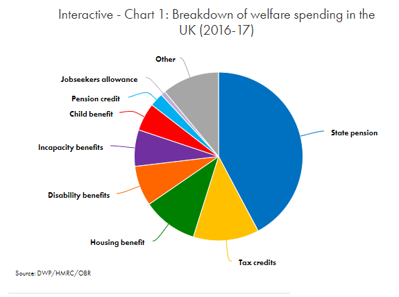
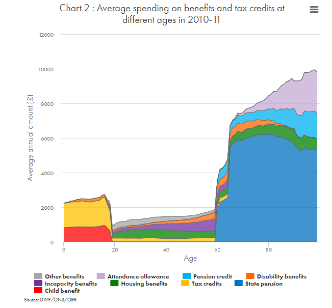
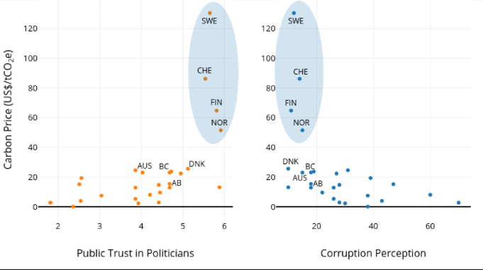

# CHAPTER 6: TAX IN PRACTICE

# 6.1: The Existing Tax System

Okay. So, we understand that it’s important for taxes to be well designed. We understand that they should be applied strategically, to tax bases that are not disproportionately impacted by their implementation. They should be efficient; they should be fair; and most of all, they should be part of a system that provides the greatest amount of benefit possible from the revenue raised. 

We also established that the core purposes of taxation could be reduced to three streams: revenue-raising, behaviour-influencing, and fairly redistributing rents and income across the population. That taxes could be useful in achieving these goals is a theory that economists and political theorists alike have ascribed to.

But is this the reality in the UK today? With one of the oldest tax-and-welfare systems in the world, and well-established norms that facilitate its implementation, it would appear that the UK should be in a good position to translate these principles into successful practice. Is that where we are in reality?

In this chapter we take on this question by analysing the existing taxation system. We look at how it operates in practice, and show the significance of the perspectives laid out in the last chapter. After taking a look at each of the tax system's characteristics in turn, we'll be able to evaluate the current condition of taxation in the UK. 

We'll also look at the ways in which taxes fail. As our framework suggests, simplicity and practicality are core components of any successful taxation system. When large-scale evasion or avoidance occurs, this is a failure of the system. We therefore describe how taxes are routinely avoided in the UK; by clearly outlining the methods by which evasion and avoidance occur, we hope to create a tool for citizens and the policy-makers alike to hold evaders and avoiders accountable. 

Taking a systemic perspective of the UK tax and welfare system can be helpful in determining where its pressure points lie. Tax and welfare are two sides of the same policy coin. One side cannot be fully analysed or appreciated without the other. Although our later chapters on inequality cover the UK welfare system in more detail, here we take a step back and look at these policy tools holistically, gauging the overall levels of spending and assessing the current benefits system. 

# 6.2 Revenue and reasons

## Tax in Practice
The UK tax system consists of approximately 26 different taxes, exploiting many tax bases. In total, £594 Billion was received by the HMRC in 2017/18 [@HMRC2019]. With national GDP in 2018 recorded as £2.033 trillion [@ONS2019], this translates to an overall tax burden of 29.2%. Of this, income taxes made up £180 billion, national insurance contributions £131 billion, and VAT £125 billion. This demonstrates how concentrated the UK’s tax base is, with over 73% of total receipts raised from these three taxes. 

A diminishing number of taxpayers are responsible for paying the bulk of income tax. According to Full Fact, the top 1% of earners were responsible for 28% of overall income tax revenues [@FullFact2019]. This number is relevant when it comes to the perspective of those designing tax policies. Retaining an attractive enough tax environment for top earners is a core priority of government tax bodies and is one of the more important considerations behind 'practicality' considerations in this space. A top tax rate of 100% may be attractive to some enthusiastic tweeters, but is, in reality, impractical. Policymakers must balance a desire to raise money or combat inequality using  tax rate increases on high incomes against creating incentives for tax evasion or avoidance and capital flight. 

Overall, the proportions of total tax receipts received by HMRC in the UK has remained mostly stable since the 1980s [@HMRC2019]. The key changes of note have been the increased revenues contributed by indirect taxes, and the growing importance of consumption taxes, especially the value-added tax (VAT).

The wide range of tax bases has, however, remained, making the UK tax codes one of the most complex in the world. The UK tax code is now 12 times the size of the King James Bible, itself not exactly a nightstand novella. The tax code stood at 22,000 pages on last measurement [@Martin]. This is due in part to the Tax Re-write Project, which converted previously archaic and disorganised laws into plain, comprehensible English. Indeed, complexity and length can be negatively correlated. The 'shorter' US tax system is often thought of as more complex than that of the UK. However, it remains the case that the burden of administration and interpretation is still heavy, and there is substantial political support for simplification of the tax code. 

This complexity also has consequences for HMRC itself. It is the second-largest government department in terms of staff numbers. The administrative cost of running this organisation is substantial, running at £3.3 billion in 2016-17 [@NAO2017].

Part of the reason behind the complexity is the range of purposes which taxes are intended to achieve. Raising revenue for government spending is clearly the primary objective of VAT, income tax, and national insurance contributions. Carbon and environmental taxes are meant to change behaviour and regulate pollution. And the levels of child tax credits, income allowance, and housing provision are examples of the goal of redistributing income in the UK.  

As it stands, the tax system already makes a substantial contribution to these three goals. Taxes pay for the majority of government spending; taxes already redistribute income significantly; and taxes on activities that are harmful to the environment and to health have been levied to discourage those activities.

However, the tax system is not the only way to achieve these outcomes. Public services could be funded by issuing bonds or imposing user charges. Regulation to ensure high quality, readily accessible education, the strong protection of workers' rights, and changes to property rights could also help to lower inequality. As for behavioural incentives, education and exortation could be highly influential in reducing unhealthy behaviours, with legal prohibitions applied to those bads which are seen to be overwhelmingly harmful. Environmental objectives could also be achieved through government investment and stringent regulation, rather than market-based instruments. 

This is most clear when the tax system fails to generate the outcomes targeted. Some objectives are too important to leave to the market, especially when it comes to regulating social and environmental bads. Moreover, relying on tax revenue can be difficult when the system is as complex as it currently is. Increased complexity raises the risks of tax avoidance and evasion by the wealthiest of earners. 

# Welfare in Practice

But what about the flipside? As we’ve touched on already, the objectives of Beveridge’s welfare state were to create a comprehensive system that employed tax revenue, government policy, and moral authority to tackle the five great evils in society. Today, this is achieved through the welfare system. Allocating funds to people of diminished capacity, low-income citizens, and the elderly creates a safety net, a minimum standard of living that people can count on... in theory.

According to the Office for Budgetary Responsibility, the UK public sector is estimated to have spent £771 billion in 2016-17. Within that, around £484 billion was allocated to the 'welfare state.' Here, we define the 'welfare state' broadly to include "health, education, social services and housing, as well as social security and tax credits"[@OBR2018]. The rest of the spending was on the military and on servicing the public debt.

Of the money allocated to the welfare state, some £217 billion was spent on social security and tax credit spending - i.e. some 28% of total public spending in that fiscal year [@OBR2018]. That amounts to about £8000 paid out per UK household.

In fact, the UK welfare system is so comprehensive that at some point in an individual’s life, they will most likely receive some form of payments from the state. These are most commonly in the form of child tax credits or child benefit, and state pension payments during retirement age. Over half of families in the UK receive income from one or more welfare payments in the system, with the majority of these payments (59%) going towards pension obligations. Together with personal tax credits, mainly targeting families with dependents, and housing benefit, these three areas combine to make around two-thirds of total welfare spending. Job seekers' allowance, despite its infamous status, made up only 1% of the total spend on social security provisions in total. The figure below expands on this spending.

As the figure above shows, the largest single slice of the expenditure on welfare is directed towards people in retirement, sitting at 40% of total revenue. Despite recent policy changes to raise the retirement age in light of an aging population, this portion of welfare is set to increase. The rest is divided amongst those on disability and incapacity benefit, families, and low-income people. These benefits are either on a contributory basis, i.e. pension payments that are dependent on National Insurance contributions, or non-contributory, such as the basic state pension. These benefits can be awarded on a means-tested basis, i.e. housing benefit, or be universally applicable, like universal credit.

As we outlined in the previous chapter, there are three key purposes to the UK benefits system: To provide a safety net for all individuals at the bottom of the economic system; to care for people with special needs; and to protect individuals into old age with a state pension. 

There are obviously flaws in the reality of achieving these goals, some of which will be expanded on in our inequality chapter. We can summarise by boiling these down to (i) administrative costs and errors and (ii) issues with inequality and delivery. Food-bank use in the UK rose 13% in the 2017-18 period alone, following a 6% increase the year previously [@TheTrussellTrust2019]. This is due in part to rising costs of living, and in part to administrative issues having to do with the rollout of universal credit, which has left many people behind in their payment schedule. This too will be expanded on in more detail in the chapter on inequality, but for now, it's important to recognise that there are issues in the implementation of these welfare ideals in practice. 

#6.2 Bugs in the System

##Identifying the issues

There are several problems with the UK tax and benefit system as it stands today. These are issues that we can categorise into a few groups as follows: administrative and compliance barriers, tax avoidance and evasion, and public acceptance of taxes. 

A broad complaint about the tax system is its complexity. The over-complexity of the UK tax system has led to high administrative and collection costs, as well as a number of unwanted consequences around progressivity. It has also allowed an extensive number of exemptions and loopholes to arise in the system. These can be described as government expenditures, masked as tax rebates. They complicate the system and most of them should be removed.

Moreover, it could be said that despite its length, the system lacks ambition. As it stands, the tax system doesn’t take sufficient advantage of opportunities to change consumer behaviour. Only about one-sixth of existing tax revenue is raised from taxes which are aimed at behavioural change. Given the potential for taxation to create behavioural norms and effect social change, this is a missed opportunity.  

## Administrative Issues
The complexity of the current tax system is made worse by the number of loopholes, exemptions, and tax-credits that it offers on a variety of different criteria. It is difficult for the non-specialist citizen to comprehend the full extent of the tax system as it stands. Many employ professional services like accountants and lawyers to deal with its details. Clearly, citizens cannot hold politicians to account when they don't understand the system. Politically influential groups can gain a great deal of influence in shaping the tax code without citizens ever becoming aware of it.

It is also difficult for the government to administer the policies. HMRC is one of the largest government departments, costing over $3bn annually to run. Its administrators face huge challenges in monitoring and enforcing a tax system which covers over 65 million individuals, with over 26 taxes applied on direct and indirect tax bases, using what is often a manual data-management process.

Moreover, due to its complexity, there are several interplays between different taxes - and these interplays can distort behaviour in an economically inefficient way. The entire existence of 'tax advice' firms shows that there are economic resources engaged in avoiding tax instead of producing goods and services, with a net loss of value to society.

The issues that surround implementation are offshoots of the system’s complexity. Unintended consequences of taxes can arise from weak communication and poor implementation of new policies. 

## Public acceptance

The perceptions of tax as an inevitable evil aren't helpful for its implementation. Fears of government tax grabs and regressive impacts can mean that even policies that appear well-designed in principle can fail in practice. It is important to consider the communication strategy during the implementation process, and to explain the public purposes for which revenues raised from taxes are spent. 

A paper published by Demos, a cross-party think tank, suggests a number of ways that taxes can be designed to make them more politically acceptable. An overriding comment is that voters and citizens are increasingly wary of bureaucratic 'black holes' of spending - an issue that came to light in the MP expenses scandal over the last decade. Finding that taxpayers' money had been frittered onto, amongst other things, expensive duck-houses for MPs was a factor in decreasing the perceived legitimacy of government tax revenue. As the authors  describe, "Government appears as a black hole into which resources disappear." [@Mulgan1993] This paper sets out three mechanisms by which taxes can be made palatable to a voting public.

Firstly, taxes should be 'hypothecated,' i.e. taxes can be clearly linked to the specific public goods provision enabled by revenues raised. We can see this in the case of carbon-tax theory, which a number of studies have examined to determine the most politically viable avenues for allocation of these new revenues. A recent study by the Oxford Martin School found that how the design of carbon pricing reforms incorporated this issue was directly linked to their longer-term success [@OurWorldinData2018]. An overarching finding was that the visibility of the spending enabled by revenues was a key factor, which could materialise in the form of green infrastructure investments, tax rebates, and consumer subsidies, or even direct transfers to households. The latter methods have the benefit of tackling the potentially regressive impacts of carbon taxes, which are consumption-based and therefore tend to hit poorer households harder than richer consumers.  

'Regressive' means that the burden of the tax falls proportionately harder on the poor than on the prosperous. With consumption taxes, even though the latter may be paying more in absolute terms, as a percentage of disposable income, the poor pay more. Taxes like VAT, National Insurance, Vehicle Excise Duty, and council tax fall under this category. British Columbia is an example of success in this respect, having directly rebated households with the proceeds from their nascent carbon taxation scheme. Public acceptance rates of this scheme have thus been maintained. Compare this to the poorly communicated fuel levy placed in France towards the end of 2018 and the resultant ‘Gilet Jaune’ protests, and the importance of clear communication about the purposes to which a tax policy is put become clear. 

The figure above correlates the height, or price, of carbon prices in governments with public trust in government and politicians. Carbon tax rates are positively correlated with trust in politicians, and negatively correlated with perceptions of corruption [@OurWorldinData2018]. 

The second recommendation from Demos' paper was that voters "should have more influence on spending choices… spending should be decided by referendums" [@Mulgan1993]. This is potentially a way to bypass allegations of corruption and low public trust. However, the administrative cost of such a system is significant. 

Thirdly, local spending should be tied to local taxes, so that high levels of visibility can be maintained for local voters. Councils should be allowed to determine local spending to an extent that is agreed on by their electorates. This feeling of buy-in is not only important on the lower income levels of UK society, as we shall explore in the next section on tax avoidance. Citizen buy-in is an important factor for ensuring sustainability within the system. 

## Tax avoidance strategies

As Theresa May said in 2017, "Taxes are the price we pay for living in a civilised society." [@Houlder2017] Speaking in the wake of the tax avoidance scandal that implicated a number of well-known celebrities, including Jimmy Carr and Bono, the Prime Minister spoke for a cross-party majority when she attacked those who evaded and avoided tax. However, given the large number of reliefs, loopholes, and rebates that continue to exist in the over-complex system we have, it's difficult to say whether her concern was genuine or feigned. 

As it stands, HMRC relies on self-reported income, and could therefore be termed an honesty scheme. There are regular check-ups, used to incentivise people into truthfully reporting their income. However, the sheer scale of the enterprise, combined with the ability for wealthier individuals to use complex taxation schemes, means that the administrative body is often playing catch-up in enforcing these regulations. The system's loopholes encourage avoidance, and HMRC has not, until recently, strongly punished evasion. Richer individuals and companies are incentivised to pay advisers to avoid tax legally (or even illegally). Large companies can take advantage of variations in tax treatments between different countries ('tax arbitrages'). It must be admitted that changes in a single country's tax policies cannot prevent this alone. However, simplification of the UK tax system could at least enhance transparency for officials and the public, aiding in identifying those entities which engage in tax arbitrage practices.

HMRC has started to tackle tax avoidance more strongly in recent years, with "tough new legislation and demands that they pay disputed tax up front." [@Houlder2017] Recent prosecutions and stricter controls have closed off many of the avenues that were once commonplace for large multinationals and wealthier individuals. The world of tax evasion and avoidance is smaller, and mostly plays closer to the letter of the law – layering the available relief schemes available from the government. Yet tax-saving ploys remain available that allow and encourage high-net-worth individuals to reduce their tax liabilities.

Knowledge is power - not least when it comes to tax avoidance and evasion. It therefore seems relevant to outline the most common methods of tax avoidance and evasion that high-net-worth individuals engage in. The HMRC itself regularly publishes a breakdown of the tax evasion and avoidance strategies which it is aware of. [@HMRC2018b] 

Following this, we can see that these strategies include:

1) Tax Havens
2) Shell companies
3) Equity swaps
4) Avoiding capital gains tax
5) Evading estate tax/inheritance tax
6) Shell trust funds
7) Incorporating
8) Payments in kind
9) Life insurance borrowing
10) Real estate borrowing

We will not be able to tackle every accounting problem. Our approach is twofold:
- a much simpler system of income tax with fewer marginal rates and fewer taxes (with the aim to eliminate the separate benefits-means-testing system, employers and employees National Insurance, and yet retain a system of tax contribution records)
- some totally new taxes (such as a land value tax and and upstream carbon taxes) that be designed well to start with.

In other words we follow Einstein who suggested: 'make it as simple as possible, but no simpler'.

# 6.3 Conclusions

It is clear from the foregoing that the UK's existing taxation and benefits system does not operate in practice in the way it is meant to in principle. The system has failed to effectively enforce behavioural taxes on a wide and mobile tax base. 

Accordingly, it’s important to draw out some recommendations for how policy makers should adapt the tax system to fix these implementation issues. Communication, clarity, and enforcement are all aspects of this transition. 

What is taxed should be concrete and objective. It should not depend on the honesty of those declaring the tax, and it should not penalize the honest relative to the dishonest. The tax system should not contain 'tax arbitrages', and should not allow for dishonesty. This would help to combat the issues of public acceptance and administrative complexity. 

The costs and time-commitment of administering the system should never be excessive. Streamlining the tax code to simplify the number of tax rates, directly tying benefits to the purposes of taxes that are applied, and severely limiting the number of exemptions should be among the steps taken. Above all, the tax and benefit system should be capable of being easily understood by the public.

In terms of public acceptance, the purposes and targets of taxes should be well communicated and clear. As outlined in the previous chapter, following clear principles when taxes are created, so that they are practical, beneficial, and fair, is essential to ensure that they will be successfully launched. Tax should either fall on things that *don't go away* when we tax them (e.g. land) or things that we *want to have go away* when we tax them (e.g. fossil fuel use, or excessive sugar consumption).

It is important to our everyday lives that the tax and benefit system works well. As we've shown, income tax and consumption tax revenues are the lifeblood of public services like the NHS, the educational system, and social security. 

There is buy-in on the welfare side. Most individuals in this country will benefit from a public payment of some kind, from healthcare to child benefit to the state pension, within their lifetimes. Creating the same level of connection with the taxation system is an essential component of the system's public acceptance and sustainability. 

The key mechanisms by which the UK raises revenue, redistributes income, incentivises corporations and nudges individuals towards choices in the public interest, have been neglected and left to rust, out-of-step with the times we live in. There is no shortage of popular support for reform. Indeed, consensus seems to be on the side of the need for improving and simplifying the current tax and welfare system. 

As we will explore in coming chapters in more detail, things are changing, but not enough. Proposals put in place that aim to move towards the Universal Credit system have ignored the need for the changes to be practical, beneficial, and fair. HMRC’s attempts to reduce tax evasion have yet to do much to solve the problem. And destructive behaviours, especially by corporations, have yet to be effectively targeted through the use of taxation. There is still a long way to go to implement our high principles in practice. 

