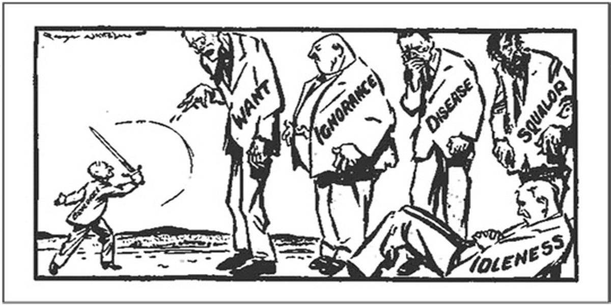

# CHAPTER 7: WELFARE AND WORK

This chapter considers the social security system of the UK from the perspective of *work* -- paid employment. The existing social security system is a mess: there are large disincentives to work, massive complexity and conditionality, and interruptions to benefits causing harm to vulnerable people. In this chapter, we aim to reform this social security system not *just* to encourage work but also to improve the quality that work and the financial security of all. We propose a system of universal benefits, integrated with the taxation system, and combined with a *contributory* sovereign wealth fund. We also propose an additional *conditional* element (a high quality and rapid combined work-and-skills training program) aimed at improving the skillset of the British population. Together these reforms can eliminate the disincentives to work in the current system, reward both paid employment and valuable non-paid work such as child-rearing and caring, encourage high-skills, security and wealth for all. These reforms are not only, we believe, practical and beneficial, but also consistent with the long-held values of the British population.

## Summary 

- Work plays a major role in modern life, yet it can be difficult to define precisely. Work can be purposeful and fulfilling (work as leisure) or it can be unsatisfying drudgery (work as toil).  

- Work can be of benefit to society (e.g. nursing) or it can be harmful (e.g. creating advertisements for junk-food). Benefit and harm are often not reflected in salaries.

- In the UK, there has been a decrease in unemployment, but proportional growth in low income, low-skilled and insecure work. There has been an increase in people relying on tax credits to top up their wages.

- Many people feel overqualified and dissatisfied with their work. Other people work excessively long hours. This is associated with increased rates of heart disease, mental illness, diabetes, and stroke.

- There is a relationship between the labour market and welfare. When work is precarious, there is a need for unemployment benefits to plug the gaps. Illness from overwork may lead to a need for Employment and Support Allowance or disability payment.

- The current British welfare system is unsuitable for the needs of today's workforce.

- The current system discourages people from transitioning into work. There is also a stigma associated with receiving benefits, contributing to a non-takeup of benefits by people who are entitled to them. Administrative delays and assessment mistakes are also rife.

- Any new welfare system should: be flexible, avoid disruptions in income, be empowering, promote work-life balance, be non-stigmatising, be simple, avoid benefits trap, be modern, and sufficient to live on.

- Citizens Income would meet many - though not all - of the above requirements.  It is an income unconditionally granted to all, on an individual basis, without means test or work requirement.

- Guaranteed Jobs and Skills Training could be used to improve the skill level of people in deprived communities.  A successful program would help people discover what work people would like to do, and would be targeted towards skills needed by employers.  

> *"I think there's a lot of pressure in this country to work when you have kids, and I don't think that's true of everywhere. You think of somewhere like Germany, when you are at home with your kids that's OK, but here there's pressure all the time to be out working."* 'Laurie,' single parent

> *"I also just feel that bringing up a child is working! Why is that not given the status?"* 'Ray', single parent.

> *"I have a job with a really flexible employer, but I do get called up at short notice and it's incredibly stressful."* 'Martina'

> *"If you are on a zero-hour contract, you are already not going to be earning much, so how do you pay for childcare to cover those times? It's not unreasonable for people to have some kind of predictability in the workplace."* 'Keira'

# 7.1 What is Work?

*"We shall honour those who can teach us how to pluck the lilies of the field who toil not, neither do they spin"* [@Keynes1930]

`r tufte::newthought('Those words were written')`in 1930 by John Maynard Keynes, the eminent economist, in an essay entitled Economic Possibilities for our Grandchildren. Keynes predicted that in 100 years' time, people in the developed world would be working for about 15 hours per week on average. He assumed that because of rapid technological advancement and productivity growth, people would work less and still meet their needs. He thought people would have more leisure time, and worried about how they might use it. This prediction was made for the year 2030, just a few years from now. We are still far away from the conditions of life and work he imagined.

As explained by Keynes' biographer, Lord Edward Skidelsky, in 'How Much is Enough' [@Skidelsky2013], Keynes was largely correct in his predictions on technological advancement. However, we have not seen a commensurate decrease in working hours, nor the wage growth that would allow people to meet their needs with reduced working hours. From the latest ONS figures, full-time workers in the UK put in an average of 37.5 hours per week. Those working part-time work on average 16.1 hours per week [@ONS2016b]. So, even what we consider nowadays to be a 'part-time' working schedule has more weekly hours than Keynes' predictions.  

Work in the form of paid employment plays a huge role in our conception and experience of modern life. Many of us spend more of our waking hours in work environments than at home or in non-work social situations. Even these basic categories are not fully descriptive, as our work colleagues can often become our friends and spouses, and our homes may also be our offices. Moreover, the concept of a career (as opposed to merely a 'job') plays a central role in our sense of identity and personal purpose. One of the most common questions asked when meeting someone is, 'What do you do'? Those without an impressive answer may feel a sense of personal shame during the introduction ritual [@YouGov2015]. This is no surprise - for most of us, the importance of our role in the workforce and the centrality of a career to our personhood has been drummed into us through the questions asked in our childhoods such as 'What will you be when you grow up?'

## Defining work as Leisure or Toil

For such a widely used term, the specific meaning of 'work' seems strangely hard to pin down.  A standard definition might be 'the exertion of effort in exchange for remuneration,' although that would not account for unpaid domestic labour, or the efforts of entrepreneurs and artists who are yet to see income from their activities. Even within this definition, the breadth of experiences covered is striking. For example, handsomely-paid actors who live out their dreams by appearing in films call this activity 'work.' This is the case even if they would perform the same exertions for much less remuneration. Similarly, an exhausted cleaner, vacuuming office buildings at 2 AM on a very low wage because they need money to pay for rent and food, is also performing 'work.'  

Work is often talked about by politicians as though it is an absolute good. To some, to be 'in work' is always better than to be 'out of work' no matter what the job is, or what other worthwhile activities the 'out-of-work' person might be performing [@PatrickWintour2010].  Slogans about getting people into work are regularly parroted, and often precede restrictions on access to benefits. Yet, as the above example demonstrates, work can be a purposeful and fulfilling activity which a person engages in for its own sake, or a drudgery which a person does purely for the purpose of remuneration. This difference is clarified by Skidelsky, who makes a useful distinction between work as 'leisure' and work as 'toil'. *Leisure* is described as activity done for its own sake, because it is intrinsically purposeful to the person performing the activity, rather than for an extrinsic reward. Notably, this definition of leisure does not equate to idleness.  As Skidelsky writes, 

> *"The sculptor engrossed in cutting marble, the teacher intent on imparting a difficult idea, the musician struggling with a scene, the scientist exploring [...] space and time. Such people have no other aim other than to do well at what they are doing.  They may receive an income for their efforts,but that income is not what motivates them."* [@Skidelsky2013]

Toil, on the other hand, is activity with no intrinsic value to the person performing it. It is done solely for an extrinsic end, usually a paycheck. Of course, this division is not clear-cut; a lawyer might be engaging in leisure when fighting a cause they believe in, and toiling when they are not. An artist who sells a few paintings may be engaging in leisure, but also has to toil as a taxi driver to make ends meet. An activity which is fun and enjoyable once per week, may become toil when it is performed on a punishing 40 hour-a-week schedule. So these concepts are limited, yet useful, because they help us direct ourselves towards what we want more of in society (purposeful activity) and clarify what we want less of (drudgery). We therefore apply these terms in the following discussion of welfare and work, as they help better flesh out the issues that can arise with policies geared at 'getting people back into work.' 

## Work as Benefit or Harm

The concept of work is also broad in relation to benefit or harm. In its common usage, 'work' is a word used to describe activities which are beneficial to society as well as activities which are socially destructive. The activity performed by a teacher, for example, is generally considered socially useful. A good teacher helps children to develop into thoughtful, mature adults. A teacher imparts valuable knowledge and skills which prepare students for further study, future employment, and life in the outside world. This way, educated students can then go on to make their own valuable contributions. Teachers' activities are essential for all kinds of social progress and social cohesion.

In contrast, consider the work of an advertising executive who designs campaigns that promote tobacco, alcohol, or online gambling. His exertions at work are designed to encourage impulsive purchases, which then may lead to addiction and illness. The social costs of such outcomes can then have downstream effects on social provision like health services, welfare, and the prison system. Much (though not all) advertising work is an effort to create a sense of need or desire in people which is not already present, or to create a sense of inadequacy which (it is promised) will be relieved by purchase of the advertised product. The result is often status anxiety, with social comparisons between those who 'have' the desired goods and those who do not, and wastage as still-functional but 'obsolete' items become undesirable. This leads to unnecessary increases in consumption of the earth's raw materials. The New Economics Foundation has attempted to quantify the social value contributed by some work, and the social costs caused by other work. In their report, A Bit Rich, they found that "for every '£1 of value created by an advertising executive, £11.50 is destroyed." By contrast, they found that for every "£1 paid to a hospital cleaner, £10 is created in social value." [@NewEconomicFoundation2009]

Consider also the work of tax accountants who specialize in tax minimization for the ultra-wealthy. Such accountants are often very well-paid. They spend their time finding loopholes in the tax system to enable companies and wealthy individuals to avoid paying tax. It is estimated that £12 billion is lost to the UK government from companies and £13 billion from individuals each year due to tax avoidance.  These accountants' activities are harmful to society as a whole, yet they are also considered to be 'work.'  According to the New Economics Foundation, tax accountants destroy £47 of value for every pound in value they generate.

There are, of course, forms of work which neither greatly benefit nor greatly harm society. There may also be work which appears not to make any contribution, but which may lead to a socially beneficial outcome after a long time. Few people could have imagined, for example, that Charles Darwin's curious hobby of cataloguing plants and animals would lead to a theory which would underpin major scientific and medical developments. So we cannot always tell when work is socially beneficial, but at a basic level, we should try to incentivize that which we know to be beneficial, and reduce that which we know to be harmful.  

## Work, value and pay

There is no clear correlation between pay and the kinds of work which are socially beneficial. If anything, the opposite is often true. Using the examples mentioned, tax accountants and advertising executives are vastly better paid than the teachers, despite the often dubious outcomes of work done by the former two kinds of professional. We could take this point further and observe that it is possible to perform activities which are extremely socially useful, but receive no remuneration at all. Since they lack remuneration, there has been debate as to whether to term these activities as 'work', but activities such as child-rearing, caring for elders, volunteer work, and other forms of unpaid activity are often of great value to society.  We should keep this point in mind as we consider the role of welfare and welfare recipients in society. Although people may be in receipt of benefits because they have no or little income from paid work, they may in fact be performing unpaid work which is socially beneficial [@Webber2016].

# 7.2 Work in the UK

## Wages and the growth of low-skilled work

With those broader considerations in mind, we can consider the status quo for work here in the UK. In the three months leading up to May 2016, the UK unemployment rate fell to its lowest figure since October 2005.  The graph below shows the unemployment rate from March 2011 to March 2016 [@RichardClegg2016].

||
|:--:|
|*Figure 7.1 - UK Unemployment Rate*|

The number of employed people reached a record high of 74.4%. On the surface, this seems to be great news, but just like the concept of 'work,' the 'employment rate' hides a myriad of experiences.  

Firstly, employment often does not provide sufficient income to cover an individual's essential outgoings. According to research by the CIPD Institute in 2014, in-work poverty in the UK has grown by 20% in the past decade [@CIPD2014]. According to the New Policy Institute, in 2012, 4.3 million working families were receiving some form of welfare benefit, with the vast majority receiving support in the form of tax credits. While the level of employment is at a high not seen since the early 1970s, the annual rate of growth in wage earnings is slowing. 

|
|:--:|
|*Figure 7.2 - Cartoon showing the folies of upward mobility and the working poor*|

The Guardian economics editor Larry Elliot [@LarryElliott2016] suggests three reasons why this might be occurring. Firstly, the UK is attracting people from other EU countries, so employers can comfortably find workers without increasing wages (Brexit may well put a dent in the number of EU citizens wanting to come to the UK). He believes that restrictions on public sector pay have been a second factor. Finally, the jobs being created tend to be low-paid, such as those in hospitality. The CIPD Institute suggests that the government has taken a 'low road' approach to industrial policy, whereby the workforce are relatively disposable, providing relatively standardized goods and services at a low price, and firms come to the UK because of the country's low corporate tax rates. They argue:

*"Not only does a drift towards a low-road labour market and economy make for unfulfilling working lives for many (with associated stress and health costs attached), it supports the increase of low-skilled, low-paid work, helps fuel the growth in 'in-work' poverty, and at least some of the costs of employers adopting such practices are being passed on to the taxpayer and government via in-working tax credits that top up low wages."* [@CIPD2014]

## Underemployment and dissatisfaction at work

A related phenomenon is underemployment and under-utilization of skills. The Spring 2016 Employee Outlook report from CIPD found that a third of employees believe that they are overqualified for their jobs [@CIPD2016]. As well as contributing to low wages, this is likely to lead to dissatisfaction at work. The ONS compared the educational distribution in the UK labour market against average educational attainment per occupation.  Their findings, shown below, were that the percentage of employees who were overqualified for their jobs had steadily increased since 2010 [@FredFoxton2016].

|
|:--:|
|*Figure 7.3 - Mismatched Employment *|

The CIPD report found that a third of employees thought that their organization did not provide them with the opportunity to learn and grow. Over a quarter felt dissatisfied with opportunities to improve and extend their skills. Our earlier discussion introduced the concepts of work as inherently meaningful and work as toil. It seems probable that when people feel as though their abilities are being underutilized, they are more likely to experience their work as toil.  

Work will also seem toilsome if it feels meaningless or pointless. A YouGov survey from 2015 investigated meaninglessness and work. 37% said that their job is not making a meaningful contribution to the world. 33% said that their work was not very fulfilling or not at all fulfilling. Another 45% said their work was 'fairly fulfilling' [@YouGov2015]. Clearly this is a far cry from the ideal of people undertaking deeply satisfying and meaningful work which one would perform for its own sake. Additional research also revealed widespread employee dissatisfaction. The 2016 employee sentiment poll from Investors in People reported that 1 in 3 employees in the UK are unhappy with their current job, and 49% were looking for a new job in 2016 [@InvestorsinPeopleHQ2016].

## Illness and Wellness

Another cause of workplace dissatisfaction that appears again and again in employee surveys is an insufficient work-life balance [@AntoniaMolloy2015]. A punishing work schedule can transform work into toil. It can also contribute to workplace stress, mental illness, physical illness, and family discord. Worryingly, the number of people working excessively long hours is increasing in the UK. A total of 3.417 million people are working longer than 48 hours per week, an increase of 15% since 2010 [@RachelMiddleton2015]. The associated health risks are well documented. There is a direct correlation between the length of a working week and stroke risk. A comprehensive study by University College London [@SarahBoseley2015] found that those working between 41 and 48 hours had a 10% higher risk of stroke and those working 49 to 55 hours per week had a 27% increased risk of stroke. The over 55 hour group also had a 13% increased risk of coronary heart disease. Other studies have shown increased risk of diabetes and obesity. These findings are unsurprising when we consider that long working hours often entail more time being sedentary, less time for physical exercise, less time to prepare healthy meals and less time for relaxing or sleeping. These basic lifestyle factors which underpin good health are all undermined by long working hours.

Overwork doesn't only show itself in physical illness. The Mental Health Foundation warns, 

> *"The pressure of an increasingly demanding work culture in the UK is perhaps the biggest and most pressing challenge to the mental health of the general population."*[@MentalHealthFoundation2018]

In 2014/15, there were 440,000 reported cases of work-related stress, depression, and anxiety. This translated to 9.9 million working days lost annually, with an average of 23 days per case. Stress accounted for 35% of all work-related ill-health cases [@HealthandSafetyExecutive2018]. However, long working hours aren't the only causes of mental illness. Other work factors reported included tight deadlines, excessive responsibility, a lack of managerial support, and workload pressures.  

Clearly, the current status of work in the UK today is far from the future which Keynes envisioned. Rather, overwork and underemployment are both prevalent factors, with some workers suffering from lack of work-life balance, and others from low pay (and some from both). Many experience their work as toil, feeling little satisfaction or meaning, whilst those making meaningful contributions to society may be unpaid or poorly paid. Importantly, the labour market does not distinguish between work which is beneficial or harmful to society in the way those jobs are remunerated. There is a need to apply new approaches and perspectives in addressing issues related to labour markets and state provision of safety nets. It is to this that we now turn.

# 7.3 Welfare

> *"I have reduced hours and taken time off from work and will have to do so again in order to continue caring. I am torn between caring, working and being there for my own family. I don't want to care anymore but I have no choice. I will jeopardise my job, health and personal life in the process. I don't know what will happen to me in the future."* 'Jane', carer [@CarersUK2014]

> *"The statements flying around about the 'work shy' and 'people who don't work for their money' are actually pretty offensive to me. This is not a life that we chose and my own experiences have shown me that it really could happen to anyone - we have gone from living in a privately rented home and earning a good wage to the very real struggles of living in social accommodation while struggling to get by."* 'Christina,' living with illness [@Fishwick2013]

> *"Trying to work full time (which is necessary!) and look after my father caused me to almost get to breaking point.This is when I was advised to contact social services about direct payments. I have since found out that I could have received direct payments for the past three years due to my father's condition, but nobody advised our family of this"* 'Sara,' carer

> *"Even though I had been actively looking for work, and proved I was, when I spoke to my local centre about my difficulties in leaving my house, I was spoken to like a "benefit bum" and was sanctioned with absolutely no benefits for FIVE WEEKS. I was finished. I got more into debt, and had to rely on family to help me out. I really think a lot of the problems in people not finding work is down to the advisors in Job Centres who make claimants feel dumb, worthless and who obviously need extra help. I truly think this is where the government need to start, rather than just slashing people's payments."* 'Martin,' age 25.  After becoming unemployed, he started receiving JSA. He became depressed while unemployed and missed an appointment, leading to benefit sanction. 

> *"I'm sick of the government only describing the working as 'the strivers'. I AM a striver too, I worked incredibly hard to get into the best university in the country, but I can't work. That isn't MY fault. But I am STRIVING to get better and make a decent contribution to society. I wish I could give those ministers in the multimillion pound homes a piece of my mind."* 'Bernadette,' aged 18, has clinical depression.

## What is Welfare?

People who are unable to find work, are too ill to work, are retired from work, are too young to work, or whose work doesn't generate a livable income, still need the means to live.  They still have to pay for food, shelter, heating, medical care, transport, and family costs. This is where government assistance, known alternatively as 'social security', 'social insurance', 'welfare', and 'benefits', comes in. Welfare exists to prevent people from becoming destitute. It aims to provide a bare minimum standard of living.

The origin of the welfare state may be traced back to late Victorian Britain, during which liberal policymakers responded to the widespread squalor, poverty, and criminality prevalent during industrial revolution. The modern welfare state was formed amidst the idealism of the post-WWII period, and it was set up to tackle the 'Five Giant Evils': Want (Poverty), Disease, Ignorance, Squalor (Homelessness), and Idleness(Unemployment) as described by William Beveridge [@Beveridge1942]. The Labour Party sought to eliminate these evils in their pledge to provide for the people of the United Kingdom "from the cradle to the grave" through their victory in the 1945 general election. The plan for the welfare state was visionary, in the sense that it was motivated by a vision of the future which could be much better than the present and the past.  

|
|:--:|
|*Figure 7.4 - Beveridge and society's five evils*|

Philosophically, it had two moral underpinnings.  Firstly, it was based on reciprocity. This is the idea that if you've paid in, you're entitled to take out. Secondly, it had an absolute moral position, which said that whether a person had contributed or not, it would be wrong to allow them to become destitute. Thus, a multifaceted welfare system emerged in the United Kingdom, built from a raft of different policies to protect the citizens from destitution. These include social insurance for the unemployed and sick and those injured at work, a national health service, free education, council housing, and increased employment through public spending.  

The welfare state has grown rapidly since its inception. In 2015/16, the total benefit pay out, (including the state pension) by the Department for Work and Pensions is expected to amount to about £171 billion (23% of public spending).[@Fullfact2015] This does not include the costs of administering the benefits. £116 billion is projected to be spent on benefits for pensioners (including state pension) and £53 billion on working age people. Benefits and tax credits together are projected to amount to £210 billion in 2015 [@Fullfact2015].

There is, of course, a sympathetic relationship between the issues with work outlined above, and demand for the welfare system. With increasing numbers of people in low-wage jobs, there is a parallel increase in the need for supplementary income from the state insurance mechanisms. 

|
|:--:|
|*Figure 7.5 - Drop in real wages growth since 2009*|

With an increase in precarious and short-term jobs comes an increased need for unemployment benefit to fill in the gaps in employment. Overwork and unhealthy work habits can lead to illness, which then require the payment of Employment and Support Allowance. Built around the model of long-term employment with a single employer, the current welfare state is unsuited to the demands of today's working environments.

Today's welfare state covers five main categories of welfare spending: 

1. Incapacity, Disability and Injury Benefits
2. Pension Spending
3. Unemployment Benefits
4. Housing (including Housing Benefit and Rent Rebate)
5. Family Benefits, Income Support and Tax Credit

# 7.4 Issues with the Benefit System

## The 'Benefit Trap'

One of the problems with means-tested benefits is that they can create a disincentive to seeking paid employment. A person receiving benefits may find that their benefits cease when they take a job, and they also pay tax on their earnings, which often leaves them scarcely better off than they were on benefits. The current system is engaged in a shift from a sharp cut-off point to a gradual phase-out. With the former, when the costs of commuting to work and/or childcare are taken into account, this creates a strong disincentive for the unemployed to take up a low-wage job. 

The diagram below shows how benefits taper off as take home pay increases, for a lone parent with two children. We can see that the parent could hold a job which makes £175 per week, and along with benefits, will receive a net income of around £570 per week. If the lone parent decides to increase her income from paid work (usually by increasing working hours), to '£400 per week, she will be barely making any more in net income than she was before - around £590 per week. 

|
|:--:|
|*Figure 7.6 - Lone Parent with 2 children and childcare costs*|

Similarly the below chart shows how increases in household incomes can provide 'disincentives' for some when income reaches beyond certain thresholds, creating a jagged transition for income progressivity [@Dyson2015].

|
|:--:|
|*Figure 7.7 - How tax rates rise and fall*|

When we add the means-testing of benefits, the situation is even worse. For every £1 earned, 70p or more of benefits are withdrawn. This is clearly a disincentive against work, a 'welfare trap'.

||
|:--:|
|*Figure 7.8 - Benefit Withdrawal and Marginal Tax Rates, with RSA Proposals*|

## Administration 

Many benefits require claimants to inform the Department of Work and Pensions of any changes of circumstances which may affect their benefits.  Such changes may include, for example, a decline or improvement in an illness which may affect one's capacity to work or affect one's living support needs. A gift of some money may affect someone's Job Seeker's Allowance. In many cases, the claimant is obliged to volunteer the information to the DWP. In some cases (as for ESA and PIP), capability assessments are made by the department.

When a change in circumstances affecting entitlement occurs, this can often mean a sudden withdrawal of benefits and a long wait while decisions are appealed.  There are also significant waiting times for people once they have submitted applications until payments materialise, particularly in the case of JSA and Housing Benefit.  When these gaps in support occur, individuals often experience serious economic hardship and mental stress.

The following real-life case studies demonstrate ways in which hardship can occur:

**Liam:**

Liam received Employment and Support Allowance for mental health and mobility issues. After undergoing a work capability assessment, his ESA was withdrawn. Liam appealed the decision and after four months, his ESA was reinstated. However, he was without income for several weeks between the termination of his ESA and applying for JSA. He attempted to make savings and was compelled to go to a local food bank. His anxiety issues increased and the process exacerbated his young son's anxiety issues. After having ESA reinstated, it was again withdrawn after another work capacity assessment and he was forced to go through the same process again. He says,

> *"It's hard when you have to make choices. Do you cut down on the electricity you're using or do you cut down on the food? And when you're cutting right down to the bare minimum it's hard to cut back any more"* [@ChildPovertyActionGroupa]

This example demonstrates the hardship which can occur from an incorrect work capability assessment and from any form of sudden disruption to income. The frequency of errors in work capability assessments is worrying. Figures recently released by the DWP show that tribunals overturned 52% of Employment and Support Allowance appeals in the period Oct 2014-Dec 2014.

**Sarah: **

Sarah is a single parent and is at university.  During the student summer, she has to go on job seeker's allowance and is subject to the conditionality criteria even though she would be unable to take up work because of her studies. She receives housing benefit during the summer months and this is reduced during term time. She says that whenever she has to reapply for Housing Benefit, she always has problems or delays:

> *"It causes me nothing but trouble. Last scholastic year I had to restart my housing benefit because they stopped it... it's just stress, stress, stress, stress, stress, all the time. Are they going to do it properly? Every time, twice a year I have to change my circumstances with them. And it's never once gone right, not once."* [@ChildPovertyActionGroup] 

These issues have exacerbated her anxiety and this has had an effect on her studies. She also feels that she has taken out some of the stress on her young son as there are only the two of them in the family.

**Emma: **

Emma and her husband have very variable monthly incomes. They also receive tax credits. Despite contacting the DWP on a monthly basis to inform them of their fluctuating incomes, they were overpaid. As a result, they are now not receiving any tax credits at all. They now feel that even if they are entitled to tax credits, they are more trouble than they are worth.

> *"Currently we're not receiving any tax credits. We've not had anything for a wee bit and anything we do receive now would be offset against the over payment received. But we've come to the conclusion now that it's been so much more hassle than it's worth that, I think if I'm entitled to something then I should get it, but I'm scared to spend it."* [@ChildPovertyActionGroupb]

## Stigma 

There is a significant social stigma in receiving government assistance. Television shows like 'Benefits Street' and salacious tabloid headlines have contributed to the idea that those receiving benefits are lazy or a drain on society. Political and media rhetoric arguing for 'crackdowns on benefit cheats' have also fostered a culture in which people claiming benefits are viewed as untrustworthy and lazy.  In such an environment, it can be seen as shameful to receive benefits.  

In 2012, the charity, Turn2us UK, commissioned a study [@Baumberg2012] to assess the impact of stigma in applying for benefits. They found that the wider public sees benefit claimants as less deserving now than they did twenty years ago, with particular increases around the early 1990s and 2000s.  They observed that these increases correlated strongly with non take-up of benefits, suggesting that many people do not take up the benefits to which they are entitled out of a desire to avoid the associated stigma. Worryingly, given the prevalence of mental illness in Britain, the study found that social stigma contributed to feelings of low self-esteem and worthlessness in claimants.  As one contributor to the study who was claiming Job-seeker's allowance stated, 

> *"I know I'm not a scrounging bit of scum but when it's told you over and over again and that's all you hear I can understand some people get really affected by it."* [@Baumberg2012]

The study also found that countries with benefit systems based on citizenship or contribution, see lower levels of benefit stigma than those with benefits based on means testing.

Benefits exist to prevent extreme poverty, to ensure a minimum standard of living for people, to enable people to take part in the economy and social life of the nation, and to help individuals better themselves. It is beneficial for the nation as a whole that those who are entitled to benefit receive them.  

There is, however, a serious problem of people not taking up their benefit entitlements. In the period 2014-15, only 6 out of every 10 people who were entitled to pension credit claimed this benefit. Only 5 out of 10 of those entitled to income-based jobseeker's allowance claimed it. 1.4 million families who were entitled to housing benefit did not submit a claim.

According to a 2014governmental report, "Take-up may be affected by factors such as the attractiveness of the benefit, lack of awareness of the benefit or application procedure, lack of awareness of entitlement, the perceived stigma of receiving a benefit or other factors." [@ONS2016c]

The chart below shows the proportion of unclaimed benefits to overpaid benefits. 

||
|:--:|
|*Figure 7.9 - Mis-paid Benefits *|

# 7.5 Criteria for a New Welfare Model

- **Flexibility** The welfare system needs to be adapted to a current work environment, in which people go in and out of short-term contracts and may be working part-time. The current system involves a time-consuming application process which is not responsive enough to changing conditions in people's work lives.  
- **Stability** The system should, as far as possible, minimise or eliminate anxiety-inducing disruptions to income. Whether due to delays in processing applications, or because a claimant has changed their address or experienced some other life change, the current system imposes delays and cuts to benefits. This can cause extreme anxiety and repercussions on family members.
- **Enabling** In regards to support into work, the system should enable people to find their own way towards what they want to do. Ineffectual fortnightly appointments and compulsory work programmes often do not provide the tailored support needed. The goal should be to assist people to find work which is fulfilling and enjoyable for them (work as leisure), rather than taking any job for fear of benefit sanction (work as toil).
- **Balance** The welfare system and industrial policy generally should promote, as far as possible, a flexible workforce in which people are able to avoid illness-causing overwork. Improved work-life balance is likely to help carers, parents and older people who want to continue working past retirement age. It is also likely to reduce unemployment, as people are able to share jobs.
- **Non-stigmatising** The current system is extremely stigmatising, particularly for the unemployed. Some of this stigma derives from compulsory and infantilising processes, such as requiring people to fill in a job diary, attend fortnightly meetings, and take any job offered. Some stigma also derives from the fact that the benefits are means-tested.  
- **Simple** The welfare system should be as simple as possible, and avoid excessive and unnecessary bureaucracy. Complexity creates confusion about entitlements, which can then lead to costly sanctioning. 
- **Incentivising** The welfare model should avoid creating a benefits trap in which people experience a high effective marginal tax rate when they move from benefits to working.
- **Modernised** The welfare system should make use of technological advances as much as possible. Allowing people to submit information online rather than fill in pages of paper forms, can save both time and money. 
- **Sufficient** Many people are struggling to make ends meet on the benefits they receive. Many carers, for example, are sacrificing basic essentials as they try to survive on Carer's Allowance. Jobseeker's allowance is too low for most to live on, so for those who cannot rely on savings or family and friends, it can be extremely difficult to survive whilst looking for work.

## Current Changes to the Welfare System

Much has been said already of the issues in the current welfare system. Bureaucracy and expense, over-complexity, and poor built-in incentives have plagued the system since Beveridge's proposal for a 'Social Insurance' system [@Beveridge1942] was published in 1942. Following the 'National Assistance Act' in 1948, the first of Beveridge's policies implemented by Atlee's Labour government, successive British governments have continued to build and shape the modern welfare system into what it is today. 

Beyond the original report, the reforms have generally lacked overarching strategy. There have been a number of jolting, ill-thought-out changes made to the administration of welfare in the United Kingdom, as each political party sought to make their own mark on improving the system. It seems then that tackling the problems of the welfare system may have had cross-party support, but that there has been no cross-party agreement on a coherent plan to fix them.  

Damien Green, the current DWP secretary, said it is "compulsory to quote William Beveridge in any review of welfare policy." Beveridge laid the foundations for the modern welfare system, and is remembered for stating that "the object of government in peace and war is not the glory of rulers or of races, but the happiness of the common man." This is, of course, what the welfare system aims to achieve - if you understand 'happiness' as the ability to live a dignified existence with sufficient access to nutrition, shelter and healthcare. The entire endeavour is founded on the idea that any civilised society needs an economic 'safety net' for its poorest, and most at need. In any reforms this principle must be held above all others. The system may be efficient, it may be beautifully designed, but above all it must ensure that enough support is given to those who need it to survive. 

A welfare system must also be sustainable. Firstly, it must ensure that sufficient revenues are collected from those in employment to fund this 'collective insurance', and secondly it must encourage those who are able to seek employment from other sources than the government. This should be a welfare system, rather than a welfare state. The current welfare system arguably doesn't do a good enough job at encouraging people back into work. This is, in part, due to built-in bugs that mean an individual faces a 'cliff-edge' when they work above a certain, arbitrary threshold. [[3\]](#_ftn3)There is also a lack of effective retraining opportunities and support that would enable an individual to upskill themselves and seek more fulfilling employment. These are important considerations when planning any kind of reform to the current welfare system.

The most recent overhaul of Welfare fell to Iain Duncan-Smith, then the Secretary for the Department of Work and Pensions (DWP). This overhaul was spearheaded by 'Universal Credit'. First proposed as a concept in a 2009 report by Duncan Smith's think tank, the Centre for Social Justice [@CentreforSocialJustice2009], the government legislated for UC in their Welfare Reform Act 2012. 

It was announced that the 'best performing' DWP and Tax-Credit processing centres would be chosen to run the pilot scheme from 2013. This was subject to a great deal of critique as to the 'overly ambitious' [@Norris2016] timetable chosen for the UC roll out. Such criticisms have also been echoed in the National Audit Office's report on 'Rolling out Universal Credit' [@NationalAuditOffice2018]. In this, they allege that the rapid implementation of the Universal Credit scheme has had detrimental impacts on the aims of the project - which include saving money on administration, running costs and promoting people to re-enter the workforce.  The National Audit Office, which oversees government spending, said that the universal credit programme was "driven by an ambitious timescale" and that it had suffered from "weak management, ineffective control and poor governance".[[4\]](#_ftn4) They recommended that the roll-out be much slower, with a great deal more monitoring to ensure that any potential impacts on claimants are accurately assessed and accounted for. 

At inception, Universal Credit had cross-party support. The policy involved combining six different means-tested benefits, and their associated IT systems, into one coordinated benefit. The benefits which were consolidated were Income Support, Income-based Jobseeker's allowance (JSA), Income-based Employment and Support Allowance (ESA), Housing benefit, Child tax-credit and Working Tax-credits. The purpose was to streamline these benefits and make it easier to claim 

Unlike with the old system, there is no limit to the number of hours that an individual claimant can work. Rather, the system operates on a universal entitlement principle, whereby a base threshold of income is set which is thereafter reduced on a flat rate as an individual's earnings increase. 

This adjustment to the system means that people on a low income no longer face the cliff-edge of the 100% benefits withdrawal rate once they start working more than 16 hours. It is thought that a more gradual withdrawal rate, like that built into the new system, encourages such an individual back into full-time employment, as it ensures that no one is better off claiming benefits than they would be working. Universal Credit currently sets this at a 63% withdrawal rate. This means that for every £1 earned above the income threshold, £0.63 is removed from their Universal credit entitlement.

The title is perhaps a misnomer. Universal credit is still subject to eligibility criteria. An individual must be between age 18 and state-pension credit age, not in full-time education or training and with savings under £16,000. They are also still subject to a maximum income threshold, above which they are no longer able to claim Universal Credit.

The Institute for Fiscal Studies has warned of a possibility that 'over three million households will see lower entitlements from universal credit with an average loss of £1,800 a year (and around two million households will see bigger entitlements with an average gain of £1,400 a year)' if they are not eligible for transitional protection [@Hood2017]. Claimants for Child Tax credit and Working Tax credit will be the hardest hit by these changes.[[5\]](#_ftn5) For those who fear a sharp reduction in their benefits entitlements, there is a transitional smoothing mechanism built in to the system. This is part of the Government's commitment that 'no-one will be worse off under Universal Credit.' Provided an individual has claimed correctly for their benefits entitlements in time for the universal credit rollout, any loss in income when transferring to the new system will be accounted for by a transitional top-up payment. This, of course, omits those who have not engaged, or cannot fully engage with the current UK welfare system (e.g. the homeless, those with mental illnesses, and those who have fallen through the cracks in the social security system). 

With over 1 million claimants now within the Universal Credit scheme, it has become apparent that there are some major flaws within its administration. Designed to replicate the payment schedules of traditional employers, Universal Credit payments are made in arrears. This means that a claimant must submit their projected income for the month at least four weeks in advance. This ignores the fact that most people who live on small incomes often receive payment on a weekly basis. Under the old system, the goal was to pay benefits within two weeks of a claim. Under Universal Credit, there is a formal waiting period of one week with no money when someone is onboarded to the scheme. With an average initial processing time of two weeks for every applicant, this means that there is at least a six week wait built into system before any benefits are paid out. However, around 25% of all Universal claimants must wait more than 6 weeks to receive their first payment in full because of errors and problems in evidencing their claims. This has caused problems for individual budgeting, especially for those on exceptionally low incomes, as well as for landlords. 

According to the Trussell Trust, food bank usage has continued to climb in areas where Universal Credit has been rolled out. They claim that this is because delayed payments have seen people struggle to afford the basics as they wait for their entitlement to be paid. More pressingly, a shift in the payment of housing benefit to being paid directly to tenants rather than their landlords has caused significant increases in the number of people falling behind with their rent. Moreover, because the new system is fully digitized, those claimants who lack access to the internet or a mobile phone will find it difficult to follow up on, edit, or even make new claims. This may cause further issues in administering the payments. 

Moreover, the updated welfare system still does not incorporate the necessary retraining opportunities to effectively encourage individuals back to work. Perhaps lessons should be learned from alternative welfare systems like that in Switzerland, where language lessons and retraining classes are covered by the state if an individual becomes unemployed. Although the system makes headway by removing the 'cliff-edge' and improving the incentive mechanisms to return to work, the conditional element of UC still penalises an individual - both in income and time - for choosing to look for gainful employment rather than taking poorly paid and unfulfilling roles. It is understandable that for any welfare system to be sustainable, individuals with the capacity to work must do so. However, without effective retraining and educational opportunities, the bulk of the low-income workforce may remain under-skilled and under-employed. 

Universal Credit is not in itself a bad proposal. As with most political agendas, the key lies in its administration. Streamlining the welfare system has been well overdue. With over 25 different benefits, it can often be an overwhelming process for claimants to ensure that they are receiving everything which they are eligible for. However, the rapid roll-out of the Universal Credit scheme has resulted in several administrative issues, delayed payments and increased confusion on behalf of the claimants. This can hardly be said to be fulfilling Beveridge's requirements for ensuring successful welfare reform.

Universal Credit should be considered as the first step towards a new system. It has done the 'hard work' of reconciling a few different benefits to give reformers a tractable baseline for income-related benefits. It has also gone some way to reducing the bureaucracy by consolidating six different, separate IT systems into one, though it must be said that the UC administrative system is still far from perfect in terms of both operative efficiency and expense. We need now to work on addressing the remaining conditionality in the system, which still 'penalises' individuals for working. We also must expand the focus of these reforms to include better training opportunities and cooperation between the state and private sector to better support people into gainful employment. A shift in this direction would also help tackle stigma by transforming the 'welfare state' into its intended form, as a form of social insurance that builds an individual's capacity and capabilities, and guarantees them a sufficient and decent standard of existence.  

We therefore argue that a Citizens Dividend could be the next step forward in combating these issues, which we will explore in the next section in more detail.

# 7.6 The Citizens Dividend: A Brief Introduction

## Brief History and Principles

In June 2016, a landmark referendum was held in Switzerland. The Swiss went to the polls to vote on whether the Swiss government should pay each citizen a monthly sum sufficient to allow them to live in a dignified manner and participate in public life. In Switzerland, referendums are commonplace - but what made this one remarkable is that it was the first time that the citizen's dividend idea was put to a referendum for serious consideration by the populace. Even more significantly, though, the referendum launched the idea into the mainstream media, bringing it widespread attention, both within Switzerland and internationally.

So what is a citizens dividend? We use the term here as synonomous with Basic Income, but with the idea that a citizen's dividend is a 'top up' and is not intended to be enoough to live on. 

There are many different models of a citizens dividend, but the core principle is the same.  The Basic Income Earth Network describes it as follows: 

*'A basic income (citizens dividend) is an income unconditionally granted to all on an individual basis, without means test or work requirement.* 

It is a form of minimum income guarantee that differs from those that now exist in various European countries in three important ways:

- It is being paid to individuals rather than households;
- It is paid irrespective of any income from other sources;
- It is paid without requiring the performance of any work or the willingness to accept a job if offered. [@BasicIncomeEarthNetworkBIEN]

This idea sounds shockingly radical to many of us, who are used to the mainstream stigmatizing of benefit claimants as lazy and work-shy.  Many assume the idea of a citizens dividend is a new innovation. However, there has been a long history of advocacy for a citizens dividend. It has been advocated at different times and in different countries by both progressive and conservative economists. 

One of the earliest modern scholars to advocate the idea was British. Towards the end of the First World War, philosopher Bertrand Russell advocated a universal income sufficient for necessities, writing;

> *'A certain small income should be open to all, whether they work or not and that a larger income - as much larger as might be warranted by the total amount of commodities produced should be given to those who are willing to engage in some work which the community recognise as useful.  When education is finished, no one should be compelled to work, and those who choose not to work should receive a base livelihood and be left completely free.*'[@BertrandRussell1918]

##  Case Studies 

## Alaska

The Alaska Permanent fund is a constitutionally established fund, owned by the State of Alaska. It began in 1976 with the goal of ensuring that every Alaskan could benefit from the state's exploitation of oil resources, and that future generations could benefit even after resources ran out. Since 1982, Alaskans have received a yearly dividend from the fund, the amount of which varies according to returns on investments in the fund. In 2015, the dividend payout was £2072.

The fund has been credited with contributing toward income equality, with Alaska having the second-lowest inequality of any state in the USA. In the period from the early 1980s to 2000s, Alaska was the only state in which the income of the bottom 20% of the population grew faster than the top 20% [@BrianMerchant2015].

## Madhya Pradesh, India

In villages in Madhya Pradesh, every adult was given a monthly payment of 200 rupees and every child, 100 rupees (paid to the mother or guardian). These amounts were later increased to R300 and R150 respectively. These figures mean that an average family received the equivalent of USD$24 or GBP £15 a month. The amounts were initially paid in cash, and later into bank accounts. The effect of the grants on the communities was studied over period of eighteen months, with the villages receiving grants compared with other 'control' villages which didn't receive the grants.  

The findings were very positive. Many in receipt of the benefit used the money to improve their housing, build latrines, and protect themselves against Malaria. There was a significant improvement in the average weight-for-age among children, particularly with young girls. People had better diets, partly because they could afford to eat more vegetables and fruits. School attendance also improved.

Those receiving the payments were more likely to reduce debts. Also there was an increase in production from small-scale investments, such as planting improved grain, repairs to equipment, and the creation of shops. The scheme had a particularly positive effect for disadvantaged groups, such as women, the disabled, and lower-caste families.

According to Professor of Development Studies Guy Standing, allowing people to gain control over their lives was crucial to the scheme's positive outcomes. He wrote: 

> *"The policy has transformative potential for both families and village communities. The whole is greater than the sum of the parts. Unlike food subsidy schemes that lock economic and power structures in place, entrenching corrupt dispensers of BPL (Below Poverty Line) cards, rations, and the numerous government schemes that supposedly exist, basic income grants gave villagers more control of their lives, and had beneficial equity and growth effects."* [@Standing2017]

## Manitoba, Canada

Between 1974 and 1978, the Canadian government ran a field experiment in the town of Dauphin, Canada. As part of the experiment, any family without income from other sources would receive a dividend amounting to 60% of the 'Statistics Canada Low Income Cut-Off' - (called LICO [@StatisticsCanada2018]). Every dollar of income from other sources would reduce the payments by 50 cents. Payments were indexed to cost of living. This meant a particularly significant increase for people who did not qualify for welfare under traditional schemes, such as the elderly, single, employable males and the working poor. Those who already received social assistance would see little change in their income.

The experiment ended without an analysis or report of findings, but in 2010 a Canadian social scientist, Dr. Evelyn Forget, uncovered the raw data. She found that compared with a control group,for those receiving the income there was a significant reduction in hospitalisation, especially for accident, injury, and mental illness. Contact with physicians regarding mental illness also reduced during the period. They found no increase in fertility or family dissolution. A greater proportion of students also stayed in school to Grade 12. Dr. Forget concluded: "These results would seem to suggest that a Guaranteed Annual Income, implemented broadly in society, may improve health and social outcomes at the community level." [@Forget2011]

## Arguments in favour of a Citizens Dividend

## It avoids the 'benefit trap'

The basic income concept avoids this trap because it is not means-tested. It provides a minimum income floor. Any income from work which a person receives will be added to this income floor. This makes it much easier for people to take on part-time or low wage jobs. 

## Citizen's Dividend is simple and cheap to administer 

Means-testing adds to the cost of administering benefits. The finances of each claimant is individually assessed, which is time-consuming and labour-intensive. For example, the cost of administering claims for housing benefit and council tax benefit is almost 16 times higher than the cost of administering child benefit, which is non means-tested.  

Also, the Department of Work and Pensions makes individualised disability assessments to determine claimants' eligibility for the Employment and Support allowance and the Personal Independence Payment. These assessments are performed by private contractors and are costly and time-consuming. A report by the National Audit Office in January 2016 found that the over the period 2015 to 2018, the Department of Work and Pensions expected to spend £1.6 billion on contracted out health and disability assessments. The cost of ESA assessments was found to have increased from £115 per assessment to £190 per assessment after a change in contractors in 2015. The process of assessment for Employment as Support Allowance can be painful for claimants. The report found that ESA claims take on average 23 weeks to administer,bduring which period the claimants are not entitled to full payments [@DeptForWorkAndPensions2015].

A citizens dividend model would require no individualised means-testing of benefits. Most models of citizens dividend still require some benefit for those with particular disabilities or long-term illness, who have higher living costs as a result. Therefore, even with a citizens dividend, some individualised assessment would be necessary.  However, many people who currently receive Employment and Support Allowance do not have extra costs due to their illness, but are merely unable to work. That is, many are on ESA because JSA would require them to look for work, not because they have extra health costs. With a Citizens Income of a sufficient amount, it is reasonable to believe that many of those people would be satisfied with the basic amount, and will not require assessment for additional benefits.

As Simon Duffy of the Centre for Welfare Reform notes, "Even on its own such a system (citizens dividend) would replace a large part of the need for the ESA, which currently costs £14 billion and is received by 2.5 million people (an average of £108 per week). This would kill in one stroke the crazy and expensive world of conditionality, sanctions, privatised assessments and ineffective training programmes into which disabled and sick people are currently forced."

## It reduces the stigma of receiving benefits

The study also found that countries with benefit systems based on citizenship or contribution, see lower levels of benefit stigma than those with benefits based on means-testing [@Duffy]. The basic income would be universal, and therefore is less likely to induce social stigma. It may not completely remove stigma of course, as there may be some stigma towards those who receive the benefit and do not attempt to find work.  

## It promotes freedom & independence, without compulsion

Rather than force people to apply for jobs which they have no interest in or for which they are unsuitable, the Citizens Dividend allows them to make decisions about what is best for them.  As Sam Bowman of the Adam Smith Institute argues, 

> *"A basic income (citizens dividend) is the least paternalistic welfare scheme possible. Instead of pushing would-be computer programmers into work as Poundland assistants, a scheme like this would leave decisions entirely up to the individuals involved. The discovery process that each of us is engaged in would continue, and now without mass decision-making by a central state authority."* [@SamBowman2013]

## Assessing how much would be paid

Our citizen's dividend is not intended to meet all living costs. It is intended to exist in conjunction with a workfare scheme and together these would provide sufficient income on which to live.

To get some idea of what people might receive, we can look at the Minimum Income Standard calculator provided by the Centre for Social Policy and Research. They suggest that a single adult with no children will need £286.54 per week. This can give us an upper bound for the amount needed. The Royal Society for the Encouragement of Arts, Manufactures and Commerce (RSA) has proposed a basic income of £3692 annually, rising to £7420 for pensioners [@RSA2015]. The current state pension is £115 per week. The below chart shows that the RSA model would provide a more gradual marginal deduction rate as earnings increase, compared with the status quo.

For those who are ill long-term, or disabled, we would provide a greater amount based on their particular needs. This would be a non- means-tested, non-taxable amount. Like the Personal Independence Payment today, an assessment of needs could be made, and supplementary amount provided. Depending on the base level of our Citizens Dividend, a supplementary amount may also be needed for full-time carers. Simon Duffy of the Centre for Welfare Reform proposed a system in which abled people receive a taxable top-up to their citizen's income, as well as a supplement based on additional needs.  

In assessing disability needs, we should avoid the harsh bureaucratic and alienating system which in operation today. Duffy [@Duffy] suggests a model in which people can claim the correct disability assessment for their circumstances and then have it validated by a GP, social worker, or NHS expert (we suggest a new department at the NHS that would do these assessments). Reassessment should occur on a more personalised basis.

> *"In the end, this system would help us take a big step forward towards human rights for all, including disabled people. Nobody would be subject to demeaning systems of control and punishment managed by the DWP (whether they had a disability or not). Everybody would get a basic income. Sick or disabled people would get an appropriate supplement to that income. In addition, we would organise any further support and assistance in a way which was empowering and under the control of disabled people themselves."*

# 7.7 Options For Welfare System 

So, as we have discussed, the present benefit system is a mixture of unconditional, conditional, means-tested, taxable, and non-taxable payments. It is illogical and ill-thought through. Additionally, different means-tested benefits are means-tested in different ways. The sum total of the system creates perverse incentives and does not encourage work effectively. Indeed, dealing with the benefits system is like a job in itself, both for the person claiming benefits and for the people administering benefits. This complexity is unnecessary because means-testing is just a tax in disguise: it takes away money from people as wages increase. Such a function is best performed by the income tax system, which also takes away money from people as wages increase. 

We propose a return to universal benefits with 'means testing' performed by the income tax system, rather than the benefits system, in an integrated and smooth way. The basic universal benefit in our proposed system is the Citizens Dividend. It is a universal payment to all UK citizens. The Citizens Dividend is a per capita payment to all citizens of the country, paid regardless of employment status. It is a universal payment to everyone in society who is a citizen of the UK. The payment would be initially equal to current income support levels, i.e, around £75 a week, or £3800 per year. 

The system we envision will be different rates for children (replacing child benefit and child tax credit, paid to mothers), working-age adults (replacing income support) and pensioners (equivalent to the existing state pension). It provides all UK citizens with the minimum amount of income. We also propose to offset payment of Citizens Dividend against other taxes so taxpayers only receive a net bill or payment.

In addition, there will need to be further payments for particular categories of people with specific needs -- for example, disabled people, the elderly, carers, and mothers with children. We propose that these payments would be made on a similar and consistent basis to the Citizen's Dividend described above. There will obviously need to be changes to the tax system in order to pay for these universal benefits, but the system of government accounting should account for a means-tested benefit and a taxable universal benefit.

We also propose to offset payment of Citizens Dividend against taxes. This would specifically apply to those taxes that are highly visible such as property taxes, so that individuals will receive or pay only the net amount of either taxes or benefits. 

The ideal education and welfare system include not only a (low) citizens income, around the current level of income support but also an integrated training, entrepreneurship, and workfare scheme. The workfare system would be a system that pays a small wage, but also develops the claimant's skill-set. This is also the purpose of some further education courses. Integrating workfare with training allows continual upgrading of the skill-set. Such training should always prepare the recipient both for employment and for entrepreneurship/self-employment. For example, mini-economies can be created in schools and universities to allow older school children to trade between themselves. The training-workfare college should develop these entrepreneurial skills further, removing one major barrier to entry to all industries: A general lack of entrepreneurial skills.

We need a system of contribution records. We suggest merging Income Tax, National Insurance and Means Testing into a *single* tax at a rate of around 40% for the bottom 99% of the population. Since we are replacing means testing there would be *no personal threshold*. However, the payments of the first 4,000 pounds of tax would be consisidered a 'contribution record.' The government would aim to purchase an equivalent amount of asssets. Those assets would uprate the unconditional benefits with an additional, funded 'basic property' allowance.

Finally we suggest help for increasing people's skills by integrated work and training placements. This is not within the main scope of this book.

## Different ways to fund a Citizens Dividend Scheme

This article argues that there are *different types* of Citizens Dividend Scheme, depending on what the Citizens Dividend Scheme replaces and how it is funded. Those types are a *simplifying* Citizens Dividend Scheme, a *compensating* Citizens Dividend Scheme, a *redistributive* Citizens Dividend Scheme, and an *extra* Citizens Dividend Scheme. A *simplifying* Citizens Dividend Scheme is paid for by changes to income tax and pre-existing benefits; a *compensating* Citizens Dividend Scheme is paid for by increases in other taxes that are paid by all, such as a carbon tax. A *redistributive* Citizens Dividend Scheme is paid for by taxes on the rich; whereas an *wealth fund* Citizens Dividend Scheme is paid for by a wealth fund.

These are not just different ways to fund a Citizens Dividend -- they are inherently different overall propositions. A simplifying Citizens Dividend Scheme does not change incomes very much, but it does simplify the benefits system. A compensating Citizens Dividend Scheme's main rationale is to remove the regressive effect of independently worthwhile policy. A redistributive Citizens Dividend Scheme moves money from rich to poor. And a wealth fund Citizens Dividend Scheme increases national savings by funding the transfers with asset purchases.

## A Simplifying Citizens Dividend Scheme

The main goal of a simplifying Citizens Dividend Scheme is to simplify the existing system of welfare provision with lower benefit withdrawal rates and a more universal aspect, so as to prevent the bureaucratic checks that accompany means testing and conditionality. A strategy for implementing the simplifying Citizens Dividend Scheme would be to remove the personal allowance and find the 'common feature' across many different schemes, then add a Citizens Dividend, and at the same time reduce benefits and allowances by the same amount across the board.

*Simplifying Citizens Dividend Scheme, Typical tax increased: Income tax (personal allowance)*

## A Compensating Citizens Dividend Scheme

The reasoning behind a 'compensating' Citizens Dividend Scheme is to compensate for changes to taxes that would otherwise be undesirable because of their regressive effect. Environmental taxes are desirable because they attempt to properly price externalities. Health taxes aim to change behaviour of consumers and modify the composition of produced foods. However, sometimes these taxes have a regressive effect, because the poor spend more as a proportion of their income on food or energy than the rich. A *compensating* Citizens Dividend Scheme would redistribute these tax revenues using the mechanism of the Citizens Dividend Scheme. Examples of this approach include a carbon tax combined with a Citizens Dividend , referred to as the 'tax and dividend' approach.

*Compensating Citizens Dividend Scheme, Typical tax increased: Carbon tax*

## A Redistributive Citizens Dividend Scheme

Like a compensating Citizens Dividend Scheme, a redistributive Citizens Dividend Scheme is also paid for out of increased taxes. But in this case, the taxes that would be increased would be taxes primarily on the wealthy. So for example, a Land Value Tax or property tax falls more heavily on the wealthy.

There are variations of a redistributive Citizens Dividend Scheme that can be tailored to make a land value tax more palatable. For example, there could be a personal allowance for property owners, and a Citizens Dividend Scheme for non-property owners. In that way, a property tax is made to favour those who own just one property. Those who own more than one property will pay extra tax, whereas those that own none get a compensating payment. This allowance would be equivalent to a Citizens Dividend Scheme for property owners. It could then be extended by using the funds raised by the multiple property owners to those who are renting.

*Typical tax increased: Land Value Tax (new tax)*

## A Wealth Fund paying a Citizens Dividend: Basic Property

Whereas the previous three example would be funded by increased taxes and/or reduced other benefits, a wealth fund basic income would be funded by a sovereign wealth fund. Wealth funds already exist, for example the Norwegian sovereign wealth fund. In this case the wealth fund would buy assets such as equities, bonds, land, or property. The wealth fund would pay out dividends according to the return (dividends, interest, rent) on the underlying assets.

But how would the assets themselves be financed? From which source? There are a number of options: Taxation, Financial Surpluses from some other activity, Government Borrowing, and Quantitative Easing.

An obvious example in this case would be corporation tax. Increased corporation taxation would be used to purchase additional equities. In effect, companies would be asked to pay an increased corporation tax in shares. This approach was tried in Sweden for some time, and proved successful and popular. Companies paid a portion of their taxes in shares, and this enhanced a fund that paid a basic
dividend to everyone.

Surpluses from local development are another method to fund the basic income. For example, a local bank could be set up. This bank would purchase land/ lend on land, and the surplus that it generates would be stored in a local social fund. The dividends from the fund would then be used to pay a basic income. The advantage of this approach is that the assets paying the fund would be themselves useful to provide capital for the bank, and the dividends would also be helpful.

Another indirect way to fund a wealth fund basic income would be Quantitative Easing or Bond Issuance, used to buy up assets, perhaps at the same time as taxes were used to reduce those assets. Purchasing assets vs. taxing them act in opposite directions in regards to the sale price of assets. Taxing an asset will often reduce its market price; purchasing that asset tends to increase the price. The introduction of taxes on assets at the same time as purchase of assets, allows for financial stability at the same time as capture of surplus by the authorities.

One step beyond a basic income is *basic property.* This would be a basic requirement for providing a portfolio of owned property, e.g. shares in a mutual fund, for all citizens.

# 7.9 Towards a Contributory System

The Beveridge report and the system of national insurance that it brought in have at their heart the dual ideas of universal benefits and  of contributory benefits. Universal benefit is a benefit that is paid at the same level whatever happens. Contributory benefits are those where tax or national insurance contributions affect the future amount of benefits provided.

The Beveridge report argued *against* means-testing, which can be defined as taking away benefits as income increases. But the UK welfare state has introduced means-testing -- which is effectively a second income tax, applied only on the income of those on benefits. Of course, taking money away from people as their income rises is what income tax does, and it is odd that in the uk four separate systems were set up for doing this (income tax, employers and employees national insurance, and means testing of benefits, recently integrated into a single benefit, universal credit).

A simple and *integrated* tax and benefits system recognises that taxes and means-testing are essentially the same thing. A benefits system with a basic income at its heart recognises that the high benefits withdrawal rates of the current system. So a transition to a  basic income of, for example, £4000 per year, could be financed.

## Contributory Basic Income Increases

It will be assumed here that we can fund a basic income from environmental taxes. This would pay a basic income of £4000, but this amount would not be uprated with inflation. In order to achieve our target of a basic income of £6000 per person, the addition would be funded by  securities purchased in the market. The money raised to fund these purchases would be from the following sources: Taxes on company profits or wealth, or money purchase of overseas securities. The allocation of the tax paid would be to everyday people according to the tax paid, up to some maximum value per year.

So for example if £2000 saving would be put into securities yielding 5% per year, then the basic income next year (and thereafter) would be 5%\*£2000 = £100 extra per year. There would be two ways to earn these credits.

There would be two methods for saving this £1000. First, for every £ you pay in income tax, you might get £1 of securities set aside for you. Second, the local authority or national government could pay you for doing various community actions.

Communities need maintenance. Public goods need to be paid for. This creates a basic income scheme very much like the sort of scheme Beveridge intended, and also the welfare schemes that many countries have, which have a 'contributory' component. In other words, if you don't work,

It is intended to be the sort of scheme that represent the and financial
interests of 99% of the population and the value set of 80% of the population, that build a broader coalition than egalitarianism alone to include community, the work ethic, as well as simiplification and the national interest. Over time, the scheme would move to being 'funded' perhaps by taxing multinational's shares apportioned by sales so that ownership over time moves to the fund(s) paying the basic income - a sovereign wealth fund in other words.

In summary, the scheme encourages community involvement, eliminates the disincentive effects and deadweight cost of income tax for everyone earning less than £50K per annum, and makes BI more palatable to people that subscribe to ideas that our communities, public physical infrastructure and public goods need maintenance and that work should be rewarded. All at no additional cost.

## A basic income with a tax contribution record.

The basic idea is as follows:

- Every current citizen is granted a right to a basic income of £4000 per year.
- Income tax paid (at 40%) between 0 and 10K is set aside to buy securities
  and thus increments additional amount to the basic income
- Whilst income between 0 and 10K is taxed, the taxpayer increases his or her
  benefit entitlement in so doing, with an exactly equivalent value.
- Community actions could also be paid in this benefit

## Politics of Citizens Dividend Scheme

It seems to me that the major problem with basic income is that people aren't happy with giving money for nothing. If however, it was funded, and there were local organisations with balance sheets paying basic income out of a funded balance sheet, then this would be perfect, because the income would not be seen to be coming out of taxation. It would of course then reduce the tax burden for the state. Taking the population seriously means that taking seriously the idea that people will not just be interested in 'money for nothing'. Perhaps it also means that people are interested in value for value created. But if you create value in a community you should get a reward.

For the last few years, Britain has struggled with the idea of freedom of
movement. The UK, and particularly London, are attractive places for people across the EU to move to, partly because of the English language, partly because the economy was booming, and partly because the international and multicultural nature of London in particular was very welcoming. But it has become clear that some portion of the existing population did not feel much economic benefit from this. A basic income if related to a real or notional personal wealth fund could allow smooth earning of basic income by citizens and then for new residents to 'buy in' to this fund.

## Implementation

*Step 1: Introduction of Payment Card.* The citizen's dividend system would be introduced as a payment card for all citizens (similar to an oyster card).

*Step 2: Simplifying Universal Credit.* Universal credit works like this: You can opt into the system, if you have been on another benefit and you are in an area that UC has been rolled out to. Universal credit replaces the following benefit types: Child Tax Credit; Housing Benefit; Income Support; income-based Jobseeker's Allowance (JSA): income-related Employment and Support Allowance (ESA): Working Tax Credit. Once you are in the system, it works like this: You have a standard payment, that is set up as follows: 

- If you are are getting help with housing: you get a payment
of X per year, not including housing costs. - If you are not getting help with housing: you get a payment of Y per year.

For those people in the universal credit system, replace it with a universal payment and a standard benefits withdrawal rate of 40%. Now, a benefits recipient would receive a universal benefit of ?4000 per year , and pay a standard tax of 40% on all income coming in.

*Step 3: Simplifying Income Tax.* For people working, replace it with a basic income and the elimination of the personal threshold. Simultaneously simplify the income tax, employees and employers system to a standard rate of 40% and a higher rate of 60% for the first percentile only. If you are in the PAYE system you get the basic income.

Now these two groups are on a basic income: 

- People earning over the personal allowance 
- People qualifying for universal credit (how many are there?), and legacy benefits to be replaced by universal credit. 

The participation basic income would be paid in two circumstances. First, you are in work. Second, you are in receipt of universal benefits and the legacy benefits that universal benefit allows for.

*Step 4: Reduce Income taxes, Increase Externality Taxes.* The fourth step is to reduce again the basic rate of income tax, and replace it with the carbon tax, at the same time bringing into the scheme those people who aren't either recipients of universal credit, or full time workers above the personal allowance (as was prior to the introduction of the scheme.

*Step 5: Basic Property Tax Free Allowance.* We adopt the same approach to property as with income. We first consider the people who are taxed and the people on benefits and we adopt the same allowances for these two groups. Those owning property and those on housing benefits should have the same benefits. We then extend this allowance to all.

# 7.10 Guaranteed Job and Skills Training

We would also propose a guaranteed job and skills training program, operating in conjunction with the Citizen's Income.  For example we propose taking around 250,000 people into full technical apprenticeships each year.

There are several reasons why we propose these two in tandem:

## Geographical

Citizens Dividend is a flat payment to every individual. The difficulty with setting an amount is that it is hard to make it high enough for London and low enough to be affordable

One option would be to have a variable Citizens Dividend based on location. However this could encourage more pressure on housing in London, thereby worsening housing problems.

If you base the income level on original residency, then you introduce a sort of apartheid, in which neighbours may receive different Citizens Dividend levels.

Unlike the Citizens Dividend, a guaranteed job and skills training program can be applied geographically. It is more targeted.  

## Cost

Citizen's Dividend is intended as a low level payment, available to everyone apart from temporary residents and tourists. Along with the guaranteed job, everyone can be kept above the poverty line. Individually, they will not be sufficient.

The guaranteed job is not likely to be taken up by everyone. The purpose of the guaranteed job is to improve the skill level of people so that they can get an economically viable job in a globalized marketplace. We want to take people from being deskilled to highly skilled.  The approach is to combine skill training in something that the person enjoys with real work experience in that area. 

## Tailoring

The system can be tailored to different types of people. For example, prisoners, homeless people, young people and older people whose work no longer exists have different requirements from a social welfare system.  Implementation would involve trialled schemes and schemes operating in parallel. Local authorities can also be encouraged to set up their own schemes.  Best practice could be developed to ensure individual needs are met. We would need a specific scheme for homeless people and disabled or chronically ill people. 

We propose that prisoners get the full amount. Whilst in prison they would have access to the money to spend on provisions, then when they leave they will have a lump sum to restart their lives and not be a burden upon society. (If they die in prison the money cannot be passed on to relatives). Young people up to16 years get half the adult amount and those over 65 get 50% more than the adult amount.

## Compulsion

If you just had a workfare scheme, then poor people would be compelled to take a job they didn't want. This kind of compulsion, as well as being difficult to impose, can lead to wasted time and opportunity, with people showing up for work but doing nothing.  Rather than compelling people to take any job, a work scheme should help people to discover what they would like to do and assist them in that regard. To achieve this, flexibility is required. In contrast to a monolithic single scheme, we propose options for guaranteed jobs of different types which would be optional. 

## Tailoring jobs to skill gaps

Companies can give an idea of what skills are missing.  If there is a situation in which skills are missing, people can be provided with combined training courses and work experience. In the beginning, there will be more training than working and then more working than training as individuals progress. Training will be targeted to particularly deprived areas. The idea is to upskill people within a two month time period, for lower skilled work.  There would be conditionality attached to payment, with possible bonuses for high performance. 

## Organisations providing jobs

Three sectors will be active in providing jobs: government, companies and charities. Charities could run schemes and charities that could be unrelated to the problem of de-skilled unemployment could take on jobs. The benefit of allowing charities to run schemes is that charities often have a caring culture and attitude. This often provides an appropriate work environment for those who have physical or mental illness or who have been long-term unemployed. 

There would be both providers of guaranteed job schemes and providers of the jobs themselves.  Most jobs should be combined work and skills and may be affiliated with education providers. There would be no limit on the number of times people can go through the scheme.  People can pursue more than one skills set if they so choose.

## Entrepreneurship and networking

The scheme should not discriminate against people who want to start their own business.  Entrepreneurship should be part of the core training.  Currently, whilst there is a lot of support for innovation, there isn't much support for 'non-innovative' businesses. For example, China is good at supporting businesses which are not innovative, such as corner shops and copy shops. Skill sharing and networking will also be a part of the scheme. Once a database of skills is developed, people can call on others in the network.  This could be in the form of a voucher or time banking system. Supplementary to this would be a system of CVs of people who have been through or are currently in the program, which could be useful for employers. 

## Creating a more caring society and building local communities

Local authorities can use the scheme to get more funding.  This will contribute to a more caring society and promote the creation of more 'cathedrals' - projects which bring the community together. 

## Potential issues or limitations of the scheme

Guaranteed jobs could displace existing workers. Some employers that have people already could take the free labour and fire the people they already have. This occurrence may be difficult to prevent. In the worst-case scenario, people will be rotated through the skills program.  

A high-skilled economy is inevitably more inflexible as it takes longer to get particular skillsets. Computer technicians cannot easily retrain as brain surgeons. Also, certain work is only suitable for those with very high academic ability.  This scheme would not be of great assistance as regards those kinds of skills.

# 7.11 Further Ideas

(From Gordon)

- Citizens Dividend to be paid unconditionally to all UK citizens.  New citizens must wait five years to qualify.  (Prisoners to pay 33% of their CD to the state to compensate for their keep.  The rest will be held in trust with 5% AER to cushion their release into society.  If they perish in captivity the money reverts to the CDT.)  Suggested payments:  £250 per month for 0-16 years of age; £500 for 16 to 65; and £750 thereafter. (numbers completely open to debate, as always with me)
- CD to be paid into an account at the SLB-UK.  All citizens that apply for and claim their CD must apply in person and present themselves for interview in private (if a person is considered to be vulnerable in any way, they will be provided with free state legal representation for the purposes of determining their wishes).  Each successful applicant will be issued with a banking card that doubles for a biometric Citizens Identification Card.  If a person does not want to subscribe to the ID Card system, they do not qualify for the Citizens Dividend.
- Another key policy that will negate the need for Government paying out for future pension contributions is the implementation of mandatory Social Welfare payments that we intend implementing for all registered 'tax payers'.  As in China, even if they don't pay tax, people will be required to pay a mandatory 5% to 10% of their salary into a Social Welfare fund that can be used primarily as a pension.  It will be tax free up to 10%.  That's very high.  The taxpayer can choose to receive a fixed 5% interest from the Government, or they can put up to 66% of it into riskier investments such as stocks and shares.  Then there is every incentive to save for retirement.  It will only pay out at 65 years of age.  Even putting 5% of income away for 20 or 30 years with 5% to 8% interest, and assuming we can keep inflation to 3% or below, and added to the Citizen's Dividend, should provide most people with a livable pension.  This removes much of the liability from the Government outside of the Citizen's Dividend of GBP 9,000 per year for 65+ people.
- University education to be made free or heavily subsidized for courses considered being in the 'national interest'.  This will cover a wide range of scientific, academic, and technical disciplines.  A grading system will determine the amount of subsidy from 100% free through to 100% paid.
- A massive apprenticeship-training program to be developed in direct consultation with UK businesses.  At least 250,000 apprentices entering formal technical apprenticeships each year with a minimum of 1,000,000 people under full-time hardcore technical instruction at any one time.  This will require the importation of English speaking trainers from all around the World.  The UK simply does not have enough people available to train our future generations.  A minimum of 100,000 trainers will be required, possibly as many as 250,000 employed in training and administration.
- Most prisons and detention centers to be turned into apprenticeship training hubs.  Qualifying inmates will be trained to Master Craftsman Level and, if deemed safe, will qualify to train other inmates, and eventually civilians in adjacent facilities.  Exceptional progress will be rewarded with early release if deemed appropriate.  Prison apprenticeship programs will be coordinated in close consultation with regional industry.
- Youth offenders and their families should be offered the opportunity to trade custodial sentences to technical apprenticeships on probation.
