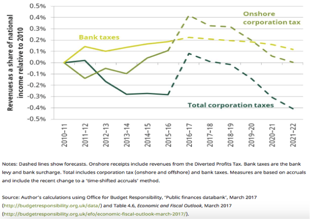
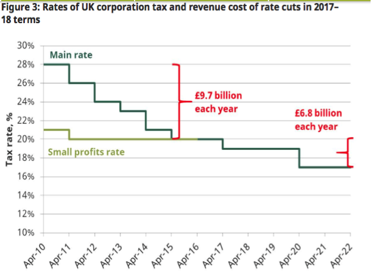
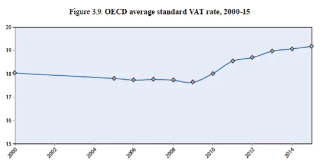

# PART 9: CORPORATIONS

# 9.1 Corporations and Tax

r tufte::newthought('If we take as a given') that the benefits of paying income tax outweigh the costs to individual taxpayers, the question becomes one of what other players in society should be liable. Individuals with sufficient earnings pay National Insurance and income tax. People who buy goods and services pay VAT. It serves to reason then that companies which consume goods and services, and earn profits in the UK, should also be liable for a tax.  For what exactly is a company but a collective group of people organised into delivering a certain good or service. It is fo

 Despite seemingly an uncontroversial position, the minefield that surrounds corporation tax begs to differ. Several different taxes are currently levelled on companies that operate in the UK, including corporation tax on their profits from their business operations, and business rates on the rateable value of their land and buildings. Several loopholes and rebates exist which aim to keep companies pacified against having to pay increased levels of tax. However, these loopholes often overstep the mark and leave corporations which, while in reality conduct the majority of their business and operations within the UK, are able to claim a foreign base and avoid taxes all together. 

In an increasingly globalised world, countries now have to tread the thin line between levying sufficient levels of corporation tax, and maintaining an attractive enough environment for the companies to remain in the country, rather than relocating their base to a less 'expensive' region in the world. It's a difficult task, and the complexity of determining effective tax rates domestically while coordinating with a myriad of  different international standards and regulations means that these loopholes are difficult to close. 

 However, lest we forget, corporation taxes are an important source of revenue for a Government which provides the employees of these companies, and the companies themselves, with a variety of public goods that enable them to function successfully. Everything from high-quality national education to effective public transport assists  corporations in operating a successful business. It's important, then, that these entities pay their fair share. 

##Knowledge is Power

Knowledge, we emphasise, is power. In this chapter we aim to empower the reader with information about what exactly the corporation tax landscape looks like in the UK and how it operates, and explain why the current framework permits certain issues to persist. 

It's worth then outlining some definitions before we enter into the murky world of corporation tax law administration. 

###Corporations

Corporations are, in their most basic definition, a large company or group of companies authorized to act as a single entity and recognized as such in law. A company is a collection of individuals who have grouped together to provide a professional service or goods. These companies and corporations, however, are legal constructs. They have no *real* presence in the world, but are legal forms ultimately owned and controlled by a person or people.  A limited company is a legal form where the financial liability of the owners is limited to the net assets of the company. In other words, a company can go bankrupt and the owners of the company have some protection from the company's creditors. Corporations are the legal forms which are dominant in modern society and, much like religious organisations and educational institutions, wield enormous power.

###Corporation Tax

Corporation tax is a tax on company profits. In simple terms, profit is the difference between sales revenue and company costs. In this, there is an analogy with a general principle of taxation, which says that those who have more should pay more. With respect to corporations, those companies who make more profit, should pay more Corporation tax. In the UK, this is currently set at 21% for companies with annual profits over £300,000 [@HMRC2019a]

In the UK, Corporation Tax is a tax payable on the profits of doing business as a limited company, a foreign company with a UK branch or office or club, co-operative or other unincorporated association. ^[An unincorporated association is an organisation set up through an agreement between a group of people who come together for a reason other than to make a profit (for example, a voluntary group or a sports club).]

Such organisations will pay corporation tax on the money they make from:

- doing business (referred to as 'trading profits')
- investments;
- selling assets for more than they cost (referred to as chargeable gains).

If the company is based in the UK, it must pay corporation tax on all its profits from both the UK and abroad. If a company isn't based in the UK but has an office or branch here, it only pays Corporation Tax on profits from its UK activities.

###Business Rates

Corporation tax is not the only tax on companies. Companies also pay business rates, which is a tax on the rateable value of land and buildings. This is covered in the part on section on land and property.

###Rates and Reliefs

Companies pay corporation tax at the rate which applied during their accounting period. The current Corporation Tax rate on company profits is 21%.

More complex calculations are also required for: associated companies^[One company is associated with another if either one company controls the other or	both companies are controlled by the same companies or people]; companies who have more than one applicable rate during their accounting period; and companies who have an accounting period of less than 12 months. There are also different corporate taxation rates for 'ring fence profits' of companies involved in oil extraction in the UK or UK continental shelf. 

When preparing the company's accounts, the costs of running the company may be deducted from the profits. Anything which a company director or employee gets personal use from must be treated as a 'benefit'. It may be necessary to pay tax on these items. It may be possible to claim capital allowances on assets kept for use in the business, for example, machinery, equipment and business vehicles. Some other reliefs are also available for specific cases, such as where the business is involved in the creative industries or involved in research and development.

Organisations must calculate and report their own tax obligations. There is no bill from HMRC. Rather, they must register for corporation tax within three months of doing business. There may also be a penalty for late registration. 

### Ring Fenced Companies

Different corporation tax rates apply to companies that make profits from oil extraction or oil rights from UK-based resources. These companies are designated as 'ring-fenced' due to reasons of national energy policy and security. Such companies can claim Marginal relief on profits between £300,000 and £1.5 million. 

###Registration

Registration can be done online, and companies require their Unique Taxpayer Reference number, which usually will have been posted to them by HMRC after the company was registered with Companies House. 

While registering, companies also need to inform HMRC of:

- the company registration number
- the date they started to do business (the accounting period will start from this date)
- the date the annual accounts are made up to.

Unincorporated associations will need to call HMRC to register.

###Accounting Records

In order to calculate how much to pay, companies must keep accounting records. HMRC has strict and detailed requirements for accounting records. If accounting records are not kept, companies can be fined £3,000 by HMRC or individuals may be disqualified from being company directors. It is necessary to keep records for six years from the end of the last company financial year they relate to. 

###Tax Returns

When companies or associations receive a 'Notice to Deliver a Company Tax Return' from HMRC, they must file a Company Tax return. They must still file a return, even if they have made a loss or have no Corporation Tax to pay. The tax payable should usually be paid 9 months and 1 day after the accounting period^[The accounting period is normally the same 12 months as the financial year covered by a company's annual accounts] it covers.

The tax return is due 12 months after the accounting period it covers. There are various penalties for late filing. If the return is six months late, then HMRC will send a 'tax determination' to say how much tax the organisation must pay. Organisations cannot appeal against a tax determination.

# 9.2 Competing Narratives

## The Need for Corporation Taxes

When it comes to corporation tax, there are two competing narratives at play. The right-leaning microeconomic story posits corporations as wealth creators and suggests that they should be taxed lightly. According to this narrative, corporation tax creates 'distortions'. Reducing corporation tax encourages business to invest and to make profits, and, in so doing, employ more people and provide more useful goods and services. 

The more left-leaning story, however,  is focussed on the macroeconomic picture. If an economy is 'wage-led' (as most economies are), then boosting the wage share will lead to increased aggregate demand. The profits and capital gains of companies in the end simply make the rich richer, and the rich spend a smaller proportion of the income than the poor. So a higher corporation tax could promote economic growth.

So what is the truth? Why should corporations pay tax on their operations? It seems obvious that as both wealth creators in an economy, and consumers of public services, there is a clear need to balance the needs for revenue, and to account for the value corporations derive from public goods and service provisions, alongside the need to maintain an attractive enough environment to encourage them to settle nationally and employ a national workforce. There are two sides to any coin, and we'll explore these concepts below

## One Side of the Coin

### Why Tax

A corporation tax is a tax on company profits. It generally covers both profits retained within the company (retained earnings) and those paid out as dividends (distributed earnings). A credit is applied to distributed earnings so tax is only paid once. But should we have a corporate tax at all? Since companies are owned by individuals, might it not be simpler to tax individuals rather than companies?  

It might be clearest first to define the functions of a corporation tax first. At the  simplest level, such a policy functions as an at-source tax on company profits made in the UK. This has a number of purposes, including regulating foreign ownership of wealth and assets in the United Kingdom; preventing companies from being used as vehicles for  low-tax saving; and to ensure that companies pay a fair share of the cost for the government services provided to the company (eg. enforcement of property rights, education of the workforce, health care provision).

 There are also several pragmatic reasons for the application of corporation tax, which will be explored below. 

### Revenue

Corporation tax makes up approximately 8% of HMRC total receipts. It is the fourth biggest tax in terms of receipts: after Income tax, VAT and National Insurance Contributions, although the financial crisis saw income from the tax fall significantly, from £46.3 billion in 2007/08 to £39.3bn in 2013/14 [@UKParliament2015]. A small number of firms pay the vast majority of income tax. According to the Oxford Centre for Business Taxation, 1% of all companies account for 81% of receipts. As it is a tax on profits, income from the tax is strongly correlated with the business cycle and thus can be very volatile. The below chart shows the relationship between the state of the economy and receipts from corporation tax [@UKParliament2015]. The vertical axis is the annual change in corporation tax receipts and the horizontal axis is the annual change in economic output (1979/80-2013/14).

At the time of writing, receipts from Corporation Tax are surprisingly high, with the UK government raising £56 billion in the 2016-17 financial year, which is an increase of 21% from the previous year [@Miller2017]. This is forecasted to decrease to £53.2bn in 2017-18. However, onshore receipts are projected to fall to 2010 levels, as the below chart from the Institute of Fiscal Studies shows. 

The current level of receipts from Corporation Tax have been attributed to several factors, including a general growth in the UK economy, increases in the profitability of UK corporations, a fall in investment spending (because companies can offset some investment against profits) and increased focus on tax avoidance [@JacksonHoulder]. 

|  |
| :----------------------------------------------------------: |
|           *Figure 7.2 - Corporation Tax Avoidance*           |

### Private Companies Rely on Public Services Too

Corporate profits are not totally independent of public investment. Corporations require a number of public goods to run their companies successfully - from educated and healthy employees, smooth roads and public transport systems, and power grids and telecommunications systems for their companies to operate. They therefore rely on tax-financed public goods, including social investment in the education and health of employees, public infrastructure, legal contracts and property rights. Without these structures, which are upheld and funded by government, corporations would not be able to conduct business profitably.

### Tackling Rent

Another reason for corporation tax concerns economic rents. Economic rents are basically the analogue to land rents: whereas it is assumed that high profits would be competed away by other companies, in some cases this is not possible because the company has some advantage that cannot be replicated by others.

The OECD describes these as 'profits above the normal level of return required for a business to be successful. Economic rents mainly arise as the result of monopoly profits or market power and entrepreneurial skill or ideas.' There are many kinds of economic rent. For example, this includes control over intellectual property, which prevents competitors from entering a market (and thereby lowering prices through competition) can lead to such profits. 

Nicholas Shaxton offers further examples,

> *'[rents] like oil money that flows effortlessly into Saudi or Kuwaiti coffers - are earnings that arise not from hard work and real innovation but from accidents of nature or good fortune. Adair Turner recently explained how banks in the City of London are particularly adept at earning rents, such as from exploiting insider knowledge and expertise; from natural oligopolies in market-making and other activities; and from "valueless" trading activity'[@Shaxson2011].*

It would be ideal to design corporation tax so as to tax economic rents only, which should result in no market efficiency losses.Therefore, companies who hold a monopoly over certain goods and services collect economic rent due to market imperfections such as lack of competitive pressures. In such cases, the consumers or the public pays an economic rent over and above an acceptable price. Corporation tax is able to recoup such rents and redistribute those funds to the public.

###The Backstop

Individuals can have income from employment and from owning assets. The tax on this income is levied through the UK's 'income tax' and 'National Insurance' systems. We call the tax on profits of companies 'corporation tax'^[Sometimes different terminology is used: the income tax is called the 'personal income tax' and the corporation tax 'corporate income tax', but we avoid this terminology here]

Income tax is not only a tax on employment income, it is also a tax on distributed profits (dividends). Profits distributed as dividends are  taxed twice; once under the corporation tax and once under the income tax system. The rate of income tax paid is lower to account for the corporation tax already deducted.

||
|:--:|
|*Figure 7.1 - Corporation Tax and Income Tax*|

Since the country of the activities of the company and the country of residence of the owner could be different. This means that profits could be made in one country and then distributed to an owner resident in another country

Thus corporation tax acts as a sort of backstop to the income tax system. Corporation tax is paid on profits. Profits can, in turn, be retained within the company (retained earnings), or paid out as dividends to the owners of the company. Dividends would be subject to income tax, but since they have already paid corporation tax, a deduction is made for that purpose. The tax paid on dividends will depend on the residence of the person receiving the dividends. Foreign owners of UK companies are not caught by UK income tax, but corporation tax requires them to pay some percentage of the profit they received.

As discussed earlier, it might be difficult to tax residents' wealth for two main reasons. First, that rich people are geographically movile and can move to the lowest tax jurisdictions; second, residents can hide offshore wealth in foreign and secret locations. It is therefore difficult to tax individuals on their global wealth. It is not impossible though, as the US does attempt to tax US passport holders on their global income. 

Corporation tax prevents at least some of the avoidance associated with companies as a legal form. Without a corporation tax, wealthy individuals could *shelter* their income in a company. Companies are a legal form, and a company does not necessarily represent a business nor is a business necessarily incorporated. For example, an individual can be paid through a fully-owned company, and then offset some costs and smooth wage and dividend payments so as to minimize higher rate income tax on their earnings. In this sense then, corporation taxes is an essential companion to the personal income tax system.

## The Other Side 

###Economic 'Distortions'

When taxes cause corporations or individuals to behave differently than they otherwise would, for example by moving their headquarters to another country, the taxes are said to cause *distortions*. Taxes on corporate profits are thought to be particularly distorting, in that they create and negate a variety of incentives  which result in significant behaviour change by corporations, and those who invest in them. Researchers Johannson et al, in their 2008 OECD Working Paper, observed that corporation tax is likely to have many kinds of effects;

>*'The corporate income tax is likely to distort the total amount of investment and the type of investment projects that are undertaken, the corporate sources of finance (debt, newly issued equity or retained earnings), the location of the corporate tax base, the choice of a business legal form and the tax might have an impact on corporate mergers and acquisitions.'* [@Johansson2008]

The researchers suggested that, when different taxes are ranked from least distortive to most distortive, recurrent taxes on immovable property are the least distortive tax instrument, followed by consumption taxes (and other property taxes), personal income taxes and finally corporate income taxes being the most distortive ^[This is in terms of reducing long-run GDP per capita].

In particular, these distortions are likely to negatively affect economic growth. There is evidence that corporate income taxes negatively affect economic growth. Research by Lee and Gordon examined data from 70 countries which covered the period 1970 -1997. They found that, after correcting for other variables, that the corporation tax rate was 'significantly negatively correlated' with economic growth. They suggest that that cutting the corporate tax rate by 10 percentage points can increase the annual growth rate by around 1.1%. The authors explained these findings by suggesting that lower corporate tax rates may encourage more entrepreneurial activity, with more people choosing to leave employment and start businesses.^[The authors noted that lower corporation tax rates seem to be correlated with lower personal tax (income tax) revenue, which would be consistent with such a theory.] The authors stressed that

>*"the growth effects of tax reforms, as well as the more standard efficiency and equity effects in a static context, merit serious consideration."* [@Lee2005].

The is a particular kind of distortion which is particular to corporation tax. This is the 'debt-equity' distortion. This results from an asymmetry at the heart of corporation tax, whereby the return on equity is taxed, but interest payments on corporate debt are tax deductible. This can increase the risk of bankruptcy and encourage tax-minimisation strategies through taking on more debt. Writers of an IMF blog argues for 2 ways to mitigate debt bias - to limit the tax deductibility of interest or provide a deduction for equity costs [@DeMooij2016].

###Who really pays the piper?

In some ways, corporation tax can be thought as an indirect tax on those who are owners of capital.  These owners may be individuals or shareholders of corporations, who gain or lose value through changes in the value of their shares or through the receipt of dividends after a company gains profits through their operations. Notably, the corporation tax burden falls mostly on capital owners, rather than employees because stock ownership is most concentrated amongst the wealthiest individuals and family trusts [@Shaxson2011].

Because corporations are not natural, but are legal constructions, it has been argued that Corporation Tax is not paid by corporations but by people, and that sometimes these people are not the ones we might prefer to target.

Economist Helen Miller made the following argument in 2017, when she said that "an important feature of Corporation tax is that the ultimate burden is not necessarily entirely borne by company shareholders. It can be borne by workers. In short, if firms decide to respond to higher corporation tax rates by doing less investment in the UK, that leaves UK employees with fewer job opportunities and lower average wages. Evidence suggests that, because capital tends to be much more mobile than workers, a significant share of the burden of corporation tax tends to get shifted to labour. Corporation tax can also be borne by consumers if firms respond by increasing the prices they charge." *[@Miller2017]

However, others have argued that it is unclear whether corporation tax falls largely on employees, and have made the wry point that if Corporation tax doesn't fall on the owners of capital, then why do so many companies try to avoid the tax?

# 9.3 Loopholes in the Law

##Tax Avoidance

Because Corporation tax is based on profits, it is vulnerable to clever accountants who are able to exploit differing tax rules in different companies. We outline a case study below about Apple's corporate tax avoidance. 

###**Case Study: Apple**

In 2016, the technology company Apple, accustomed to great praise, received a taste of bad press, but not for its new iPhone model. Rather, its tax arrangements attracted scrutiny from the European Commission, which demanded that Apple pay up to £13 billion (& interest) for unpaid taxes in Ireland. Both Ireland and Apple condemned the decision, claiming a right to create an agreement between a sovereign nation and a private company. Thus arose a farcical situation in which the Irish government brought legal proceedings in order that they not receive £13 billion in back taxes.

In fact, the agreement between Ireland and Apple allowed the tech company to pay a maximum effective tax rate of only 1% of their profits, a classic sweetheart deal. The standard corporation tax rate in Ireland is already quite low compared to other EU countries, at 12.5%. The arrangement between Ireland and Apple was complex. Apple created two subsidiary entities in Ireland, which effectively own most of the company's intellectual property. These organisations then licensed the intellectual property to Apple subsidiaries elsewhere in the world.  Thus, profit earned in countries around the world is transferred to the Irish companies, ostensibly in the form of license fees. This income would normally be taxed at 12.5% in Ireland but the agreement between Apple and Ireland allowed the profits to be attributed to a 'head office', not located in any country (and thus not subject to tax in any jurisdiction). The result was that Apple paid only 1% tax on its European profits in 2003 and 0.005% in 2014.

According to the European Commission, this arrangement amounted to a form of state aid and was illegal for EU members. The European Competition Commissioner, Margrethe Vestager argued that the deal was unfair to other businesses, stating,

>*Our rules don't stop governments applying a law rate to every company...what they can't do is to select just a few favoured businesses and give them special treatment which their rivals can't get. So, when we ask national governments to reclaim unpaid taxes, all we're doing is ensuring that everyone has an equal opportunity.'* [@Vestager2016]

## The Race to the Bottom

The above discussion illustrates the underlying tensions between governments and corporations, and the growing difficulty facing governments who attempt to tax corporate profits in a globalised world. Multinational companies wish to minimise their tax bill and are willing to move around and create complex tax structures to achieve this goal. Countries seek to attract investment and gain income from corporation tax. In the case of Ireland, the government has positioned itself as a low tax country in order to attract investment and create jobs. This dynamic between corporations and governments creates a *race to the bottom* in which governments compete to attract companies by lowering their corporation tax rates. The below chart compares the rates of Corporation Tax around the world [@Miller2017].

||
|:--:|
|*Figure 7.3 - Corporation Tax Rates Around the World*|

As can be seen in the chart, the UK's main rate of corporation tax will decrease to 17% in 2020. The stated objective of this reduction is to create a more competitive corporate tax system to provide the right conditions for business investment and growth. Government analysis suggests that the change will reduce income to the Exchequer of £120 million in 2019-20 and £945 million in 2020-21 [@HMRC2015]. The below chart from the Institute of Fiscal Studies shows the revenue cost of past Corporate tax rate reductions, and the projected cost of future cuts [@Miller2017]. 

||
|:--:|
|*Figure 7.4 - UK Corporation Tax Rate Cuts*|

The picture is similar elsewhere. In 2015, Japan, Spain, Israel, Norway and Estonia decreased their corporation tax rates and Italy, France, Japan and the UK had announced plans to do so. 

These trends in corporate tax rate have a bearing on issues concerning wealth and income inequality. Tax Justice campaigners have warned that as governments reduce taxes on corporate profits, they have increased the rates of VAT, fuel and car taxes. The below chart shows the increase in the OECD average rate of VAT from 2000-2015. We can see a steady increase in the VAT average after 2009.

||
|:--:|
|*Figure 7.5 - OECD Average standard VAT rates*|

VAT and fuel taxes disproportionately affect lower income earners. According to the Tax Justice Network, "Governments make up the shortfall by levying higher taxes on other, less wealthy sections of society, or by cutting back on essential public services." Another concern is that if corporation tax reduces the return to company shareholders, this will not only affect people with directly held shares, but also older people with private pensions. This would suggest that tax competition boosts inequality and deprivation.

## Ring Fencing Bads

A final concern with the corporation system as it currently stands lies in the ring fencing of domestic fossil fuel companies. Allowing marginal relief on the profits made by these companies is, in fact, a subsidy on their operations, and, in effect, a subsidy for the externalities which their carbon intensive operations create. 

 With a stated commitment to lower UK emissions by 80% by 2050, this tax subsidy is clearly incompatible with national goals. It is arguable that a rewrite of these tax policies could be instrumental in shifting incentives for companies to produce fossil fuels. As it stands, however, these incentives to lower carbon emissions and push a fuel shift towards low-carbon sources do not exist within corporate tax policy. 

#9.4 Reform 

It's clear then that what is needed to combat these significant issues is substantial reform of the corporate tax system. In as much as the space and issues around corporation tax are complex and challenging to comprehend, so too is their reform. How best to balance the needs for sufficient tax revenue against the increasingly mobile nature of companies is a question that numerous academics and politicians have tried to solve. Building on tax-based incentives to create social 'goods' is another layer of complexity in the mix. 

 With any question of reform, it is important first to establish the goal to which we are working. With corporation tax, our ideal is thus. A system of company taxation that rewards exporting companies and all those that invest in physical capital expenditure in the UK. More specifically, we're looking for a way to taxing the wealth and income of the eventual owners of corporations. We would like to do this, so that this group pay their fair share of taxation.

Any reforms should be applied in such a way that they are not easily avoidable or evadable, and that treats companies fairly. Preventing an international 'race to the bottom' is also a key priority. International cooperation on tax policy is the ideal, but designing a tax policy that doesn't compete on lowering taxation rates is a strong alternative solution. Supporting the creation of social 'goods', most commonly translated into discouraging bads, is also a core objective of any reform. Lastly, creating an attractive environment for exporters, in the short-term, would support the UK's historically poor trade performance. We suggest a proposal that reforms VAT and existing corporation tax system to achieve just this, through the unification of both components under a company cash flow tax. 

However,  lets not walk before we can crawl. As with before, knowledge is the most effective tool to start rebuilding any system. To this end then, there are a number of possibilities for reform of corporation tax.  In this section, we'll outline a few of the main proposals for reform, including unitary taxation, the cash-flow tax, and potential tax-rebates for the creation of social goods, before moving on to discussing what the optimal options would be for the society we'd like to create.  

## Options for reform 

###Unitary Taxation

A rose by any other name would smell as sweet. The same goes for Unitary Taxation, or 'Formulary apportionment' by its slightly more descriptive title. In more basic terms, this method of taxation tries to tackle the mobile nature of multinational corporations by allocating the profit earned by corporations proportionally to the jurisdictions that they operate in. 

 allocating profit earned by tax jurisdiction

- idea is fair share of business operations --> fair share of liability for tax
- illustrate point: al business all employeesin one country, 'board member in the caynmans - low tax!' e.g. apple
- Way to deal with this: unitary taxation
- [@TaxJustice2019]

Unitary taxation is a method for taxing large corporations which allocates their global profits according to different jurisdictions. So instead of there being a confusing plethora of different formulae for determining how much taxes should be paid in a certain jurisdiction, a standard formula is used. One such formula is the so-called 'Massachusetts formula', which was proposed to be used in the United States for allocating the profits of corporations between various states in which they are based. The formula takes the total worldwide profits, to which are then applied a weighting in each country or other state in which they are based. 

The weighting has three components: the proportion of sales, the proportion of assets, and the proportion of employees that are in each jurisdiction. We then take the average of these three weightings. This average weighting is multiplied by the global profits to determine the tax payable in the jurisdiction.

Thus the corporation tax paid in jurisdiction i is given by:

$$CorporationTax_{UK} = t_{CT} * Weighting_{UK} * Global Profits$$

where $t_{CT}$ is the tax rate and

$$  Weighting_{UK} = \left( \frac{1}{3} \right)* \left( \frac{Sales_{UK}}{Global Sales} + \frac{Assets_{UK}}{Global Assets} + \frac{Employees_{UK}}{GlobalEmployees} \right)$$

###The Cashflow Tax

Another possibility for reform is the so-called Cashflow Tax, sometimes referred to as the 'Dyson Tax' in this book. 

A cashflow tax is a tax on the difference between domestic (uk) sales and domestic (uk) wages and supplier costs.

$$Cashflow Tax_{UK} = t_{CF} * (Sales_{UK} - Costs_{UK})$$

In the language of International tax, it has a 'destination basis' for sales and a 'source base' for costs. Something can be counted as a UK cost so long as tax has been paid on it. So, for example, UK employment income would be counted as a taxable deduction so long as it was subject to income tax. 

Note that cashflow tax can be either positive or negative. If a company locates in the UK but sells abroad, it may have a negative cashflow tax. Thus the cashflow tax encourages companies to locate in the UK. Conversely, if a company sells to the UK but has no UK costs, then it will pay the cashflow tax on all of its sales. In effect, this would be a sales tax not a profits tax. Thus it encourages business to locate in the UK; with the higher the tax rate, the greater the incentive to move.

Thus the cashflow tax satisfies two of our requirements for reform: it reverses the race to the bottom and it gives a boost in the short term to UK manufacturing. Whilst unitary taxation is also a good option, the cashflow tax fulfils more of our objectives.

###Integrating Cashflow Tax and VAT

Since the cashflow tax operates on the 'destination' basis for revenue, it is similar in some way to a Value Added Tax, but where UK wage costs are deductible.

Given that we also propose to introduce a comprehensive system of environmental taxation (see later chapter), it might make sense to integrate our corporation tax system with our system of VAT. Assuming a cashflow tax rate of 40% for domestic firms, how should imports be considered? Under the VAT system, there is a tax on imports and a subsidy on exports. But it is not as high as 40%. 

We propose that cooperative tax nations would pay only a 20% rate on imports ^[Corresponding to a 25% VAT rate, as the definition is inverse]. This means in effect that payments made to compliant countries would be half-deductible for the purpose of coherence and ease. This clause would not apply to tax havens, which would lack all deductibility so as to discourage use.

## Conclusions

We propose to replace Corporation Tax and VAT with a 'cash flow' tax and taxation at source of all dividends. Whereas a corporation tax is a tax on 'economic profit', a cash flow tax is a tax on net receipts (i.e. retained cash flow). Cash-flow is a destination basis corporate tax, exempting exporters, capital investment and R&D but including interest payments. The basis of the cash flow tax is UK sales and borrowing minus costs, dividends, interest and principal repayments. It therefore exempts capital expenditure and exports. It is similar to a value added tax, where wage expenditures are deductible. The advantage of the cash flow tax is that can be applied to the financial sector and it encourages investment and exporters. With corporation tax, companies can move the jurisdiction they are registered in, and charge losses to high-tax locations and profits to low tax locations. With a cash flow tax, all sales in the UK are taxed, and only UK wage payments are deductible. It applies to all companies that sell in the UK, and 'transfer pricing' becomes irrelevant. It avoids the international 'race to the bottom' among corporate tax rates. 

****- Publicly quoted companies should have the option to pay the cash flow tax in shares. These shares would accrue to a sovereign wealth fund which would pay the Citizen's Dividend.- A 'monopoly charge' of 5% of the company value (proportional to value added sold to UK consumers,i.e. like VAT) would be imposed on all large companies and on trusts. This tax would be payable in shares to a sovereign wealth fund for children, so that1/20th of the shares of a company or trust would go to such a fund per year.- International wealth transparency tax of 0.1% of assets greater than 5 million pounds- Capital Gains Tax: If the tax paid on retained earnings is less than the average tax paid on dividends, company owners will have an incentive to retain those earnings within the company. The owner of the shares could later sell them. They would therefore pay less tax than if the earnings had been paid out as dividends. Capital gains tax on  shares ownership can be thought of as a crude way to prevent tax avoidance through this route. Capital gains tax also allows those who have achieved unearned capital value increases (for example, due to the fall in long-term interest rates) to contribute properly. Capital gains tax rates should be set consistently to  avoid tax advantages or disadvantages based on legal structure. - Applying an Immigration and Citizenship charge****  