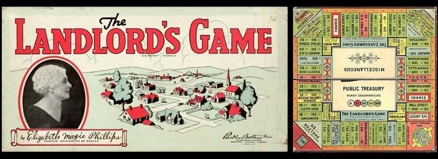
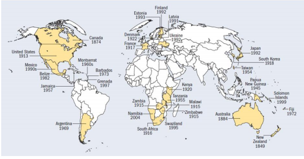
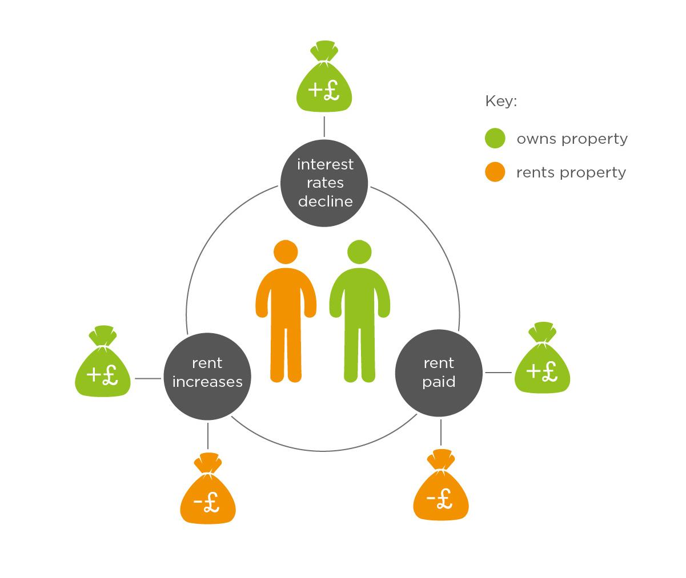

# PART 10: LAND AND PROPERTY

## Summary 

- In the UK, buying a house is extremely and increasingly unaffordable for many. This is contributing to other problems, such as homelessness.
- High house prices are due to high land values. House prices go through boom-and-bust cycles due to land price speculation. This is when people buy land in the hope that it will go up in value. This is not a productive investment, one that leads to economic growth, but rather is a 'pseudo-investment' or placement.
- Landowners get free value from the work of the community, such as the building of public transit infrastructure or community investment in local parks. Landowners receive an increase in land values from these external activities, which they themselves have done no work to create.
- Land Value Tax is an effective solution to this unfairness, and to the housing boom-and-bust cycle. It is a tax on land values.
- LVT is a well-established idea, with multiple benefits. It faces some obstacles, for which there are solutions. The biggest may be political feasibility.
- Land has been neglected in neoclassical economic theory, and generally is conflated with capital. However, land differs from capital in important ways. Many current economic problems have arisen from a failure to recognise this distinction.

# 10.1 How bad is the housing affordability problem in the UK?

`r tufte::newthought('The affordability of housing')` is frequently the topic of national debate, but as housing charity Shelter UK warn, we risk becoming so accustomed to the high cost of housing that we end up seeing it simply as a fact of life [@Shelter2010].

The most recent review into this topic was conducted by Lloyds Bank, who found that home affordability (i.e. the ratio between average house prices and local earnings) across UK cities "has hit its worst level in eight years" [@LloydsBank2016]. The report found that the average UK city house price had risen in 2016 to its highest-ever level of £211,880. Average affordability in the last twelve months had increased from 6.2 to 6.6 times annual average earnings. Most notably, the researchers found no cities in the South of England where house prices are less than 7.5 times the average local income.

The below chart shows how the ratio of UK house price to real earnings has changed over time. 

| |
|:--:|
|*Figure 8.1 - Real Wages vs House Prices*|

The ratio is the highest it has been since April 2008, at the beginning of the great recession. We can see below that it is particularly hard for first-time buyers to afford a house in London.

||
|:--:|
|*Figure 8.2 - First time buyer earnings to house price ratio across the UK*|

The below chart shows that the gap between the most and the least affordable local authorities has increased since 2002, and this is due to the least affordable areas moving further away from the overall affordability ratio [@ONS2016a].

||
|:--:|
|*Figure 8.3 - House price affordability compared between Burnley and London*|

There have also been many demographic changes in housing ownership. The chart below shows the percentage of each age group that are home owners, from 1981 to 2014  [@Ough2016].

||
|:--:|
|*Figure 8.4 - Percentage of each age group that are home owners in England, 1981-2014*|

We can see a dramatic reduction in the percentage of people between the ages of 34-44 owning homes, and an increase in the percentage of over 65s owning homes.

##  The Human Impact

The rising cost of housing is also contributing to growing inequality of wealth. The chart below shows the upper bounds of household net property wealth for each 1% of the net property wealth distribution in 2012. 

||
|:--:|
|*Figure 8.5 - Upper bounds of household net property wealth in 2012*|

The graph above shows dramatic inequality in property wealth, but it still does not capture the devastating personal effect that unaffordable housing is having on British people. Shelter UK warns that: 

> *"Unaffordable housing plays a vital role in changing the way people live and constraining their choices...the high cost of housing is having an impact on all aspects of life, and raises the prospect that, as a result of a collective failure to find solutions, we could be allowing ourselves to drift into a future where we will all ultimately be worse off."* [@Shelter2010]

A staggering 44% of working families in England (3.7 million families) have had to cut back on essential food and clothing to help pay their rent or mortgage. A further 41% say that housing costs cause them stress and depression [@ShelterEngland2016]. With so many families having to cut back on food and heating expenditures in order to pay for housing costs, it's clear that this is a problem striking at the heart of citizens' well-being.

## Case Study: Michelle and Kevin

Michelle and Kevin rent a small home in Cambridge, where they live with their two children. Kevin works full-time for a cleaning company, while Michelle studies for a career in criminal justice. Kevin had previously been self-employed and his income had dropped so low that they fell behind on rent. With Kevin now in full-time employment, they still struggle to get by.

> *"Even though my husband has a new job now and works as many hours as he can, it's constantly hand-to-mouth. We've cut back on everything to help pay the rent - including food. When the children are at school, the heating isn't on at all, and we only ever buy clothes when we absolutely have to because the little ones have grown out of something."*

Millions of people are experiencing that major life decisions, such as moving out of their parents' homes into their own home, or starting a family, are being affected by the lack of affordable housing. 21% of people aged 18 to 44 said they were delaying having children because of a lack of affordable housing. Worryingly, 36% of this group expected that housing costs would prevent them from starting a family for at least another four years. Shelter UK notes that this will create knock-on effects for the NHS and other public services, as women are forced to delay pregnancy into their less-fertile years:

> *"If women continue to put off starting a family because of housing costs, this could drive up the numbers experiencing fertility problems, putting more people through the trauma of being unable to conceive. As well as the obvious human impacts, such an outcome could also result in additional financial costs to the NHS in the form of increased demand for fertility treatment."* [@ShelterEngland2016]

One of the most surprising findings was that 24% of adults have been forced into continuing to live with a partner they are no longer conjugal with, because they cannot afford to move out, or know someone who has been in this situation. Housing costs are also causing many adults to move back in with their parents, or delay ever moving out at all. At the other end of the age spectrum, housing costs are also making it difficult for adult children to live near to, and care for, their aging parents.

## Case Study : Alan 

Alan lives with his wife in Portsmouth and is an architect. Both of their parents live in Bournemouth. His wife's parents are becoming increasingly frail. Alan and his wife would like to move back to Bournemouth, but their house is in negative equity and house prices in Portsmouth are too high for them. 

>  *"We can't see any improvement in our situation in the short to medium term. What we really fear is that time is not on our side."*

# 10.2 The Cause of the Housing Crisis

If you were riding in a London cab, and were to ask the driver why the cost of buying housing in London is so high, he might say, 'Well, its obvious! It's supply and demand! There is a huge demand for housing in London. Lots of people want to live here!" At face value, this explanation sounds very reasonable; but if I thought a little harder, I might wonder why the cost of other things doesn't increase in the same way. 

The best way to think of this is by picturing another product, like mobile phones. There is very high demand for mobile phones. Almost everyone has one, and like housing, they are generally considered a necessity. However, the cost of phones doesn't keep going up and up. Why not? 

Moreover, we know the housing market has boom and bust cycles, where housing price increase for years and years, and then suddenly start dropping (i.e. housing prices go through boom and bust cycles). Why don't the price trajectories of mobile phones do that?

There is a key difference between housing and mobile phones. Phone-makers can increase the supply of phones essentially at will to meet demand. Housing is different. Housing has to be built on land, and the supply of land is essentially fixed (notwithstanding the impressive achievements of the Netherlands in converting seabottom into land by building dikes and pumping away the water from shallow seas). The taxi driver was right in comprehending that this is an issue of supply and demand. When demand for phones increases, we can increase supply. Prices will stay the same, or even decrease, if an over-supply is generated by competing phone-makers, or process improvements reduce production costs. In stark contrast, when demand for housing increases, as it must when populations increase, we cannot increase the amount of land to build on, so the price of housing (house and land) increases indefinitely. Given rising populations, housing prices are a one-way ratchet.

Though we talk about 'house prices' increasing, it would make more sense to speak of 'land prices' increasing. The supply of land is the factor causing the combined cost of house + land prices to increase - not the cost of actually constructing a house. If we look at valuations in UK regions with high 'house prices,' we see that the land value is much higher than the value of the building sitting on it.

As campaigner Edward J. Dodson states,

>  *"Actually, "house" prices are not increasing. A housing unit is a form of capital good, and all capital goods depreciate over time. The actual value of a house is best defined as its replacement cost, less any depreciation. Thus, the potential selling price of a house has everything to do with the owner's ongoing maintenance and periodic replacement of systems .... Ongoing efficiencies in the production of the materials that go into constructing a housing unit have resulted in a reduction in construction costs per square foot."*

>*"One need look no farther than land acquisition costs for an explanation of why a residential property is an impossible acquisition for a growing segment of the population."* [@Shaxson2016]

If you're not convinced, consider Figure 8.6 below [@Wightman2013]. This graph compares four important costs relating to housing, and shows how they have changed over time. The lowest line on the graph, 'Build Costs,' is the cost of actually constructing a house. 'House Price' is the value of the house only, and 'Land Price' is the value of the underlying land only. 'Earnings' show the population's average earnings.

We see that while the cost of building houses has remained largely stable between 1986 and 2007, land prices have oscillated dramatically through a boom and bust cycle. The 'House Price' line is most revealing because, while the costs of building houses has stayed the same, the cost of buying them has oscillated - mirroring the 'Land Price' line [@Lloyd2009].

||
|:--:|
|*Figure 8.6 - Index of housing market costs 1983-2007*|

## Why then the boom and bust cycle?

As the population increases, the demand for housing increases. Supply doesn't increase, so we would expect the price to steadily increase. Why then do we see a boom and bust cycle? 

This is because of 'land price speculation,' whereby people buy land in the anticipation that its price will increase. This is a kind of bet (and a fairly safe one at that). When lots of people buy up land because they think the price will go up, it pushes the price up further. There is a fixed quantity of land, so supply cannot respond to demand. It is very difficult, in this environment, for someone to buy a home to live in, because there are plenty of people in the market who simply want land as a way of making money. The price continues to rise until some form of shock occurs, and the value suddenly plummets as people exit the market. After some time, the price starts to climb again as speculators' confidence returns, and they again believe that the land price will increase. So speculation increases the demand for land and causes prices to increase faster and faster.

These land price speculators are treating land as a kind of 'investment.' However, land is not an investment in an economic sense, because no new product or service is produced. No improvement is made. They simply sit on their ownership titles to land, hoping it will increase in value so they can sell it or borrow against it somewhat later in time. 

The impact of land speculation on people who want to buy homes to live in and for renters is obvious. The price of homes goes up and up, and so does the cost of renting. This is also a loss for the economy generally, as money from people's monthly income is spent on rent rather than on other things, which reduces demand for consumer products and hence the jobs involved in producing them. And investors' money is not put into productive investments which benefit the economy, such as new businesses; instead, it is tied up in land speculation.

# 10.3 Fairness and land values

We mentioned that one cause of increased house and land prices is population increase. However, that's not the full story. There are other reasons why some areas may become more in demand and increase in value. In rural communities, it may be, for example, that farmers work to the improve the land itself, say by using new techniques to make the soil more fertile. In most cases though, and particularly in urban areas, land value goes up without the owner making any improvements to the land itself. 

One reason why the value of the land goes up is because of the work of other members of the community in developing the area around a particular piece of land. A bustling high street, cafes, improved public transport, well-kept parks - these are all examples of developments which can come to surround a piece of land and thereby increase its value, even if the owner of that piece of land has made no improvements to it at all. A location tends to become more desirable as a place to live and work because of government and community activity and investment. That is why we may sometimes exchange the term 'location value' for 'land value.'   

Of course the opposite can sometimes occur. We have seen from the experience of the American mid-west that land values can plummet when important local infrastructure or businesses close down, and a local area becomes a less desirable place to live. 

The general trend, though, is for land values to increase. In many cases, a landowner captures a great deal of financial value due to the work of the wider community, without himself incurring any expense or effort. It is appropriate for us to reflect on the fairness of this arrangement.

Let us consider some scenarios:

- If a noisy road is built close to a man's house, and the value of his land and property decreases as a result, is that fair on him?  
- If the public as a whole, via the government, create beautiful parks and amenities close to a woman's land, and this causes her land to increase in value, is it fair that she keeps the value? 

Consider that the rents which her tenants pay may also go up as a result. They have to pay more to live there, but their landlord's land goes up in value. She receives both increased rents and an increase in land value. Is that fair?

## The Jubilee Line example

When the Jubilee Line on the London Underground was created, it cost the public purse £3.5bn. The value of the land around the line's stations shot up by an estimated £13bn [@Riley2001], and it was private landowners who gained that extra value[@Mitchell]. In particular, the land value around Canary Wharf station increased by £2.8bn, while the land value around Southwark station increased by £800 million [@TransportforLondon2004].  This was an increase in land values that landowners adjacent to the Jubilee Line stations had done nothing to create. The public paid for the amenity, and those landowners received a windfall. Is that fair? Should all or at least some of that windfall benefit be shared with the public?

Great minds have already considered this matter. Winston Churchill made his viewpoint clear: 

>*"Roads are made, streets are made, services are improved, electric light turns night into day, water is brought from reservoirs a hundred miles off in the mountains, and all the while the landlord sits still. Every one of those improvements is affected by the labour and cost of other people and the taxpayers. To not one of those improvements does the land monopolist, as a land monopolist, contribute, and yet by every one of them the value of his land is enhanced."*

>*"He renders no service to the community, he contributes nothing to the general welfare, he contributes nothing to the process from which his own enrichment is derived ... the unearned increment on the land is reaped by the land monopolist in exact proportion, not to the service, but to the disservice done."*

John Stuart Mill similarly wrote in 1848, 

>*"Landlords grow rich in their sleep without working, risking, or economising. The increase in the value of land, arising as it does from the efforts of an entire community, should belong to the community, and not to the individual who might hold title."* [@mill1848principles]

More recently, the writer George Monbiot wrote, 

> *"(T)hose who own the land skim wealth from everyone else, without exertion or enterprise. They levy a toll upon all other forms of wealth and every form of industry" *

As mentioned, this form of unearned land value increase is particularly prevalent in urban locations. It is less relevant to agricultural locations, where the work done by a farmer does little to affect the value of her neighbour's land. 

Before we consider in detail how to best address the unique situation of land, and the problems currently associated with it, let us lighten the mood and discuss board games.

# 10.4 The case of Monopoly

Monopoly is a fun game to play, but not necessarily one that leads to familial harmony, at least when playing the standard rules. We all know how Monopoly works - everyone has some starting cash and goes about buying up properties, building houses, and charging rent. As players move around the board, they land on properties and pay rent to whoever owns them. In the end, one person owes everything, and everyone else is left penniless. This is a parable for our present economy.

Rather less commonly known is the fact that Monopoly was preceded by and evolved from another game, called 'The Landlord's Game,' invented and patented by Elizabeth Magie. 

||
|:--:|
|*Figure 8.7 - The Original Monopoly was first called The Landlord's Game and invented by Elizabeth Magie*|

This state of affairs is also present when oligopolies exist. ^[A state of limited competition, in which a market is shared by a small number of producers or sellers.]

Magie's game had two sets of rules of play. The first set of rules is similar to the rules of Monopoly, and similarly led to extreme instability, with the whole board monopolised by one player, and the other players forced into penury and bankruptcy. 

The second set of rules in The Landlord's Game led to a very different outcome. The game, when played by these rules, led to a stable and admittedly boring game with no clear winner. Everyone ended up with something. Not quite world peace, or even family peace, but economic peace - at least within the confines of the game.

So what were the different rules that lead to a much more stable economic outcome? 

The 'economically stable' rules involved a tax levied by the central authorities on the value of the land owned by each individual, and distributed back through public services or a per-capita dividend. This is sometimes called a 'site valuation tax' or a 'location value tax,' but is most often referred to as a 'land-value tax.'

# 10.5 Land Value Tax

## History

Elizabeth Magie intended her game to demonstrate that a single tax on land values could lead to a sustainable economic system in which all benefited. This is the kind of tax we are proposing.

Magie was not the originator of this concept. She was espousing the ideas of a 19th Century self-taught economist named Henry George, who argued that a single tax on land values would be both efficient and fair. It would be *fair* because it taxed unearned increases in land values which occur not as a result of individual effort or ingenuity, but because of development of infrastructure and the wider economy. It would be *efficient* because the quantity of land does not change. He suggested that when we tax labour (via income tax) or tax economic activity via sales tax and corporate taxes, we discourage these activities and thereby make the economy less productive. Taxing land values instead might discourage people from speculating on land, and this would be a good thing, as it would free up funds for more productive investment and free up land for more beneficial purposes.

||
|:--:|
|*Figure 8.8 - Everybody works but the vacant lot*|

George presented his ideas in a bestselling book, 'Progress and Poverty,' and the case for a land value tax was taken up by great thinkers and politicians, including the Russian novelist Leo Tolstoy and British politicians Winston Churchill and David Lloyd George. It was only the intervention of the first World War that prevented the tax being implemented in the UK. The "people's budget" was passed by the pre-war government, but had not yet been implemented by the outbreak of World War I. After the war, the new government had different priorities, and the tax was never implemented.

Though he popularised the single land tax, Henry George could be seen as a follower of the great classical economists. Adam Smith, David Ricardo, John Stuart Mill, and Karl Marx all supported land value tax or public ownership of land. David Ricardo developed both the theory and recommendations in 1817 in his monograph 'On the Principles of Political Economy and Taxation.' A land value tax was considered the first point of the political program of Marx. The importance and optimality of a land value tax was one of the few things the great classical economists agreed on.

In the 20th Century, the idea of a single tax on land values was espoused by economist Frank Ramsey [@Ramsey1927]. He explained that if any one commodity is absolutely inelastic, either for supply or for demand, the whole of the revenue should be collected off it [@Putland2013]. To clarify, when a commodity is inelastic for supply, this means that its supply is (not very) sensitive to changes in price. Likewise, a commodity which is inelastic for demand is one whose demand is not greatly sensitive to changes in price. Oxygen in the air, needed for people to breathe, is an example of a commodity which is demand inelastic (but fortunately it is a part of the commons, freely provided by nature, and not a "commodity" in a financially valuated sense). However, there is one commodity which is supply inelastic: Land. Some marginal tinkering by Dutch dike-builders notwithstanding, and ignoring for now the future impacts of rising sea levels due to increased greenhouse gas concentrations, one cannot, in general, increase or decrease the amount of land in existence. 

That's why many economists over many years have recommended a land value tax, often considering it an 'ideal' tax. The arguments in favour of the the tax include arguments based on justice as well as arguments based on economic pragmatism. Land Value Tax is rare in this respect.

# 10.6 Benefits of Land Value Tax

Land Value Tax is very much alive within taxation discussion today, and is advocated across the political spectrum. Greens MP Caroline Lucas described Land Value Tax as "sensible, efficient, effective and progressive." In the final report of the Mirrlees review [@Mirrlees2010], the economic case for land value tax was described as "simple, and almost undeniable." 

The Mirrlees review of the tax system was commissioned by the Institute for Fiscal Studies in 2010/11. It brought together internationally renowned experts and researchers to: 

>*"identify the characteristics of a good tax system for any open, developed economy in the 21st Century, assess the extent to which the UK tax system conforms to these ideals, and recommend how it might realistically be reformed in that direction."*

The review wrote extensively about the merits of land value tax. A section of their findings is below.

> *"The economic case for taxing land itself is very strong, and there is a long history of arguments in favour of it. Taxing land ownership is equivalent to taxing an economic rent - to do so does not discourage any desirable activity. Land is not a produced input; its supply is fixed, and cannot be affected by the introduction of a tax. With the same amount of land available, people would not be willing to pay any more for it than before, so (the present value of) a land value tax (LVT) would be reflected one-for-one in a lower price of land: the classic example of tax capitalization."*

>*"Owners of land on the day such a tax is announced would suffer a windfall loss as the value of their asset was reduced. But this windfall loss is the only effect of the tax: the incentive to buy, develop, or use land would not change. Economic activity that was previously worthwhile remains worthwhile. Moreover, a tax on land value would also capture the benefits accruing to landowners from external developments rather than their own efforts."* [@IFS]

Along with the economic efficiency argument, there are other arguments in favour of Land Value Tax. A summary is found below.

1. Funding infrastructure: Increases in land tax can be used to fund better infrastructure.
2. Difficult to avoid/evade: The owners of land cannot re-declare it as being held in an offshore haven. The tax is based on the location of the land, not on the location of the individual owning it.
3. Natural rights: Individual work (labour) is naturally owned by the person who did the work, whereas land and natural resources are naturally unowned, or shared by all.
4. Fairness: Societies that tax land prevent individuals making an economic return simply by sitting on the land as others create improvements around them.
5. Incentives to invest productively: If individuals and companies can make money simply by owning land, they will not feel the need to invest in the real economy. Land Value Tax incentivises those with wealth to invest in productive investments.
6. Economic stability: Speculation on the value of land is associated with credit-based booms and busts. For example, the Japanese late 80's boom and 90's bust, or the recent 'great recession,' which resulted from the bursting of a massive property speculation bubble in the U.S.
7. House price stability: A Land Value Tax could help to stabilise house prices, giving incentives against disproportionate amounts of capital being tied up in property and unsustainable accumulation of mortgage debt. That is, people who are just holding land because they expect the land value to increase, will have an incentive to either use the land productively or sell it. Simply holding it will become too expensive.
8. Benefit to local government: Taxing land values can enable some of the increase in value that results from a prosperous economy and public investments to be captured by local government. This can provide an incentive for local authorities to support economic growth and development, and potentially could become an efficient way of financing infrastructure projects [@Wightman2013].^[Alternatively, a national land tax would naturally redistribute from one region to another, but then you'd lose the local connection.]
9. Removal of counterproductive taxes: Many taxes discourage productive behaviors which we should instead be incentivising. Land Value Tax would allow us to do away with some of these distorting taxes. Nicholas Boles puts it succinctly in a Financial Times article [@Boles]:

> *"The Holy Grail for every Treasury economist is a tax that costs little to collect and does not reduce people's incentives to do the things that we want them to do... Land Value Tax does not discourage productive behaviour, but would enable us to do  away with counterproductive taxes on labour, production, dwellings, other capital, and commerce."*  [@Gaffney2009] 

# 10.7 Does experience bear out the theory?

As indicated above, proponents claim that land value taxation can reduce real estate speculation and volatility in house prices. There are two ways in which LVT might have such an effect.

The first has already been outlined. When house prices start rising, LVT bills will rise commensurately. If a plot of land is not generating an income sufficient to defray the tax, rising bills may become unaffordable. Cumulative LVT bills will also reduce any capital gain the landowner may hope to receive one day by selling the land. Those with under-developed land (that is, land which has a more profitable permitted use) such as land-bankers will therefore have a motive either to put the land to a more active and profitable use, such as housing (or higher-density housing), or else to put it on the market, thereby making it available to those willing and able to develop it.

Thus in theory LVT should discourage land-banking, and may help to reduce upward price-volatility in the housing market by increasing the supply of new housing when prices start to rise. 

It is difficult to demonstrate through comparison studies (i.e. studies comparing times or places with and without LVT) that adoption of land value taxation is associated with higher rates of construction. Differences in population growth, interest rates, and other taxes are just some of many variables which confound such comparisons. Dye & England (2010) in a sympathetic report on land value taxation noted:

> *"Some advocates of land value taxation rely on comparison studies to predict greater building activity in communities adopting a land value tax, but they are making hopeful assertions rather than offering convincing evidence."*

The second way LVT might help to stabilise house prices is by helping to offset the effect of buyers' expectations regarding future prices. Expectations of future rises or falls in price can become self-fulfilling, as they increase or decrease what buyers are willing to pay today.

According to economic theory, the 'fundamental' price of property reflects the present discounted value of future returns (returns are rents paid to the owner, or if one is using the land oneself - living on it, generally speaking - then the financial value of avoiding having to pay rent to someone). Future revenues are discounted to allow for 'time preference,' uncertainty, mortgage costs, and so forth. Fundamental prices tend to rise over time owing to economic growth, but when actual prices exceed fundamental prices, it denotes a speculative bubble caused by self-fulfilling expectations.

LVT costs (and other property taxation) affect future returns from owning a house, and so should cause a discount in house prices. In other words, the tax should be 'capitalised' into house prices. Thus when house-prices escalate, expectations of higher future LVT costs should in theory abate buyers' willingness to pay current prices, reducing upward volatility. Conversely, when house-prices threaten to fall, expectations of lower future LVT costs should bolster buyers' willingness to pay current prices, reducing downward volatility.

It is complicated to demonstrate empirically that property taxes are indeed capitalised into house prices. Studies which try to correlate tax rates and property values must contend with numerous confounding variables. For example, a high tax rate may be a consequence and not a cause of low property values, if the municipality needs to raise a certain level of revenue to pay for local services. One must also allow for the possibility that local property taxes may not be significantly capitalised into house prices if home-buyers feel that the tax burden is indemnified by a commensurate level of local services.

Still, some rigorous studies have found evidence that property taxes are indeed capitalised into long term or 'equilibrium' house prices (e.g. Yinger et al, 1988). The question at hand, however, is the effect of LVT not on long term prices, but on short term price movements. 

In Taxes & Speculative Behaviour in Real Estate Markets (1992), K. E. Case addressed the question of whether land holding taxes, as well as those on real estate capital gains, had significantly reduced volatility during real estate booms. His conclusion was that they had not. 

Besides demonstrating these findings on countries such as Taiwan and Japan, he analysed house-sales data from the one hundred largest suburban towns across Eastern Massachusetts. Local property-holding taxes varied significantly across jurisdictions (effective rates ranged from 0.8% to 2.0%), and the data covered the decade of the 1980s, during part of which there had been a real estate bubble. Although regression analysis revealed a negative relationship between tax rate and property prices (i.e. evidence of capitalisation), there was no significant relationship between tax rate and the amount of house-price appreciation (i.e. upward volatility) which a town had experienced between 1982 and 1989. 

Case suggests that when prices are rising, home-buyers may willingly pay current prices, notwithstanding the prospect of increased property taxes, lest they find themselves priced out of the market. He further suggests that the potential capital gains to be made from purchasing real estate during boom periods are so large, whilst the 'investment' is of such low risk, that even high rates of taxation are not sufficient to discourage speculation.

While Case allowed that land taxes could be used to reduce volatility in house-prices, he doubted the existence of "the political will to raise land taxes to levels high enough to really retard boom cycles." The level of land taxation which would be 'high enough' to have a significantly effect is, he surmised,

>*"Probably closer to Henry George's 100% than to current laws around the world."*

One reason even countries with forms of land taxation are still vulnerable to real estate bubbles may be ineffective implementation of the taxes. The example of Estonia demonstrates this case.

## The Case of Estonia

Estonia experienced a real estate boom and bust between 2003 and 2009, despite having a local land value tax which was introduced in 1993 shortly after establishment of a private property market in the wake of Estonian independence. Nominal rates vary between 0.1% and 2.5% of a plot's 'highest' or 'best' market value. However, because LVT re-assessments have been only sporadic, occurring in 1996 and then for the last time in 2001, effective tax rates have generally fluctuated inversely with prices. Some municipalities even used a regulation introduced in 2002 to lower tax rates on properties in high value areas.

Cocconcelli and Medda (2012) showed using econometric tests that the Estonian real estate boom represented a speculative bubble. They also showed that if an asset pricing model had been implemented in which tax bills had followed annual assessments to track market changes, LVT would have significantly affected house-buyers' attitude to price. That is to say, the effects of the tax would have been significantly capitalised into prices, reducing volatility. 

However, because in reality LVT assessments were sporadic, even large changes in market prices left LVT bills unchanged for a long and indefinite period. As a result, house-buyers, especially speculators, did not take the effects of the land value tax into great account. This curtailed any stabilising effect of LVT on house prices. Thus Cocconcelli and Medda conclude that the Estonian land tax failed to act as "a protective buffer" against a real estate bubble because it was not implemented "correctly." 

## Denmark

Denmark is another country which suffered from a speculative housing bubble in the mid-2000s despite taxing land value. Moreover, in a paper on "the advantages of stabilising housing taxation," Klein et al (2016) detect signs of a new bubble in certain Danish cities such as Copenhagen, where price rises for flats have recently exceeded 10% year-on-year.

As well as a municipal land tax with an average rate of 2.4%, Denmark has a 'property value tax,' which is levied at 1% of a property' entire market value up to a certain threshold, and then 3% on the excess. However, the tax was frozen in 2001, and so ceased to track changes in market prices long before the start of the speculative bubble in the mid-2000s. The average effective rate is now 0.55% and effective rates are lowest in the cities which are showing signs of a new housing bubble.

Nor does Denmark's municipal land tax necessarily track changes in market prices: Assessments may be three years out of date, and year-on-year increases are capped. Thus, for example, when house prices were plummeting in the period 2008-10, land tax demands rose, because they were still catching up with the huge rise in property values of the preceding period. According to the calculations of Klein et al. (2016), the failure of Denmark's two property taxes to track market changes has increased volatility in the Danish real estate market by 22%.

# 10.8 Practical Implementation

## Valuation Methodology

Implementation of a land value tax would require regular valuation of land parcels. This would have to occur in such a way that the taxable valuation excludes the value of any buildings or other 'improvements' made to the land. Critics of Land Value Tax have frequently suggested that the need to provide accurate land valuations is an insurmountable obstacle because of this. 

Yet in reality, it can be done quite straightforwardly, at least in the period preceding the introduction of land value taxes, by substraction of the value of the buildings on the land from the current market price of land-and-buildings (or an average of the market price over, say, the previous three years). The value of the buildings can be calculated by assessing the cost of replacing the existing buildings after depreciation (i.e. after adjusting for their condition: dilapidated, average, or high-standard). 

Determining replacement building construction costs per square meter for a given category of house is not difficult - this can easily be based on available empirical data. A national statistics bureau would maintain frequently updated schedules of regional construction cost data per sq m of different classes of buildings, specifying median construction costs per square meter. The total size in sq m of the house would be measured. This allows a simple calculation of the standard median cost of constructing a replacement for the existing building. In a final step, assessors would take into account the condition of the land, and apply a suitable depreciation multiplier between 0.0 (for a house that is a ruin that will be torn down) to 1.0 (for a house that is in good-as-new, freshly renovated condition). The resulting number would be deducted from the house-and-land market price. The amount left over would be the "land value" on which the land value tax will be calculated. 

Land value, for LVT taxation purposes, is then the difference between the current market price of house-and-land less the replacement cost of the buildings and improvements (e.g. driveways) on the land, adjusted for the depreciated value of the buildings (based on their condition). Rather benignly, using this method for calculating LVT also encourages people to maintain their houses in tip-top shape. 

Indeed, the system outlined here can serve to encourage people to make 'green' energy efficiency improvements to their buildings as well. For example, the multiplier applied to standard building replacement costs could be specified to go above 1.0, for example 1.1, 1.2, 1.3, 1.4, or as high as 1.5, for a specified number of years (e.g. 10 years), depending on whether the building owner has had specific and measurable improvements made that improve energy efficiency, or lower the carbon footprint of the property - for example, heat pumps, rooftop solar hot water heaters, or improved insulation. The highest rating would be for buildings that have achieved a "Passivhaus" standard. 

However, there is a possible problem with this approach in the longer run: There is a feedback loop between land value taxes and the market price of real estate properties (land-and-houses). The higher land value taxes go, the lower we can expect market prices of properties to go. At the end of the day, if the government sets out to capture all the 'economic rent' from land (rather than letting land 'owners' capture it), the 'freehold' price of a piece of property should decline until it amounts to the combination of the value of the buildings, plus the locational value of exclusive usufruct of that particular property even in spite of the fact that in some places, high LVT tax means people who 'own land' are essentially paying rent to the government. 

At that point, it might make more sense to allow or encourage people to sell land back to the government (or to the central bank, which could have land banking added to its duties), and have the government rent out properties to occupiers directly, with the price of leasing a property (for some specified time-frame) determined by competitive bidding. If the leases are longer than a few years (five years?), however, this becomes fraught, since circumstances will change and locational utility will change. Black markets in on-leasing properties (an illegal secondary market) could arise if very long-term leases exist.

Another way to determine how much economic rent is associated with a given piece of property is the price of rent in the neighbourhood. The rent per square meter of a flat differs depending on city and neighbourhood. Why? Partly because of the details of the flat itself - how luxurious its detailing is, how big the windows are, and so on. And these differences can be characterised by setting up a standardised catalogue of different quality levels of flat (derived in part by estimating their replacement costs). But the main reason for differences in rental prices per square meter are locational. A flat facing onto a river and an otherwise identical flat facing a busy motorway will have very different valuations. Because of this, it should be straightforward to develop a schedule of the relative amount of economic rent generated by different properties (and available to be captured, either by private landlords, or by government through a land value tax). 

The Mirrlees review noted that one difficulty is that in most areas and sectors there are generally few transactions in land, separate from any buildings thereon. That's why a valuation approach based on estimates of building replacement cost adjusted by depreciation, as we propose here, makes sense. 

Mirrlees et al. also noted that for Land Value Tax to be efficient (and not discourage productive activity), it does not have to be very accurate - however, inaccurate valuations could cause unfairness between taxpayers. They explain:

> *"It is worth noting that since we are looking at taxing a rent, the figure for land value does not have to be exact - or even approximate - for the LVT to be efficient. The value of each plot of land falls by the present value of the tax imposed on it; in principle, each plot could be taxed at an arbitrarily different rate without compromising the efficiency of the tax. However, to the extent that valuations are not accurate, inequities will be created between taxpayers - just as they can be created by inaccurate valuations under the current property tax regime, but the inequities will be worse if the valuation is less accurate."*[@Mirrlees2011]

The Mirrlees review also found that despite the 'thinness of the market,' there are recognized methods for determining land values where there are a low number of transactions. For example, one obvious way is to look at cases in which similar buildings, in different locations, are on the market at very different prices. This brings us back to our London versus Scunthorpe example, in which we can see that the same kind of house on the same size plot of land sells for a lot more in London than Scunthorpe. This tells us something about the difference between land values in the two locations. Such comparative location data can supplement (but not replace) the building-replacement-cost approach we recommend. 

A study by the Institute for Public Policy Research (IPPR) suggested that another issue that must be overcome pertains to recording land ownership. Approximately 30 percent of land in England and Wales is not currently valued by the land registry, which makes it difficult to ascertain its ownership and value. They note that countries such as Denmark have found ways to record ownership information and assess land value. 

> *"These are not necessarily insurmountable problems, but it would take a lot of detailed work to devise a robust and sustainable system of land value taxation for the UK. Countries with a functioning land value tax have dealt with some of these issues. For example, land in Denmark is valued using a 'hedonic' pricing model based on the compulsory registration of all land transactions. This model uses information about the characteristics of land (location, transport links and soon) that is sold to estimate the value of other land"* [@Lawton2013a]

## The Asset Rich - Cash Poor (The'Devon Pensioners')

One oft repeated concern with Land Value Tax is that there may be people who are living in property which is of high value, but who have little income, for example a pensioner who owns a home in central London. If they had to pay a tax based on land values, critics argue, such people might be forced to sell their homes, even though they had intended to stay until life's end in their familiar surroundings. It should be noted that this concern is vastly overblown when the likely number of 'Devon pensioners' is considered. Oxford University Professor Iain McLean estimated that only about 2% of the population are in this position.

He writes, 

>*"'But what about the Devon pensioners?' I hear. There are actually very few poor people living in rich houses - about 2% of households...They should not distort the discussion of the best property tax for the other 98%."* [@Mclean2013]

Moreover, he argues that 'Devon pensioners' could easily be accommodated by raising the asset threshold for Council tax benefit eligibility, and allowing the tax liability to be deferred and become a charge on the estate when the house is sold [@Maxwell].

## Political Feasibility Issues

'Stern's Law of Tax' suggests that taxes which are best economically are the worst politically. Richard Brooks, research director at the Fabian Society, has investigated whether Land Value Tax might be politically infeasible. He writes, in an IPPR report,

> *"The philosophical and economic case for a land value tax (LVT) seems strong, but the issue has all the hallmarks of a political minefield: Large numbers of people would be affected by any change; the status quo is seen to be unsatisfactory, but there is little consensus about the appropriate response; and public understanding is low."* [@Maxwell]

We could add that those who would most be affected by LVT are also those who are wealthier and have the resources to lobby actively on their own behalf. Notably, many politicians and media moguls are landowners and would be affected by the introduction of LVT.

Brooks suggests some steps which could be taken to better 'prepare the ground' for an introduction of LVT:

- Increase public understanding of Land Value Tax. This could occur through discussion of LVT within the context of related debates, for example debates around Council Tax.
- Some impacts of LVT could be softened, even if this means losing some of the economic benefits. Brooks suggests that households might be protected from sharp increases in their tax liabilities.
- Introduce LVT such that it yielded less revenue than Council Tax in total, resulting in less domestic losers overall. This could be paid for by increasing the total revenue from non-domestic property. 

He also offers an test for proponents of LVT to assess the policy's political feasibility:

> *"What is needed is a really clear understanding of what the household impacts might look like by income group, household type, and geographical area. This kind of work would allow the parameters of a politically plausible scheme to be determined. There is no clear formula for such a calculation, but very crudely, no scheme which appears to be financially detrimental to significant numbers of swing voters in marginal constituencies is politically plausible."* [@Maxwell]

## The Denmark Experience

Land Value Tax has been applied in some form in several countries, including Denmark and Estonia, and some parts of Australia, New Zealand, and the USA. [@Conservative2016]. The chart below illustrates the widespread nature of land tax policies [@Dye2009].

||
|:--:|
|*Figure 8.9 - Land Value Taxation: Theory Evidence and Practice - Countries with Land Value Taxation by Year of Adoption*|

Since 1922, Denmark has levied a land value tax based on the market price of land, revalued every two years. The tax is payable to the local authority and county based on a per-thousandth share of the value of the land. The share varies according to different types of land use; however each share is a minimum of six and a maximum of 24 thousandths of the value of the land, giving an effective tax rate between 0.6% and 2.4% of the land's estimated market value. 

> *"Such a tax raises the cost of holding developable land when demand, as expressed through rising market prices, increases. This should, absent other factors, make holding valuable land more expensive as development pressure increases, encouraging land release for development."* [@Barker2004]

This localised Land Value Tax is still in effect in Denmark today. Denmark initiated another, more centralised, land value tax in 1957, under what was known as the Ground Duty Government. It gained this name because at its inauguration, the government announced that it would collect as much rent or 'Ground Duty' as possible. From 1957 to 1960, under their governance, the Danish economy improved dramatically.

> "*During the Ground Duty Government (1957-1960) industrial production went up - it more than doubled; private investments were three times bigger than public investment; employees and entrepreneurs earned higher real income than ever before; inflation disappeared almost; savings soared immensely; unemployment almost disappeared to around 1 percent; foreign debt was reduced considerably; domestic and foreign trade expanded, and at the end of the period (1960), all economic forecasters expected further economic progress and prosperity."*

> *"How much of the progress was due to the formation and activities of the Ground Duty Government is difficult to estimate exactly, as other countries experienced economic progress in the same period; but in Denmark the progress was eminent."* [@Lefmann2007]

The Ground Duty government were defeated in 1960. According to writer Ole Lefmann, 

> "*Economic analysts who examined the defeat of the Ground Duty Government have all emphasized that the reason for the defeat was political and succeeded because Danish proponents of Land Value Taxation had not enlightened people in general well enough about the advantages of their proposal.*"

According to Danish MP Knud Tholstrup, after the Ground Duty Government defeat, inflation climbed back up to 5% and by 1964 reached 8%. Land prices increased dramatically, increasing 19-fold from 1960 to 1981, while prices of goods and services increased fourfold [@Bauwens2011].

Denmark's experience could be seen as a lesson to proponents of Land Value Tax, or in fact any tax: It's not enough that the tax makes economic sense, is of benefit to the majority, and is 'just.' Public perception matters too. The public need to understand why it is of good in all these ways, otherwise they will be susceptible to noisy fearmongering and lobbying from powerful vested interests.

In the final chapter of this part we investigate in more depth the unique nature of land, how it differs from other factors of production and the implications of this for the economy.

# 10.9: Positive Externalities in Land Use

Markets allocate land to the highest bidder, which suggests that land ownership will go to where its *private* use value is greatest. Whoever can generate the highest revenue from using the land will be willing to make the highest bid. However, little to no attention is paid to the social use of such a space. Rypkema [@Rypkema1992a] argues that for any commodity to have economic value, it must possess the following four characteristics: 'scarcity, purchasing power, desire, and utility.' Much in the same way that a property value can be increased by the positive externalities flowing from an external investment, like a new transport link or better amenities, so too can the value in a community be increased by a positive use of the land space. The positive value that arises from land stems from the amenities that it provides to the surrounding community, whether that be in beautification, economic and commercial terms, or in facility-provision (like a useful village shop, or an open-access bathroom in a busy high street).

One example of a positive externality could be the conservation of beautiful historical buildings. Tiesdell [@tiesdell1996] says that:

> "*Historic buildings are often more interesting than the new, 'industrial' buildings, housing and shopping centers.*"

Romero argued that such preservation helps people maintain a sense of the past, providing an 'anchor to the past, as well as an incentive to the future' [@romero2004]. This argument hinges on the idea that historic buildings can provide functional diversity, resource value,  economic and commercial value to the surrounding community. However, maintaining such buildings can often present a great cost for a private owner, to such an extent that they may deem it more financially prudent not to maintain their public amenities - be that, as per this example, tearing down a historic building, or perhaps closing the public bathroom that their property had previously maintained.

Governments can intervene to help promote this social value above the private value, either through command and control (e.g. mandating all buildings be the same height so as to control aesthetics) or taxes and subsidies (taxing disused land and subsidising home improvements through rebates). Issues exist with both policy methods. Such direct orders may appear draconian and totalitarian, and may also not be administered properly so as to ensure the desired characteristics of the land are maintained. Taxes and subsidies may not always be set at an appropriate level to properly manage the resource, but they do at least give individuals flexibility in what they choose to do with their property.

# 10.10: In More Depth: The Unique Case of Land

> *Ask for what end the heav'nly bodies shine, Earth for whose use? Pride answers, Tis for mine.* Alexander Pope

> *"This land is your land, this land is my land
From California to the New York island
From the Redwood forest to the Gulf Stream waters
This land was made for you and me."*  - Woody Guthrie

>"*When the Great Way prevailed, natural resources were fully used for the benefit of all and not appropriated for selfish ends... This was the Age of the Great Commonwealth of peace and prosperity*." Confucius

We humans encounter land; we do not make it. It is part of the primordial form which precedes human existence. It has been formed over millions of years, by forces we only partially understand. We observe it, we walk over it, we change it, but we cannot create or destroy it. No human is responsible for the existence of land (or air, or water, or life, or ourselves), but we all benefit from it. More than merely benefitting, we rely on land in the very strongest and most fundamental way, to exist and to survive.

Land generates good things for us 'for free' through mind-bendingly complex processes that seem deceptively simple. These processes arose as a consequence of the billions of years of evolution in a biosphere rife with vast numbers of feedbacks. A seed in the ground can produce a tree without any human involvement. The tree may produce flowers or fruit, and seeds for more trees. We can plant trees, of course, and planting a tree seems a simple action, but it is merely one minor step of intervention in a natural biogenetic technology of awesome sophistication. On this planet and on none other that we know of - and certainly none other in our solar system - land holds the power to make things grow. We may harness these forces, guide them in ways useful to us with agricultural practices, but we do not create them. Anyone who controls land is, by legal convention, given control over the unfolding of this power on that specific piece of land, a power Christians have called 'God's Bounty' and governments call 'natural resources.' Whatever the name, land in this sense belongs to no-one or to everyone - and we suggest that land 'ownership' entails a duty of respectful stewardship.

American Economist Mason Gaffney describes land as our 'free gift':

> *"Land is not produced, it was created. It is the world, the planet from which man evolved, with the sun that energizes it and the orbit that tempers it. Land is a free gift, variously expressed in different philosophies as Spaceship Earth, the Big Blue Marble, God's Gift, Creation, Gaia, The Promised Land, or Nature. Mankind did not create the Earth with its space and resources, nor can we add to them. We can only acquire them, often by fighting, or rent-seeking, or in other counterproductive ways. Man at best improves and develops capacities inherent in the free gift."* [@Gaffney2009]

The notion of land as a gift applies even when land is developed and urbanised. Any piece of land in a city will be affected by its surrounds, but primarily the effects will be positive in terms of social and economic value, because where people gather in high-density groups, interesting things tend to happen. We can see that if the value of the land were publicly owned, as perhaps it should be, then this form of 'free lunch' would be available to all.

Gaffney has spent his career critiquing the inadequate treatment of land in economics. This chapter largely summarises his essay, "Land as a Distinctive Factor of Production," which is highly recommended reading.[@Gaffney2009]

## The Classical Factors of Production

Classical economic thought treated land as one of three 'factors of production.' These are resources or 'inputs' which are used to produce products and services (output). They are mutually exclusive, comprehensive, and necessary for all kinds of economic activity. The three inputs of classical economics were Labour, Capital, and Land. Each factor has a price. The price of labour is wages; the price of capital is interest; and the price of land is rent. Labour is familiar enough: Human time spent working. Capital is "that part of wealth devoted to production."

^[George's precise definition was "**wealth in the course of exchange**" which requires a little more explanation. Here is the whole passage:  "The key, it seems to me, is whether or not the item is in the possession of the consumer. Wealth yet to be exchanged is capital. Wealth in the hands of the consumer is not. Hence, we can define capital as **wealth in the course of exchange**. We must understand here that exchange does not mean merely passing from hand to hand ' it also includes the increase in wealth from the reproductive or transformative forces of nature.Using this definition, we can include all the things that capital properly includes, and eliminate all it does not.]

This definition includes all tools. Tools are really capital, in economic terms. For what makes a tool 'capital' is whether the output of its uses or services are to be exchanged or not. Thus, a lathe used to make things for exchange is capital; a lathe kept as a hobby is not capital. Wealth used in the construction of a railroad, a theater, or a hotel is wealth in the course of exchange. The exchange does not occur all at once, but little by little, with an indefinite number of people - yet there is an exchange. The consumers are not the owners, but rather the patrons who use these facilities.

This definition is consistent with the idea that *capital is that part of wealth devoted to production of more wealth.* But to say that production is merely about 'making things' is too narrow an understanding of the term. Production also includes bringing things to the consumer. Storekeepers are as much 'producers' as farmers or manufacturers. The stock in a store is capital, and it is as much devoted to production as the capital of the others. 

## Land in Economic Theory

Gaffney [@Gaffney2009] defines 'economic land' as "all natural resources and agents, with their sites (locations and extensions in space)," and emphasises that economic land is not simply that which we would colloquially call 'land.' Economic land also includes air, falling water, water and seabeds or lakebeds under it, game, fish, vegetation, and the radio spectrum. In modern parlance: Natural resources.

For John Stuart Mill, 

> *"The part which nature has in any work of man is indefinite and incommensurable."* [@mill1848principles]

Thus land (or natural resources) was recognised by classical economists as being distinct from, and on equal footing with, capital and labour. 

However, according to Financial Times economic commentator Martin Wolf, "something strange" happened in the transition from Classical to Neoclassical economic thought. 

> *"In moving from classical to neoclassical economics - the dominant academic school today - economists expunged land - or natural resources. Neoclassical value theory...still makes a great deal of sense. Expunging natural resources from the way economists think about the world does not."*

Neoclassical economic orthodoxy tends to conflate land (including natural resources) with capital. The neoclassical theorists recognise only two factors of production - labour and capital. For Wolf and a growing number of economists, this change is based on erroneous assumptions, the consequences of which are now having disastrous effects:

*"The idea that land and capital are the same thing is evidently ludicrous. It requires us to believe that the economic machine is self-sustaining - a sort of perpetual motion machine. Capital is the product of savings and investment. It is the result of human frugality and the invention required to imagine and create new capital goods. Labour is also - and in today's circumstances, increasingly - a form of capital. Parents, governments and individual people invest in their own skills, so making themselves more productive.* 

*Yet there would be no economy - indeed no humanity - without a constant inflow of natural resources into the system: What lies above our heads (the sun and the atmosphere), what lies close to us (the soil, the seas and location itself), and what lies beneath us (fossil fuels, metals and minerals and heat). Humanity does not make these things; it exploits them. Some of these resources are also appropriable and so a source of unearned personal wealth."* [@Wolf2010]

## The effects of treating land as a kind of capital

According to writer Martin Adams, this failure to effectively distinguish between land and capital in economic models leads to "incorrect forecasts and faulty economic applications in addressing social issues such as wealth inequality or ecocide."[@Adams2016] This occurs partly because by seeing land as capital, we fail to recognise that *the factors which influence the price (land rents) of land are not the same factors which influence the price (interest rates) of capital.*

This erroneous conflation of land with capital also leads to the treatment of land as an investible product, though it is not. Because land generally increases in value, people talk about buying land 'as an investment.' The buy-to-let landlords in the UK who see themselves as investors in property, are not truly investing in the economic sense. Rather, they are parking their money somewhere - thez are making a *'placement,'* not an investment. This is the case because to be an *investment,* by definition, something which is both new and of value must be created - something that did not previously already exist. Land is not investible in the sense that anything new of value is created by the input of money. Acquiring land involves a mere transfer of ownership - not a creation of new value. 

When money is put into start-up businesses producing food, shelving, toys, medical devices, or ultracapacitors, for example, these are productive investments. They may, in tandem with the efforts of people labouring in these businesses, create something new which is of value. The mere purchase of land in the hope that its value will go up later as a city gets generally more expensive, by contrast, is not a productive investment, as it adds no new goods or services of value to the economy. Neo-classical economic theory fails to recognise this important distinction. The results of this are policies which allow or encourage people to park their money in property rather than incentivising them to invest it in truly productive endeaviours, such as factories or new infrastructure. This misallocation of finances leads to less creation of new products and services than would be the case if money were invested, rather than merely 'placed.'

# 10.11 Ways in which land differs from capital

Land has unique characteristics which distinguish it from capital as an economic input. Gaffney emphasises ten primary distinctions:

## 1. Land is not produced, nor is it reproducible

When satellites show us pictures of the earth from space, they show us something which we did not create, yet exists: Lands and seas. "Man at best improves and develops capacities inherent in the free gift." 

Capital, on the other hand, is produced by human investment, thrift and production.[@Gaffney1994] It coexists with land, and perhaps this is why microeconomics makes the error of conflating land and capital. Gaffney suggests that neoclassical economics deals mainly with relations of coexistence and largely ignores relations of sequence over time, such as the formation and destruction of capital.

*"The life of capital, like that of people, is marked by major sacraments of birth, growth, aging, and death - all missing from microeconomic theory. Micro deals mainly with how existing resources are allocated at a moment in time, not how they originate, grow, flourish, reproduce, age, die, and decompose."*

## 2. Land as 'site' is permanent and recyclable

Essentially, this is to say that land does not get used up (with the exception of extractive natural resources), destroyed, or depreciate. Capital does decay, however. Capital products - human-created tools, in the broad sense - wear out. They must be kept usable by constant maintenance and repair. It is, of course, possible to damage land, for instance through toxic waste dumping.

## 3. Land supply is fixed

One of the most crucial consequences of this fact is that, unlike capital, land acquisition is a zero-sum game. That is, no one can acquire more land without others having less. The amount of land we have now is fixed. We cannot make more (even attempts to create new land masses involve simply moving land around, e.g. from underwater to the surface).

## 4. Land is immobile in space and uncontrollable in time

The fact that land is immobile in space means that its supply cannot be increased to meet increased demand in a localised area. So when demand goes up, prices go up. 

The fact that land is 'uncontrollable in time' means that the benefits which flow from land, such as raising seedlings, flow steadily at a certain pace. The benefits cannot be set aside and stored for future use.

> *"Nature's services per se...come in a flow like time itself, unbidden and uncontrollable. Mankind cannot advance nor retard its services at will."*[@Gaffney1994]

Another effect of the immobile or fixed location of land is that is suffers externalities - both positive and negative - from activities on surrounding land. That is, the economic value of a piece of land is affected directly by what is going on by the land surrounding it. So for example, land's economic value can be affected by negative externalities such as pollution or crime in the surrounding area. The value of land can also be increased by 'positive externalities,' such as improvements to local infrastructure and the creation of public amenities.

## 5. Land does not turn over. It is recycled and versatile

Land is versatile in that it is available for a multiplicity of uses. Land rarely becomes obsolete, with the result that there is almost always an opportunity cost in the use of land: i.e. it can always be used for something else. This is not the case for many forms of capital, which can and do become obsolete as technologies evolve. 

*"The only source of land for new uses today, as for ages past, is to take it from its previous use."*

## 6. Land is not interchangeable with capital

Interchange must be distinguished from 'exchange.' Land can be exchanged for capital, but they are not interchangeable. Capital can be converted into other types of capital. The consequence is that it's a mistake to think that 'uniformity' within taxation should occur between land and capital. It need only occur within each class.

## 7. Land is subject to market forces that differ from those that determine the price of capital (interest rates).

We mentioned earlier the costs or prices of different modes of production. The price of labour is wages, the price of capital is interest, and the price of land is land rent. But what affects these various prices, and are the influencing factors the same?  The short answer is that they are not the same. Interest rates around the world are subject to common, interconnecting forces, and they rise and fall in sympathy. Land rents are also influenced by common forces, but these are not the same forces as those which influence interest rates. In fact, one of the forces which influences land rents is the interest rate. The two prices vary inversely. As Gaffney states, 

*"Capital and Land are rivals for the same pie, so usually their returns vary inversely. Ground rent equals operating cash flow less interest on the cost of building, and less building depreciation. A rise in interest rates lowers ground rents."*

The melding of land and capital in neoclassical thought causes us to lose sight of this distinction and the attendant inverse relationship. This is an obstacle to attempts to model the outcome of economic policies. 

## 8. Land price guides investors and determines the character of capital, as capital substitutes for land.

There is a relationship between land prices (rents) and the kinds of capital which investors choose to invest in. We are familiar with the idea that when the price of labour is high, then investors prefer 'labour-saving' capital (such as self-service checkouts at supermarkets). Similarly, when land rents are high, investors prefer 'land-saving' capital, such as high buildings. 

They also favour:

- land-enhancing capital (capital used to improve land for a new use)
- land-linking capital (rail lines, canals, etc.)
- land-capturing capital (e.g. dams to secure water rights)
- rent-leading capital

## 9. Land is limitational

This is a technical term which essentially means that all human activity requires some land (including air, space, water, living ecosystems, etc.) and some capital. Labour and capital cannot exist without at least some land, while land can easily exist without labour or capital. Absent human labour or capital, Land supports natural ecosystems, which can be understood as the economies of our cousins in the tree of life - grasslands, forests, lakes, rivers, seas, wildlife habitat.

It has often fallen to environmentalists to remind us of the limitational value of land. The famous environmentalist catch-cry coined by activist Judy Bonds puts it most powerfully: "No jobs on a dead planet!" 

## 10. Land value (basic permanent location value) is not an economic fund

The unique qualities of land certainly give it value, but this value cannot be effectively described by the usual categories which are used to describe economic values. These standard categories divide value into funds and flows. Gaffney clarifies that land value is the present value of anticipated future service flows from land, which cannot be hastened. This is a mouthful, but it expresses an important quality of land. This kind of value is not like capital stores (a fund), which can be drawn from, such as grain from a granary. 

Here we are speaking about the basic permanent location value of land. There are exceptions in cases of exhaustible resources such as oil and gas reserves.

# 10.12 Economic Consequences

## 1. The origin of property in land is political, and owning land imparts superior bargaining power.

Capital may result from the ingenuity and effort of people and involves the creation of something new. There is thus a sort of natural ownership which arises. There is also a natural ownership of one's labour. There is no such natural ownership of land. That is,no-one claims land by right of production. Whilst there are good reasons for private ownership of land, it should be remembered that historically, the origin and distribution of property inland in not economic, but political. 

> *"The initial distribution of land -the origin of property in land -is military,legal, and political, not economic. The prime business of nations throughout history has been to gain and defend land. What was won by force has no higher sanction than lex fortiores, and must be kept and defended by force."* [@Gaffney1994]

The enlightenment era thinker and member of the Physiocrats, Richard Cantillon, similarly wrote, 

> *"It does not appear that Providence has given the right of the possession of land to one man preferably to another: the most ancient titles are founded on violence and conquest."*

This original distribution of land ownership often persists long term, transmitted through inheritance and confers political power for generations. This is particularly relevant as regards fairness.

For the American context, Gaffney puts it thus, 

> *"If one's grandfather was a slave when the Land Office was parcelling out Federal lands to the friends and cousins of corrupt Congressmen, one may be excused from believing Utopia will ensue from limiting all future changes to"win-win" Pareto-optimal changes from the inherited status quo."*

Similar reservations might be held by the descendants of peasants in England, who after the Enclosure Acts, lost access to the common land. Writer Helen Salmon has explained the unfairness of the Enclosure Acts.

> *"Predictably, the commissioners, appointed by the rich landowners, gave them the best land, often leaving the poor with useless,infertile plots. Plots were also often allocated to the owners of cottages rather than their tenants, leaving the poor with nothing and their landlords with yet more land.* 

> *If this were not bad enough, the costs of enclosure, including the costs of presenting the bill to parliament and fencing all the plots of land (estimated by the authors at up to '?5 per acre of land enclosed) would be shared between all the villagers. These costs were ruinous for the poor, who were forced to sell their land to the rich at whatever price was offered.* [@Salmon2005]

The benefits of ownership of land multiply further because land imparts superior bargaining power. Whilst we all have labour power in varying degrees, landowners also receive income from land above that, which gives them 'discretionary spending or waiting power'. Also, whilst land appreciates in value, capital depreciates. So, in contests between the land owner and the non-land owner, the landowner has a key bargaining advantage.

## 2. Land rent does not evoke thrift, production or investment.

We mentioned earlier that 'investing' in land is nota productive investment. Gaffney puts it thus;

"*Investing in land is macro-economically sterile. It creates neither income nor capital.Socially, it is a wash: one buys, one sells, nothing else happens*".

Another term for this type of non-productive investment, is a 'placement'. This means that it is a 'place to put your money' rather than a physical addition to overall wealth in the society. When people owning placements are able to preserve and increase the value of the placement, they gain an increase in their private worth without a corresponding increase in overall wealth. This will, in relative terms, decrease social wealth.

Furthermore, since property and land are concrete assets with a fairly stable and easily-assessed value, they are highly attractive to banks as collateral for financial investment. Treating land as an investment therefore diverts banks away from their important role of funding productive investment in society.

## 3. Land value lowers savings rates

Land values in investment portfolios lower the need to create real capital. This also reduces the tendency to save and the supply of capital. Gaffney compares this situation with the case of slave ownership in the past;

"*The existenceof high land rents and values, like the ownership of slaves, tends to satisfythe need for accumulation of assets without any actual capital formation*."

## 3. Land Destabilises the Financial System

Two of the most serious recent economic crisis have been associated with land and property speculation: the Japanese crisis of 1990 and the following last decade and the overall financial crisis of 2007 and the following (and in Europe ongoing) 'great recession'. Both of these economic problems are triggered by property lending bubbles which burst, causing losses on bank loans. These losses rippled through the financial system causing banks to lose money and go bust. Banks reduced their lending activity causing a reduction in economic activity. The government stepped in both to recapitalize banks and also to stimulate the economy through low interest rates and fiscal deficits. These prevented an economic catastrophe and also led to a ballooning of government debt. 

What has been wrong with the system and the economic model? Well, the model has been based on debt primarily and house price speculation. Banks have been primarily lending on existing collateral, primarily property (real estate), rather than
performing their traditional economic role which is to finance new business investment. High and volatile house prices create various macroeconomic imbalances. Whilst house prices are increasing, the' wealth effect', makes people feel richer and able to fund higher consumption, which then increases indebtedness and equity control. However, when the bubble bursts and house 
prices fall, individuals feel overburden in debt and cut back on expenditure leading to a demand deficiency. This is when the government needs to step in to
make up for the lack in private sector demand. 

Land and property speculation is not economically productive. It also contributes to increased inequality, which itself has economic consequences. Lending and capital which has been allocated to house price speculation could instead have been used to support productive investment.

## 4. The Price of Land Must Be Systemically Risky to Compensate For Supernormal Return

If, as we argue, urban land has a supernormal 'monopoly' return potentially greater than that of other assets, then this presents us with a problem. If rational agents can deduce this, then we'd expect them to pile into the asset class, leading to a rapid appreciation to high levels from which it would no longer be expected to achieve a super return. This is, in fact, exactly what we observe. Land observes semi-regular booms (or 'bubbles') and busts. This instability has very significant economic effects - the Japanese crash of 1990 and the US sub prime crisis of 2006
onwards both had their roots in real estate.

## 5. The Fall In Interest Rate Makes Property Owners Richer and Makes Home use Ownership Too Expensive for Many.

Owners of capital also get capital gains and losses associated with changes in the interest rate. Changes in interest rates change the capitalisation rate between a rental flow and the associated capitalised value of a piece of land. Another way to see the same effect is that changes in mortgage rates affect the cost of purchase since they change the total quantity of interest paid to the bank.

Generally, since the 1980s, interest rates have been falling, leading to very large capital gains on land and property assets. Marx argues that capitalism, in accumulating capital, would lead to long-term reductions in the rate of return on capital. If these are accommodated by the central bank, this would lead to long-term reductions in the interest rate leading to the capital appreciation.

So as we can see from this discussion, the ownership of land conflates a great deal of power to the owner. Limited land supply means that the owner is able to benefit from the need for housing (Rent), increases in demand for housing in that area (rent increases), and decreases in interest rate (asset value increases). These increases in property wealth contribute to the impact outlined by Piketty [@Piketty2014a], whereby the rate of the increase in wealth outstrips that of income, which further compounds inequality between the have-nots and the have-lots. 

||
|:--:|
|*Figure 6.20 Land, Rent, and Income Inequality*|

# 10.13 The Treatment of Land in Economics Education

We have discussed the problems which the treatment of land in neo-liberal economic theory has caused. To solve these problems, we need to bring land out of the shadows of economic theory. 

According to Gaffney, the original conflation of land with capital may have occurred in part for political reasons, to deflect possible taxes on land. This unfortunate development in economic thought was then institutionalised;  land was ignored in the main economic canon in universities and was marginalised into sub-disciplines of 'Land Economics' and 'Agricultural Economics'.

Gaffney is scathing;

> *"(T)he obvious is obscured, silenced, or denied. Hundreds of books on economic theory are published with "land" absent from the index. Denial is reinforced by dominant figures using sophistical, pedantic cant, which students learn to ape to distinguish themselves from the laity and advance their careers'.* 

> *A number of economists don't buy it, but don't do anything about it - acquiescing in error by silence, indifference, passivity, or anxiety of the professional consequences. They handle the question by "going into denial," as it were, resolving a vexing issue by pretending it isn't there. Truth will not be made manifest by hedging, especially against such motivated forces as have an interest in hiding unearned wealth behind the skirts of capital... The discipline has not totally eliminated land, but marginalized it. [...] The sub-disciplines are kept away from the "core" and "mainstream" of economic thinking by  compartmentalization and colonization. Patronizing "land economics" as a colonial discipline keeps potentially contagious movements within the empire, where they can absorb critical tendencies under watchful control, while yet remaining safely remote, in the outskirts of the system. Orthodoxy flows out from the core, communicated via mandatory "core courses." Land economics is banished from the "commanding  heights" of economics."* [@Gaffney1994]

There may be some other reasons why land has been so neglected in  mainstream economics. One reason may be that land is often thought of in agricultural terms and is therefore assumed to play a small role in modern industrial economies. However, though we may think of land as rolling green hills and farmland, it must be stressed that 'land' in economics includes urban land. In fact, urban land is possibly more significant to the economies of modern industrial societies, than is agricultural land. Another possibility for the neglect of land in economics is that economics in general is focused on production, not the cost of existing assets. The classical economists perhaps would not have considered the provision of housing services to be part of 'production'. 

A further possibility is that land economics and by extension, any prospect of taxing land is politically unpalatable to many. Moreover, land owning interests are politically highly influential. Even universities, who are seen as places where ideas flourish, may feel threatened by land economics, as they often hold much of their wealth in the form of land.

Clearly, land itself must be brought out of the economic theory wilderness and given a central role.

## **Appendix: Singapore as a 'Property State'**

Singapore is often described as a neoliberal paradise: low taxes, open trade, a large financial sector. It has been phenomenally successful, with average growth rates in the range of 5-10% and has transformed itself into a city state with amongst the highest GDP in the world.

Scratch the surface and a rather different story arises, one that has public ownership of land and provision of public housing at its heart, as described by Anne Haila's ['Urban Land Rent, Singapore as a Property State'](https://onlinelibrary.wiley.com/doi/book/10.1002/9781118827611). So what exactly is the 'Singapore model' in relation to property?

Ownership of land has really two components: it allows the landlord to collect rent on whoever is occupying the property, and it gives control over the development of that land, including usually the effects of that development on the physical environment, on other people and landowners and on the supply of housing. Singapore has both components: public capture of rent, and public development of housing.

The first component, capturing land rent for public purposes, is shared by those arguing for a land value tax (LVT). Proponents of an LVT argue for taxing land value (principally urban land, as agricultural land is of much lower value). An LVT separates the value of a property into two components: the value of the physical building (the bricks and mortar) and that of the underlying location (land value). Almost all the major economists, from Adam Smith, David Ricardo, to Milton Friedman and Britain's Mirrlees Review of taxation have argued in favour of an LVT and American journalist Henry George popularised these ideas with his masterpiece *Progress and Poverty*. Recently the Economist [has promoted the idea](https://www.economist.com/briefing/2018/08/09/the-time-may-be-right-for-land-value-taxes). The ownership of land allows the charging of ground rent, but this idea is implemented sensitively with a view to reducing the cost of housing to low-paid workers.

Singapore has also shown the advantages of the second component: the public sector having a decisive role in developing land. Providing public housing is of course crucial in a rapidly-developing high wage city with limited space. Furthermore, the state development of infrastructure increases those very same land values. The return of a profit to the public sector, thus leads to the replenishment of the funds which can be used to provide further investment, in a beneficial cycle. Contrast this to Britain where public infrastructure such as HS2 is paid from public funds whereas the landowners near the stations, who benefit thanks to increased land values, pay nothing. 

The whole tenor of the Singapore approach is pragmatic, putting the public interest first, being sensitive to the interests of individuals, and avoiding concentration of power in any one institution.

Whilst the institutions of the Singapore property state model have evolved over decades, there are policy solutions that could give the benefits of land value tax and of public ownership of land more directly. In the UK, an LVT would replace council tax, business rates and stamp duty. It would be a proportional tax on the value of property paid by owners rather than occupiers, with a deduction for the value of the bricks and mortar. And future *increases* in land rent could be taxed at nearly 100% and the revenues shared between those responsible: the local community, municipal authority and national government. Those with large mortgages would be protected by asking banks to pay the land value tax on the proportion covered by a mortgage. Alternatives to bank mortgages such as building societies and state-backed community land purchase could also be developed.

Singapore shows that public land ownership can be combined with high rates of owner occupation. Low cost and high-quality public housing can be both affordable and beneficial to all parts of the community, including the business sector. In Brexit Britain, where parts of the public sector, such as Railtrack, are still selling off land to the private sector, where public housing provision has declined relative to the private sector, and where property taxation is outdated and arbitrary, the Singapore property state model deserves a closer look.
