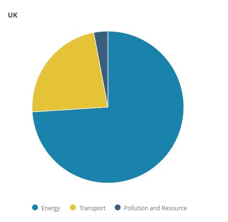

# CHAPTER 12: ENVIRONMENT, HEALTH, AND RESOURCES

# 12.1 Introduction

> *"Future generations are unlikely to condone our lack of prudent concern for the integrity of the natural world that supports all life."*  [@Carson1962]

> *"For the sake of civilised society, it's time we truly figure out how to enable economic growth, while keeping intact the very grounds upon which all prosperity is based: clean air, fertile soil, metals and minerals, and all natural resources that enable us to flourish as human beings."*
>
> `r tufte::quote_footer('---  H.R.H. Prince Carlos de Bourbon de Parme (2014)')`

`r tufte::newthought('The Earth is facing')` a great number of environmental problems, many of which are caused or contributed to by human economic activity. Everything in the world that really matters for our survival and well-being -- the rivers and lakes we drink from, the air we breathe, the food we eat, the animals and plants with which we share the planet -- is being impacted by irresponsible human action.

This chapter is devoted to reducing the harm caused to the environment and human health by economic activity such as burning fossil fuels or excessive production and consumption of red meat. We also investigate the distributional effects of resource extraction and consumption -- in particular, the financial surpluses that accrue to whoever controls the land from which rents are extracted.

||
|:--:|
|*Figure 12.1 Key Environmental Issues*|

Economic activity often causes damage that's not suffered or accounted for by the polluting parties themselves, but rather borne by those who have neither benefited from the activity nor caused the damage. Manufacturing businesses pumping out CO~2~ into the atmosphere have little or no obligation to pay for the damage that climate change causes around the world. Resulting 'damage costs' often can be ignored because they affect third parties and may be difficult to quantify and difficult to locate the direct source for. Such costs are called 'negative externalities.'

Negative externalities can be accounted for (or 'internalised') if an economic actor has to pay for the cost of the damage via a tax. This is known as a Pigouvian tax (after Arthur Cecil Pigou, a British economist). Pigouvian taxes are intended to disincentivise damage-causing economic activities. Companies and individuals will be motivated to find less damaging alternatives to polluting economic activities when these damage costs fall on them, acting not altruistically, but rather in order to reduce their tax bill [@Pigou1932].

There are some difficulties with applying taxes on resource consumption and environmental or health bads. Such taxes can be difficult to quantify, costly to apply, and sometimes unpopular, and they may fall harder on those with lower incomes. In particular, the 'incentive' effect of a green tax may need to be substantial in order to have the desired effect; but high externality taxes are often unpopular. Accordingly, when considering revenues from environmental taxes, we must focus not only on their possible economic co-benefits, but also on possible political resistance to imposing them.

With this in mind, we recognise that we may be able to use Pigouvian taxes to reduce other taxes, i.e. implement a 'Green Tax Shift.' This could be particularly beneficial if Pigouvian taxes replace taxes on productive activities (reducing some taxes and increasing others, for overall government tax revenue neutrality). 

Alternatively, if we are focused on political acceptability, instead of having Pigouvian taxes create fiscal room for reducing other taxes, we might consider simply giving the money raised from Pigouvian taxation back to the population, either through targeted subsidies or perhaps by means of direct payments on an equal per-capita basis. We discuss two possible strategies here: An output subsidy on goods produced (especially electricity), or a payment to everyone in society (a citizen's dividend).

In relation to natural resources, there is a second important concept in addition to Pigouvian taxes -- namely Resource Rent. We are already familiar with the concept of resource rent from our chapter on land.^[Land rent is the payment made to the landowner by the occupier of the land, whether land has buildings on it or not. It is the private value associated with ownership of the land, net of any costs associated with making use of the land. So the land rent of a landowner's field is roughly the value of the land (strictly speaking, the unimproved land) if he were to rent the land out on the open market. This rental value is clearly closely associated with the surplus that the land can produce -- the value of the foodstuffs that he produces, net the costs of his time and other expenditures needed to get those resources to market. Resource rent is similar, but is calculated per unit of a commodity.]

Resource rent is the excess of the sale price of the resource over the cost of production. And just like land rent, resource rent is associated with control of the legal rights to extract certain natural resources from a piece of land. So for example, the resource rent of oil extracted in a certain place is the sale price of the oil minus the cost of extraction.

Thus, in the economics of environment and resources, we distinguish between two sorts of argument. The first argument is that the world economy is doing radically the wrong activities, because the cost on the environment is not considered. The second argument is that the purchase of resources gives large transfer payments to those who deserve them least. But the two arguments are linked. As Al Gore once put it, "We're borrowing money from China to buy oil from the Persian Gulf to burn it in ways that destroy the planet. Every bit of that has got to change."

In the next section, we will deal with resource rents: i.e., the distributional consequences of the production side of resources. The rest of the chapter deals with the topic of negative externalities from the perpective of consumption.

# 12.2  Resource Rents ^^

Future resource rents represent unearned income in the form of natural resources yet to be extracted. Tax revenues gathered from charges on resource extractions are different to general government revenues in two key ways. First, resource revenues are volatile because they are driven largely by volatile commodity prices, and the revenues are, in principle, temporary. Secondly, natural resources are part of the commons: In principle, all citizens have an equal claim on them, and unlike income-based government revenues, resource rents have not been appropriated from anyone, and so represent 'distributions' as opposed to 'redistributions' [@Segal2012].

A large body of work finds that having a large resource sector generally has adverse effects on a country's economy, institutions, and politics. These effects are collectively known as the 'resource curse' [@Ploeg2011]. Resource revenues are frequently misused, wasted, or lost to corruption [@Segal2012]. Citizens in countries funded mostly by resource revenues rather than taxes end up being recipients of government largesse doled out by unaccountable authoritarian rulers. However, a statistical review found that resource wealth does not *necessarily* cause poor institutional or political outcomes such as a tendency for authoritarianism [@Haber2011]. Resource rents also have significant potential to increase the welfare of citizens, if correctly managed. Norway is an example of a country where this is the case. 

There exists *competition* over the capture of resource rents between government agencies, private corporations, and intermediaries (e.g. corrupt politicians). Oil producers can be taxed or nationalised, as already happens in the UK and elsewhere. Very large oil producers, in particular Saudi Aramco, can drive up prices by reducing production in order to increase the oil price (with the side effect, however, that this might stimulate competitors to enter the market, such as shale-oil producers in the United States). This is the *producer side* capture of resource rents. 

Interestingly, however, *consuming countries can get into the resource-rent-capture game as well,* by means of the same taxes that correct for externalities (carbon taxes and taxes on rare metal consumption, for example).  Resource-importing countries could impose coordinated taxes on externalities and natural resource imports (including oil) to capture resource rents and reduce transfer payments to resource-producing countries. This could be beneficial to the environment. We are used to rent-seeking being a negative phenomenon, but rent-seeking by resource-importing countries could reduce the overall amount of resources extracted.

## Producer Country Capture of Resource Rents
The notion of 'resource nationalism,' in the sense that resources belong to the country in which they are located and should be used for that country's benefit, is a principle codified in numerous international treaties on human rights. This is a relatively recent development. Paul Segal of King's College London explains this historic shift [@Segal2012]:

> *"The twentieth century saw a dramatic reorientation of resource ownership rights. First, the principle that subsoil resources are owned by governments as opposed to private landowners was settled in almost all countries (private land in the US being the only major exception), with private agents gaining access to them through regulated contracts...*
>
> *...More dramatically, decolonisation led to an assertion of the rights of developing-country governments and a massive swing in bargaining power in their favour, away from the international mining companies and their rich-country owners that had dominated the industry. The development of national oil and mining companies was part of this trend."* 

In some parts of the world, resource rents have been used to create schemes known as 'severance tax trust funds,' which have specific remits to invest in projects for various kinds of public benefit. The Alaska Permanent Fund, created in 1976, is perhaps the best-known example. The fund pays a per-capita dividend to citizens, based on the principle of common ownership. Severance tax trust funds are also in place in Montana, New Mexico, Utah, North Dakota, and Wyoming.

In some parts of the world, resource rents have been used to pay per capita dividends to citizens. This can be done directly from oil revenues, or indirectly, by creating investment vehicles known as 'severance tax trust funds,' a form of sovereign wealth fund from which citizens dividends are paid to the general population. The Alaska Permanent Fund, created in 1976, is perhaps the best-known example. The fund is funded in part from revenues from oil extraction.^[Revenues from the sale of exploration and extraction leases; oil royalties] It invests the funds to maximise returns. It then pays a per-capita dividend to citizens, based on the principle of common ownership. Severance tax trust funds are also in place in Montana, New Mexico, Utah, North Dakota, and Wyoming.

Philosopher Thomas Pogge has advanced an alternative vision for resource rents that is based not on resource nationalism but resource globalism. Pogge presented his idea of a 'global resources dividend' as a means of tackling global poverty [@Pogge1998]. However, such a system would require significant international coordination, and critics have suggested the distributive effects could anyway harm poor nations that are not resource-rich [@Hayward2005]. We propose that UK producer resource rents could help contribute to a national citizen's dividend.

## Consumer Country Capture of Resource Rents

A use of resource consumption taxes to *reduce* resource rent capture by producers is an additional justification for taxes on fossil fuels, alongside their value in motivating emissions reductions. Indeed, an optimal coordinated tax would include the optimal capture of rent as well as internalisation of global externalities. 

As with our story in an earlier chapter about the gun-toting landlord of an island, resource rent is a surplus without any associated obligation. Resource rents are associated with the violence of whichever group has seized effective control of the resources and rents in the first place, or bought such control with funds found from other sources. Perhaps in part because resource rent is associated with violence and control more than any specific competence, it seems that resource rents are often associated with authoritarian regimes (e.g. Saudi Arabia) or states plagued by a great degree of conflict (e.g. Democratic Republic of Congo). 

The battle for resource rents between consuming countries (who want to reduce the price of fossil fuels and other resources) and producing countries (who want to increase the market price of fossil fuels or other commodities) appears to be a zero sum game. In fact, it may be a negative-sum game: Resource payments often make violence, terrorism, or inequality worse. In that respect, they are a lose-lose proposition for the people of both countries. What is more, easy collection of large amounts of resource rents can discourage developing countries from moving up the economic value chain.

Increased resource rents are associated with larger transfers between countries. From a consuming country's point-of-view, if a resource rent goes up, it's analogous to your landlord putting up the rent: There is no extra value delivered for the extra money paid. In other words, the price of fossil fuels is a monopoly price, not primarily contingent on the cost of production. 

Transfer payments from resource importers to resource exporters can have some serious consequences. Consider the 1970s oil shocks, where after both shocks, oil importers suddenly paid oil exporters roughly four times more for a barrel of oil. This could actually be compared to the reparations extracted by the governments of Britain, France, and other countries from 1920s Germany. These reparations involved payments of hard currency (gold or dollars) for no additional value flowing in the other direction. They were simply a form of looting. It's no surprise that the 1970s payments for much more expensive oil caused a combination of low growth and high inflation in consumer countries, not unlike that experienced in 1920s Germany. 

The lesson to be learned is that resource consuming countries have a collective interest in reducing their aggregate consumption, thereby reducing prices and payment volumes to producers. Reducing total demand for fossil fuels would reduce their global open market price and improve the economic well-being of consuming countries, provided that energy services weren't reduced in effective quality or quantity in the consuming countries. For example, if automobiles in consuming countries became twice as fuel-efficient, with no loss in transportation service quality, then that's a straight win for those consuming countries. The same is true if consuming countries shift to e-cars powered by affordable domestically produced electricity, instead of importing oil to power oil-burning cars.

Policies to reduce climate change often are associated only with the demand side. People tend to assume that oil and other fossil fuels are priced according to their cost of production. This isn't generally the case. Of course, fossil fuels won't be produced if the marginal cost of producing them exceeds the global market price. However, there is a more important factor driving oil prices: An oil producers' cartel that controls aggregate supply (OPEC) by pumping more or less oil from 'easy oil areas' where reserves are large and production is very cheap (e.g. Saudi Arabia). 

What is the implication for climate change policy? Well, to tackle climate change, we really must leave fossil fuels in the ground - we have already dug or pumped out and burned far too much coal, oil, and gas; unless we're prepared to lose all our coastal cities and great river deltas to the waves and make a huge swathe of land around the equator uninhabitable due to excessive temperatures, we must *reduce* atmospheric CO2 levels as soon and as rapidly as possible, and return them to pre-industrial-era levels, not continue to increase them. That means we must *increase* the post-tax price to fuel consumers to reduce demand. At the same time, we should also *reduce* the pre-tax global open market price of fossil fuels, because that way, only the cheapest-to-extract fossil fuels will be extracted.

This shows how challenging tackling climate change is. If policy action reduces the price of fossil fuels, the price fall may increase demand in other parts of the world which do not impose large carbon taxes. This 'rebound effect' cautions against the idea that a national emissions reduction caused by a stiff carbon price will also cause a global emissions reduction. Coordinated action on carbon pricing amongst consumer countries is essential to achieve a transition to a future in which most remaining fossil carbon stocks stay safely underground, where they belong, and don't end up as atmospheric carbon or methane.

## The Case for Coordinated Resource Rent Taxes

Let's consider how consumer countries could work together to reduce the pre-tax price of fossil fuels. It may seem perverse, but to prevent fossil fuels from being extracted, their pretax market price should fall below the cost of production. This means that the 'resource rent' would be reduced to zero. Producers would lose money by producing. That is, in fact, the policy aim. Even the most cheap-to-produce oil should be unprofitable to produce.

An internationally-coordinated tax on the consumption of resources (e.g. oil and other fossil fuels but also other non-renewable resources, such as scarce metals or phosphate reserves) is therefore, something of a 'super-land value tax'. It would be as efficient as a land value tax in the sense that it would be almost impossible to avoid or evade, and it would prevent the flow of resource rents out of the country. It would generate the polar opposite of the 'oil price shock' of the 1970s. Moreover, the revenues from such a tax could be used to subsidise fossil fuels demand reducing infrastructure investments such as efficient urban transportation systems, which have several positive co-benefits. 

Resource rent taxes can be charged both by consumers and by producers. In that way, there is competition between the two. There is already a tax on profits from extraction of North Sea oil and an aggregates levy. These should be retained.

We propose a tax on coal, crude oil, and gas, as well as refined oil and gas products (whether imported or domestically produced), imposed by coordinated international action between coal, oil, and gas-consuming countries. This should be increased over time, with the aim of reducing the open-market price of oil. Imposing such a tax is essential in order to reduce new exploration and the environmental damage it causes. It would also help reduce trade deficits. 

In principle, resource taxes should be imposed on the extraction of any and all high-rent natural resources, although oil appears to be the only relevant resource in the UK. Such taxes should be coordinated between oil-consuming countries. A resource rent tax is, in effect, a land value tax on resource rents which would otherwise be captured overseas.  

## Towards a Total Fossil Fuels Phase-out

There may also be a case for setting a total fossil fuels phase-out date, as a sort of forward-looking regulation. In this case, it would be an expected norm of behaviour that no fossil fuels will be extracted from the ground after that date. Now, clearly it's going to be hard for the whole world to agree on this norm. But could such a norm could be defined by a group of consumer countries, or even just a single country, and then gradually extended to other countries? The financial system may provide a pressure point. Certain investments can be classified as 2 degrees C compliant or 1.5 degrees C compliant, others as consistent only with a higher global average temperature increase target limit. Such a process of classification should lead to serious financial disbenefits imposed on financial institutions investing in anything related to new fossil fuel extraction.

# 12.3 Taxing Bads

Having dealt with resource rents, we now move on to the other main topic: Negative externalities, or 'bads.' The world faces a range of environmental problems which seem to be steadily getting worse. Ocean acidification, climate change, fisheries depletion, over-hunting of wild animals, wilderness and wildlife habitat destruction, water resource depletion, plastics in the oceans... These are all caused or worsened by human activity. We humans have developed bad habits that we cannot seem to break -- not least because there is no financial incentive to change our habits. Why do we allow such tremendous environmental destruction to result from our economic activity? How could the tax system alter the balance of incentives?

Many environmental problems are caused by economic activity ^[actions involving the production, distribution, and consumption of goods and services]. We are familiar with the example of effluent from a factory poisoning nearby waterways for the surrounding community. This happens because the factory doesn't have to pay for the damage it causes. Another way of saying this is that the factory's operators don't have to account for the full cost of their activities. 

If I chop down a forest to sell the timber, the price at which I sell it will account for my expenses incurred in chopping down the trees, the cost of my labour, and any permits required. The price will *not* have accounted for the cost of destroying the ecological goods and services ^[Ecological goods and services (EG&S) are the benefits arising from the ecological functions of ecosystems. Such benefits accrue to all living organisms, including animals and plants, rather than to humans alone.] [@LandStewardshipCentreofCanada2018] that the trees were providing to their local environment. 

The trees will have been slowing the rate of water runoff and preserving soil structure, as well as providing carbon storage, wildlife habitat, shade, and microclimate moderation. Now they are gone, soils will erode faster, and the fertility of the land will be reduced. Downstream flood risk is increased, and the productivity of irrigation infrastructure and a hydroelectric power project are reduced. The trees are no longer absorbing carbon dioxide from the air and storing the carbon in their biomass. If any of the timber is used as fuel, or rots, the stored carbon will be returned to the atmosphere in the form of carbon dioxide, so I have increased the atmospheric concentration of a greenhouse gas that contributes to climate change. 

Yet I, the logger, have had to pay for none of the costs incurred by these damages. I do not pay to stabilise the soil, or for flood damages to the local village, or for the reduced productivity of farmland in the area. I don't provide new, alternative habitat for forest creatures, either. I simply did not have to consider these costs when I was judging whether it made financial sense for me to cut down these trees. 

There are a number of underlying reasons why environmental and social damages occur. Rational Choice Theory contends that it is because economic agents ^[individuals and institutions that engage in economic activity] tend only to consider costs to themselves. Most, if not all, such damages tend to be imposed upon and incurred by third parties, and so the party causing the damage does not consider them. This was the case in my (hypothetical) example in which I cut down a forest to sell wood. The damage I caused was suffered directly by others, and I didn't have to pay for any of it, so I didn't consider it. 

It is also the case that many damages do not immediately manifest or are not plainly visible, and so do not contribute to the knowledge that informs economic value assessments. William Forster Lloyd's famous theory of the 'tragedy of the commons' [@Lloyd1833] suggests that even when resource users know their activities will contribute to collective exploitation and are against the common good, many independent individual actors will continue to pursue their own self-interest. 

The cost of raising and harvesting my trees, as well as the costs paid by distributors and consumers of the timber, are examples of 'private costs.' They are costs incurred by participants in economic activity. We define the full cost of an activity, including damages caused, as the 'social cost' or 'damage cost.' In the example above, the social cost includes the costs to soil, atmosphere, fisheries, wildlife, irrigation infrastructure, hydroelectric project, flood security, and other parts of the economic and ecological system affected. 

The difference between the private and the social cost, i.e. the costs that are left out of free market prices, are called 'externalities.' We mostly encounter negative externalities, but positive externalities also exist, where environmental or social benefit is provided by activities but not accounted for in prices. The benefit that a landowner gets from developments in nearby infrastructure, public services or the general economy, is an example of a positive externality. ^['Positive externalities' also exist where environmental or social benefit is provided by activities but not accounted for in prices. The benefit that a landowner gets from developments in nearby infrastructure, public services or the general economy, is an example of a positive externality *received* by a private agent. Private agents can also *produce* positive externalities. An example of this might be a beautiful building or a café with charm and character. 

The concept of 'externalities' was first put forward by aforementioned British economist Arthur Cecil Pigou. 'Externalities' are a very elegant contribution to economic theory. Pigou realised the tremendous implications of the discrepancy between social and private costs and prices. All kinds of activities that appear at first to be profitable might not really be profitable at all, once their full costs are included. We are allowing private profit literally at the expense of others who are damaged by such activity. This, he thought, is simply unacceptable. Pigou then devised a relatively simple solution. All we have to do is calculate the value of the 'negative externality' and levy a tax of that amount so that the private cost is equivalent to the social cost. This is known as a Pigouvian tax [@Pigou1932].

||
|:--:|
|*Figure 12.2 Pigouvian tax -- depicting social and private costs, and a corrective tax*|

In practice, things are more complicated than simply pricing everything correctly to reflect the money impact of 'externalities,' but, even so, Pigou certainly pointed in the right direction, i.e. towards recognising and rectifying damages to the environment and society caused by economic activity.

# 12.4 Policy Options for Tackling Social and Environmental Damages

Pigou was particularly concerned that any damages caused to the environment or to people should be paid for. If we get prices right (so that they reflect full social costs), this will discourage activities that would otherwise seem profitable despite causing external damage. 

The 'polluter pays principle' is "the commonly accepted practice that those who produce pollution should bear the costs of managing it to prevent damage to human health or the environment" [@GranthamResearchInstituteonclimatechangeandtheenvironment2014]. This principle is the basis for most attitudes to the regulation of environmental pollution, forming part of the broader set of guidelines on the matter created in the 1992 Rio Declaration [@UnitedNations1992].

The issue of externalities is of particular relevance to the conservation of natural resources and the environment. These resources -- the land, the animals, the air -- are vital to continued high-quality human existence. If we strive to reflect the true environmental costs of economic activities in our prices, we will stop undermining the sustainability of the economy and our prosperity. 

Successful Pigouvian policies have been put in place to manage a variety of environmental and social issues -- from the 5 pence bag 'tax' to congestion charging in busy metropolitan centres. However, these existing policy initiatives are not nearly sufficient to tackle the large environmental problems or to ensure our economies are developing in a sustainable and regenerative manner. 
The figure below illustrates what has worked well to date, and notes some areas for future development. 

||
|:--:|
|*Figure 12.3 Successful Environmental Initiatives*|

Sustainable development as defined by the Brundtland report is 'development that meets the needs of the present without compromising the ability of future generations to meet their own needs.' [@CommissiononEnvironment] Unless we act now to create policy tools to properly account for and manage environmental damage, our actions will definitely continue to be grossly unfair to future generations.

## Policy Options

Pigouvian taxes are not the only tools at our disposal to solve the problem of negative externalities. There are a number of ways to address social and environmental damages. 

- We could ban or regulate the activities that cause harm ('command and control');
- We could directly or indirectly subsidise desirable behaviours;
- We could create market-based instruments (MBIs) which placing an overall limit on the damage we will allow, and then distribute or sell tradeable rights to contribute to the acceptable damage total ('cap-and-trade');
- We could levy taxes to discourage harmful activities, as Pigou suggested.

## Command-and-Control

The prohibition of ozone-damaging CFCs ^[Chlorofluorocarbons - compounds that, when released into the atmosphere, damage the ozone layer that protects humans and other organisms against damaging Ultraviolet (UV) light] in aerosols is an example of a successful command and control policy. It was effective because it applied to a specific production input (CFCs) that directly caused environmental damage, and because alternative substances were available for substitution. This latter quality meant there was minimal disruption to existing production in terms of input cost, design and manufacturing, and other changes to supply. To put this another way, producers of aerosols could easily replace CFCs with other ingredients.

However, this kind of solution would not work with many other kinds of environmental problems. The combination of direct application of regulation to the damaging externality together with very contained and predictable economic effects is unusual within the scope of environmental externalities. While 'command-and-control' solutions may appear to be the simplest and most direct approach to preventing or restricting damaging activities, their economic impacts tend to be complex and difficult to predict and measure in advance. In some cases, restricting one activity or product may simply cause it to be replaced with another that is equally or even more damaging, meaning net social costs are actually increased. In addition, regulatory mechanisms tend to be expensive to administer, meet high resistance from vested interests, and can be difficult to enforce. Stephen Shavell of Harvard University [@Shavell2011] presents a damning summation:

> *"Conventional regulatory policies, which have not accounted for economic responses, have been excessively costly, ineffective, or even counterproductive... the 'tragedy of the commons' might be better described as the 'failure of commons regulation'."* 

One possible way to reduce the effects of economic shocks of regulation is to introduce restrictions incrementally, or with delayed effect, perhaps in conjunction with development subsidies. One can then observe early economic effects and give industry the chance to adapt and transition. Forward-looking regulation can be extremely effective.

However, there are further reasons to seek alternatives to command-and-control approaches. As World Bank economist Stefano Pagiola and colleagues explain:

> *"While regulation can to some extent ensure basic compliance with minimum environmental and social requirements (although enforcement is usually far from perfect), use of positive incentives can unleash creativity and entrepreneurship which can lead to results far beyond the minimum."* [@Pagiola2002]

## Subsidies

Subsidies for innovation and development are an obvious choice to generate positive incentives to protect the environment. As a widespread approach, however, this would not only set up an untenable strain on public finances, but would also represent an entirely backward logic. It would involve using tax revenue from labour and other productive activity to reduce damage that was inefficient or inappropriate to start with.

Our proposals operate in accordance with the 'polluter pays' principle. It is a core tenet of this book that there should be a direct financial cost on damaging activities. This means that the burden for this damage falls on those that are responsible for it. This would not be achieved by a subsidy approach. We choose, therefore, not to include pure subsidies in our proposals, but we do consider a tax-and-subsidy hybrid later on in this report. 

## Cap-and-Trade (Emissions Trading)

There still remains an alternative to taxation we've not yet considered: The emissions trading scheme or 'cap-and-trade' system. We consider this in the context of greenhouse gases. The current EU Emissions Trading Scheme (ETS) is an example of a 'cap-and-trade' system. It *caps* the total volume of greenhouse gas (GHG) emissions from fixed installations like power plants and aircraft operators responsible for around half of EU GHG emissions. It then allows *trading* by affected firms of emission allowances so that the property rights to the collective total emissions are assigned to their most economically efficient use (i.e., the highest bidder). The aim is that collective total emissions remain within the cap, and the system acts as a least-cost mechanism to reduce emissions. If an emitting company undertakes measures to reduce their emissions to a level below their assigned portion of the amount permitted by the overall cap, they may sell the excess allowance to other firms. In this way, the market finds an appropriate 'damage cost' for these emissions and incentivises technological advancement to find less polluting alternatives to current business practices that are affected by the scheme.

In theory, this system works by assigning property rights to the ability to 'emit,' and allows free trade amongst market participants to ensure these property rights are allocated in the most efficient way along the Pareto frontier i.e., where no party can have a utility increase without decreasing the utility of another party. Simply put, people and firms that have the greatest need or desire to emit purchase the greatest number of permits from other economic actors who can reduce emissions or find less polluting alternative business practices. In this simple model, free exchange leads to a 'Pareto optimal division of goods' [@Allcott2018]. In reality, however, the initial allocation of these property rights can often mean that although the outcome is economically efficient, it is distributionally unfair. 

The effect is to reduce the production-damage to companies that find it more costly to reduce emissions and to incentivise firms with a lower marginal cost associated with emissions-reduction to decrease their emissions more than it is required of them to do so. 

However, in practice, the EU's ETS has highlighted the many pitfalls in this approach. In requiring international negotiations on the terms of the scheme (to ensure that there is a large and diverse enough market to make the system efficient), the ETS was watered down by lobby interests to the point whereby it has been barely effective at all. Far too many permits were distributed, and the cost of credits was too low to dramatically encourage decarbonisation. This was helped by the fact that most were allocated free of charge instead of being auctioned, and the overall base of the scheme covered only half of European GHG emissions. 

Subsequent iterations of the ETS system have barely improved on these issues, because the political will to actually achieve emissions reductions was missing - and lobbyists prevented politicians from taking simple actions like buying back or cancelling an appropriate percentage of the excessive numbers of permits previously issued. It will be a long, unwieldy process to properly internalise externalities using this method, given the many players who are in a position to block progress. The ETS has, since its introduction, arguably been worse than no carbon pricing measure at all: It has since its introduction in 2005 served as a fig leaf, allowing politicians to pretend the carbon pricing problem has been dealt with at the European level, when in fact the ETS did very little, perhaps nothing at all, of actual effectiveness in reducing emissions. 

## Environmental Taxation

It is a core premise of this book that we should tax unproductive and damaging activities instead of those that are wealth-creating. We are used to taxing goods, incomes, and transactions, but we really should be taxing 'bads'! If we do this well, it will be possible to reduce environmental and social externalities in ways that improve on or overcome the crucial shortcomings of command-and-control approaches, and also potentially confer additional benefits. 

Well-transitioned environmental taxes can achieve a system that's fair to industry and consumers and provides sound incentives, whilst also covering the whole tax base. We will explore this policy option in more detail in the section below. For reasons of efficiency, ease of application, and incentivising potential technological developments, our proposals primarily focus on environmental taxes.

## A Proposed Approach to Reducing Bads

# 12.5 Taxing Negative Externalities 

As mentioned earlier, the concept of externalities was developed by British economist Arthur Pigou, after whom 'Pigouvian taxes' were named. In simple terms, Pigou argued that the tax per unit of pollution should equal the damage cost of that unit of pollution (assuming such a thing could be measured). Since the damage cost of a unit of pollution might vary in the quantity of pollution, we should clarify that this rate should normally be measured at the optimal quantity of pollution (that optimum being when the overall sum of 'benefits minus costs' is maximised). In principle, once that tax has been imposed, the best allocation of resources in an economy could then be provided by the free market [@Pigou1932].

A 'marginal' cost is the cost increase in producing one additional unit of a product, i.e., in increasing the margin of production by one increment. A marginal damage cost is, therefore, the cost associated with the damage of producing one additional unit of the externality-causing product. For example, in the case of carbon dioxide (CO~2~), the marginal damage is the present value of future (worldwide) damages from an extra ton of emissions, accounting for the gradual uptake of CO~2~ from the oceans and delayed adjustment of temperatures to higher concentrations [@Parry2012]. These taxes are theoretically efficient solutions to environmental and social problems because they manipulate price mechanisms in order to modify activities, encouraging more efficient damage reduction at a lower administrative cost.

## Calculating Damage Costs

It is notoriously difficult, however, to calculate damage costs, given that this involves evaluating complex systems with multiple feedbacks, predicting damages that have not yet happened, and including factors that are difficult to quantify in any numerically measurable terms (e.g. in monetary terms), such as psychological impacts and aesthetic value. For example, to correctly tax a unit of CO~2~, we must know precisely how a unit increase in CO~2~ emitted today would affect 'social welfare' at different points in the future [@Pagiola2002]. 

Despite these reservations, the authors of a recent IMF working paper argue that inefficiency due to inaccurate damage costs may be overstated:

> *"Even if the tax is set at, say, 50 percent above or 50 percent below marginal damages, a large portion (roughly three-quarters) of the welfare gains from the true corrective tax are still achieved. Or put another way, given inherent imprecision in externality measurement, a tax that is 50 percent above or 50 percent below true marginal damages may still perform reasonably well in terms of expected welfare gains."* [@Parry2012]

According to these IMF economists, therefore, the measure of damage doesn't have to be exact for the Pigouvian tax to be effective. We will further discuss the difficulties and implications of accurately calculating externalities later in the chapter, within the context of carbon taxes. First, we'll complete our introductory review of Pigouvian taxes as the preferable means of internalising social costs,  and explore criticisms they have faced as to their potential to contribute to a tax system that better serves society and the environment. 

## Four Types of Environmental Taxes

In the UK, environmental taxes raised £48.0 billion in revenue in 2017, which as a percentage of GDP has remained fairly stable since the 1990s -- sitting at around 2.2% to 2.8% of national GDP. Forty percent of these taxes fall on households, rather than companies, with 66% of household expenditure on environmental taxes relating to energy taxes and fuel duty. As for the corporations and services to which these taxes apply, those with high energy usage and transport fuel needs faced the next biggest tax burden. Such data indicates that clever and appropriate targeting of tax bases, alongside appropriate use of revenue to mitigate the regressive impacts of such taxes, is needed to ensure that these are sustainable. 

However, taxes on fossil fuels and carbon content remain a significant proportion of these environmental taxes. Of the £48.0 billion raised, around three-fourths were sourced from energy taxes. These encompass taxes on the production and use of energy products like petrol, gas, and diesel. The largest single element of the revenue raised was from fuel duty, which applies to fossil fuels such as petrol and diesel. These taxes raised 57% of total revenue from environmental taxes in 2017. 

Conceptions of environmental taxes are closely linked to creation of disincentives against air pollution and greenhouse gases. Yet Pigouvian taxes can be applied much more widely to other externality targets beyond air pollution.

Environmental taxes can be subdivided into four categories: Energy, transport, pollution, and resources [@ONS2018]. An example is the 1996 landfill tax. Since its introduction, the amount of biodegradable municipal waste sent to landfill in the UK has decreased by 28 million tonnes in 1996 to 7.7 million tonnes in 2017. Solid waste exports to foreign countries and changing attitudes to recycling may also have had an impact, in addition to the landfill tax. But it is clear that such taxes can have a big impact on non-climate related pollution. Moreover, the introduction of the 5 pence bag tax in 2015 [@DEFRA2018] saw a reduction in plastic bag use by 22% in the UK in two years. It worked by forcing people to consider internalising the externality of taking another unnecessary bag, when on average each UK individual was estimated as having around 40 plastic bags already at home. 

Such taxes could also be applied to other 'social bads.' One pertinent example for anyone living in London is traffic congestion. London has been a pioneer in this area, applying several different scales of congestion taxes to ensure the city avoids gridlock or dangerous levels of air pollution. In combination with successful provision of affordable public transit, the London congestion tax -- introduced in 2003 -- reduced congestion in central London by 26% in 2006 from the 2002 levels [@CentreforPublicImpact2016]. Other tangential benefits included a reduction in automobile accidents of around 40-70% in the designated congestion zone, alongside the generation of significant revenues for the municipal government. 

# 12.6 Addressing Inequity

Environmental taxes can be applied to many purposes. We focus here on carbon and fuel taxes, due to their double dividend of reducing the risk of climate change and raising public revenues. However, let's keep in mind that the potential tax base of environmental taxes is broad, and could help us to achieve a range of social objectives. Future examples may include things like taxes on sugar, on disposable plastics, and on other wasteful items that degrade the environment and social well-being. 

We must also keep in mind, however, that some people may face disproprotionate burdens (in terms of their net income) from Pigouvian taxes, and design their implementation to protect those least able to pay. Pigouvian taxes have been criticised for being regressive (disproportionately affecting the less well-off) and exacerbating social inequity. A flat-rate tax on carbon might appear to be unfair because a greater proportion of poor people's income is spent on fossil fuels than that of wealthy people. For example, the percentage of income going to fossil fuel consumption in the lowest decile of income in the US is 10.1% versus 1.5% in the highest decile (Shome, 1995). 

The effect of any specific environmental tax on lower-income households might be evaluated by considering a combination of impacts:

- The direct impact when the price of the taxed good rises and affects household expenditures
- The indirect impact of price increases when taxed goods are used in production of other goods
- The net impact given any improvement in the environment, and its effect on welfare and behavioural changes resulting from changes in the price of taxed goods. [@OECD2011]

## How Should Revenue be Used?

The overall social benefit of Pigouvian taxes depends in part on what happens to the revenues raised. If the tax is regressive, it may be appropriate to use some of the money raised to provide subsidies to low-income households. By contrast, it isn't a good idea to simply exempt poor households from Pigouvian taxes, if they also contribute to the externality, since they are not then incentivised to change their behaviour; that would reduce the overall effectiveness of the tax. The Organisation for Economic Co-Operation and Development (OECD), a major intergovernmental organisation promoting trade and economic progress, advises that:

> *"Attempting to address both environmental issues and distributional concerns within the tax itself risks undermining the ability of the tax to do either. For example, an exemption for low-income families from a tax on heating fuel eliminates the incentive otherwise provided to economise on fuel use and to consider alternatives...*
>
> *...Where there are significant negative impacts on, for example, low-income people, these usually are better addressed by other redistributive policy responses."* 

Beyond simply sending a monthly or annual cheque to poorer families to compensate them indirectly for their higher fuel costs, additional or alternative welfare-enhancing options could be to allocate money to public services, or invest in economic growth such that society as a whole is better off. 

Alternatively, the tax could be made revenue-neutral by using the money raised to lower other kinds of taxes, e.g. by raising the basic exemption level of annual income subject to income taxation. This would have the potential to address equity concerns. Economists have discussed how this kind of 'revenue-recycling' could also make the economy work better by reducing taxes that are damaging to production and demand, thus leading to another kind of 'double dividend.'  

## The 'Double Dividend'

Labour taxes are often criticised for their 'distortionary' qualities because, while central to government revenue, they effectively punish people for working in that they reduce people's effective income and their resultant welfare. Such taxes also affect the 'work versus leisure' judgements of individuals that are assumed to determine people's willingness to work, and in turn impact the overall labour supply. In increasing the marginal cost of labour, labour taxes may also have a negative impact on employment. These issues were explored in the Core Tax System chapter. Our concern here is to review the viability of using revenues from environmental taxes to reduce the undesired impact of other kinds of taxes.

Parthasarathi Shome of the International Monetary Fund argues that:

>  *"The attractiveness of garnering a double dividend, of reduced environmental damage and revenue without social cost from environmental taxes, should not be underestimated. Many estimates for the United States suggest that the marginal welfare cost of taxation is about one-third or higher. Thus, taxes such as carbon taxes which have relatively large tax bases could dramatically improve the efficiency with which revenues are raised."* [@ParthasarathiShome]

However, others have argued that because environmental taxes tend to raise the cost of producing output (thus supposedly reducing investment), they in fact may exacerbate the efficiency costs associated with 'tax distortions' in labour and capital markets. This means that the perceived efficiency benefits from revenue-recycling could be outpaced [@Pagiola2002]. It has been suggested that if the negative tax-interaction effect does exceed the positive effect of revenue-recycling, the real-world Pigouvian rate should be set somewhat lower than its theoretical optimal in order to compensate, making a tax both revenue- and efficiency-neutral, but no longer environmentally optimal [@Bovenberg2001].

One study assessed the potential for recycling carbon tax revenues to reduce labour taxes in order to reduce unemployment, and concluded that a positive effect would depend on very special conditions -- specifically that the impact of the tax on after-tax profits is low [@Boehringer2004]. Similarly, another concluded that employment benefits would depend on the initial Pigouvian tax rate being lower than the wage tax rate [Koskela, 1998].

Post-Keynesian economists might disagree with most of the concerns raised in the immediately preceding paragraphs, which are based on questionable conceptions of labour supply and demand, in which the demand for labour goes up as the price of labour goes down, in the same way that the demand for poatoes goes up when the price goes down. In reality, labour 'markets' are nothing like markets for potatoes or other commodities. Labour supply and demand functions are intimately linked, not independent, because *wage-earners are also consumers.* When wages go down, aggregate demand goes down too, because people have less money to spend. 

When money is spent, it circulates - it doesn't disappear. The trick to keeping an economy dynamic and healthy is ensuring that the velocity of monetary circulation is high (this generates a higher GDP than the same amount of money circulating more slowly), whilst also ensuring that money is spent primarily on purposes and production which are socially and environmentally benign as well as welfare-enhancing in a broad consumer-lifestyle sense. Pigouvian taxes can help achieve these outcomes, both by disincentivising 'bads' and by spending the revenues raised on 'goods.'

Whatever the outcome of arguments between adherents of different schools of economic thought may be, it's clear that the likely effects of various combinations of taxes and the potential of revenue recycling need to be properly evaluated and modeled on a case-by-case basis, before a judgement can be made. Such evaluations are complicated by the difficulty of assessing deadweight losses. 

## The Perfect Market: Should We Reduce Deadweight Loss at All Costs?

In neoclassical economic theory, 'deadweight loss' is a term used to describe the loss caused to the society due to 'market inefficiencies.' It occurs when a presumed 'equilibrium' for goods and services is not attained. In other words, it occurs when the supply curve of a commodity does not intersect the demand curve at the free market equilibrium point. 

The idea is that when consumers do not feel the price of a good or service is justified when compared to the perceived utility, they are less likely to purchase the item. With the reduced level of trade, the allocation of resources may become inefficient, which can lead to a reduction in overall welfare within a society.

Neoclassical and neoliberal economists believe that minimum wage and living wage laws can create a deadweight loss by causing employers to overpay for employees, thereby preventing low-skilled workers from securing jobs (they ignore the fact that labour market supply and demand functions are tightly linked, not independent, as we noted above). Price ceilings and rent controls can also create deadweight loss by discouraging production and decreasing the supply of goods, services or housing below what consumers truly demand (they ignore the difference between land, which has an inelastic supply, and other goods or services with elastic supply curves). As a result, according to these theoreticians, consumers experience shortages, and producers earn less than they would otherwise.

Taxes are also said to create a deadweight loss because they prevent people from engaging in purchases they would otherwise make, because the final price of the product is above the 'equilibrium' market price that would obtain in a completely 'free' market without 'distortions.'

For example, if taxes on an item rise, the burden is often split between the producer and the consumer, leading to the producer receiving less profit from the item, and the customer paying a higher price. Given that a higher price is assumed to result in lower demand, this results in lower consumption of the item than previously, which reduces the overall benefits the consumer market could have received, while simultaneously reducing the benefit the company may see in regard to profits.

In neoclassical theory, a market with no distortions whatsoever, 'a perfect market,' is created under conditions of 'perfect competition.' According to this narrative, both taxes and externalities represent 'distortions' that undermine perfect competition. Yet there are additional factors involved when attempting to evaluate net 'distortion' effects from a new tax. Perfect competition (the market optimum) obtains only if several unrealistic conditions apply simultaneously. These include:

- Liquid markets. The must be a large number of active buyers and sellers making independent bids, so that true market prices are found.
- No monopsony or monopoly. There must be no sellers or buyers with market power to set prices above marginal cost (whereby they could raise prices without losing as many customers to competitors as they should).
- Factors of production must be fully internationally mobile. 
- Perfect information. Producers and consumers must know all prices, and accurately assess the benefits of owning a given item of property, within the context of a basket of market goods. Producers and consumers must also know their own preferences precisely, and these are assumed to be unchanging.  
- Rational economic actors. I.e. there is an assumption that people always optimise the benefit they get from their transactions. This also assumes that people are predictable - this is a core assumption of 'rational actor theory' at the heart of neoclassical economics. It is well beyond the scope of this chapter to critique that theory in detail, but let's make two key observations.

First, accurately assessing 'deadweight losses' approaches impossibility in the face of incomplete knowledge and multiple factors influencing net 'market distortion' effects -- all the more so when we can question whether or not some factors are even theoretically predictable. 

Second, and more importantly, to place the primary focus, or the normative goal, on reducing the absolute magnitude of deadweight losses incurred by taxation, is to assume both that *perfect competition creates a welfare maximum across society,* and that *any lessening of distortions from that ideal is necessarily desirable.* If these assumptions were held consistently, it would also follow that governments should levy no taxes on labour at all, or indeed on any elastic factor of production (i.e., factors for which a change in price affects the level of supply or demand). 

Yet this makes little sense. In reality, taxes pay for public services which are properly understood as legitimate costs of production for goods and services. Without roads, bridges, educational and health services, police and fire departments, legal systems and central banks, factories would not be able to safely produce and distribute goods - indeed, factories could not even exist. Taxes are simply the reflection of the need to pay for the maintenance and supply of these societally shared factors of production. Taxes are membership dues in the national system that maintains the complex infrastructure which allows businesses to operate, and workers to be trained and safely enter contracts with employers. It would be wholly absurd to treat taxes as exogenous to the cost of doing business, or to see taxes as a form of 'theft,' as corporate libertarian fanatics and some adherents of the 'Austrian school' of economics insist.

In this book, we argue for a shift in the overall tax-base towards things that are inelastic in both supply and demand, but not for the shrinkage of the state -- because the state must pay for the delivery of a complex shared infrastructure, a civilisational 'commons' without which a modern economy could not exist or function, and also because some level of redistribution is necessary to provide an acceptable standard of welfare for all. 

If we consider a progressive tax that disproportionately affects the better-off and redistributes benefits to the less well-off, it is easy to see that the overall welfare gains to society may be thereby increased, even though the amount of economic 'distortion' has increased according to neoclassical terminological conventions. Indeed, characterising this process as a 'distortion' is not an objective description of a value-neutral mechanical process; it is not a statement of fact. It is an ideologically based value judgment, in which a pejorative term is applied in a pseudo-scientific way to make a normative value judgment seem 'objective.'

These points serve to demonstrate that some economic 'distortions,' including the 'deadweight loss' of taxation (insofar as such a thing can even reasonably be said to exist), is desirable insofar as this 'distortion' generates welfare gains to society as a whole, both by paying for the delivery of essential civilisational infrastructure and through redistribution benefits.

# 12.7 Health and Food Taxes ^^

Taxes on items that are harmful to individuals that consume those items are not the focus of this book -- but such taxes do exist. They are often called 'sin taxes.' There are high taxes on cigarettes and alcohol, for example. A case can easily be made for taxing unhealthy but cheap products such as sugar and salt in manufactured food, as well.  

Taxing cigarettes, for example, has the dual benefit of raising revenue for the public Treasury and of reducing pollution from disposed cigarette butts and packaging as well as air pollution from tobacco smoke and its associated health risks. The money thus raised can be spent in part on public health care, compensating the state for the costly health and medical expenditure consequences of smoking.

But taxes are not the only arrow in the quiver when our target is reduction of 'bads.' We suggest a TEAR approach, 'tearing down the old system before it reduces us all to tears.'

1) **T**ax the 'Bad'

2) **E**ducation of the citizens, exhorting them to avoid the 'bad'

3) **A**greement by the citizens to restrict the 'bad' through social sanctions, and finally, if all else fails

4) **R**estrictions and quotas on the 'bad' imposed by legal regulations.

In the following subsections, we go through several categories of health bads as these are taxed at the moment, and outline some proposals for improving the system.

## Alcohol and Tobacco

Alcohol and tobacco taxes can be retained in their current form. A strong case can be made for harmonisation of such taxes across Europe to discourage 'booze cruises.'

## Sugar and Salt Tax on Processed and Prepared Food

Excess sugar intake causes multiple health problems, including obesity, type-II diabetes, and tooth decay. We propose a simple sugar tax on the manufacture or importation of sugar, based on three categories of sugar-like compounds, plus a tax on salt: 

- Class A: 'sugar' (i.e., sucrose, glucose, and fructose), including contents of fruit juice. 
- Class B: synthetic and natural sweeteners with unclear health impacts.
- Class C: 'unprocessed' sugars in raw fruit and vegetables; starch and other carbohydrates.
- Class D: salt.

Class A would have 100% tax (i.e., £0.02 or 2p per gram sugar); Class B, would be charged 50% (i.e., 1 pence per gram sugar sweetness-equivalent, but such sweeteners might be reclassified to class A or C with appropriate scientific evidence), and class C 0%. Class D would be charged according to salt content.

## Red Meat

Red meat (e.g. beef and lamb) causes *both* health damage to those who eat excessive quantites of it *and* major greenhouse emissions, in particular, methane. It also involves deforestation. Reducing beef and mutton consumption would allow land to be returned to forest, which would store more carbon and provide much higher levels of other ecological services as well, ranging from water retention to bird and wild mammal habitat. Two-thirds of agricultural lands world-wide are pastureland, mostly for cattle and sheep. 

A straightforward way of taxing red meat would be in proportion to its estimated greenhouse gas emissions, according to the same tax rate per CO2 equivalent as is proposed below. ^[Technically, the Global Warming Potential over 100 years]. The lifecycle emissions per meat type and per gram of meat would need to be approximated. This would not not explicitly tax the health downsides of red meat, but reducing its consumption by taxing concomitant greenhouse gas emissions will have a health benefit if it results in reduced consumption.

## Wholesome Foods

A healthy diet includes plenty of fresh fruit and vegetables, pulses, nuts, and other sources of vegtable protein. It's essential that everyone has access to low-cost, fresh, wholesome foods. Therefore, any additional taxes on food should be used to encourage and ensure easy availability of healthy foods, especially in poorer areas. To eat healthily should be the easy default option - unlike the situation that pertains now, where unhealthy junk-food is generally the easy default option. The bottom line is that healthy foods should be cheaper and more readily accessible than unhealthy foods. 

# 12.8 A Green Tax Shift

We are proposing a broad suite of environmental taxes, together representing a 'green tax shift' whereby increased taxes on resources to internalise environmental and social damages complement reductions in taxes on labour. This resonates with the ideas of Dutch entrepreneur Eckart Wintzen for a 'value extracted tax,' which taxes the value that a certain product or raw material extracts from the environment through human use [@VanKamp2003]. Wintzen proposed that such a tax could form the basis of a new system that promotes services above material goods. These ideas have become the basis of the Ex'Tax project, which has explored how such measures might operate across the tax system, and proposed a plan for implementing such a scheme in the Netherlands [@Groothuis2014].

There is a potential issue with replacing labour taxes with environmental taxes, in that it must inevitably undermine the stability of government revenue flows. If an environmental tax discourages a certain kind of behaviour, that tends to reduce returns to the treasury. If a tax rate is linked to damage costs under evolving circumstances and shifting behaviour, it is dynamic and possibly more difficult to rely on than is a levy on labour. Ex'Tax respond to this difficulty with diversity, setting out a broad range of environmental taxes that collectively help to secure stable revenues. Taxes on energy and natural resources are relatively inelastic compared to labour taxes, which means that there is room to increase the rates without causing a large decrease in government income. 

Ex'Tax also point out that the assumption that labour is a reliable and stable source of government income no longer holds as true as it once did. We live in a globalising world in which jobs move across the globe, and high rates of unemployment, ageing populations, and increasing health costs all weaken the stability of traditional labour tax revenues. This reality certainly applies to the UK [@TUC2017], where the growth of insecure employment is estimated to cost the Exchequer '£4bn a year.' For the case study in the Netherlands, the Ex'Tax group outline a $33.7b shift in the national tax base from labour to natural resources and consumption. Below is a summary of the measures they suggest: 

| **Decreases in  Labour Taxes**                               | **Increases in  Natural Resource & Consumption Taxes**       |
| ------------------------------------------------------------ | ------------------------------------------------------------ |
| Exemption threshold of '16,300' for income tax  and employee national insurance contributions | Flat VAT rate at 22%                                         |
| Allowances for the retired and unemployed/underemployed      | Excise duties on fossil fuels (transport fuels including jet fuel, natural gas) |
| Zero VAT rate for environmentally 'best practice products' and for labour-intensive services | Tap and groundwater tax                                      |
|                                                              | Electricity tax for large-scale consumers                    |
|                                                              | Deposit system for metals                                    |

^^^^
Some additional green taxes that could be imposed are described below. For taxes that are difficult to apply discretely, it may be possible to vary (rebate or increase) corporate tax according to progress made by corporations at reducing these impacts. Please see the Corporations chapter for more details on this.

## Scarce Water
The appropriation of scarce water resources should be taxed. This is particularly important in areas short of water, so rates could be set regionally rather than nationally. 

## Endangered Fish
Many fish stocks and species are endangered through overfishing. It's not enough to ensure that fish of a given species are fished at sustainable rates; they must not be close substitutes for fish taken from unsustainable fisheries, or threatened species will be wiped out as side effects of a larger fishery. The taking of some fish species should be banned althogether; others can be taxed, with the revenues raised allocated to fisheries management and enforcement. Sustainable fish farming in ponds on land, in contrast, could be rewarded with a managed market in which a government-subsidised floor price is set. For wild fisheries, the most important measure is to set sustainable quotas and properly enforce them, and impose heavy sanctions against rule-breaking. 

## Chemicals Use in Agriculture
Pesticides have been implicated in the reduction in insect numbers over recent decades. What exactly is to blame for the decline is not yet known with certainty. Nevertheless, the overuse of pesticides is almost certainly an important factor. Pesticides should be heavily taxed, to discourage their overuse.

Fertilisers can cause direct greenhouse gas emissions. In addition, the runoff of fertilisers and animal waste into streams and waterways  causes widespread problems of eutrophication. 

Antibiotics are often used in animal husbandry. But overuse of antibiotics threatens to create a new class of antibiotic-resitant organisms. Antibiotics should also be heavily taxed, to discourage overuse.

## Plastics and Packaging
Plastics clog rivers, lakes and seas. Some forms of plastic packaging should be banned outright. A small tax not only on plastic bags but on all forms of non-degradeable packaging can be imposed to avoid needless overpackaging and to encourage a switch to biodegradable packaging.

## Local Pollution
Additional local pollution caused by fossil fuels such as coal, for example SO2 and soot (including PM10s), could be controlled either by regulations or by taxes or tradeable permits. However, high carbon tax will eliminate coal-burning in any case.

## Risk Charge
A more general problem is that risk is not taxed. Let's consider some examples. Imagine that a small oil exploration company drills in the Arctic. There's a spill which bankrupts the company. The damages continue, and the company is no longer there to pay. Now, consider a bank or a nuclear power station. With the bank, and probably the nuclear plant, there is a risk that the entity will create damages that will have to be 'bailed out' by the state. (In the case of the nuclear power plant, this risk is likely to be much lower than the risk of climate change it helps mitigate through avoided carbon emissions, but the risk, however small, still stands.) With banks and the financial system, during a financial crisis, banks have been bailed out by the taxpayer. 

There is a case for assessing risks, especially those considered 'uninsurable,' and imposing a tax on the entities that generate that risk, so that they have in effect paid insurance against it. These taxes should be set differentially, in connecton with a risk management certification system, so as to encourage avoidance of high-risk behaviours that could cause major costs to the public (e.g. behaviours that could result in oil spills, large-scale methane leaks, nuclear meltdowns, bank collapses). Adding rules for personal financial liability of senior corporate officers in some industries, especially banking, may also be appropriate. 

# 12.9 Focusing Tax: The Case of Vehicle Emissions

The difficulties of assessing true damage costs have led to two common adaptations to the original Pigouvian ideal. 

- The first adaptation is to use direct taxes that are aimed at meeting specific regulatory standards, and priced according to abatement costs, rather than set according to the full cost of the externality per se. In theory, this can provide a degree of choice to damaging agents to either pay the tax or (if it is better value) to reduce damages, or a combination of both. If the tax is set high enough, it will be an effective way to meet specific damage-reduction targets. There can be issues if the costs borne by agents are highly unequal, which we will discuss later in the context of carbon taxes. 
- The second is to impose consumption taxes on goods that are implicated in environmental damages, rather than directly taxing the sources of the externalities or targets. Taxes are set commensurate with the damage, in industries where damage increases in direct proportion to the amount of activity undertaken or product used. The issues with this approach are outlined in this section, using the example of fuel taxes.

The example of vehicle emissions highlights the importance of recognising where multiple externalities are associated with a product or activity, and optimising taxes accordingly.

Let's explore the question of where best to target taxes by examining policies intended to reduce vehicle emissions. 
Vehicles generate at least eight externalities: 

1. Vehicles emit carbon dioxide emissions, which contribute to the greenhouse effect. 
2. Vehicles use petroleum products (petrol or diesel) which are imported (or use products which could be exported) from unstable and authoritarian countries. This is costly in financial and political terms, and has security implications (Sallee, 2011).
3. Vehicles pollute local air, harming health and the environment.
4. Driving contributes to traffic congestion. 
5. Vehicle use entails risks of accidental injury to pedestrians, cyclists, animals, and other motorists, and causes accidental damage to property. 
6. Driving wears down road surfaces and increases infrastructure maintenance costs.
7. Roads use high-value land that could be used for other purposes.
8. The construction and maintenance of roads costs money and resources that could otherwise be allocated elsewhere.

These eight externalities, taken together, drive us toward some conclusions on vehicle taxes. 

Given that the first two externalities are directly proportional to the volume of fuel consumed, ^[assuming conventional petrol or diesel fuels; biofuels complicate the overall emissions flux] their ideal Pigouvian solution is a fuel tax. Taxing fuel directly will discourage its use, leading to efficient reduction in those damages. Given that emissions vary with fuel use (because they are also factors of engine efficiency, road surface, etc.), the optimal solution here is an emissions tax, but that would be impractical given current technologies [@Anderson2011]. However, a fuel tax still has an estimated two-thirds of the benefits of an optimal tax on emissions [@Fullerton2000].

Injury risk is a composite of a suite of factors including overall mileage, average speed, weather conditions, prevalence of other road users, and safe driving technique. Injury risk therefore evades an optimal tax, but it is certainly correlated with overall vehicle use, so its reduction is aligned with taxes that incentivise reduced vehicle use. Infrastructure use and wear is optimally addressed with a mileage tax. The current system of road tax is unfair because it charges all road users within the same tax band evenly, despite widely different levels of road use. The tax band system itself is a form of tax on fuel economy, intended to incentivise the use of more fuel-efficient vehicles to reduce pollution effects. This is also flawed.

## Fuel Taxes

Burning fossil fuels causes both global and local environmental problems. In addition, burning oil products in cars causes health problems, and car travel is relatively dangerous. A tax on fuel is a way of paying for those costs. 

A fuel tax is a type of consumption tax, and consumption taxes can be very effective at driving consumer behaviour, whilst being efficient Pigouvian taxes if a large proportion of the externalities tackled are confined within a particular sector or product class. If an externality has multiple sources, such a tax will not be optimal unless it tackles all of those sources. 

One important comparison is between fuel taxes and taxes on the cars themselves in inverse proportion to their fuel economy rating.
A US study of tax policy and fuel economy concluded that:

> *"Fuel economy taxation shares the weaknesses of fuel economy regulation in that it induces a 'rebound effect' by lowering the cost of driving, which erodes gasoline savings and increases congestion and accident externalities...* 
>
> *...while they do work to improve vehicle fuel economy, the same goals could be achieved at a lower cost to society if policy makers instead directly taxed fuel."* [@Anderson2011].

The existing road tax, with a band system based on engine capacity, plus the existing vehicle excise duty (VED) with exemptions for low-emission vehicles, are inefficient at reducing emissions, and can cause rebound effects. Replacing both with a fuel tax would retain universal incentives to reduce vehicle use (excepting electric vehicles, but they would still be equally liable to pay congestion charges). A fuel tax would increase manufacturer incentives to improve fuel efficiency to meet consumer demand, and create a more efficient system for emissions-reduction. But would much higher fuel taxes be accepted politically? A better option (or complementary measure) might be to increase congestion charges.

## Congestion Charges

Cars travelling at peak times take up limited road space, and prevent other car users from reaching their destination timely. Fuel taxes can be seen as implicitly charging for congestion; however, they do so imperfectly (because congestion and its cost are concentrated at very specific times and places which do not constitute a large proportion of total fuel use), and so we propose a separate congestion charge. 

Congestion is linked to overall vehicle use, but is strongly focused on busier times and locations, so a time- and place-based congestion charge, such as has been introduced in London, is the most effective practical solution. However, congestion charging would only be optimised if it accounted for all times and places that congestion occurs, imposing responsive per-mile tolls on congested roads, which may become more feasible with future monitoring technology [@Parry2012].

We propose to adjust the existing VED to become a congestion charge. This would work on a tax and rebate system. Everyone would pay the charge, but people would have the option to have a black box in their car which would prove through acceleration, location or time that the driver was not driving in a congested area. Every day that the vehicle was not in congestion would generate a small refund from the overall tax paid.

We support per-mile congestion charges, once appropriate supportive technology becomes available. In the meantime, congestion taxes similar to that of London should be rolled out across cities and congested motorways. 

Since there are so many externalities associated with road vehicles, we have considered road fuels separately. Next we consider the impacts of fossil fuels more generally.

# 12.10 Tackling Climate Change: A Carbon Tax

There is an overwhelming consensus in the scientific community that anthropogenic (human-created) GHG emissions are leading to increasing global average temperatures through the greenhouse effect. Atmospheric CO~2~ is by far the largest contributor to the rapid rate of warming that must be quickly stemmed if we are to avoid a suite of extremely dangerous and expensive climate disruptions. 

> *"The most important anticipated consequences of climate change are changes in precipitation, decreased snowpack, glacier melting, droughts in mid to low latitudes, decreased cereal crop productivity at lower latitudes, increased sea level, loss of islands and coastal wetlands, increased flooding, greater storm intensity, species extinction, and spread of infectious disease... Estimates of economic impacts of unrestrained climate change vary, with most falling in the range of one to three percent of world GDP per year by the middle of the current century (with large regional differences), assuming 4C warming."* [@Shavell2011].

There is a global imperative, including a strong economic argument, for large systemic changes to our activities to meet these challenges. Yet even a staunch 'climate skeptic' (someone who has been misled by disinformation campaigns, paid for by fossil fuel industry interests, to reject the validity of physical chemistry and thermodynamics as applied to global climate research) can find very good reasons to support a well-designed fiscal policy on carbon. Fossil fuels, the primary source of current CO~2~ emissions, are non-renewable resources, so there is a need to transition to renewable energy sources in the medium term to ensure long-term energy security. Moreover, technologies that don't involve emissions also are associated with cleaner air. 

A well-designed carbon plan can catalyse the transition to renewable energy sources, and help incentivise the innovation and early-adoption of sustainable energy technologies. Moreover, the approach we propose would lead to significant welfare gains for every citizen, because of the shift in state revenues it would help to facilitate. 

## The difficulty of calculating the external costs of carbon emissions

Because of the sheer unpredictability of the integrated feedbacks between the earth-system and social and economic responses, given unprecedented climate change, compounded by the difficulties of distributing the burden of spending along a projected future timeline, the problem of estimating damage costs is encountered here at its zenith. Estimations of the external costs of carbon emissions vary hugely and find little consensus. For example, one study placed the cost of a ton of CO~2~ at over \$300 USD [@Stern2006a] while another suggested a much more modest tax of \$30 per ton of carbon, increasing to about \$85 USD in 2050 [@Nordhaus2007]. Gregory Mankiw, Professor of Economics at Harvard University, explains an important quirk of the economics of projected costs:

> *"Suppose I were to tell you that some event - it could be global warming, or it could be a falling meteor - is going to lower permanently real GDP by 100 billion starting one century from now. How much would you pay today to avoid that future event? The answer depends on how you trade off dollars today against dollars in the future, which is measured by the discount rate. At a discount rate of 1 percent per year, you would be willing to pay 3.7 USD trillion today. At a discount rate of 5 percent per year, the answer is a mere $15 billion. Plausible changes in the rate of discount can easily change the answer by more than 100-fold. This simple numerical example goes to the heart of a difficult problem: the issue of global warming involves taking costly actions today to avoid adverse outcomes that will occur far in the future. Economists have not yet figured out the best way to calibrate that trade-off."* [@Mankiw2009]

The models that economists build to simulate the social cost of carbon (SCC) are known as 'integrated assessment models' (IAMs). They combine a climate science model, describing GHG emissions and their impact on temperature, with an economic model, which includes projections of abatement costs and a description of how changes in climate affect output, consumption, and other economic variables. Many critics are not convinced that these models are reliable. In a 2013 review of IAMs to date, Robert Pindyck, MIT Professor of Economics, concluded that:

> *'The models are so deeply flawed as to be close to useless as tools for policy analysis.'*  [@Pindyck2013]

## Trying a different approach: Choosing a set level for CO~2~

If we cannot rely on these models, how can we hope to get the price of a carbon tax right? We need to bark up a different tree. Instead of persisting with the impossible task of estimating CO~2~ damage costs, we should instead say that the marginal tax rate could perhaps most feasibly be set to equal the marginal cost of reducing CO~2~ to a set level ^[Here we talk of CO~2~ prices as a direct tax on the causes of emissions that also discourages the unsustainable extraction of high-carbon natural resources] as determined by reviewing national 'carbon budget' emissions targets as part of commitments to longer-term goals set in multinational agreements under the Kyoto Protocol. So, instead of attempting to evaluate the full costs of a complex system of damages and feedbacks, we are faced with a somewhat more manageable question: How the short-term cost of reducing net emissions to a more acceptable level can be internalised. This would be the first stage of an eventual transition to a carbon-neutral economy, in which economic activity would induce zero net gain in the atmospheric carbon pool. Depending on the time this takes, it may be necessary to move to a position of net carbon sequestration for several decades, in order to bring the desired stability to the climate and to sea levels. 

The cost of reducing net CO~2~ emission to a set level can be approached from two angles. On the one hand are the costs of reducing the current rate of human-caused emissions (abatement costs); and on the other, the costs involved in increasing the rate at which atmospheric carbon is captured and stored (sequestration costs). Consider for a moment that we could calculate both the available sequestration capacity and the marginal cost of additional sequestration. If we did this, we would know how much it would cost to capture an additional tonne of carbon from the atmosphere and store it such that it is not contributing to the greenhouse effect. We could use this knowledge and this potential capacity to increase sequestration to make an offer to CO~2~ emitters using the tax system. An emitter could choose either to reduce their emissions to the required level (and incur abatement costs), or to pay for the service of having the equivalent carbon sequestered (pay the tax), or some combination of the two, according to relative costs. 

This would mean that whatever happens, the emissions target will be reached, and the price attributed to carbon as a marginal damage cost is accurately equated to the cost of negating the damage, i.e. once the target moves to zero net emissions, the tax would be one hundred percent efficient at internalising the externality. 

However, obviously the feasibility of this policy depends on two key conditions: 

- If the sequestration cost is too high, such that it greatly exceeds emitters' abatement costs, the resulting high carbon tax rate could leave emitters with no option but to bear the full upfront costs of abatement. The economic shock of this would likely cause a lot of damage to production, including rendering firms bankrupt. Similarly, if the sequestration cost was much lower than most firms' abatement costs, there would be no incentive to decarbonise production, and the concurrent benefits for promoting sustainable resource use would be lost. The latter scenario will remain much less likely than the former for the foreseeable future. 

- There must be enough capacity for additional sequestration to meet demand. Otherwise, the target would not be met, or the carbon price would be inflated. ^[The scenario of a sequestration supply capacity that is both smaller than demand and cheap to provide, with appropriate supply:demand and abatement:sequestration cost ratios supporting only a moderate carbon price increase, seems highly unlikely. Therefore, we assume supply must be able to meet demand]. The most feasible scenario in which this system would work would involve additional sequestration capacity that can be provided at an acceptable and relatively stable price. 

There is considerable future promise for establishing sequestration services which could allow us to set a carbon dioxide price that reflects the cost of negating the emissions externality, and is not simply based on guesswork about damage costs. 

## Other Greenhouse Gases

We should also consider greenhouse gases from sources other than the two mentioned so far (carbon dioxide emissions from fuel combustion and methane from red meat production). Cement production is an important example. In addition, industrial processes sometimes produce non-CO~2~ greenhouse gases such as SF6, N~2~O and HFCs. The general rule is that we need a greenhouse gas tax at a consistent rate, in proportion to the greenhouse forcing effect of each gas.

# 12.11 The Urgency of Climate Change and the Transition ^^

So how should we transition to an effective, behaviour-driving carbon tax? The design of our carbon tax is of crucial importance to how fast we can decarbonise.

For a practical transition policy, we could implement a broad-based carbon tax at a relatively moderate rate which increases with time. There are several reasons for starting with a lower rate. First, it would establish that there is a social cost of carbon, and that this cost must be internalized in the prices that consumers and firms pay [@Pindyck2013]. Second, it gives polluting firms time to adapt to abatement pressures, and develop new technologies towards that end. Third, it allows us to monitor economic impacts more gradually rather than introducing a large shock with unpredictable consequences. 

However, climate change is becoming increasingly urgent. Is there a more creative way that can motivate change more rapidly? At this late date, with scientists saying major climate disruptions are now inevitable and could get much worse is massive action on decarbonisation isn't taken immediately, any serious solution needs to unleash the full force of both public and private sectors. The necessary role of the public sector (apart from taxes, which we will come back to) is huge; describing its many facets is not fully in the scope of this book. ^[We will limit ourselves to a few remarks.]

Let's talk engineering first. The principle alternative energy sources (renewable and nuclear) produce electricity rather than other energy vectors. To meet our climate targets of limiting global temperature rises to 1.5-2C above the pre-industrial level requires a *rapid* (two decade) transition to emissions-free energy *globally*. Therefore, producing *sufficient* generation capacity quickly enough is the key challenge. Let's talk about costs.

For nuclear in particular, costs are kept down and speed is optimised when a standard design can be deployed and repeated many times. Furthermore, both nuclear and renewables need low interest rates. Government borrowing typically enjoys the lowest interest rates of any economic actor, and so state investment, or a hybrid involving low borrowing costs of state entities, seems optimal.

Revenues of carbon taxes could be allocated to the construction of low-carbon energy generation equipment, i.e. renewables or nuclear. In addition to this public sector role, the full force of the private sector must be brought to bear, so that action results as quickly as is reasonably possible.

How can the private sector be motivated to take action? Not by means of a small and slowly rising carbon tax. For the private sector to come on board rapidly, we will need very strong financial incentives.

One option is subsidies rather than taxes. So called 'feed-in tariffs' have been used in the UK and other European countries to subsidise low-carbon energy sources in the short term. But feed-in tariffs are falling out of favour because of their relatively high cost. Furthermore, the tariffs encourage the construction of new clean electricity generation capacity -- but they do nothing at all to discourage dirty generation sources. So Germany, often described as a success story due to its large proportion of renewable electricity, still burns lignite (brown coal), the dirtiest of all energy sources.

Yet there are also problems with a large carbon tax. A major issue with even a moderate carbon tax is that it will increase electricity prices. The risk is that domestic and industrial customers will be forced to pay increased electricity bills until renewable low-carbon energy sources become cheaper. Don't we actually want to make electricity *cheaper*? The whole economy needs energy and, assuming that we build lots of renewable and nuclear capacity, we also need to transition cars, homes, and industry to use electricity rather than fossil fuels directly.

There is potential here to achieve a double win. When we introduce a high carbon tax, we could simultaneously introduce an electricity subsidy. This would mean that all electricity producers would receive a subsidy payment per unit of electricity produced. Those hit by the carbon tax, the fossil-fuel power stations, would initially have most of those costs mitigated, while low-carbon sources would receive the same subsidy for electricity without having to pay the carbon tax. 

Thus, electricity-output subsidies give the opportunity to put in place a big incentive for clean energy sources, without cost to the taxpayer and without raising electricity bills significantly in the short term. So, for example, a tax of £200/tCO2 would raise the cost of gas-turbine-generated electricity by around 8p/kWh. If that were combined with an electricity subsidy of 6p/kWh, gas-powered electricity would be generated at a cost only 2p/kWh higher than today. But just look at the effect on rewewables and nuclear. Their net production cost (the financial cost to electricity generating companies) would be almost free, with a subsidy of 6p/kWh covering almost their entire cost of production. Coal would be eliminated entirely because the net tax on coal would be a crippling 18p/kWh (due to its higher carbon emissions).

Obviously this system would only work if a unitary price is charged for electricity to electricity consumers. That price would have to be at least sufficient to allow gas-fired electricity generators to stay in business during an interim period. 
Electricity generating companies would react to the new incentives by building new clean energy generating plants. The subsidy would have to be set up to react dynamically to shifts in the relative availability of fossil vs. clean electricity, in order to ensure that the carbon tax covers the cost of transitioning to low-carbon electricity; i.e. the electricity subsidy would have to decline in tandem with the total revenues from the carbon tax, in a feedback loop. 

This proposal is an example of how creative use of a mix of carbon taxes on the one hand, and subsidies paid to clean energy producers from the proceeds of those carbon taxes on the other hand, can work together to motivate a rapid transition to a low-carbon energy future. Dynamic economic modelling showing the flows of different kinds of energy in relation to flows of money over a several year time horizon should be used in order to compare different approaches of this kind, and seek optimal trajectories. We have not yet done such modelling.

Output-based subsidies could be used in other sectors too. Consider steel production. A tax on carbon inputs to steel could be combined with a subsidy on steel production. But don't we want to tax steel consumption too? Well yes, we could tax consumption as well as production, at the same rate. In this case, exports of steel would be exempted from our carbon tax, and imports of steel included. What we have then is the starting point to a border tax adjustment in order to consitute a carbon tax based on economic *consumption* rather than *production*.

# 12.12 Borders and Competition: Making a National-Level Carbon Tax Feasible

The UK already has a form of small carbon tax in place, called the 'carbon price floor,' which was introduced in 2013 and is set as a 'top-up' tax on top of the European Union Emissions Trading System (EU ETS)  ^[(HMRC, July 2016)] [@Grover2016]. However, it does not apply to all domestic production, and in particular, it does not apply to imports. As Dieter Helm of the University of Oxford explains:

> *"The UK and EU targets are all based upon production and not consumption. They therefore do not link in any clear way to the CO~2~ ppm [parts per million] concentrations at the global level. Hence, the abatement cost measures are not strictly carbon ones...*
>
> *...it is possible to hit the domestic production targets whilst at the same time increasing global emissions."* [@Helm2009]

To be comprehensive and effective, then, a carbon tax must have a broad tax base. In other words, it should apply to many things rather than just a few. It also needs to actively incentivise decarbonisation. The carbon emissions implicated in producing most of the products we consume in this country occur in other jurisdictions, because those products are imported. The UK runs a trade deficit, which means we import more than we export. In 2015, we exported £284 billion and imported £411 billion of goods and services ^[ONS, 2016]. A carbon tax would ideally cover the emissions implicated in all of the goods we produce as well as all the goods we import. These CO~2~ emissions resulting from the production, transport, and use of goods, are known as 'embodied emissions.'

What would happen if we started taxing embodied emissions, and increased the carbon tax to better incentivise decarbonisation?

If we levy a moderate carbon tax on goods and services produced in the UK as a standalone policy, it could negatively affect domestic firms' ability to compete on international markets. We will have incorporated the carbon externality into pricing, but other jurisdictions may not have done, or may have done so to differing amounts. So while our carbon price may be 'right,' the global carbon market price will be lower, and for product categories in which a lot of energy was used in production, UK firms will struggle to compete. 

We could potentially avoid this issue by having a carbon tax based on consumption, not production. If we do not impose the carbon tax on things produced in this country, but we do impose a tax to reflect the embodied carbon of things consumed here, there are fewer unfair negative competition effects for UK firms. It would, however, drive competition between both domestic and foreign firms that supply the UK market to reduce embodied emissions and thus, reduce the price to consumers. Taxing UK consumption but not UK production would also be likely to drive exports, which in turn would be good for our economic growth.

In an ideal world, this would actually be doing things the wrong way around. An 'upstream' carbon tax, at the point of extraction, refinement, or electricity production, is the most efficient tax base because the carbon stored in fossil fuels can be precisely quantified and taxed without having to calculate embodied emissions. This would also lead to savings in administration costs of the tax. A system of rebates could incentivise the development of 'downstream' emissions capture technology [@Parry2012]. The ideal for global CO~2~ emissions reduction is to arrange a global price for carbon that is taxed upstream. International coordination towards this end should be promoted. 

However, for now, we need to find an approach that works on a national level. Because of the efficiency losses and generally high administration costs of downstream tax bases relative to upstream bases, it is still desirable for us to impose a carbon tax on domestic production in high-carbon industries, rather than taxing at the point of consumption. But in order to negate the international competitive effect, we would also need a subsidy on exports, which could simply be arranged as a tax refund. Imports would need to be taxed based on embodied carbon, in order to correct for the domestic carbon tax. Systems like this are known as 'border tax adjustments' (BTAs).

In general, we can separate two different types of border tax adjustment. One type, similar to the approach in output-based subsidies above, would provide taxes and rebates according to standardised quantities of the major carbon-intensive commodities.

## Border Tax Adjustments: Feasible and Legal?

Concerns have been raised in discussions about the feasibility of these policies. We address some of them here.

## Complexity and Administrational Cost

Our proposed BTA system is very simple in principle. The complexity comes in assessing the embodied carbon of imports. To do this thoroughly would require consideration of the tax policies of all countries exporting to the UK in order to assess the extent to which embodied emissions of imports have already been taxed under other jurisdictions. This monitoring role might be appropriately delegated to an international agency, e.g. the IEA, International Energy Agency. As more exporting countries respond to the financial incentive to reduce embodied emissions, the border tax adjustment rates charged at UK points of entry could be decreased.

The UK could form mutual agreements with other nations that impose a comparable tax on embodied emissions of imports, such that both sides refund these taxes at the border. An evaluation of such measures in light of international trade agreements would be necessary to ensure conformity with World Trade Organisation rules. 

## WTO and GATT Legality

The General Agreement on Tariffs and Trade (GATT) is a multilateral agreement between 128 countries (including the UK) on the terms of fair international trade, regulated by the World Trade Organisation (WTO). A detailed analysis by the German Federal Ministry for the Environment found that in principle, BTAs seem to be acceptable under GATT: It is permissible to impose a tariff on imports concurrent with a subsidy on exports of comparable goods and services.

A central tenet of the GATT agreements is that there must be no policy discrimination for imports based on country of origin. However, the German study's authors argue that there are exceptions written into the agreement that could feasibly be invoked with the justification of protecting the environment as a global resource [@Hilbert2009].

# 12.13 Conclusions to the Chapter

We've argued here for a suite of environmental taxes to tackle climate change and a host of other issues faced by humanity. A carbon tax can initially be rebated on electricity production, thus allowing a higher rate and encouraging a more rapid switch to clean energy sources. Taxes on other greenhouse gases, congestion charging, and other environmental problems are crucial.
