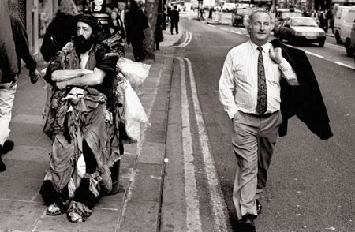
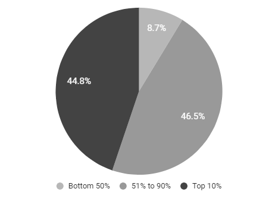
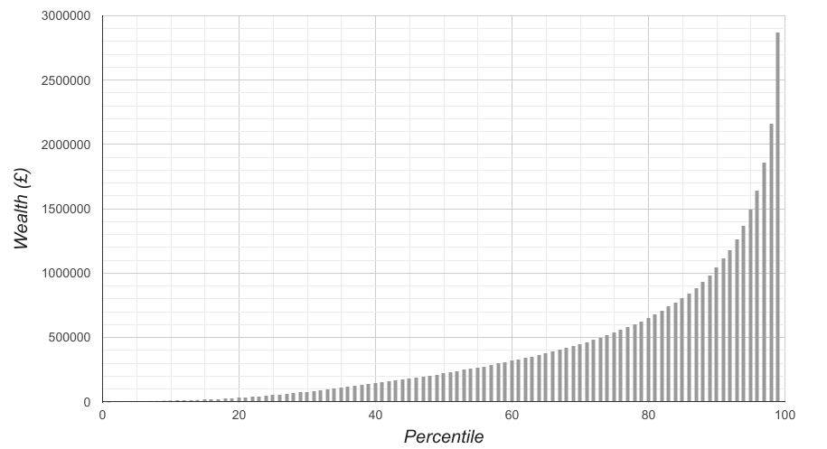
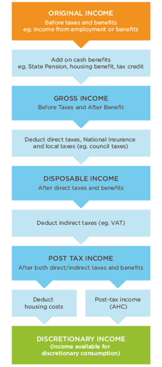
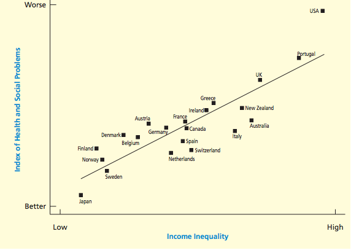
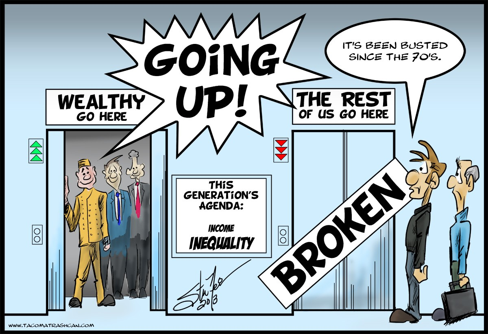
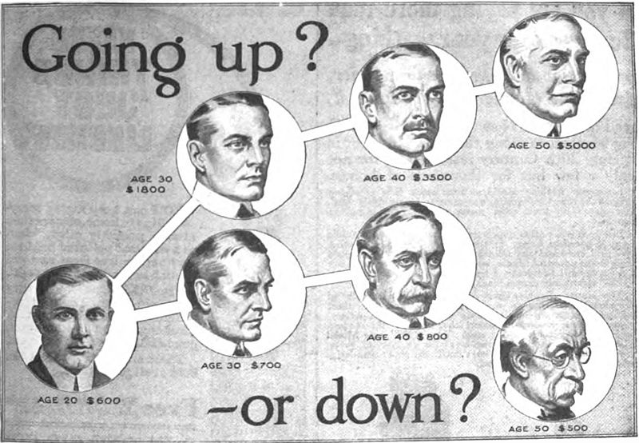
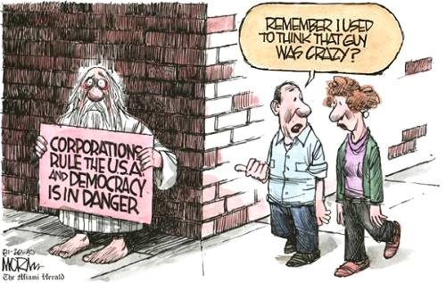
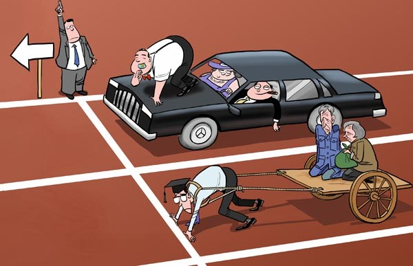
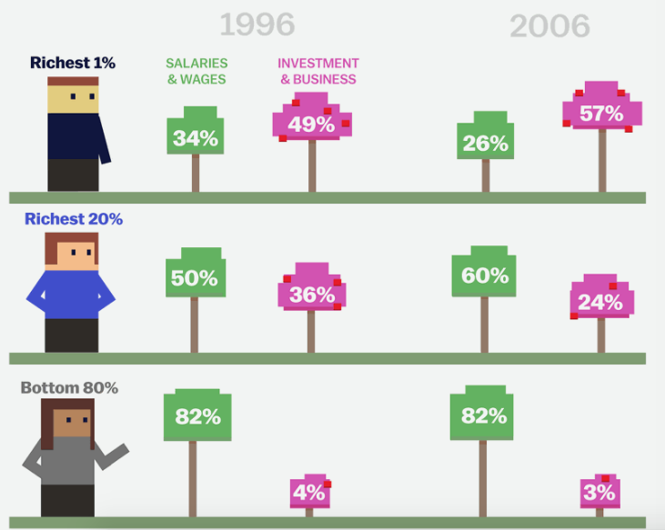

# PART 7: INEQUALITY 

## Summary 

- When assessing inequality, we can consider whether it is harmful and whether it is justified.
- People build material wealth through primary and secondary wealth creation. Primary wealth creation is wealth that is earned through wages or acquired through inheritance. Secondary wealth creation is generated by investment of primary wealth.
- Those who have great wealth are able to grow it through secondary wealth creation. Those without (in particular those who pay rent), have little income for secondary wealth. They may also see their primary wealth decrease through wage stagnation and decreases in the real value of wages.
- Piketty found that under capitalism, returns on capital wealth will tend to grow faster than wages. This implies a structural advantage for those who already have secondary wealth. One reason for this is pseudo-investments.
- Wealthy people are able to put money into unfair pseudo-investments,which do not lead to overall growth, such as land or monopolies. 
-  Wealthy people also benefit unfairly from lowering of interest rates,leading to increases in asset values.
- Britain has a severe wealth and income inequality problem. 
- Inequality is correlated with many social problems, such as higher crime rates, lower life expectancy, poor health outcomes, poor educational attainment and lower social cohesion.
- Inequality also poses risks for democratic representation and economic growth.
- Judging from US data, people want a more equal society (more like Denmark)
- Income tax has an important redistributive role. It is effective in reducing income inequality and the top 1% income share.

# 7.1 Why Does Inequality Matter?

`r tufte::newthought('Have you ever walked')` through Knightsbridge in London, and watched as expensive cars parked outside of designer shops? And turned your head to see homeless people beg outside? In this chapter, we will look at how wealth and income are distributed in Britain. As we will see, the distribution is very unequal. But what to think? Is it a problem that some have so much, while others have little?  

||
|:--:|
|*Figure 6.1 - A Street Scene In The UK*|

Many would say that this state of affairs is morally wrong and should be addressed through policy change and taxation. Others might ask how this wealth were acquired, and warn against discouraging productive activity. We generally have a strong sense that if someone has worked hard for something, then they have earned it and should be able to keep it. If everyone has the same opportunity to build wealth and rich people gained their wealth through hard work, sacrifice or ingenuity, we might conclude that the rich deserve their wealth, no matter how great. That is, we would be considering whether the wealth disparity is *fair*.

Aside from fairness, we also have to consider whether there may be serious and undesirable social ills associated with an unequal distribution of wealth. Does inequality lead to undesirable outcomes for people and society?  Does it lead to social problems, such as more crime, poorer health and shorter life expectancy?  Is it a threat to representative democracy?  On the other hand, are there social benefits to inequality, for example, does it encourage innovation and the creation of new luxury goods which may eventually be enjoyed by the less wealthy?  Does it motivate economic growth?  This kind of questioning is an assessment of potential *harm* or *benefit*.

Thus in evaluating the status quo, we must take a two-pronged approach;

-  Benefit or Harm: Consider whether there are benefits or social ills associated with disparities in wealth and income, aside from whether or not those disparities are fair and just.
- Fairness: Consider how income is received and how wealth accumulates in the hands of people in Britain. Then we can assess whether this wealth accumulation occurs via fair or unfair means.

But before making this assessment, we should take a step back. We have talked about 'wealth' and 'riches' on the assumption that we all take these words to mean the same things. In fact, the word 'wealth' in its common usage can refer to very different things. We break down our interpretation of this in the next section. 

# 7.2 What is Wealth?

In its most broad sense, wealth refers to anything of value to people. Thus based on this rather broad definition, 'wealth' can refer to things which are quite intangible. Social connections, charisma, political influence, the rule of law and safety. These are all desirable, at least to most people. People often use the term 'wealth' to describe things which are personal and irreplaceable, such as a family heirloom, or even simply family or friends. Such things have little or no 'exchange value' (i.e. they can't be sold or can't be sold for any great amount), but they may have great personal value. 

Some things of great value are what we might term 'social goods' because they are not privately held by one person. Social goods may also include effective public transport, parks, clean air, a free press and even a feeling of community. These are a kind of wealth, in that they are valuable,  but they are unlike privately held wealth because they are enjoyed by the many and most efficient when used for a large number of people, rather than on an individual basis. An obvious example is clean air. In a world in which the air was too toxic to breathe, the rich might be able to afford clean air piped into their homes. However, this would be a diminished life for everyone, including the rich as they would need to employ an expensive, labour-intensive process compared to simply having a clean atmosphere which all could enjoy. 

Another example is safety in South Africa. The degree of crime is so bad that drivers regularly have their cars stolen while waiting at stoplights. Wealthy people can avoid being the victims of crime, by locking themselves away in secure enclaves, surrounded by high walls and security systems. The public social good, that of public security (usually provided by an effective police force) is lacking in South Africa. The rich can protect themselves; the poor cannot. However, despite this relative privilege the wealthy still have a diminished quality of life, resulting from the restricted freedom of movement and a fear of becoming a victim of crime. Perversley, the fact that social goods are valued by everyone can put them at risk in a way that is not the case for goods which are held privately. This is because when people personally own wealth, they are often very concerned about protecting it. People tend to be less actively concerned about wealth held commonly with others, as their tie to the social good is often less tangible. 

It is this 'private wealth' that we are focusing on in this chapter, but social goods are mentioned here because they are so important for quality of life, and because as we shall see, inequality of private wealth is linked with the loss of some of these social goods. More specifically, we are narrowing ourselves to discussion of privately held material wealth, thereby excluding immaterial or intangible forms of wealth. However it is worth noting that having material wealth often enables the attainment of immaterial goods of great value. For example, a materially wealthy person may buy access to a top school for their child, which provides that child with access to a good education, and good social connections and may lead to lucrative and powerful work opportunities. Similarly, paid entry into expensive elite social clubs offers valuable networking opportunities. Material wealth can buy time, unique experiences, unpaid internships, physical attractiveness (to an extent) and worryingly, political influence. Perhaps the only thing material wealth can't buy is love and happiness - though many will still try.

## How do people build material wealth?

Well, there are many ways, both legal and illegal, but we will confine ourselves here to the most significant legal means;

**Wages**

Earning an income through some form of economic activity, such as working as an employee or a self-employed trader, or creating something and selling it. People who earn just enough income to meet their needs probably won't build up much wealth in this way. Someone with a high income and low living costs can build up wealth much more quickly.

**Inheritance **

Receiving  inheritance or a gift through wealthy relations. Great family wealth can often be passed down and increased over many generations.

The above two ways in which people acquire wealth might be termed 'primary wealth creation'. They concern how a person without any wealth might first acquire it. 

Once a person has some wealth, there are a myriad ways in which to use it so as to increase wealth further. This can be called 'secondary wealth creation' and includes the following actions, among others:

- Investing in companies by buying stocks and shares or some other financial instrument. If the company does well, then the investor will increase their wealth through dividends or by selling the stock when it has higher value.
- Investing in savings products (which invest on a person's behalf) and pay interest.
- Buying land or property and selling it once it has increased in value (possibly also receiving rent income in the meantime)
-  Investing directly in a business 

From the above list, it's easy to see how those who are already rich can get a lot richer. They don't have to build up wealth through labour or invention. Owning wealth opens up a raft of secondary wealth opportunities, and it allows one to take bigger risks. The wealthy are also likely to invest their riches profitably because they can afford to pay advisors and wealth managers to locate investment opportunities and to minimise tax liabilities on their behalf.

Are advantages like these really enough to propel the rich into ever-increasing rates of wealth-accumulation? Ever increasing global inequality suggests that this is so [@OECD2015]. To demonstrate this further, we take a look at the extent of wealth and income inequality in Britain today.

# 7.3 Inequality of Wealth

## The British Context

Whilst we have not yet reached a second Gilded Age, in Britain, we do have severe wealth inequality. According to the figures from the Office of National Statistics from 2012 to 2014, the richest 10% of UK households hold 45% of all wealth, while the poorest 50% own just 8.7% [@ONS2015].

||
|:--:|
|*Figure 6.2: Distribution of Household Wealth*|

Particularly striking is the fact that the richest five families in the UK are wealthier than the bottom 20% of the population [@Dransfield2014]. 

Here are a few notable facts about the UK wealth distribution:

-  Bottom 10% of households have total wealth of £12,550 or less.

-  Median total household wealth is £225,000.

-  The top 10% of households have a total wealth of over £1m.

-  The top 1% of households have a total wealth of £2.87m+.

 The below chart shows the distribution in a finer grain, allowing us to see the share of wealth held by the top 1% in British society [@ONSWELLBEING2015].

||
|:--:|
|*Figure 6.3: Household Wealth Distribution by percentile (2015)*|

This wealth inequality continues to increase. 

## The Role of Property

ONS figures from 2012-14 show that while the total proportion of wealth held by the top 1% remained steady at 13%, the next 9 per cent richest households, increased their share to 31.2 per cent of total wealth. This was up from 30.1 per cent two years previously. 

The inequality increase occurred entirely in net property wealth, during a period of house price rises [@ONSWELLBEING2015]. This indicates that a large part of the growing wealth of the richest in Britain, is due to their ownership of property, rather than wage income or business income. 

A 2014 Credit Suisse report confirmed the findings. They found that the top 10% in the UK have become wealthier since the financial crisis because of value increases in assets. They also announced that Britain is the only country in the G7 group of leading economies where inequality has increased this century [@TreanorFarrell2014]. 

# 7.4 Inequality of Income

We have discussed wealth inequality, which is the vast discrepancy in the ownership of assets, such as property, cash and investments, held across Britain. There also exists a less severe, but also worrying, form of inequality. This is inequality of income. 

Income may come from a variety of sources, such as interest on savings, wages, dividends, cash benefits (such as State benefits) and rental income. Some of this income may be taxed. Measures of income inequality generally consider inequality in disposable incomes (after benefits and after direct taxes). The below flow-chart shows the various stages of household income;

| |
|:--:|
|*Figure 6.4: Household Income after Tax, Benefits and Housing*|

Disposable income may be measured before-housing-costs (BHC) or after-housing-costs (AHC). When considering income, it is important to be precise about the kind of income being discussed. For example, when looking at income inequality, we can see that there is more inequality in income after-housing-costs than in income before-housing-costs, because poorer households tend to spend a higher share of their income on housing than those higher up the income distribution [@McGuinness2016].

In the below chart [@IFS2014], we can see how the share of pre-tax household income going to the top 1% has increased over time. 

||
|:--:|
|*Figure 6.5: Share of top % pre-tax income in the UK*|

The top incomes of the top 1% appear to be 'racing away' from the remaining 99%. Data suggests that income inequality within the bottom 99% is remaining reasonably stable or possibly slightly decreasing, while the income shares of the top 1% is increasing. 

There exists, of course, a relationship between income inequality and wealth inequality. Income leads to wealth when it is saved up and when it is used to buy assets. Wealth also generates income as shares generate dividends, savings generate interest and property ownership generates rental income. 

Households with great wealth often also receive high incomes. However  we can easily imagine someone who has great wealth in the form of property, investments and bank balance, but who has little income (perhaps a retiree). Similarly, someone may make a significant income, but have debts and high outgoings, so they don't build up wealth (perhaps a young person on a high salary). The effect of a sudden reduction in income or unexpected expenses would have a dramatically different effect on each of them. 

Broadly speaking, we have seen:

- Wealth distribution in the UK is very unequal and getting more so.
- Income distribution is also very unequal but less so than the wealth distribution.
- The top 1% income share is increasing quickly.
- Wealthy people tend to be on high incomes. Those with little wealth tend to be on low incomes.

Understanding the above graphs and figures requires us to look behind the figures and consider how different groups earn and use their income. At the lower end, there are those who earn their income through labour, and who must pay housing costs. They have very little disposable income and are unlikely to have much income available to invest in secondary wealth generation. They may have seen their wages stagnating [@Khan2016], while the real value of their wages decrease [@Tily2016].  At the other extreme are those who have high incomes and are able to make additional income through purchasing assets. As we have seen, value increases in assets, (particularly property assets) have driven an increase in the wealth of the very rich. With assets comes income through dividends, rent and capital gains. This appears to be contributing to growing inequality of both wealth and income. 

Quoted in the Financial Times, the general secretary of the Trade Union Congress, Frances O'Grady put the situation starkly;

>*"The economy is paying people too little for hard work and too much just for sitting on wealth. It is making Britain more and more unequal, with those who are already rich moving even further ahead of the typical family [@Giles2015]." * 

# 7.5 Effects of Inequality

But is this inequality in itself really such a problem? If we could ensure that all citizens have their basic wants covered, does it matter if the rich are getting richer?  Surely dealing with absolute wealth in this way and ensuring a basic standard of living is a more important focus than the relative wealth between rich and poor? 

It is clear that there is a strong view amongst some circles that inequality is not a problem as long as the poorest have their basic needs met. 

High wealth and income inequality matter for a host of reasons. It causes subtly damaging changes in the way people interact with each other and participate in society. According to the Equality Trust, income inequality is correlated with low civic participation, lower voter turnout and lower levels of cultural activity [@EqualityTrust2014]. There is even evidence that inequality may affect personality [@EqualityTrust2017]. Research comparing US states found, despite adjusting findings for state and person-level socio-demographic factors, that people in less-equal states were 'less agreeable' than those in more-equal states [@DeVries2011]. 

A World Bank study on inequality and crime rates reported a strong correlation between violent crime and inequality, both within and between countries.

## Inequality and Empathy

Psychologist Paul Piff has conducted research [@Piff2010] on a phenomenon called the'empathy gap'. In his experiments, test subjects were artificially placed into social hierarchies. Piff and his colleagues concluded that increased wealth and status in society leads to increased focus on oneself. This, in turn, leads to decreased compassion, altruism and ethical behavior. The opposite is also true. Piff's work suggests that poorer individuals tend to be more generous, charitable, trusting and helpful, compared with their richer counterparts. A related study by Keltner et al, found that 'lower-class individuals' displayed more compassion and sensitivity to the distress of others than their upper-class counterparts [@Stellar2012].

Social class and wealth, therefore, appear to be correlated with qualities like compassion and empathy. This may be exacerbated by increasing physical segregation in where the rich and poor live. Poor, rich and average households became less and less likely to live next door to one another between 1970 and 2000 [@DorlingDaniel2007] suggesting that socioeconomic separation has been accompanied by geographical polarisation.

Surprisingly, there is even evidence that inequality may affect personality. Research in the USA compared less equal US states with more equal states. After adjusting for state and person-level socio-demographic factors, de Vries et al found that people in less equal states were 'less agreeable' than in more equal states.

## Inequality and Social Problems

Epidemiologists Wilson and Pickett collated a breadth of transnational research comparing inequality and a variety of social measures. Their results were striking. They found that over a wide range of areas, including health, education,social mobility, social cohesion and foreign aid, increased inequality leads to worse outcomes. See, for example, their findings below comparing health and social problems, with income inequality, across rich countries [@Wilkinson2017]. We can see that the US is highest in income inequality and highest in health and social problems. 

||
|:--:|
|*Figure 6.6: Health and social problems related to inequality within rich countries*|

^[Wilson and Pickett's research has been criticised on the basis that their findings show relationships of correlation, rather than causation. However the researchers note that many of the causal processes linking inequality with social problems are well established from other research. They argue that the key insight from their work is that the connection can be seen repeatedly in countries worldwide.]

Their message for policy-makers was plain: 

>*"(A) clear warning for those who might want to place low public expenditure and taxation at the top of their priorities. If you fail to avoid high inequality, you will need more prison and more police. You will have to deal with higher rates of mental illness, drug abuse and every other kind of problem. If keeping taxes and benefits down leads to wider income differences, the need to deal with ensuing social ills may force you to raise public expenditure to cope ." *[@Wilkinson2010]

## Inequality and Crime Rates

In a study on inequality and crime rates, Lederman et al. found a strong correlation between violent crime and inequality  [@Lederman2002], both within and between countries. In their view;

"The correlation reflects causation from inequality to crime rates, even correcting for other crime determinants" 

Simply put, this means that inequality causes high crime rates, and not vice versa. The mechnism by which this occurs is unclear and may be myriad. Economic inequality may curtail opportunities for some, leading to feelings of hopelessness, inferiority and fear which then lead to violence. Inequality may encourage social competition, and low levels of trust and community cohesion within a society.

||
|:--:|
|*Figure 6.7: Cartoon showing the relationship between  income inequality and social mobility*|

There is also a strong correlation between high income inequality and low social mobility. Social mobility is the upward or downward movement of people -between social strata in a society. Mobility may be intra-generational (i.e within a generation, such as 'rags to riches' stories, or it may be inter-generational, i.e a change in social status from parents to children.

In an intergenerational study of the American context by researcher Corak,  it was observed that high earnings inequality is likely to be associated with a stagnation in intergenerational mobility. This means that earnings inequality makes societies more 'sticky', such that children are more likely to stay in the same social strata as their parents.

Corak cautions that this outcome is particularly likely if labour market inequalities translate into political power, which then influences whether progressive policy reforms are made. He warns, 

>*"Without changes in these underlying factors the transmission of inequality from the current generation to the next will remain a movie that is played to the same script as that viewed by past generations." * [@MilesCorak2011]

Figure 6.8 shows the strong correlation between inequality and a measure called 'intergenerational earnings elasticity' (IEE), which is used by social scientists when considering intergenerational social mobility. IEE is the percentage difference in earnings in the child's generation associated with the percentage difference in the parental generation [@MilesCorak2011]. An intergenerational elasticity in earnings of 0.9, for example, means that if father A makes 100% more money than father B, then the son of father A will, as an adult, earn 90% more than the son of father B. An elasticity of 0.2 says this 100% difference between the two fathers would only lead to a 20% difference between the sons. 

The lower the elasticity, the more mobility in the society. Figure 2.5 shows that increased inequality at any point in time is correlated with lower generational earnings mobility. Note that mobility can be in either direction, up or down. The IEE is simply considering the earnings difference between generations. 

||
|:--:|
|*Figure 6.7: Intergenerational earnings elasticity*|

This chart is widely known as the 'Gatsby Curve'. It is so named after the character of Jay Gatsby in the famous novel by F. Scott Fitzgerald. In the novel, Jay Gatsby tries in vain to raise his social standing by becoming very  The novel is set in the 1920s, when there was high inequality of wealth, and very low social mobility.

One suggested reason for the correlation between inequality and intergenerational earnings mobility is unequal access to educational opportunities. This is exacerbated by  poor social and family relationships, which then inhibit learning. The below image is from a 1916 advertisement for a vocational school, and suggests that education is a pathway to upward social mobility.

||
|:--:|
|*Figure 6.9: Advertisement promoting education as a route to upward mobility*|

These findings offer insights into how intergenerational poverty and welfare dependency have a real structural basis and are not entirely within the control of an individual's willingness, effort or merit.

## Inequality and Liberty

If we accept the evidence that economic inequality lead to negative social outcomes, might we nevertheless also argue that inequality is a necessary and inevitable outcome of a free society and equality before the law?  In his book 'The Constitution of Liberty', political philosopher Fredrich Hayek argued,

> *"From the fact that people are very different it follows that, if we treat them equally, the result must be inequality in their actual position, and that the only way to place them in an equal position would be to treat them differently. Equality before the law and material equality are therefore not only different but are in conflict with each other; and we can achieve either one or the other, but not both at the same time."*

Hayek also argues that an attempt to achieve complete material equality between people, can only come at the expense of freedom,

>*"While an equality of rights under a limited government is possible and an essential condition of individual freedom, a claim for equality of material position can be met only by a government with totalitarian powers."*  [@Hayek1944]

One response would be to say that in objecting to extremes of inequality, one is not advocating strict equality of outcome for all. 

The obvious problem with Hayek's argument is that distribution according to merit is just one conception of social justice. Consider the principles of fair equality of opportunity, and raising the lowest social position as much as possible." The point being that extreme inequality needs to be eliminated to create a level playing field where individuals are given the opportunity to demonstrate their merit [@Lister2011].

## Wealth Inequality and the Democratic Process

||
|:--:|
|*Figure 6.10: Cartoon showing wealth inequality in the democratic process*|

Despite Hayek's famous theory on the constitution of liberty, a very real danger of wealth inequality is the threat to the democratic process. Extremes of wealth mean that those at the top, whether they be corporations (as per the above cartoon) or individuals,have disproportionate access to power, and an ability to influence politicians for their own interests. A famous quotation, attributed to noted American Supreme Court Judge Louis D. Brandeis, puts it simply,

>"*We can have democracy in this country or we can have great wealth concentrated in the hands of a few, but we cannot have both*." [@Dillard1904]

 There is strong evidence that extremes of wealth inequality lead to so-called 'representational inequality'. Work by Professor Martin Gilens of Princeton University found that in the US, when the policy preferences of the affluent differ from those of the middle-class or poor, there is virtually no relationship between policy outcomes and the desires of less advantaged groups [@Gilens2004]. Policies favored by 20 percent of affluent Americans, have about a one-in-five chance of being adopted, while those favored by 80 percent of affluent Americans are adopted about half the time. In contrast, the support or opposition of the poor or the middle class has no impact on a policy's prospects of being adopted [@Gilens2012].

Economist Dabla-Norris notes in a 2015 IMF report [@Dabla-Norris2015], that income inequality can have serious consequences for political stability, saying,

>"*Widening inequality also has significant implications for growth and macroeconomic stability, it can concentrate political and decision making power in the hands of a few, lead to a suboptimal use of human resources, cause investment-reducing political and economic instability, and raise crisis risk.*"

## Inequality and Growth

Some would argue that inequality is nevertheless necessary for economic growth. Inequality is thought by some to encourage entrepreneurialism [@Matthews2016] and the wealthy are thought to invest in the economy. It is also claimed that when the state redistributes wealth through taxation and benefits, resources are lost through administration and bureaucracy. However, recent research by the Organization for Economic Cooperation and Development (OECD) suggests that even this purely economic argument is on shaky ground. Its 2014 analysis found that income inequality has a negative and statistically significant impact on growth. 

The study found that, 

>*"Rising inequality is estimated to have knocked more than 4 percentage points off growth in half of the (OECD) countries over two decades. On the other hand, greater equality prior to the crisis helped GDP per capita in a few countries, notably Spain."*  [@OE2014] 

Furthermore, while there is evidence that the promise of wealth is a strong motivator for entrepreneurs, the majority of the top 1% in the US, are not entrepreneurs but are executives, managers, supervisors, and financial professionals [@Bakija2012].

These findings reinforce the work of Piketty previously examined on inequality and 'low growth capitalism'. 

In this section, we have considered the effects of inequality in terms of its impact on empathy, social problems, crime rates, and social mobility. Contrary to claims that income and wealth inequality are necessary for liberty and growth, we see evidence that inequality threatens a functional democracy and growing economy.

# 7.6 How much inequality do people want in society?

We've seen above that income inequality and wealth inequality are associated with very undesirable social consequences. However, most would not welcome an economic system in which everyone received exactly the same amount. There has been some research from the US, as to what distribution of wealth people believe there should be in society. 

In a 2011 study by Dan Ariely and Michael Norton [@Norton2011], a nationally representative online panel of Americans were asked to estimate the current distribution of wealth in the USA, and to describe a distribution they deemed 'just'. The results were striking. All demographic groups (including Republicans and the wealthy) desired a more equal distribution than the actual US wealth distribution. Secondly, all groups vastly underestimated wealth inequality in the US, estimating that the top quintile held about 59% rather than the actual amount of about 84%.

The below chart shows the distribution which the participants estimated was the case, the participants' ideal distribution and the actual US wealth distribution. We can see that the participants' estimated distribution is as far from the actual distribution as their ideal distribution is from their estimated distribution of wealth inequality in the US.

||
|:--:|
|*Figure 6.11: United States wealth distribution - Actual, Estimated and Ideal as surveyed*|

The researchers concluded two main points.

First that a large, nationally representative sample of Americans seems to prefer to live in a country more like Sweden than like the United States. Americans also construct ideal distributions that are far more equal than they estimated the United States to be; estimates which themselves were far more equal than the actual level of inequality.

Second, there was much more consensus than disagreement across groups from different sides of the political spectrum about this desire for a more equal distribution of wealth, suggesting that Americans may possess a commonly held "normative" standard for the distribution of wealth despite the many disagreements about policies that affect that distribution, such as taxation and welfare.

In short:

- Americans think the US is more equal than it is, and
- Americans would like the US to be even more equal than they think it is (more like Sweden)
- This preference held across the political spectrum.

# 7.7 Is Income Inequality Merited?

We have now seen,that inequality is associated with significant social ills, such as increased crime rates and poor health and longevity outcomes. We have also seen that it may pose real threat to representative democracy and to economic growth. So, there is clear evidence of harm or potential harm arising from wealth inequality in Britain.

What about fairness?  Has the wealth of the very rich been accumulated through fair means? Remember again the ways of accumulating wealth which we discussed in th beginning of this chapter. There was primary wealth acquisition, occurring through income from economic activity or inheritance. There was also secondary wealth acquisition which involved putting wealth to use in the form of investment, to create more wealth. We said that if the rich arerich because they work hard and 'work smart' and the poor are poor because they do not, then that might be one reason for viewing wealth inequality as fair. 

## Inequality due to Income or Inheritance

When it comes to those primary forms of wealth acquisition, we know that unfairness exists. It would be wonderful if everyone had an elderly aunt who could leave them a sizeable inheritance, but that is clearly not the case. Some people have friends who help them get a high-paying job, some do not. Some people go to excellent schools, some do not. Some work, no matter how important to society, pays less than other work. These kinds of unfairness are difficult to tackle, raise many ethical issues and are outside the scope of this book. However, it is worth mentioning that the world is not a level playing field and while attempts can be made, (through for example, inheritance tax and affirmative action policy) to redress unfairness of opportunity to gain primary wealth, attempts to totally eradicate it would probably be futile. They would also probably have serious unintended consequences. As your parent may have told you when you were a child, 'Sometimes life just isn't fair'.

||
|:--:|
|*Figure 6.12: Cartoon showing Inheritance as a wider social problem*|

To what extent is someone's monetary success due to their own work, and to what extent is it their luck or privilege (in terms of genes, or parental support), or a product of the wider society? And to what extent should we reward those who seek money over other objectives?

Income taxation is one of the main ways in which the government affects the income distribution across society. From a purely philosophical point of view it's not easy to determine what the rate of income tax should be. We'll come back to this in the next chapter, when we look at this through the prism of income inequality and the recent historical experience. We'll also consider the equity of processes of wealth growing.

# 7.8 Direct Taxes and their Redistributive Role

## Income Tax in the UK

Most people, when they think of tax, immediately think of income tax. It is possibly the most noticeably intrusive tax in every individual's life, requiring, as it does, the keeping of records,the filling in of forms and the possible sanctions from the 'tax man'. Unlike VAT, which is added to goods and services we purchase, income tax comes out of our earnings. There is often an added feeling of grievance associated with the sense that the government is taking money for which we have worked very hard.

Income tax is progressive, with different rates of tax payable, according to income. These rates are called 'Bands'. As of 2016, each individual is entitled to a'personal allowance' of £11,000 of non-taxable income. Above this, their income is taxable. Taxable income (i.e. income above the personal allowance) is subject to different tax rates depending upon the band within which it falls. The below table summarises the income tax bands and rates.

| Band                                                     | Rate             | Income after allowances   2016/17 | Income after allowances  2015/16 |
| ------------------------------------------------------------ | -------------------- | ----------------------------------------- | ---------------------------------------- |
| [Starting rate for savings](http://www.gov.uk/apply-tax-free-interest-on-savings/10-savings-rate) | 10% (0% for 2015/16) | Up to £5,000                              | Up to £5,000                             |
| Basic rate                                                   | 20%                  | Up to £32,000                             | Up to £31,785                            |
| Higher rate                                                  | 40%                  | £32,001 to £150,000                       | £31,786 to £150,000                      |
| Additional rate                                              | 45%                  | Over £150000                              | Over £150000                             |

The current top marginal tax rate is 45%. The below chart shows how top marginal tax rates have changed over time for different countries. We can see that the top tax rate for the UK was very high during the Second World War and in the late 1970s. The rate dropped sharply during the prime ministership of Margaret Thatcher in the 1980s.

||
|:--:|
|*Figure 6.13: Top Income Marginal Tax Rate*|

## The Effect of UK Taxes on Income Inequality

Direct taxes (e.g. Income tax, National Insurance Contributions) act to reduce inequality of income. Wealthier households pay higher amounts of direct tax and a higher proportion of their income in direct taxes. They are *progressive* taxes.

The below chart shows the effect which the combination of tax and benefits have on income inequality [@Wells]. The y-axis is the degree of inequality as measured by the 'Gini coefficient' ^[A higher Gini value represents a less equal society, with 100% meaning one person has all the income, and 0 meaning everyone has the same]. The blue line is the level of income inequality before taxation and benefit distribution.

||
|:--:|
|*Figure 6.14: Impact of tax and benefits on income inequality*|

According to these ONS figures in 2014/15, the richest fifth of the population paid 22.8% of their gross income on direct taxes. The majority of this was income tax. The average tax bill for the poorest fifth was 11% of their gross income. The majority of this was from Council tax.

In 2014/15, after direct taxes, the average incomes of the richest fifth of households was five and a half times that of the poorest fifth (£67,000 and £12,300 per year respectively).

Income Tax made up the largest proportion of direct tax paid by the richest fifth of the population. Income tax is the most progressive of the direct taxes and thus has the biggest effect on reducing income inequality. The below chart compares the progressivity of income tax, National Insurance Contributions and Council Tax. A positive value indicates progressivity.

||
|:--:|
|*Figure 6.15: Income progressivity for various tax types*|

Despite fluctuation, there is a clear overall trend towards increased progressivity.

## Using Income Tax To Reduce Income Inequality

Earlier, we discussed the top 1%, and evidence that their share of total income is racing away from the share of the other 99%. The below chart shows how the income share of the top 1% correlates with top marginal tax rates in the USA. 

||
|:--:|
|*Figure 6.16: Correlation between top 1% income shares and top MTR*|

Immediately we can see a strong oppositional relationship, whereby a high marginal tax rate is generally correlated with a lower income share. So again, in the roaring 20s, we have a lower top marginal tax rate of about 25%, and the income share of the top 1% reaching a height of around 23%. During the depression of the 1930s and the Second World War, there in an increase in the top marginal tax rate and a severe reduction in the top 1% income share. During the 1980s, another drop in the top marginal tax rate and and an increase in the top 1% income share once more. So, this suggests a strong direct relationship between an increase in top marginal tax rates and a decrease in the top 1% income share. 

The pattern is also evident if we compare different countries. The below chart shows the top tax rate and 1% share for a variety of countries in 2004-2008.

||
|:--:|
|*Figure 6.17: Top 1% share and top MTR for various countries in 2004-8*|

Again the top marginal tax rate appears to have an inverse relationship with top 1% income share. Those with the lowest 1% income share are the Nordic countries, with top marginal tax rates of between 55 and 60%. The UK and US, with lower top marginal tax rates of 40% and under, are also among the highest in 1% income share. There are anomalies, however,which indicate that top marginal tax rate is not the only factor contributing to the 1% income share. Germany is a bit of an outlier, perhaps due to tax deductions.

So, we conclude by arguing that firstly, the progressivity of income tax is welcome; and that atop marginal rate of around 60% is probably necessary to keep a moderate and stable income and wealth share of the top 1%. Reforming deductions and other complexities that the rich can exploit is another possible area of focus.

# 7.9 Income Tax: The details

 Income tax is the tax which most people think of first when they think about tax. As the name implies, it is a tax which people pay on their income, which can include money earned from employment and or self-employment, state benefits, some pensions, rental income, investment income, income from trusts and work benefits. Some income is exempt from tax, for example; interest on savings and tax-exempt accounts.

## How is it paid?

 There are several ways in which income tax is paid, which vary in general according to whether the taxpayer is an employee, self-employed and/or in receipt of benefits. There is generally no minimum age for paying most income taxes, therefore even children who earn have income over the tax-free threshold will be required to pay tax.

**Employees**

Employees in Britain have income tax taken out of their pay packet before they are paid their wages. This is called Pay As You Earn (PAYE). Employers determine the tax payable by using the employee's tax code. This is a code which HMRC gives each taxpayer for tax assessment purposes, and which delineates their income tax bracket

**State benefits** 

Those whose only income is state benefits may not have to pay any tax. In some cases, HMRC will require those on state benefits to submit a self-assessment tax return. This is a form (available online or in paper form)  which stipulates an individual's income and is used by HMRC to calculate tax owed. The below table shows which benefits are taxable and which are not.

**Self-employed** 

Those who are self-employed, such those those operating as a sole trader,  will be required to register as self-employed and submit self-assessment tax returns.

**Foreign Income**

In some cases, a person may be required to pay tax on foreign income. This is income from outside England,Scotland, Wales, Northern Ireland or other parts of the world. Whether a person is required to pay tax on foreign income will depend on whether they are considered 'resident in the UK'for tax purposes. Those who are not resident in the UK will not have to pay tax on foreign income. UK residents pay tax on such foreign income. Special rules exists for UK residents who are 'domiciled' abroad. Foreign income includes wages if a person has worked abroad, foreign investments and savings interest, rental income on overseas property and income from pensions held overseas. 

| Taxable  State Benefits                                      | Non-taxable  state benefits                                  |
| ------------------------------------------------------------ | ------------------------------------------------------------ |
|  The State  Pension  | -  Housing  Benefit |
| Jobseeker's  Allowance |  Employment and  Support Allowance (income related)|
|Carer's  Allowance |   Income Support (though you may have to pay tax on Income Support if you're involved in a  strike) |
|Employment and  Support Allowance (contribution based) |  Working Tax  Credit|
|Incapacity  Benefit (from the 29th week you get it) |  Child Tax  Credit |
|Bereavement  Allowance   |  Disability  Living Allowance |
|Pensions paid  by the Industrial Death Benefit scheme  |   Child Benefit  (income based) |
|Widowed  Parent's Allowance | Personal  Independence Payment (PIP) |
|Widow's  pension |  Guardian's  Allowance |
| |Attendance  Allowance |
| |Pension Credit  |
| |Winter Fuel  Payments and Christmas Bonus |
| |Free TV  licence for over-75s  |
| |lump-sum  bereavement payments |
| |Maternity  Allowance |
| |Industrial  Injuries Benefit  |
| |Severe  Disablement Allowance  |
| |Universal  Credit  |
| |War Widow's  Pension |

## Personal Allowance

Most people will not pay tax on all of their income. Rather, there is aset amount of income which a person can keep tax free. This is known as the 'Personal Allowance'. Income above the personal allowance is taxable. As of 2017, the standard Personal Allowance is £11,500. Thus, for most people, income up to £11,500 will be tax free and income above this amount is taxable. Those whose income is greater than £100,000 will have a smaller tax free personal allowance ^[The Personal Allowance goes down by £1 for every £2 that the 'adjusted net income' is above £100,000.]. Those in receipt of Marriage Allowance or Blind Person's Allowance have a greater Personal Allowance.

## Tax Bands

Above the personal allowance,income is taxable. However it is not all taxable at the same flat rate. The tax rate progressively increases in 'bands' as the amount of income increases. That is why income tax is known as a'progressive' tax - the rate increases as income increases. These rates are known as 'marginal tax rates'. The below table shows the tax bands for the UK (with the exception of Scotland, which has different rates).

| Tax Band        | Taxable income   | Tax rate |
| ------------------- | -------------------- | ------------ |
| Personal  Allowance | Up to £11,500        | 0%           |
| Basic rate          | £11,501 to  £45,000  | 20%          |
| Higher rate         | £45,001 to  £150,000 | 40%          |
| Additional  rate    | over £150,000        | 45%          |

Income above £150,000, is taxed at the Additional Rate of 45%. 

So, for example, a person who had an income of £50,000, would calculate their tax payable as As can be seen above, the personal allowance is effectively a 0% tax rate on the first £11,500. The basic rate of 20% applies on income above £11,501 and up to £45,000. Any income between  £45,001 and £150,000 is taxed at the higher rate of 40%. follows; they are entitled to the personal allowance of £11,500, leaving £38,500 of taxable income. The next £33,499 (£45,000 - £11,501) is taxable at 20%. The income above and including £45,001 is taxable at 40%. So, a calculation of tax owed would be:

 (£33499 x 0.2) + (£4999 x 0.4) = £6699.8 + £1999.6 = £8699.4.

## Savings and Dividend Allowances and Tax Relief

There are some other specific circumstances in which one might pay less income tax. 

Tax relief: Tax Relief allows taxpayers to reduce the tax they pay or to get some tax repaid back. Tax relief may be available to people who pay personal pension contributions, charity donations, maintenance payments and to those working in special circumstances.. Tax relief also applies to work or business expenses. Self-employed persons may be able to claim tax relief for certain business expenses, while employees may claim tax relief for some expenses incurred for the performance of the job.

Generally, tax is payable on interest earned from savings accounts and on any dividends earned from shares owned. However, for these two sources of income, tax relief may be applicable depending on how the investments are disposed or reinvested. 

## Savings interest allowance

In the case of savings interest, the size of the allowance depends on how much 'other' (i.e non savings interest) income the taxpayer has. If the total amount of 'other' income is less than £16,500, then they will be eligible for a maximum savings interest allowance of £5,000. This is called the 'starting rate'. The starting rate will be reduced by £1 for every £1 of other income above the Personal Allowance. Those whose 'other' income is greater than or equal to £16,500, will not be eligible for the 'starting rate' of savings allowance.

HMRC offer the following example of a savings allowance calculation on their website (we paraphrase for clarity) [@HMRC];

> *Mark earns £15,000 in wages and gets £200 interest on his savings. HIs 'other' income (his wages) is less than £16,500, so he is eligible for the maximum savings interest allowance of £5000. Therefore his starting rate is £5000*

>*This rate is reduced by £1 for every £1 of 'other' income above the personal allowance.* *His Personal Allowance is £11,500.* 

> *Therefore £15000 - £11500 = £3500. He has £3500 of 'other' income above the Personal Allowance. Therefore his starting rate is reduced by £3,500. His remaining savings interest allowance is £1,500 (£5,000 minus £3,500).* 

>*Therefore, as Mark's savings interest is £200, which is under his allowance, he doesn't pay tax on his savings interest"* 

The starting rate is not the only way in which one can avoid paying tax on savings interest. Depending on which tax band a taxpayer's income falls in (Basic, Higher or Additional), the taxpayer may get up to £1000 savings interest tax free. The below table shows the different allowances for the respective tax bands.

| Income Tax band | Tax-free savings income |
| ------------------- | --------------------------- |
| Basic  rate         | £1000               |
| Higher  rate        | £500                |
| Additional  rate    | £0                  |

The savings covered by the allowance include bank and building society allowances, savings and credit union accounts, unit trusts, investment trusts and investment companies and peer to peer lending. Also, government or company bonds, life annuity payments and some life insurance contracts. Savings which are already in tax-free accounts (eg ISAs), are not included in the allowance.

## Dividends

No tax is payable on the first £5,000 of dividends received in the tax year. Above this allowance, the tax payable depends upon which income tax band the taxpayer is in. The below table shows the dividend tax rate for various tax bands.

This area of income tax is somewhat complex. For further information, HMRC offers a detailed factsheet 

| Tax band     | Tax rate on dividends over £5000 |
| ---------------- | ------------------------------------ |
| Basic  rate      | 7.5%                                |
| Higher  rate     | 32.5%                               |
| Additional  rate | 38.1%                               |

# 7.10 National Insurance Explainer

Originally, National Insurance(NI) did resemble an insurance program. It began in 1911, whereby employees would pay a portion of their wages into the scheme, and could claim from it if they fell ill or became unemployed. In this sense, it was very much a contribution-based system, whereby 'those who paid in, could takeout'. Now, workers pay National Insurance to build up an entitlement to claim several social benefits. One's entitlement to benefits, depends on the'Class' of National Insurance one pays.

## NI Classes and Contributions:

Some form of NI is payable by anyone who is 16 or over and is either an employee earning over £157 per week,or is self-employed and making a profit of £6,025 per year.

There are separate 'classes' of National Insurance.These are numbered 1 to 4. The class into which an individual falls, depends on their type of employment, and income level.

## Class 1 National Insurance

This is paid by employees earning more than £157 a week and under State Pension age. It is automatically deducted by the employer. Employers also pay Classes 1A and 1B NI once a year on any expenses and benefits they give to their employees. For the tax year 2017 to 2018, the rate is 13.8%.

 The 2017-18 Class 1 National Insurance Contribution rates are as follows:

| Your pay                                     | Class 1  National Insurance rate |
| --------------------------------------------- | ------------------------------------ |
| £157 to £866 a week (£680 to £3,750 a  month) | 12% |
| Over £866 a week (£3,750 a month)             | 2%  |

## Class 2 National Insurance

Self-employed people who earn £6,025 per year or over pay Class 2 NI. Those who earn less may choose to pay voluntary contributions. For the tax year 2017-18, the rate is £2.85 a week.

## Class 3 National Insurance

These are voluntary contributions which can be paid to fill or avoid gaps in a person's NI record. 

## Class 4 National Insurance

Class 4 contributions are paid by self-employed people earning profits over £8,164 a year. For 2017-18, the rate is 9% on profits between £8,164 and £45,000, and 2% on profits over £45,000.

People who are employed and self-employed will pay Class 1 contributions on their wages, and Class 2 or 4contributions on their self-employment income.

 Employed people continue to pay NI until they reach State Pension age. Self-employed people who  pay Class 2 contributions, will pay until they reach State Pension age while those who pay Class 4 contributions will pay until April 6 of the year they reach State Pension age.

## National Insurance Benefits:

By paying (some types) of National Insurance, workers build up an entitlement to claim state benefits, such as retirement pension. The kind of benefits to which one is entitled depends on the Class of NI which one has paid.

The table at the bottom shows which benefits are available to which NI Class payers.

## National Insurance Credits for those unable to pay

Those who are not paying National Insurance Contributions, for example the unemployed or ill, may receive National Insurance Credits. Those on Jobseeker's Allowance (JSA) or Employment and Support Allowance (ESA) will receive Class 1 credits automatically, while those who meet the conditions for JSA or ESA but are not receiving them, can apply for NI Credits. There are also credits available (after satisfying conditions) for those on other types of payments. This includes maternity, paternity or adoption pay, carers and foster carers, carers, those on working tax credit, those on universal credit, and some other groups.

| Benefit                                          | Class 1:  employees | Class 2:  self-employed | Class 3:  voluntary contributions |
| ---------------------------------------------------- | ----------------------- | --------------------------- | ------------------------------------- |
| Basic State Pension                                  | Yes                     | Yes                         | Yes                                   |
| Additional State Pension                             | Yes                     | No                          | No                                    |
| New State Pension                                    | Yes                     | Yes                         | Yes                                   |
| Contribution-based Jobseeker's Allowance             | Yes                     | No                          | No                                    |
| Contribution-based Employment and Support  Allowance | Yes                     | Yes                         | No                                    |
| Maternity Allowance                                  | Yes                     | Yes                         | No                                    |
| Bereavement Payment                                  | Yes                     | Yes                         | Yes                                   |
| Bereavement Allowance                                | Yes                     | Yes                         | Yes                                   |
| Widowed Parent's Allowance                           | Yes                     | Yes                         | Yes                                   |
| Bereavement Support Payment                          | Yes                     | Yes                         | No                                    |

# 7.11 Core Arguments for Progressivity

As has been outlined above, growing inequality in a society can lead to negative consequences for social cohesion, and outcomes for the poor. We base our argument for progressive tax systems on the following key ideas. 

- Macroeconomic - rich save more, thus economy prospers with redistribution OR you growing private debt

- Utilitarian / Darwinian- Money for rich is worth less in utility terms (or subject to consumption arms races)

- Political problems withgrowing inequality -> Oligarchy. Monopoly/Oligarchy can also lead to increased rents and inefficient production of goods

We do have to balance these arguments against the idea of incentives. How indeed does a government decide what should be taxed? Should this be income or consumption according to the above arguments. Should it be companies or individual wealth? And is the Government's nudges towards 'better' choices removing the freedom of the individual to choose? Will there be fears of paternalistic government.

If it is the case that consumption taxes, like VAT, are regressive, then this highlights the need to evaluate the broader systemic progressivity of the entire tax system, and its net effects on different income groups. We prioritise this in our proposals section, whereby the inequality of the system is one of our key evaluatory metrics. 

# 7.12 Wealth Begets Wealth: Explaining Piketty

The economist Thomas Piketty [@Piketty2014a] found that in a capitalist economic system, returns on capital wealth will increase at a higher rate (faster) than wages. 

Poorer people make most of their income through wages and hold little wealth in investments. Richer people make a greater proportion of their wealth from investments and much less in wages. The below cartoon illustrates the state of affairs in the US.

||
|:--:|
|*Figure 6.18 -  The rich get richer through secondary wealth creation*|

So, as their wealth increases faster than poorer people's wages grow, the gap between rich and poor will tend to increase. There is a kind of unfairness built into the system, which operates in favour of those with wealth.

But why? Wouldn't we expect that financial capital available to invest would be diverted into high-yield 'low hanging fruit' investments first, and that over time competition over these promising investments pushed the returns down? 

For sure, improving technology would create new investments, but even that should in the end lead to more competition and eventually reduced yields for investors? Why, then did Piketty find that the return on financial investment outstripped the growth in wages over the long term? ^[And then, if wealth is consequently better distributed, the option of more leisure time and less toil, as Keynes once hoped for]

To answer this question we have to distinguish between the two meanings of the word 'investment'. The first and primary meaning of 'investment' is the creation, or building, of a new physical asset. So we can talk of a manufacturing company investing in new equipment. This is investment in the *economic* sense.

The second meaning of the word is in the *financial sense*. I invest if I buy a financial asset which I hope to give me a financial return. This is 'investment' in the financial sense.^[We can also talk of 'placing our money' somewhere, and French has a separate word for a purely financial, not real, investment - a '*placement*'] There are some financial investments that are also economic investments. Classical economists talk about factories as 'capital' goods. ^[The related distinction between capital and land (in classical economic terms) is considered in more detail at the end of part 3] Such investments are *expandable*. As new funds become available, more factories are built. An investor who builds a new factory competes with another factory down the road. The competition reduces prices and the rate of profit falls overall. Even purchasing pre-existing assets can sometimes be part of this process, if the underlying asset is expandable, and that purchase leads to some physical investment elsewhere in the system. 

But there are some financial investments that are not economic investments. We talk of these as 'pseudo-investments'. The critical thing about these pseudo-investments is that they are not expandable: they are fixed. *Their return is not competed away* when funds are plentiful. Rather the price of the assets goes up. A typical example is land. The amount of land in central London is fixed. It cannot expand.Another example would be shares in monopolies, or even other companies existing outside the perfect competition beloved of economists.

So what does this mean for the inequality of wealth? Well if wealth is primarily composed of 'expandable' forms like factories, then greater availability of investible funds will lead to better growth. That growth will compete away the returns of investors as the profit rate falls. If however, wealth is composed primarily of non-expandable forms like land and companies in monopoly positions, then as individuals save and demand assets, these assets will just go up in price, making the richer even richer.

These methods of the rich getting richer are not only unfair, as the monopolist or landowner need not work for the increases in wealth, but  are also economically inefficient as the monopolist overcharges and also pulls scarce investment funds away from productive investments.

The MIT PhD student Matthew Rognlie noted that Piketty's conclusion depends on housing being included in what Piketty calls 'capital' (wealth) [@Matthews]. Without housing, the return on wealth ownership no longer outstrips the growth in the economy. The share of GDP going to capital when housing is excluded is even falling slightly. 

||
|:--:|
|*Figure 6.19 -  Capital income displacing labour income*|

This is consistent with our argument, if housing is closer in nature to land (i.e. non-expandable, local monopoly) than capital. To properly test the hypothesis, we'd need to disaggregate the land element from housing (relatively straightforward) and the monopoly element from companies (much less straightforward). However, the data is at least broadly supportive of the case suggested by Piketty's economic theory.

# 7.13 Conclusions

To summarise, economic theory tells us that there are some particular ways in which the wealthy are able to accumulate wealth which we propose to be unfair and unproductive to the economy.: Land, Monopoly, and the interplay between interest rates and asset values. 

**Land**

Wealthy people make a large proportion of their wealth through increases in the value of land which they own. When we talk about land, we are primarily concerned with the land on which urban buildings stand. This is the part of its value associated with *location*. Land is fixed in supply, and when certain locations become more desirable (such as London), supply cannot increase to meet demand. 

The result is a localised price increase and the increase in wealth of people who own land in the area in the form of land value. It is important to remember that this value was not created by the landowner, but rather by the people who made the location more desirable. These external value drivers include the government for creating transport links, schools and parks; business owners for creating jobs, cafes, shops and services; and the community, by building community-links and atmosphere. All of these creations increase the desirability of the land in a particular location. This in turn increases its value. Under the UKs current system, the landowner is able to keep this value increase.

We believe that this is unfair, as the community as a whole produces the wealth and we propose a Land Value Tax to address this unfairness. We go into detail about this topic in Chapter eight.

**Monopoly**

>*'The head of one of the largest manufacturing firms in the United States said to me recently, "It is not on our ordinary business that we make our money; it is where we can get a monopoly." And this, I think, is generally true.'* [@George]

A 'monopoly' is a stranglehold on a particular desired product, asset or service. As in the case of landowners, who are themselves a sort of monopolist, the monopolists get rich because of a lack of competitors in the market, which allows them to set any price. This means that their profits are far above the efficent level that would be set in a freely competitive market. Natural monopolies can exist when the economies of scale in running a particular business mean that it is more efficient to be large and carpet market share. The figure below summarises these concepts of competition and monopoly. 

||
|:--:|
|*Figure 6.20 Competition and Monopoly*|

**As Interest Rates Fall, the value of Assets appreciates**

Another effect is closely related and acts to accentuate the monopoly effects. As real investments get exhausted, rates of return on real investments may fall. In addition, the central bank can cut its interest rates to stimulate the economy. This encourages people to take on loans and through high indebtedness we can get accustomed to a low interest rate situation. This relationship has important price effects on land and other monopolies.

Wealthy people can see increases in their wealth when interest rates go down. The interest rate determines the ratio of the return on an asset to the capitalised value. For example, as interest rates fall people can afford to borrow more to buy a house. There will therefore be an increase in the ratio of the purchase price of the house to the rent that such a house will command. This is also true of other forms of wealth, like company shares. Of course if the interest rate goes up, then the opposite happens. Since the early 1980s, there has been a fall in interest rates to the current day historically low levels. Asset values have ticked up. 

The figure below summarises how these factors can contribute to increased income inequality.

||
|:--:|
|*Figure 6.21 Factors of Income Inequality*|

**Summary**

We've seen that wealth and income inequality can have deleterious social effects. We've noted the importance of income tax as a progressive tax reducing income inequality. We've also noted three methods of wealth acquisition that are both economically inefficient and unjust: land ownership, monopolies, and related unearned capital gains due to falling interest rates. In the next two chapters we will look at corporate structures; after that we will consider land; and finally environment and resource rents.

---