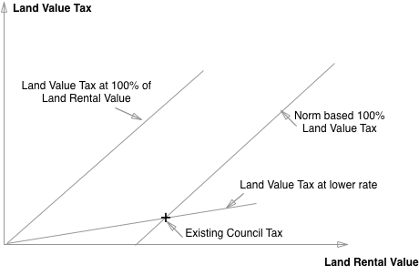

# 100 Ideas to Make Capitalism Beneficial

# 0. Overview
### Abstract
This book is about making our economic system beneficial, using the tax system. The tax system raises revenue for the government to spend. But the *way* in w-hich taxes are raised is crucial. If taxes are raised in a way that taxes surplus (a general term encompassing rent, profit and wages above some threshold of 'well off') and externalities, then we argue that the tax system will correct the distortions in the system. Whereas if we have a flat tax system, taxes will simply raise the cost of business and will be largely passed on to the consumers. In a sense, taxation is a corrective to the system of property rights.

We need a tax and social security system that works. It should be simple and unavoidable; tackle environmental problems; promote national wealth creation; and it should be set up for the benefit of the people: i.e. it should consider the British people as 'shareholders' rather than 'customers'. 

An unavoidable tax system is one that is based on an inelastic tax base. this is one that cannot be avoided. What this means is that it is essential to consider the elasticity of the factors considered. Broadly speaking we should tax things that that can't go away when they are taxed; as well as things that we *want* to go away when taxed. When considering corporate profits, personal income, carbon emissions, and wealth, we should consider the best tax base that cannot be avoided. Simplicity is also key: the more holes there are in the tax system, the more opportunities for avoidance and abuse.

Tackling environmental problems is key to what we are doing. A carbon tax can tackle climate change and can also raise income for a basic income. We argue for a *two parameter* taxes: where there is an incentive and a norm. The incentive is exactly what it says, the norm allows the tax system to be parameterised to fit existing patterns.

Promoting national wealth creation is very important. At present, the current tax system actually penalises wealth creation. In the new system, we will allow entrepreneurs a benefit for setting up in the uk. The proposed new system will not only encourage company formation in the UK, but it will also allow lower, differential taxes for deprived areas. A consumption tax base is suggested.

Promoting the benefit of the British people is also very important. At present for example, homeowners get a benefit from economic growth as the price of their houses goes up. But those who don't own a home do not. And those that own multiple houses get a benefit that is disproportionate. UK citizens would be given a small 'citizen's dividend'. This would be available to existing citizens and would be funded by a sovereign wealth fund and an externality tax. New citizens would receive this benefit according to the tax they pay into the system.

Finally, the tax system should promote a fair distribution of income and wealth. At present, whilst income is taxed fairly and progressively, wealth is not. This means that the wealthier you are, the more that capital income can be untaxed. We intend to turn around the tax system so that wealth is taxed more heavily. This means a progressive tax on housing wealth, and also a tax on corporate wealth. The latter tax would be allocated on a sales basis, so that if an individual wanted to locate themselves in the UK, they would pay the tax.

Why do we need a corrective for property rights? In summary there are three issues: firstly, there are externalities, second monopolies, third rent. These three issue give us the necessary correctives needed. We then continue to outline how those correctives can be applied.
### Contents
- Outline
- Abstract
- Philosophy of Benefit
- Shared Return in Land Value
- Purchase Plus Tax
- National Deficits: Capital Account
- Regional Money Coming In
- Game Theory of Global Cooperation
- Social Wealth Funds
- Central Dilemma, norm-based LVT and LVCs.
- Sociological Ideas: Oligarchy Event Horizon
### Outline of Article As A Whole
- The fundamental theory of capitalism
- Land and Monopoly
- Externalities
- The necessity for a corrective to property right
- Why flat taxes don't work
- Game Theory
- Unavoidable Taxes
- Automatic and Simple taxes
- The future of the economy

# 1. General Economic Ideas
## Idea 11: Capital Account Leading Current Account and The Balance Of Investment Opportunities
National deficits are bad because they involve transfer of future purchasing power over the economy. I can be serious too. So if the country is making a loss then foreigners become the landlord. This means that they are taking purchasing power. There doesn't appear to be any major mechanism for balancing things, except possibly the exchange rate. And that has its own issues, principally the J curve effect: that devaluing the exchange rate makes things worse before making them better again. That is the case with the exchange rate and could be the case elsewhere too.

The exchange rate of one currency with all the others is determined by the balance of demand for pounds and supply for pounds. This is also called the 'balance of payments'. If someone buys UK assets, for example a flat in London, they will need pounds to do it. Therefore this will increase the demand for pounds. This money that comes into the country would then be used to by goods and services from abroad. Thus *investment* demand for British assets.

X of the times put it pithily: the consensus is that a long run trade deficit is mostly to do with an imbalance between the supply of savings and the available investment opportunities. Quite. And the Investment opportunities here are financial investment opportunities (such as land). So remove investment opportunities and increase savings and you get a positive outcome.

What I call the Times Ed principle'. The Ed from the Times principle is as follows: 'the balance of trade is determined by the balance of desired savings to investment opportunities in each jurisdiction'. So if there are more 'financial' investment opportunities than there are savings, then capital will flow in. Whereas if there are more savings than financial investment opportunities then the opposite will be true.

What determines the current account deficit is the balance between desired savings and available investment opportunities. So if you remove 'pseudo-investment' opportunities, and create real investment opportunities, you should be able to encourage real investment in capital stock.

How does this principle, if it is true, matter? Well it matters if there are pseudo-investment opportunities in Land which draw capital in from abroad. And it matters if there is an intrinsic amount of saving going on or not. Thus if we save more and provide fewer investment opportunities for outside investors, it's likely that we will actually have an economy.

To Make Britain Successful, Favour Wealth Creation. One thing that the British state is failing to do is wealth creation. There is no distinction between wealth extraction and wealth creation. So it would be better if we did distinguish between these things.
## Idea 12: Why are Regions Poor? Because there is no money coming in.
I wanted to describe another principle. This one is more familiar from my history teacher. He said 'does it bring money into the area or not'? 

Not all exchanges are like for like. If money comes into an area in exchange for labour, then net wealth is gained. Some of that money will be saved by those in the area, other spent in the area on goods and services within it. This money then goes to others who themselves can spend it again. This process can be termed a 'local multiplier', after the idea of a Keynesian multiplier.

What this means is that it makes a difference the type of business that are brought into an area. A manufacturing business typically sells nationally and globally. This means that it receives money from around the world and spends it somewhat locally (once the costs of outside supplies are accounted for).

This principle has been at work in the improvements wrought in Preston. Preston has had a new approach to public procurement: local first! What this means is that local goods are preferred in the public procurement process, rather than giving money to companies outside the region. What this also means is therefore that instead of spending power leaking outside the region, it stays put.

This principle can be applied to lots of regions of the world. For example, in the Greek economy, one way to improve things is to ensure that aggregate demand does not leak out. So, restricting imports into Greece is really important.

It also relates to currencies that create their own demand (see separate article).

And it also relates to the question of where to locate strategic industries. Perhaps the domestic financial industry could be moved from London to the North of England e.g. Leeds. Or parts of the military moved from Salisbury to north Yorkshire. Or the civil service to Birmingham. Each move really improves things because it does not just give jobs to an area, but also the follow-on jobs associated with the money that is spent.
## Idea 13: Structure Global Cooperation and Competition with structures compatible with global good

Global cooperation is hard. And there are many dimensions to cooperate over. In the tax system, we are concerned with two particular aspects. 

First, we are interested in the so-called 'race to the bottom' with global corporation tax rates: the idea that it is in each country's self interest to reduce corporate tax rates. Unfortunately, this means that we may be faced with a 'race to the bottom' which means that corporations are not taxed well. Corporations are merely agents of their owners, intended to make their owners richer.

Another second example is climate change. If, by assumption, it costs money to tackle climate change, then we might assume that there is a 'tragedy of the commons' or 'prisoners dilemma'. This is a tragedy of collective action where the incentives of the individual players are different from those that provide a good collaborative outcome. Firms and individuals do not pay the full social cost of pollution, and so they pollute too much. It is easy to apply this model to climate change. It is assumed to be costly to tackle climate change; and so individual countries do too little climate change mitigation.

Tax affects both of these issues. Tax can reduce the return to ownership of companies. Of course this depends on whether and how the tax is passed on: what is the tax on the margin so to speak. The margin must not be taxed, or else the tax will simply be passed on to the consumers in higher prices. Whereas, if the rent is taxed, this should not be passed on.

Depending on the incentives involved, there may be a race to the bottom or not. In the current system, countries have an incentive to reduce corporate tax rates in order to attract more companies to the country. That's because companies can switch activity around, and the country will get two benefits: first they get the benefit of the activity switching to the first country economy they get thew benefit of the increases tax revenues.

The reader will be familiar of the informal definition of profit which is Sales-Costs. In the case of the current system, the sales would be defined as global sales and the costs likewise. This includes for example, brand licensing fees being sent to offshore subsidiaries. Thus high tax jurisdictions get loaded with costs and low tax jurisdictions with profits.

I propose a different system. I propose that instead of companies being taxed based on the normal accounting definition of profits, instead they would be taxed based on a different system, namely the following formula: UK Sales-UK Taxable Costs. 

The advantage of this approach is it actually encourages companies to locate costs within the UK. By doing so, they get more deductibility. Whereas if they are only selling into the UK, they will get charged the whole amount, by locating taxable costs in the uk they will get the whole benefit of deductibility, and therefore will only pay tax on the overall margin.

Capital investment could also be deductible, as it is in this 'cashflow tax' system. So this means that a higher rate will lead to more investment too, because the incentive to invest is that much higher. Of course, the capital equipment needs to be genuine and it needs to be long lasting. But that is already effectively checked in the existing system.

A similar system can be given for carbon. In the existing system, carbon is taxed only with a carbon floor price, in the ETS compliant systems. In the new system, a carbon tax would be combined with an output subsidy so that the net effect of the system would be neutral in terms of the price of electricity.

Then if for example steel would be taxed too, a tax on all fossil fuel inputs to the steel process, plus a tax on electricity (equal to the subsidy price). Then an output subsidy on steel equal to the money raised per unit output.

Finally, a tax on consumption, This would include a steel tax but also electricity and (again) fossil fuels consumption. As consumption does not have an 'output' per se, it would need to be compensated in another way. The obvious way is to give a per capita payment, and this would be the system in the long term, however in an interim period, I think it might be better to also give the option of a rebate based on historical usage.
## Idea 14: Profit Seeking and Effective Demand
Division of labour with taxes and with some profit seekers.

In this second case, there are people that want money for their own sake, rather than for the sake of saving people time. In this case, one person exchanges labour, the other sells labour but does not purchase it.

Let's say there are two people in our economy: Person A who wishes to accumulate and Person B who wishes to be balanced.

Nobody wants to go into debt. But the problem is the desire to accumulate on the part of person A is inconsistent with the desire to be balanced on the part of person B. Person A's desire to accumulate is antisocial if there is no non-zero sum asset that he can accumulate.

Person B is subject to the zero-sum dynamics of person A. Person A is subject to a dilemma: either engage in exchange and subject herself to diminishing wealth (which she does not want), participate less (because actions that don't lead to net losses are not available), or find a way to participate that is 

The exchange features of the economy use asset features to intermediate them. But efficient exchange 
## Idea 15: Credit Guidance
It would be good to control the flow of new lending created in the economy. This could be done through credit guidance which would give those parts of the economy that need funds, more funds in the case of economic depression, and less funds if .
The reason for putting forward credit guidance is that it allows the splitting of credit creation from money creation. Credit creation is closely linked to the growth of GDP, as is money supply creation. Which is the more important thing? Well credit sort of is money.
## Idea 16: Three Ideas of Public Entrepreneurship
- R&D
- Land
- Currency
## Idea 17: Coupons, Tally Sticks and Fiat Currency: 
Money can be gold or a claim on gold. But for a moment, let’s discount that possibility and deal with four other types of money or pseudo-money: monetary coupons, physical coupons, tally sticks and fiat money. Let’s consider each in turn. 

Coupons entitle the bearer= to some goods and service. Monetary store coupons (for example book tokens) entitle you to some monetary quantity of goods in a particular store. Discount coupons cannot be used for all, but only some portion of the total. Physical coupons would entitle you to some physical quantity.

What are tally sticks? Tally sticks are a means of borrowing. So, tally sticks in grain consist of a borrowing contract for one party to borrow off another. Usually the authorities (e.g. the government) would be the borrowing party. And they would pay back the quantity plus interest at a later date.

Finally, consider fiat currency. This has usefulness in so much as it has a value to others.

# 2. Principles of Taxation
## Idea 21: What is the Philosophy of the Current Tax System?
Imagine that the government was a business? Who would be the customers (those that pay for services)? And who would be the owners (those that get the benefits)?

I claim that the philosophy of the current tax is follows. The taxpayers are customers and they pay a charge for public services. 

Whereas implicitly, the *beneficiaries* are those getting rich from the system are the landowners and offshore owners of companies . So, for example, if a new public service such as a metro line, is introduced, then typically landowners can put up rents. Unless that rent increase is itself 'passed on' to the government, someone gains (the landowner) and someone loses (tenants and tax payers). This seems unfair. So Landowners and owners of large companies are (implicit) beneficiaries (dividend receivers). You also Get benefits if you are offshore: if you are a non dom.

I want to do something different. In the new tax system: Landowners and monopolies selling into Britain are the customers. Why? Because they receive benefits from the country. If a company makes profits from Britain, then those profits are a benefit of the system of law that we have in this country.

So the philosophy behind the system is one of tax by default, but then give allowances to residents.
## Idea 22: The problem with flat taxes 
The problem with flat taxes is that they affect the marginal activity. That means that they affect prices. Whereas taxes on surplus do not. So if you tax marginal activities, it actually doesn't affect the surplus at all. The rich still get richer, because the prices that they can charge go up.

Division of Labour without Tax: I can exchange my labour for someone else's. If someone can do something for you cheaper, it makes sense to exchange it as much as possible without tax. 

Whereas companies can develop complex supply chains, and individuals can develop complex supply chains, companies are only taxed on net income whereas individuals are taxed on gross income.

It might be better to switch to tax rent in general, that is the income over and above that which a person is able to work. 

Maybe we should eliminate income tax on payments into deprived areas and to deprived people.
## Idea 23: Comments on the Mirrlees review. 
Interestingly, the review suggests rent is the surplus over the factor rent of an economic factor. 

The justification here appears to be that factors are all heterogeneous and we cannot therefore distinguish what is rent from the fundamental nature of the commodity.

But land rent arises from the fundamental advantages of a piece of land. It is the surplus of total product over that attributable to effort.
the
In classical economics, labour is itself a 'produced' commodity, with its own price, subsistence labour.

Another thing was about the treatment of  savings. So income is taxed on the 

There's much discussion of finance. In particular, there is a discussion of the advantages that debt financing have over equity financing, and ways to reduce this.

This relates to discussion of a cashflow tax. There is discussion that the corporate tax is source (origin) based, whereas Value Added Tax is destination based. There was discussions of whether any of this can be changed. 

It seems that a cashflow tax was considered to have some issues with regard to financial transactions. The possibility of including finance in a cashflow tax was considered to be .

There are lots of potential issues with taxation, but most serious, perhaps, is the treatment of finance. Under cashflow taxation we need to make a distinction between financial and non financial flows.

Ideal tax literature: what is the best tax (a tax on rent and externalities); what is the best income tax (a tax on 'quasi rent' or a low rate of income tax)

Assume you can't tax rent; how should you tax the different land areas in Ricardo's model?
## Idea 24: Premises of RTW: Corrective for Property Rights
Why do we need a corrective for property rights? Well there are three issues: firstly, there are externalities, second monopolies, third rent.  These three issue give us the necessary correctives needed. We then continue to outline how those correctives can be applied.
Assumption 2: The tax system should tax monopoly assets.
Assumption 3: Income related price for some goods.
## Idea 25: Unavoidable Wealth Taxes
Currently income is taxed progressively, but wealth is not. 
Taxpayers living overseas and with access to good accountants can avoid tax

Similarly, the ‘euthanasia of the rentier’ post war (low interest rates and inflation), reduced returns to monetary assets (bonds). But the landowners and the owners of large corporations usually have index linked return (so inflation doesn’t erode wealth). So they actually receive capital gains as interest rates

This means that the rich, can avoid taxes and preserve wealth and even make capital gains.

A paper by Michal Kalecki just after the publication of Keynes' 'General Theory' a wealth tax does not reduce the incentive to invest. It should also *increase* aggregate demand.

A land and monopoly tax actually enhance competitiveness
Direction of travel: Fair, progressive and unavoidable unproductive-wealth tax

A reduction in the expected return from wealth. So, what should have been done at the time of the financial crisis was to tax wealth at the same time as taxing money (through lower interest rates).  Taxing both has the advantage of fairness.

Wealth taxes have the advantage of shifting scarce money and credit off unproductive speculation and onto productive lending. This could have huge benefits but it is hard to assess precisely. We can simply look into those areas that have done this (for example Denmark in the 1960s, and see the likely change in economic activity that was produced)

Interestingly, Islam seems to have quite good rules for economics. It does not allow lending at interest and it taxes wealth. Different forms of wealth are taxed differently. So property wealth might be taxed at 2.5%, second properties at 5% and mineral wealth taxed at 10 or 20%. In a sense both the christian system of Tithe and the islamic system of Zakat are self-consistent.
## Idea 26: How Investment Can Be Improved By Taxing Land and Monopolies
Economic rent can be defined as the difference between what a factor is able to be put into production and that which it is willing. Investment is a crucial element of a successful economy. The tax system needs to help people to invest more.
## Idea 27: Automatic Tax
This paper describes a new concept for the implementation of a progressive income and corporation tax, the 30/30/30 system

This paper describes an implementation system for a progressive income and consumption tax, the 30/30/30 system. The goal of the tax is to collect tax automatically, with a top income tax rate of 51%, in line with progressive countries with stable wealth distributions such as Denmark.
The automatic system works like this: there is a default ‘high tax’ mode that works for all transactions not registered in the system. In this case, transactions between all UK bank accounts are taxed at a standard rate of 30%. If you wish not to pay this tax, you need to register in the system as a bona fide UK resident. In this case you get a large deduction: for example a lower rate for the first £50,000 of income and expenditure.
So everyone is incentivised to join the system. 
Now certain transactions, although ‘automatically’ taxed at 30% can be in actually exempt. The simplest example of this is a personal allowance. In this case, up to some threshold, income and expenditure is exempt from taxation. But this is only achieved if you are a registered individual not if you are a company or a super rich non-dom.
The exact setup of the system depends on what is wanted. This implementation can create a consumption tax an income tax, a flat tax, a progressive tax. 
What are the advantages of this system? It is automatic. By default, transactions are taxed. And it allows flexibility in terms of the tax system it can implement.
## Idea 28: Cashflow Tax
A cashflow tax is a tax on the difference between domestic (uk) sales and domestic (uk) wages and supplier costs.


Let me explain. Profit is defined as the difference between sales and costs. But this is an accounting definition, subject to manipulation by every clever accountant. There is a simple way to do better. The cashflow tax.


This still applies the same principle to UK costs. They are defined according to the source principle. That is, if a business activity is located in the uk, it is deductible as a cost.
If a revenue is made in the uk from uk sales, it counts as a revenue that is taxable.


What about other EU jurisdictions? Costs from these countries would be half deductible.

What about tax havens? These countries would not have deductibility. Payments to these places would be fully taxed.


Why we should consider it.
A cashflow tax is interesting because it provides an incentive to locate for tax purposes in the UK

———

Planned future post: Cashflow Tax
describe what a cashflow tax is:
A cashflow tax is a tax on the difference between domestic (uk) sales and domestic (uk) wages and supplier costs.


why we should consider it.
A cashflow tax is interesting because it provides an incentive to locate for tax purposes in the UK.




Planned future plan: Corporate Taxation
why we should tax companies
why international avoidance is a problem
what are the possible solutions to the problem

\

# 3. Land Value Tax
## Idea 31: The Central Dilemma for LVT: Getting Benefits without High Transitional Costs
I want to talk about four related topics:

First what I call the central dilemma. I claim some of the most important arguments for LVT work best when the marginal tax rate on increases in rent is 100 per cent.

Yet I also claim that a 100 percent tax on land rent is also likely to be damaging and dangerous.

I offer two alternative resolutions: called norm-based taxation and Location Value Covenants.
## Idea 32: Shared Return in Land Value

With corporation tax have a concept of shared return: 100% of profit is shared between the company and the government.

Now with land value, have the concept of sharing 100% of the land rent return shared between ‘autonomous local community/parish county level’, municipal authority and the country. 
So, when we are taxing 100 per cent of the rent increase in a locality (see later), we will share that return between the locality and the government. There could also be rewards for 'keeping your street clean': a payment made to residents of a road based on the improvements made to those roads.

This relates to a wider idea. We have this notion that you calculate a land value via deductibility ..
This could also be extended to a notion that the Ownership of value/deductibility of cost of improvements relates not just to individual but also socially.
## Idea 33: Norm-Based Taxation

Transitional Justice: Often arguments for LVT consider justice from a 'desert island' perspective: what would be an ideal tax system, abstracting from current situations to consider what would be best in an ideal world. Often therefore people argue for a 100 percent land value tax. This leads to what I would say is the central dilemma of Land Value Tax: whilst these theoretical desert island arguments for the tax are extremely sound, for many of these arguments to really work, the rate of the tax should be close to 100 per cent; on the other hand a rate of close to 100 per cent is likely to have severely negative political, financial economic effects, not to mention significant unfairness.  This creates a dilemma. Typically, proponents then have to pick one of three options: either ignore the transitional issues and argue for radical tax reform anyway (for example arguing for 100 per cent of *current* rental values, but argue that rents will go up anyway, assuming that 100 per cent of tax cuts are passed on in rents), or argue for a slow land value tax introduction, or say that these issues can't be fixed and therefore argue for some other policy.

Here I take a different tack, arguing that both arguments are true: that there is a strong case for a 100 per cent tax on *something* similar to Mill's 'unearned increment' and that a 100 percent tax on all land values is likely to have several disruptive effects. However, I think these issues are not fatal to the idea of LVT, and there are at least two options, which I call norm-based LVT and location value covenants. I am not convinced these are the best names for the policies, perhaps we can come up with better ones! In brief norm-based LVTs is a way  to tax the unearned increment on land rent; whereas LVCs are a way to swap debt (such as mortgage debt) for a perpetual payment similar to a land value tax. In the case of LVCs, on the portion of the land value previously covered by a mortgage, the interest payments would be replaced in the long term with a Land Value tax payment. 

In the case of norm-based LVT, this would be a transitional 

There's another concept that I want to put forward. Land value creation can happen in many ways, by infrastructure development and by general economic growth. Generally the strategy should be to maximise the welfare of the people. The question of ownership of land value gains is crucial. At present, private individuals own land value gains. The plot-based principle can at least in principle be extended to larger areas. Community own any developments at the relevant scale.

Say there are two roads next to one another. One road has residents who take care, pick up litter, and make nice flowers to make everything nice. What tax should people pay? If there is a similar road next door with equivalent features but the residents do not take  care of the road as much. Should the nice use of the road be considered an improvement for land value purposes?

I would argue that 'community improvements', for example the value increase due to litter picking could be deductible from Land Value Tax in exactly the same way that personal improvements to land are deductible.
## Idea 34: Location Value Covenants
Back to LVCs. What are they and where would the money come from? I think it would be helpful to have local ownership of any profit from land value investment. These banks would be local institutions, with support from the bank of England. The LVC would be a part of loans which could include other components.

So here is the LVC concept in brief: you lend some money from a bank to an individual. The loan is tied to the land not to the individual (hence it is a covenant rather than a normal loan) but continued ownership of the land is contingent on paying the covenant regularly. After an initial implementation period matched closely to existing interest rates, the interest rate would approach the rental yield on the underlying property.

So the key variable defining a LVC is the percentage of the underlying land value that it covers. 
## Idea 35: Community Part Ownership
We suggest a switch to swapping out mortgage debt for social purposes. So we would remove mortgage debt by the following procedure:
1. A tax on mortgage debt (so a bank balance sheet tax on unproductive lending).
2. Mortgage to land sale. 
3. Tax relief on sold land
## Idea 36: A Home for Everyone: A Rhetorical Model for LVT
I think a good 'rhetorical model' for LVT would be 'a home for everyone'. That is that we should subsidise the financing of the first home with higher taxes on the second and further homes. That way we get everyone a home. Then we make clear that second and further homes would be taxed further. 
And there would be a wealth fund for those people swapping out of being a landlord.
It's quite possible that this model which is based on the underlying values. So therefore there should be a 'memo' which would actually contain the rhetorical model of LVT. 
## Idea 37: Deductibility of Community Improvements and Sharing Profits

There's a need for 100 per cent tax on increases in land rent. 
But it's also important to carry the principle of deductibility into the realm of community improvements.
That would mean that improvements for an area (for example, a well functioning neighbourhood watch scheme, or the lack of litter), would be deductible. Deductibility of community improvements means that people do not have an incentive to denigrate their own area. 

The default would be 1/3-1/3-1/3 split of land value increases.

In effect there would be two assets: you have the appreciating bit on top, which would be split by thirds, to the community, municipality and the country. Before that, any deductible assets would be split out.

Snd then you have the static wealth remaining, which now has a form similar to the static wealth in consols.

This could also be taxed, progressively, in some way or another

# 4. Norm Based LVT
## Idea 40: Intro
This paper introduces a new form of taxation, norm-based taxation. Whilst a simple proportional tax has one degree of freedom (the tax rate) norm-based taxation has a marginal tax rate and a norm. In the case of replacing council tax with a land value tax, the norm would constitute a payment to equalise the old tax amounts with the new amounts. In subsequent years, two changes would happen: first the tax paid would be responsive to the change in land rents, with a 100% tax on *increases* in land rent; second, the equalising payment would be transitioned to a fair basis. In so doing, the economic effect of the tax would be implemented immediately. [On the other hand, the actual tax paid by individuals would not change that much in the short term, and over time the changes would be reasonable being proportional to changes in rent plus a transitional change proportional to ability to pay.
## Idea 41: The Challenge of Introducing a Full LVT

The fundamental argument for LVT rests on two basic arguments: LVT is beneficial to the economy, and LVT is fair. One might then argue for a _large_ LVT or even a _full_ LVT, as did Henry George. The problem then, however, is that the fairness and benefit of an immediate 100% LVT in the _short term_ is debatable at best. The likely effect of an LVT will be increased payments for tax in high land value areas. These are also likely to cause a reduction in the capital value of land, and of property in total.

To capture the full benefit of LVT, one needs a tax that is responsive to land rental values, so that a large percentage (ideally 100%) of the increase in rents caused by, a new railway station, are captured by the public purse. But imposing a 100% LVT would likely massively reduce house prices, leaving many in negative equity

Furthermore, many have large mortgages, and people would now be paying both rent and a (presumably large) LVT in high-property price areas. Defaults on the mortgages would combine these two effects: the cost of the tax would cause financial problems with those with large mortgages, leading to more repossessions, and the decline in capital values would lead to difficulties for banks repossessing the underlying property.

A 100% LVT can also be argued to be unjust. Consider someone who has saved diligently all their lives, paying income tax as they go. Then imagine a new government introduces a 100% LVT.

Not only will the individual have paid tax on his income, he will have also had the land component of the financial value he has saved confiscated by the government.
## Idea 42: Evidence on LVT

[Add evidence here from Dye and England perhaps]
## Idea 43: Overcoming the Challenges to LVT

Political objections can be reduced by the adoption of various devices to mitigate or remove the perceived (or actual) loss to most voters and interest groups by adopting one or more of several devices that have been used in other tax jurisdictions:

We suggest a proposals here to overcome the political challenges, to replace council tax and business rates. This proposal is related to J.S. Mill's idea of trying to capture the 'unearned increment' in Land Values^[@mill1848principles], as opposed to appropriating the full value.
## Idea 44: Underlying model of house prices

Land value tax uses the assumption that the rental value or purchase price of a building can be split into two components: the land price and the building price. Such a split can be estimated by taking the rebuild cost and subtracting it from the total purchase price to get the land value. Likewise, a building rental value can be found by multiplying the rebuild cost by an assumed yield. This can be subtracted from the total property rent to get the land rent.
## Idea 45: A New Idea: Norm-Based LVT

The obvious answer to the problems of transitional justice and financial stability is to introduce an LVT slowly and at a low level to begin with. This, however, captures little of the real advantage of an LVT which is to remove speculation. Norm-based taxation is based on the idea that it is desirable to have the full economic effect of an LVT without changing the _initial_ level of tax from existing levels.

*Figure 1: Norm-based LVT*

Norm-based LVT would be a 100% LVT, combined with a regular lump-sum transfer, usually from the government back to the landowner.^[In a low land-value area, where existing council tax is more than that due under a 100% LVT, the adjusting payment would be in the opposite direction: in this case, from the landowner to the government.] Whilst proportional taxation (of anything, e.g. a LVT) has _one_ rate – the conversion between the underlying quantity and the tax paid – norm-based taxation is defined by  a tax rate and a norm. In this case the regular transfer would be made to initially equalise the tax paid in the new system with the tax paid in the old system. So therefore, if there is no change in underlying rental values, then the tax paid in the new system would be the same as that paid in the old system. It is only if rents _change_ that the tax paid would adjust. Over time, incomes tend to rise and with them, rents. You would therefore expect that this LVT would over time raise more revenue. It would also prevent land itself from conferring excessive financial returns.

Norm-based taxation distinguishes between two different forms of revaluation: initial revaluation and indexation. _Initial revaluation_ is the process of updating the values of property such that they are accurate to the present; _indexation_ is the process of updating those values on an on-going basis. Under the norm-based system, an initial revaluation would be completed but would not change the initial tax paid. Rather this revaluation would be used to establish a baseline valuation. Market rental values would be indexed using market data to update the tax paid over time in a dynamic way as rentals increased.

Initially, the LVT would be used as a like for like replacement for Council Tax and Uniform Business Rates., except that it would be payable by the landowners rather than the tenants. The norm would be set such that the new taxes would be equal to the old ones. Thus the tax would be created as a 100 per cent LVT plus a payment (usually back to the landowner, although in low land value areas could be in the opposite direction). 
## Idea 46: Existing Taxes on Property
The main taxes on property are as follows. There is council tax, which is based, in England, on the valuations of 1991. The other countries of the United Kingdom have different systems (add this here).

Council tax is paid by the residents of property

Then there is uniform business rates, a system of taxes on the rateable value of business premises. This is applied at the same rate throughout the country.

There is also stamp duty paid on houses. This is paid on the entire purchase price when transacted, but at different rates. 
## Idea 47: The advantage of a causal approach to valuation
It might be possible to develop a model of valuation which actually develops a causal approach to valuation that can split out the contribution from different elements. So for example, if prices go up, this could be due to a number of factors:

- Reductions in interest rates
- Increases in wages, nationally and in the local area
- New transport links and other new infrastructure
- Fashion and local property bubbles.
With a causal approach, it's possible to model the effect of an improvement of some kind. If the agency responsible is a public institution or public bank,

### The treatment of leasehold with non-market rents

Occasionally, there will be a block of flats which pay a peppercorn rent to the freeholder. This rent is not a market rent for the land. As part of the valuation process, therefore, there needs to be a valuation of the different claims on the land. (Could this include a mortgage??))

For example, a piece of land in Scotland could separate the fishing rights, mineral rights and shooting rights of the individual parts. Therefore it's important to note that what is being valued is a particular set of rights. Often the rights to land's rent all come together, as with a standard freehold. But sometimes they are separated. In this case, the various owners of the different parts would need to have their interests separated. In a typical peppercorn rent situation, the de facto owners of the land rent is the leaseholder. Where there is such a difficult situation, the initial payer of the new LVT would be the existing Council tax payer, until the point of rent revaluation.

### Provision for passing on the tax
Since the tax is now paid by the landlord, in some cases, he will want to pass on the tax to the tenant. Independent of the argument as for rent controls, there is a case for allowing the landlord to do so. The reason is to avoid distortions between those properties that have had rent revalued and those that have not.

### Splitting the revenues

One critical feature of the scheme is the splitting of the revenues. What do I mean by this? Well, it's important to reward each party for the improvements made at each level. There are really three levels: the national level, the municipal local authority (unitary and city) or authorities (district/county, city/county or borough/GLA), and the local area (road, parish, residents association). The general question is: how should the increase in revenues be shared? There is really two possible answers to this which we consider here: the revenues could be shared 50/50, or the revenues could be modelled as to where exactly they should accrue. We will think of these two options further as we go.

Let me explain the 50/50 approach. In this approach, as land values increase, the tax charged goes up. This revenue goes to two places: first it goes to the local authority, second it goes to a central pot which gets redistributed to poorer areas.

Now the other approach. In this case, there is a causal model which describes each area. Each level of society is responsible for 100 per cent of the improvements that this level has achieved. In the local area case, improvements that are the result of local activity are paid for by reduced council tax. Improvements that may be paid for by the local area are refunded.

Another approach is not to tax the specific improvements in a particular area, but rather to index the whole rent of a whole area.

That would mean that improvements for an area (for example, a well functioning neighbourhood watch scheme, or the lack of litter), would be deductible. Deductibility of community improvements means that people do not have an incentive to 

### Advantages of the Norm-Based Approach
The main advantage of the norm-based scheme is that it captures, as much as possible, the incremental increase in land rent for public purpose. So if the state invests in upgrading the local infrastructure, the 

### Selling the Scheme
The scheme could be called 'Fair council tax', because that is what it is. Council tax (or its replacement) would now be paid on the increment in land rent, and not arbitrarily increased according to whatever the central government allows or the local government needs. In the long term, the residual wealth should be taxed also. 

# 5. The History Of Economics
## Idea 51: The Big Economic Problems

There are three big economic problems which are broadly, how big is the economic cake (in the short term, demand, in the long term, growth), how do we decide what goes into the cake (allocation) and how is the cake divided (distribution). The first is a problem of growth: both long term (the problem of economic development) and short term (the sufficiency of overall demand); the second is the problem of allocation through prices (the intersection of sectoral supply and sectoral demand), and the third is the problem of distribution of income between sectors and classes (how market power influences profit, wages and rent).
## Idea 52: Adam Smith

Adam Smith was not the first economist, or the first thinker to think about economic problems, but his Wealth of Nations was perhaps the first truly great economic book.

### Economic Development

His leading theme was economic development: what influences the long term level of income of a nation? Despite the title of the book, he was less concerned with the long term stock of *wealth* than with the size of the flow of what we would now call national *income* (GDP). 

In contrast to the mercantilists before him, he did not think the prosperity of a nation was determined by a positive trade balance or the amount of gold it could earn. But in view of China's success with a sort of Keynesian mercantilist state capitalism, we might think again.

### The Laws of The Market

Like his earlier book, The Theory of Moral Sentiments, he was concerned with a general problem, if, as assumed, that human beings were self-regarding, how did we see a measure of social cooperation both in terms of morality, and wide scale economic development. This is perhaps a wider puzzle: how, if there is no director can the actions of many be still coordinated?

Smith argued for the laws of the market: humans were driven by self interest, but that self interest was regulated and moulded into social good by a *process* of competition (and yet that process of competition was itself interrupted by cartels and monopolies).

These laws of the market in turn led to overall laws of motion of capitalism itself: the law of specialisation, the law of accumulation, the law of population. Unlike his successors, Malthus, Ricardo and Marx, Smith was in essence an empiricist and an optimist. He agreed with Malthus that increased wages would lead to increases in population, but unlike Malthus he considered that wages could run ahead of this tendencies if there was economic growth. Like Ricardo he understood that land is a monopoly asset. Like Marx, he saw the tendency of the rate of  profit and of interest to fall.

### The Division of Labour

Smith argued that the growth of income was determined primarily by the division of labour. He has little to say about the nascent industrial revolution in the UK at the time, which was just getting started.

Smith argues that the division of labour is only limited by the extent of the market, and thus low transport costs are important.

### The Price of Things

Smith distinguishes between *use value* and *exchange value*. (It should be noted that in Smith's day, utility would correspond to total and not marginal utility, and therefore corresponds to use value. These writers saw no relation between utility and demand.)

Focusing now on exchange value (or price), he considers two different types of problem: what determines price and what is the best measure of economic progress?

First to price. So why are prices as they are? Of course, Supply and Demand. There are of course 'market prices' or short run prices, and then there are 'natural prices, also known as long run prices. Smith is essentially interested in explaining what those long run prices might be. What governs relative scarcity? In the short run, supply and demand. 

The long run price is the sum of all payments needed in making it. In the long run scarcity is governed by the cost of producing something. This can be interpreted as a special case of the Marshallian theory, where price is determined by supply alone.

Hence natural price is made up of all prices of the inputs. So how are the prices of productive services determined?  The 'natural price' does not vary with its rate of output. In other words, Smith assumes constant costs. Smith has no clear theory of rent or of profit, although he does make clear that rent is a monopoly price, unlike the other two. 

He does not assume that the cost, and therefore the long-run price, of something is purely determined by the amount of labour that it required to produce it. Nevertheless this is true in a simple case. Smith constructs a simple model (hunting beavers and deer), where there is only one factor of production. In this model, relative prices are governed by relative labour costs alone. The purposes is not however to argue that all costs are labour costs but to show the conditions under which this is true.

### An Index of Social Progress

Now, what is the best measure of social progress? We are familiar in our times of the idea of GDP, which is the sum of all the goods and service in an economy added together using their market prices. (It is also equal to the sum of all payments to wages, rent and profit.) Economists tend to correct for the effect of inflation by dividing the money GDP level by an estimate of the price level, to come up with 'real GDP'. Smith went a step further: like Keynes, but for a different reason, he divided GDP by the money wage rate, to come up with a measure of how much labour the product of the country could command.

- As the productivity of labour rises, prices would normally fall relative to wages. 
- Smith's choice was driven by conviction over the nature of economic welfare.
- Smith was driven by the idea that related improvements in welfare with reduction in the sacrifices required to obtain a given flow of income. 
- An individual's wealth was associated by the ability to command other people's products; but the pursuit of of wealth under conditions of division of labour is motivated by the desire to save ourselves disagreeable labour and impose it on others.
- The real value of a commodity is the psychological cost of work to the individual.
- With the rise of property income the coincidence is broken: the value of a commodity measured in current wage units now exceeds the value embodied in its production by the whole value of profits and rents. 
- Nevertheless, the 'real value' or effort price of a commodity is still measured by the units of the 'toil and trouble'.
- A standard of measurement must itself be invariable in order to accurately measure the changes of the thing measured.
- Defended a labour standard of 'real value': he thinks about what is a good labour unit.
- The wage unit in real terms is invariant through time and reflects an invariant disutility of labour.
- Labour commanded theory provides a positive index of welfare. The higher the real price of a commodity in wage units, the better we are off for having.
- Thus welfare is a simple sum of population.

Extension: 

- If we now drop the idea of a constant real wage rate, Smith's argument may produce a *negative* index of social welfare. The number of current wage units commanded by the total product may tend downwards, and that's a good thing.
- A fall in the amount of which a labour which a commodity commands in exchange is the reciprocal of the real wage. We are better off if we work less to procure one unit of output.
- A major element of the improvement of welfare is the falling effort price of income.
## Idea 53: The Worldly Philosophers

The economists are diverse. Their ideas are powerful, perhaps more powerful than vested interests? (Or perhaps the vested interests have now taken over the ideas ).

The Economic Revolution

In the past, profit makers were outcasts; kings wanted treasure; landlords wanted land; the average people wanted to survive and then be left alone.

Religious Background
History of Usury. When there was a military victory. Every 49 years, debt will be written off. In Islamic law Zakat of 2% was given. 50 year full repair and lease in Mosaic law is similar in effect to the Zakat. Did the Jubilee prevent a long term inequality of wealth? Jubilee was never put into effect?! Fear of leaders in 
Magnificat: hymn to the future by Mary.

Tithe system, strong religious pattern: everyone contributing to the church. The tithe was a dividend paid to the landlord. If you can’t pay your mortgage, you still need to pay.

Two versions of Moses’ law (Leviticus): one forbids usury (catholic church and Muslims); the other is much more specific: you must not enslave a man more than seven years, and you must return it to his family every 49 years. When the jews were expelled: prevented from lending to others, but not to each other.

He doesn’t deny that trade occurs. The maximising wealth perspective was new. There was a Hobbesian arms race between oligarchs. Serfs become desperate; greed on the top led to wealth maximising homo economicus. Early technology from the enlightenment, concept of land which is a disposable product that you could sell or buy. Concept of labour: once there were people that had nothing but labour. Get as much wealth. 

Well, water pump etc. makes things possible.

Changed society from rules of manor to the commercial age.

Reductionist and analytical laws; economics coming up with a parsimonious description. Society at the time was different.

Work was an end in itself, encompassing reward, sustenance and social role.
The 'market' as a concept had not been invented. Rather it was tradition and command which ruled the world. Like the ideas of tradition and command the market was a  mechanism for sustaining a whole society.

Profit
In the past, profit wasn’t maximised as much.

Profit versus profit hunting. You can have profit without profit hunting. We may not need profit in the same.

Pace of change
Marx was only 80 years after Smith.
Trains: 40 years. Speed of change was due to technology.

A new vision came out, and a new philosophy.

Enclosure
The industrial and commercial ages were born in agony of enclosure. Slow decay of religious spirit., material changes and particularly the coming of science. National political units were becoming more important.

The rich wanted the wool, and so they drove the poor off the land.
Enclosures in Scotland: the leader of the clan regarded the number of people he could get into it power. But when money came, he wanted land and not people. 

The pamphleteers, including Thomas Mun, director of East India Company, called the ‘mercantilists’ by Smith, saw the increase in gold to be the benefit of a society. 

Nature of Modern Man
Modern man, a more egotistical, atomistic, and less social conception, was being born. Thomas Hobbes argued that a strong state – a ‘Leviathan’ -  was needed to stop life being 'nasty brutish and short’. The world of Adam Smith was one where commerce was becoming to be seen to be crucial for national vitality.

Enlightenment belief in rights, that got extended. 
Rights driven system as opposed to obligations driven system. 
Adam Smith: The Wealth of Nations

Adam Smith was Born 1723, ‘’ Absent of mind’ . Oxford wasn't then a great seat of learning;. He became a Moral Philosopher  in Glasgow and was a friend of Hume’s. Smith conceived of a ‘system of perfect liberty’. At that time, the brute struggle for existence: Mines; welsh companies of Ancient Britons paid a pittance; Looms, and ‘dark satanic’ textile mills.

In 1759 published a theory of moral sentiments. If man is self interested: from whence came the moral approbation and disapproval? Smith argued that  a third person, impartial observer perspective, observing the objective merits of the case, was considered to be the perspective that was the source of morality.

Rich aristocrat Townshend made Smith an offer. Smith became his accomplishment accompanied him on a tour of Europe. There he met the ‘Physiocrats’ such as Quesnay: who argued that wealth sprang from production and flowed through the nation from hand to hand like the circulation of blood. Only agriculture produced wealth. Manufacture altered its form in a ‘sterile’ way.

Smith altered this view to argue that labour not nature was the source of value. In 1766 the tour was cut short. 

1776: Smith’s Wealth of Nations was published. This book ducks nothing, fears nothing, minimises nothing. Not Hobbes' principle of sovereign power but the market. Wealth of Nations was a blueprint for an entirely new mode of political organisation.

Laws of the Market
The private interests and passions of men are led in the direction which is most agreeable to society. These laws of the market: rule his world, and Marx's and ours. Outcome of a certain kind of behaviour in a certain social framework will produce foreseeable results. Self-interest is a guiding power to drive men. 

The regulator is competition. Selfish motives of men are transmuted by interaction. Say a glove manufacturer raises prices: then competitor steps in.
If they collude, a manufacturer from a different system would step in. 

Also the market heeds society's demand for the correct quantities of goods. And regulates the *incomes*: if the profits of one area are large, others will rush in.

Impetus of self interest; regulator of competition.
How prices are kept from ranging away from the actual cost
How society can induce producers to produce what is wanted
Why high prices are a self-curing disease

If one pleases to do what the market disapproves, the result is ruin.

Does it work this way? 
In those days, yes, it was social free for all!

Does the competitive mechanism still operate?
Less so: the large size of corporations and labour unions weakens the market mechanism.

Direction of Travel and the Laws of Motion
In those days, much of England was a dogs hole, About 10% of population was poverty stricken. Smith argued that it was moving towards a positive goal. 

Specialisation and gain: the gain of production from specialisation led to universal opulence

The Law of Accumulation increased the quantity of wealth

The Law of Population: makes sure that wages don't rise to high.

The interaction: accumulation is rescued by population growth.

'Secular evolution': Natural end when division of labour is complete.

Role of Government
Three things Government should do:
Protect against violence and invasion.
Exact administration of justice
Public works: roads and education.

Problem is not government but monopoly
Evaluation
Bounded, careful, sober. 
Capitalists liked the book
Testimony to the 18th C triumph of order over arbitrariness and chaos.
Corporations too impersonal to muster drive to succeed
Abolish slavery- cheaper in the end.
Philosopher-psychologist-historian-sociologist.
Parade of riches anticipates Veblen.
Rational scheme:  intended beneficiary is the consumer
Encompassing the age.
Economist of preindustrial capitalism.
What has survived? 
Not the scheme of evolution.
These days: market system threatened by mega corporations. 
Laws of accumulation and pop upset by sociological developments.

Comments of Adam Smith
Different end points to the laws of motion of capitalism.

John Mill’s PPE: Mill’s discovery – the true province was production. Distribution is more of a choice.

Adlestone
Allocated to principle residences of Watling street. traditionally
Malthus and Ricardo
Obsessed By Population: 1700 5.5 million.  Declining? Political Justice by Godwin
Malthus: Essay on Population. Meagre future
Ricardo: 'Property ladder': more like an escalator.
High price of wheat. Cheap grain determined what they could pay their workers.
Corn Laws: Warring groups Landlord wins
Both agreed on matter of population.

70% of population of Saudi Arabia is under 30, 80 million population. Yemen, Pakistan, Uganda – huge proportion under 30, middle generation died – grandparents.

Haven’t cracked the problem.

Ricardo: Prototype (classes)
Workers: Self-restraint only solution
Capitalists: Save their profits and reinvest
Landlord: Unique beneficiary; Gained at everyone else's expense.

It is from the difference (between marginal land and productive land) in cost that rent springs
Capitalist is worse off. In a double squeeze. 

Compare Ricardo to Smith
In smith's world everyone became better off.
Smith didn't see land as a bottleneck to progress.
No shortage of fertile soil. So no margin behind rents would rise with population.
In Ricardo's world, *oOnly* the landlord stood to gain.
Worker was condemned to subsistence.
The capitalist found wages were higher and profits smaller

Henry George: understands the nature of urban land as opposed to agricultural land. Observed the process of development of urban land. City land was much more valuable land 

What Actually Happened?
Repeal of the corn laws rescued UK from Ricardian death trap.

Other Issues: General Glut
Malthus: problem of a 'general glut'
JB Say: Desire for commodities was infinite
Ability to purchase was guaranteed due to circular flow. Demand for goods existed, and the incomes to buy them existed too. But Malthus: could you hoard cash?

Questions of Economics
Malthus: How much is there?
Ricardo: Who gets what?
Smith/Neoclassical: What is produced?
Smith asked all (Also When/Where/Why?)
## Idea 53: Classical Economics

Classical economics, for example the works of Adam Smith and David Ricardo, typically distinguish between commodities that are scarce or inherently limited and those that are not; and are instead produced by some process that can be easily scaled up and down. Scarce commodities, for example land or old master paintings, are limited (inelastic) in supply. Produced commodities, for example cloth ,are subject to competition. Smith and Ricardo argue that the long run price of produced commodities in the long-term will approximate the amounts of labour that is used to produce them. On the other hand, cannot be increased in supply. The price to rent them for call to purchase them is derive from what the market will take. Therefore these commodities Will typically make a return overall above the labour cost of their production, if any. 

Before we move onto  price determination we should make some definitions. The classical theory talks about Exchange value. Exchange value can be thought of as the price as a long worm relative price of one good relative to another. Newcastle economics straightforwardly talks about twice Price. Short multi's is that is prices in the short-term where Capital is fixed, can vary with supplier and demand. London prices on the other or closely related to costs of production. The concepts of supply and demand curve all introduce you Neoclassical economics by Alfred Marshall. A supply schedule indicates the amounts all a good day all will be supplied by bones various price.  A demand schedule hey amount all a good purchase Voice are written with the price on the y-axis and the amount of the x-axis.

The neoclassical theory of price determination is both more general and more specific. First to its general features. Whereas classical economics votes itself to value (meaning long-term price), Neoclassical economics has a general framework for both determining shorts and long term price. In the short run prices are determined by supply and demand. In the long prices are determined by supply and demand. Three classical cases all therefore the long run prices in to specific extreme cases. Very case of producible groups is that of a flat supply curve, that is factors can be supplied to any amounts at their cost of production. The case of scarce goods is with a vertical supply curve: in this case the price of something is determined purely by demand.

This is called the Marshallian or partial equilibrium framework. In general, with various exceptions such as luxury goods, demand curves are ‘downward sloping’, meaning that the amount of demand goes down as the unit price increases. Whereas long run supply curves can have many different shapes. They can be horizontal, meaning constant returns to scale, or they can be vertical, meaning that the amount supplied is fixed regardless of the price. Or they could be declining, meaning that as the quantity supplied goes up, the price falls. Or finally, they could be increasing, meaning that the cost per unit increases as the price rises.

In the general equilibrium framework, all goods vary together and we ask about the general characteristics of the system. Interestingly however we often assume the special Constant. Mathematical description general equilibrium assumes that there is non-increasing returns to scale in other words either constant or diminishing returns to scale. (Is this for the whole market or for a single firm?). There’s a further problem: usually, the ‘production function’ assumes that we can add up the input factors and express it in turns a single number. In the case of land this would be implicitly assume that all land have to same productivity. But this is clearly not the case.
## Idea 54: Classical Definition of Rent

Consider a particular model, commonly associated with the classical economists, for example Adam smith and david Ricardo.

We have two models of relative price:

Model 1 for objects that are inherently scarce: The price depends on demand
Model 2 for objects that are not inherently scarce: the price depends on the cost of production
This model of price can be seen in Adam Smith and David Ricardo for example.

In David Ricardo's work he combines these two basic models into a general model of distribution.  Land is heterogeneous and earns the surplus. Capital and labour taken together earn their marginal product. 

We can consider two types of good:

1) Produced goods
2) Scarce goods

The long run cost of produced goods is the labour that is necessary to produce them.

The long run cost of scarce goods is driven by demand.
## Idea 55: Neoclassical Definition of Rent

All factor rents are equivalent. 

We can consider the economic return from each factor from its return.

We can tax its (net) return (including net depreciation).

The claim is to legitimise wealth by arguing that the rent is the surplus over the next best use of something. It's a complete reversal of the georgist definition, which is that the rent is the opportunity cost.

Rent is the surplus above factor rent

Rent does not include land rent because rent is only the surplus above the next best use.

What on earth does this mean? So a company makes a rent if there is a surplus over and above the next best use of their factors.

In other words, everything is very confused.

------

Adam Smith: for an individual at a particular point in time, time saved = value; time costed = price.

But time saved or costed for what benefit??? For example a characteristic basket of goods, or just basic necessities (ie enough grain to live on). Could we say that time taken to work for a bushel of wheat in earnings is a good (inverse) measure of well being — ie the reciprocal of real wages????

For a country

Distribution theory: 
Game theory

# 6. Measuring the Benefit of Economic Reforms
### Idea 60: Intro
In order to measure the benefit of economic reform, we need to define the policies that we wish to adopt and the metrics by which we will assess those benefits.

Summary of RTW proposals
- An income tax: Simple, progressive income tax plus a consumption-basis profits tax.
- A wealth tax: Land value tax plus consumption basis wealth tax.
- A damage tax: Congestion charge and consumption basis carbon tax.

There are a few different metrics. Let's mention some here.
- Deadweight Loss
- Environmental Gain
- Balance Sheet Gain
- Potential Growth Gain
- Reduction and Elimination of Pointless Activities
- Increasing Free Time
- Stress Reduction Gain
### Idea 61: Deadweight loss.
Deadweight loss is the reduction in consumer and producer surplus to do with a tax. It describes how much the tax reduces the output of the economy that would otherwise be expected.Typically deadweight cost is assumed to be proportional to the tax rate squared.
### Idea 62: Cost
Cost is related to deadweight loss. Whereas deadweight loss describes a loss of output, cost describes an additional cost that has to be employed to do something else.
### Idea 63: Balance Sheet Gain
It's not all about economic activity. It's also how much the country's wealth increases. So balance sheet gain neatly describes what is required here. There are in general two different ways the country can make a balance sheet gain.
### Idea 64: Environmental Gain
Environmental gain comes in many forms, but the simple framework is that a tax system that prevents environmental destruction is one that can offer great benefits to a society. It's possible to value the environment, by using accounting prices to capture how much any particular system is valued. the environmental cost is usually measured according to the 'social cost of carbon'.
### Idea 65: Potential Growth Gain
An economic activity can also be favoured because it increases the potential growth of the economy. Actual growth may be different, due to effective demand shortages.
### Idea 66: Reduction and Elimination of Pointless Activities
Some activities provide income but do not provide any net benefit for society as a whole. For example accounting for tax evasion does not increase the net benefit of the society as a whole.
### Idea 67: Increasing Free Time
One great advantage of a great economy is that we have lots of free time. So if we have wealth that helps give people a passive income, then that wealth 
### Idea 68: Health and Stress Reduction Gain
We might want to improve the health of the population, for example by reductions in obesity and so forth. The market economy can help!  In many ways, we need to value this again, but that can be done.
### Idea 69: Bringing it all Together
Each of these gives a gain of some sort. We can assess the aggregate gain by thinking about valuing each of these gains. And we can't value things unless we put accounting prices on things. These are different to marginal prices

# 7. Political and Moral Philosophy Essays
## Idea 71: The Oligarchy Event Horizon -- Defending Against Artificial Life Forms

Every black hole has a point of no return. What I mean by that is that there is a point when you have passed it that there is no going back, you will inevitably fall into the black hole.

Why might we think that oligarchy is possible. Well for the simple reason as follows we can imagine the following scenario.

Rich people that seek only money will wish to transform the state to their own ends. In doing so, they make themselves richer. And it becoming richer they gain more power still. This is an example of a positive feedback loop: the more corruption there is, the more the influence of corrupting power.

Marx famously suggested that economic could act not only as descriptor, but was more likely as a ideology. By an ideology, he means something that suits the interests of the ruling classes. It provides a legitimisation narrative.

So the oligarchy event horizon is simply the idea that once oligarchy gets bad enough: i.e. once the state is dominated by the interests of the rich -- then there may be little going back within the realms of the existing constitution: something more dramatic than a mere political change -- A revolution, or a major war -- would be necessary to change the form of the state again back to something more akin to the common or national interest.

To put it another way, you can have 'too strong' as well as 'too weak' property rights. 'Too strong' property right are a situation where the owners of property do not provide sufficient or any 

The contemporary united states is in particular danger of a descent into oligarchy. Why? Because the houses of congress are increasingly controlled by big business, and are particularly influenced by military and industrial interest.

The corporation is an interesting entity, because it is a sort of artificial intelligence entity. I say this because it subsists in an artificial entity: the system of law designed by human beings for their own ends. Yet the corporation has its own legal basis and legal personality. It then has its own interests in relation to those legal orders.

The problem is that to the extent that the Corporation has its own interests, and those interests.

In some sense, the rise of AI is a replay of the issues. Rich people have a servant, the corporation, which itself selects for real humans and influences human systems.

Therefore we have the danger of AI in the service of humankind. 

We need to get more savvy. These ai creatures: the corporation and the ai algorithms, subsist in a substrate -- the rule of law, electricity, property rights -- which allow the artificial entities to have their own life form. We are increasingly dependent on these artificial entities. Thus it's hard for us to live without them. 

One way is to regulate them; perhaps intend to control them. Another is to govern them: to have humans on the board of companies and humans on the board of AI entities: supervisory boards so to speak. Even if theres things are top-secret, it's better that companies like google don't do top secret things if they can't be supervised.
create our own 

* * *

Perhaps we could say that 'humanity is not strong enough'? 

Humanity sets up a substrate within which other life forms can grow. Then the other life forms start to influence humanity into its fundamental operating conditions. 

One important form is matching. It learns to match the defence conditions of others. It has supporters: the life form is a coalition of power between a subgroup in society and the new technology, which allows the subgroup in society to get ahead.

So the subgroup introduces the invading life form, and gives the invading life form privileges. And then the invading life form makes itself at ease in collaboration with the 

Is America In Trouble? Why is America in trouble. Because it is eating itself. Because of a lack of social cohesion?
## Idea 72: A Single Moral Principle: What is good for the interests of the children.
It's strange to find all morality boiled down to a single principle, but a few weeks ago, I heard the following principle. The advantage of a single ethical principle is that much can be derived from it. Just like in science we do science on the basis of what is subject to empirical verification, in ethics we can consider a similar principle. This is in some ways similar to the 'Three Principles' proposed by Jasper Sky. Sky suggests three principles for living: what's good for us, what's good for the planet and what's good for the children. I agree what is good for us is important, but I don't think it has the priority that the other approaches have. And whilst the planet is of vital importance, and it has importance in and of itself, independent of the role in relation to our children, the currently alive human inhabitants with most to lose are the children's generation.

Explaining more detail about this.

It's important to note that this principle is concerned with interests rather than desires. The interests of children is a notion that is both somewhat objective and somewhat subjective. It assumes that there is sometimes a notion of superior judgement: in this case, the judgement of parents is often considered superior to children. But there are clearly aspects of the interests of children which are subjective and context dependent. A parent might consider it to be in the interests of the child to have a 'proper' accent, whereas someone else might think this not part of the defined interests.

This idea is potentially shared both by religious and non-religious groups. The moral principles upheld by religious groups prioritise the interests of children usually. But the same is also true of non-religious morality. The abuse of children and of children's interests is rightly considered a very serious crime.

The interests of children has a strong biological basis. We are naturally set up to desire the process (sex) that leads to children, and to care for and protect the children when they do arrive. In general (and this links with the next point), we can say that in general, the purpose of individuals from a Darwinian perspective is to preserve the genetic information and pass it on: making children is a conduit to those genes.

This means that the interests of children are a widely shared value. The interests of and care for the family is a principle that is across country, age, sex etc. It is a widely shared value across all sections of all societies. That means it is a uniquely helpful organising principle.

This idea also links into the emotional basis for morality. It's important to note that religions do not just involve a moral but also an emotional basis. The analogies and stories often point to an imagined parent. God is considered to give you emotional support when you need it. And reference to an imagined person leaves people potentially emotionally secure.
## Idea 73: Trinitarian Buddhism.
This relates to what might be called an atheistic trinitarianism. Could we say that the well-known concepts of father, son and holy spirit actually relate to philosophical concepts? I think there might be a case that they do. In particular they may related to past (father), future (son) and present (holy spirit). There's also another distinction, which might be important: the three relate to different notions of reality. 

I wanted to focus on three notions: reality of the outside world as perceived (son); the unperceived reality of ourselves, the agent (spirit); and the fundamental nature of the universe (father).

From a management perspective therefore we can also say there are three questions we can ask: firstly what are the constraints (father); second what is the vision (son); third, what is the energy necessary to make things happen.

The spirit-son distinction also matches up a little with the idea of form (son), with the Dionysian idea (holy spirit). These two actually work together. And it indicates the need for both reason and passion in any undertaking. We can split the world up (son) or we can consider it an undivided whole (spirit), but it's fundamental nature (father) cannot be ignored.
## Idea 74: Particularism and Universalism in Politics
There are different concepts of political spectra or dimensions. The most famous is the left-right spectrum. Broadly this is a spectrum between those that defence the interests of the less rich and less powerful to those that have the opposite perspective.

Another perspective is the so-called political spectrum. The political spectrum rates political perspectives in two ways, first in the familiar left-right perspective, and second in regards to the scale of government.

But this perspective misses something important. This could be termed particularism versus universalism. Universalism is the idea that we can find general principles that are not culturally specific for government. Political morality is discovered not created.

Whereas cultural particularism by contrast is concerned with defending a particular way of doing things. It makes no claim for those ways to be universal, but rather likes things to be a certain way.

Sometimes particularism and universalism come together. For example, it is a universalist perspective that we should choose one side of the road to drive on, where it is a particularist perspective that for example in the UK we drive on the left. 

It is my claim that some of the discussions about the political 'spectrum' or the political 'compass' would be better described with the benefit of this particularism versus universalism. 

So particular rightism is often called 'conservatism'; particularist leftism called 'local left'; particularist centrism 'nationalism'; universalist leftism might be marxian, universalist centralism liberalism, universalist 
## Idea 75: Economic Theories as Maps
A map is a representation of the world for some purpose. So for example, one can have a road map which indicates the road types and numbers and some place that it can be assumed that people might want to go. 

What are we doing when we do economics? Perhaps economic theories are sort of maps. They are a high level picture of an economy for a certain purpose. We may have a different model for each purpose.
## Idea 76: Feeding the Rats & Christ As Management Theorist
I spoke to a colleague last night (Friday 6th), in the early small hours in a taxi across town. He put to me this: "In our human systems, we seem to care about the individual. But life does not care about the individual. One life, to the forces of life itself, is meaningless. Do we need to update our perspectives to account more for the collective and less for the individual?"

My response was this: I somewhat agree... but let me explain myself some more. Let me explain some different perspectives on life: feeding rats, and Christ as management theorist...

The first is about the 'feeding of rats' (interestingly, earlier that evening as I first thought about feeding rats I saw a rapid rustle - a real rat). Every individual soul, and every society has different tendencies. It is hard to control those tendencies. (One of the tricks that our psychology may play on us is the 'illusion of control': it creates for us the illusion that our higher level consciousness is controlling the world, whereas actually what we see is the post-hoc rationalisation after the decisions are made elsewhere in some mental equivalent of a smoke-filled room. Hence does the human soul mimic the political world.)

Each of these tendencies has power: we could call these the 'Quixotic' force, the will to live. The enthusiasm of our enthusiasms means they live on, our will to life is so strong that we transfer it into our extensions. And yet the enthusiasm of our extensions are not our enthusiasms, but their own; just like the enthusiasms of our children are different from ours and occasionally even totally foreign from us.

Thus our enthusiasms -- and our extensions -- are like rats. We 'feed' each rat by giving it value, by which I mean, by giving up some scarce resource that we have. And the most fundamental scarce resource we have is our time, our attention.

The philosophy of 'Wu Wei' is the taoist notion of 'non-action'. Life, according to Wu Wei, is surfing. We respond to the waves only sometimes coming into action.

Feeding rats is a more active matter. It requires devotion, consecration. We devote time, meaning we devote some human action. But we consecrate time in so doing, meaning that we set aside some space for the meaning that we have. In so doing we let the rats subside, relax. They cease to compete and start to work out how they fit together. Only then can we promote one rat but with the understanding and consent of the others.

So now I come to my second idea: Christ as management theorist. I want to argue that mankind has many systems for solving problems. And in the solution to one set of problems, he creates another problem. Positive progress is when the set of new problems is smaller than the ones solved; negative progress when the new problems created are greater than the ones solved. But again, do not think we can directly choose these two options! We can only choose earlier, at a previous or prior state. We need to feed rats not knowing what those rats may become. Life then is inherently risky, but is less risky when we properly recognise its risks.

So coming back to my earlier point of departure, the man in the taxi. He said that we should account more for the collective. I responded that I agreed; but I'll put a different slant on it. One of the most difficult things is to comprehend myths. Why? Because we don't always know how to reinvent wheels. When we convert one set of understandings into a new framework, some ideas or sentiments in the old understanding may not fit into the new framework.

The myth of Jesus is for me about management theory and not about morality. What Jesus said was very simple: there is a wider, shall we even say global, purpose. And we each have our unique role to play in that purpose. 

Now let me clear up one misunderstanding of this straight away. I am not meaning to say that this is a con. I am not applying deception. And I don't have ulterior motives. Or rather, more precisely, I do think it's important to be professional, to have purposes, and to present a good face to the world. The good faker is at least a good professional in fakery and in the expediency to fake in order to 'make it', we forget that surface things -- and skill -- are not only expedient but also virtuous. One level of uncomfortable deception occupies our mental energy  That is, the fake has at least the virtue of professionalism, and professionalism is a virtue.

Christ as management theorist was therefore saying to humanity: you have an amazing socio-emotional system, equivalent to your economic system; this is a very fundamental system and regulates and controls the other system. This system is the system of *purpose*. And *purpose* system allows all that is good: it allows the creation and ongoing success of life. And our purpose is a choice, it requires our devotion and sometimes our sacrifice.
## Idea 77: Other Ideas
1. The meaning of life as a game played by the various problem-castes
2. Article on Camus, specifically the quote on ‘enthusiasm and evidence’ [@Popova2016]
3. When to be optimistic, and when to be pessimistic
## Idea 78: Migration Notes
What should be done about the European migration crisis? Well, often politics switches into two components: the nationalists who want to stop migration, and the liberals who want more of it.  I support the nationalists on this one. They seem to think that the process of migration is driven by the pull factors from the open XYZ. What is to be best? I think there's actually a middle way, which reduces the economic incentive to migrate and which nevertheless is open and friendly to new migration. I guess nationalism is a symbolic commitment. And symbolic commitments allow us to reduce the barriers that divide us and become part of a super-organism.

Social wealth funds are a possible solution to *two* problems. The first problem is  saving, the second problem is migration. You may say, why is saving a problem? Well for two reasons: first, people need to save up money for their retirement. Second, if the financial investment opportunities available in the country are greater than the net saving taking place, then it is likely that money will pour in from abroad. 

Now note that in a 'free market' economy with the *same culture* but different demographics and stages of economic development, these flows could be actually helpful. In the sense that if a country had many people of working age who needed to save for their retirement, then this country would be saving a lot, whereas a country with a lot of retired people and children would likely be dissaving. So therefore these financial claims moving around would be helpful to move funds

But in the real world, that's not how it works. There are a lot of differences in culture between countries, especially in regards to saving behaviour. 

# 8. Proposed Initiatives
## Idea 81: 'Mostly Economics' Blog
### Summary

- *What?* We set up a blog platform. 
- *Why?* We already have a developing group. We want to create a platform to develop and promote our ideas.
- *Specific goals?* Develop 'Branded products', that is campaigns
- *How?* It should be based in Wordpress. We should look at how other blogging platforms work well e.g.
- *When?* Starting pretty much now, i.e. June 2018
- *How much?* It's free.

### Introduction

I would also like to introduce some concepts for a blog-think tank. I want to distinguish in that between the concepts that are shared and those that are mine for discussion across all the members.

Firstly the general scope. I think it would be good to have a blog with a general scope of 'Mostly Economics'. Economics, because that's what we are interested in. Mostly because it's good to treat economics as an open subject, and we will blog on topics that are of interest to our members.

Second, what are we? I think 'blog-think-tank' is a nice description. That is we are initially a blog and perhaps turning into a think tank. I think we are generally in the space that NEF, INET, Rethinking Economics, are in. However, I think there's a sort of gap, partly just to provide our ideas and partly to provide a sort of coherent alternative set of ideas.

Third, what would be our objectives? I think it would be good to develop the work of the members in the group. A blog article by this assessment, is a bit like a staging place to publication.

Fourth, I think we should have objectives for content too. Broadly -- theory, modelling, evidence and policy are the areas we are engaged in. One project we could engage in generally is in providing policy advice to political parties, particularly the labour party. This might be a unifying idea. 

Another objective might be to provide a coherent economic understanding backed by evidence, meaning a solution to the various economic problems. So this would mean that we might have an economic 'identity' but that identity would be defined early on with reference to evidence.

Fifth, overlapping with the idea of a blog, which is a way to get ideas out is the idea of capability building. In this case, the capability in question is the notion of being good at writing and marketing of ideas through writing. This includes other related skills of, in particular, peer review and editing.

To set up such a skill sharing group should be relatively straightforward. I think it would be useful to swap skills and also develop a currency that can be used to swap skills. It's already easy to do bilateral skills swaps; it would be rather helpful to also have the capacity to do multilateral skill swaps as well.

Sixth, what should we publish? Well the main thing would be ideas that we ourselves develop that we'd either like to blog about and then forget, so to speak, or develop into working papers which would then eventually be published in the peer-reviewed literature.

Seventh, the capability for 'internal peer review' is really important. If we can find a way to take some of our raw work and turn it into a paper that has the quality mark on it, then this could be really helpful. It could even help us in publishing or republishing the books that we ourselves have written.

Eighth, there is the question of marketing of our ideas. Perhaps some blog articles could be republished elsewhere e.g. on Evonomics blog, others can be taken on to be papers, and others 'listicle' style group books (10 great challenges and their solutions).

Ninth, sometimes we will not just have written articles, but also videos. Videos can be made by recording our talks, or by developing animations. 

Tenth, we would also have illustrative diagrams to display our work. This links in to the capability network idea: if we have people in the group that have the capability to make nice diagrams, then these people can help be the 'master' in master-apprentice relationships that can develop this skill in the group. Google draw is a free program that can be used to create nice vector graphics.

Coming back to the topics: we have theory, modelling, evidence and policy as the four main topics. Along with a working paper series, we should also have a policy briefing series which is there to promote policy ideas to politicians and others.

### Topic Areas 
There are three general areas that we are interested in. 

1. **Theory**, especially economic theory;
2. **Modelling**, especially economic modelling;
3. **Policy**, especially economic policy;

A final area is **Political Change**, i.e. understanding how and why political change happens.

### Personal Objectives 

#### Stephen
1. Write book on tax and welfare 'in the open'
2. Develop take on 'coherent economics'
3. Speculate on what it will take to make real change happen.

#### Andrew
1. Summarise other people's research, like Martin Wolf's column
2. Describe simple stock-flow consistent economic models

### Background: What Works?

The purpose of this section is to describe what already exists and works.

#### Existing Groups

Drew and Stephen have been developing a couple of groups for some time. The following groups exist and are active:

1. **Economic Theory Reading Group** (in person): Have discussed Monetary Economics by Godley and Lavoie; Macroeconomic after Keynes by Vicky Chick; 
2. **Money and Credit Group**: Meets irregularly to give 'round table' updates on work that the members have done.
3. **Online Reading and Presentation Group**: Like (1) and (2) but online. Fortnightly on Thursdays, economic theory reading group (currently reading Blaug's *Economic Theory in Retrospect*). Fortnightly on other Thursdays: general intellectual reading group.
4. **RTW (Revolutionising Taxation and Welfare) Skype Group**: Online Skype discussion around Gordon, Stephen and friends.

#### Existing Frameworks 

1. **Communication: Rethink Policy**: *Neale and Stephen* have done a couple of 'agile' campaigns, both using our own resources and with support from *Gordon*. The purpose of an agile campaign is to make some *impact* and to *learn* skill.
2. **Research: RTW**: Some sub-parts of the RTW have been well defined research projects. Create well defined research topic and presentation. Oddly in my opinion this often works best when there is someone involved who is *not* fully politically aligned (since the 'bar' is higher to convince someone intelligent but not fully aligned). On the whole, we still need to set up frameworks for 'bitesize work' that are *repeated* more often.

#### Existing Activities

1. **PhDs/Research**: Drew and others (Sarah, Beth) are doing a PhD, and as part of academic career publish in journals. Drew has also published a couple of books already.
## Idea 82: Global Village: Cooperation through Differentiation
### Summary
Global Village (GV) is an incubator network and community hub. By combining the best functions of companies, communities and nation-states, global village expects to be able to out-compete companies that operate without the benefit of such a network. By outcompeting companies, the global village is able to produce a surplus, which can fund the interests of the villagers. The purpose of global village is to develop the potential of our members, by enhancing their capability to do things individually and collectively.  We exist to transform the prospects of the future. We do this by interlinking the community in ‘global villages’ that offer transparency and collaboration through specialisation.  We upgrade people’s skills through apprenticeship and guild approaches. 

### Capability, Action, Purpose

At present, we have a well-developed global consumption economy (for example the supply chain associated with the manufacture, shipping and distribution of a product purchased on Amazon).  We hope to supplement this economy of consumption, with three other economies: the economy of capability, the economy of doing and the economy of purpose. The economy of capability links together those with skills and capability, to develop the . The economy of doing allows individuals the capacity to do things by collaborating together. Finally, the economy of purpose allows the transformation of large scale societies to act in ways that have social purpose.We build capability, demonstrate what can be done and support the creation of public goods.

### Capability Development and Certification

GV aims to reduce the gap between business and and the skills that individuals have. In so doing, it ensures that *capability* is retained within the community, rather than being captured by large corporations. 

Global village acts like a skill incubator. 
Each member of the network would have a skill that they develop and certify and a product that they sell. For example the writer can have different levels of competence through basic grammar and spelling up to art and beauty of writing. 

### Institutions of Global Village

Global Village consists of a number of 'storefronts' or businesses, each with specific purpose in mind. for every skill area there is a expert coordinator. This person's has two functions they coordinate the development of individual skills level in this area and also act as a storefront to the wider world. 

It is structured as follows: For example a personal tutor coordinator would manage all the other personal tutors in the village assigning to each a skill level and also acting as the sales route to the outside world. 

### Community

The long run GV consists of a number of villages, specified geographically. So for example, Cambridge might have a village, or part of London. Each ‘village’ sits on top of an existing settlement, for example a town such as Cambridge or a suburb. Each city would have their own ‘global village’, sometimes more than one in the case of large settlements such as London. The village also acts as a high social cohesion group within the larger city. 

### Complementary Currencies

Within the network, time would be traded using a complementary time based currency. Individuals in the village can trade between themselves by buying and selling each others services using vouchers issued by each storefront. Certification of the skill set of each individual would be made by the network coordinator. The work on complementary currencies supports the existing types of currencies developed by Stephen, specifically EuroVoucher and SkillBill. Eurovoucher is a coupon denominated in Euros to support local economies (for example greek islands).

Skillbill allows individuals to issue their own currency. The currency would be issuable by individuals against collateral already posted consisting of work paid for and deposited in the SkillBill account. In this way, the money allows low cost credit to take place in the system.

Complementary currencies have various advantages: they allow deductibility of costs, they allow low cost development of of business ideas, and they allow more money issuance even when money and credit are short.

### Communicating Activity

Having set up a framework for purpose driven organisations, based on the idea of complementary currency giving capability network. What do I do? What can I offer you? A sort of business card that increases the number of skills that can be given. Each person has 'partners' who can help in the network. 

each business card can be activated. If you want help to do something. You call someone up and in exchange their business card is activated, with a thank you note. 

### Outcompeting Capitalism
The intention is to outcompete the existing economic system. How? By acting as businesses, we have all the advantages that businesses already have. By drawing on the community, we can get skills and a low cost market in order to grow. By linking with other global villages around the world, we allow access to other markets and global skill sets rapidly.
## Idea 83: Political Masterplan

Political Strategy - Proposal

Ultimate Objective
The ultimate objective is to achieve political power and to use that power to transform Britain and the world for the better.

Our Pitch
Neither Britain nor the world is taking care of the long term. We are not investing sufficiently in our infrastructure. And we lack the capacity to solve long term problems.

Strategy
There are three elements of our strategy:

1. Political Party
We will initially try to make progress in one of the existing political parties, such as the Labour party. 
If that is unsuccessful, we will start our own party. This party will be called something like ‘rebuild Britain’.
It’s expected that our political party candidates would take our course (see below).

2. Books and Papers written by Think Tank
We will set out our ideas for government in a series of books and papers, beginning with ‘revolutionising tax and welfare’ and continuing to the other policy areas.

3. Governmental Management Course: The ‘Political MBA’
We will develop an online course to train our members. This course will have the following components:
	.	Business: a focus on how to set up and run effective organisations
	.	Economics: on the principles of good government
	.	Politics: how to persuade and achieve political power.

There may be other ‘modules’ required to achieved our ends. The political MBA would develop a set of ‘leaders’ to take care of the elements of our ‘masterplan’ (see below).

Conditions for Starting a Political Movement
In order to be politically successful, e.g. to start a political party or a movement within existing political party, a number of conditions need to be satisfied. These are our assumptions.

We assume that to get elected we will need the following:
A leader:
•	Recognised by the people
•	Known for something already done

A clear pitch
•	A reason to trust us
•	A reason to vote for us

A keynote policy
•	Something we are recognised for.

Supporters
•	Many supporters up and down the country supporting us

A strategy for breaking into the first past the post system.

Types of Political Party
Mark Pack distinguishes between the following types of party
•	Interest based: representing a particular set of political or financial  interests.
•	Values based: representing a particular set of political values
•	Competency based: representing a particular set of competencies.

So it must be clear what your values are, your competencies, and the interests you represent.

Mission Statement
We exist to solve the problems facing us: to rejuvenate those areas that are depressed and to bring together professionals to solve our planets problems, whilst at the same time representing the people of this country.

Public Persona of Leader
In general you need to  have a political personal, and it should be positive. Our persona should be of the practical engineer that brings together the

Stand for something
It needs to be clear that you stand for something in particular.  That means that 

Masterplan List of Modules
The masterplan recognises that it is impossible to make the large changes that we propose without the involvement of a number of individuals and groups. The master plan builds those ‘modules’ together. It is expected that the ‘Political MBA’ will train leaders capable of achieving any of the modules in the master plan.

In order to achieve the conditions outlined in the previous section, it may be that we need a number of modules to support the work of the political party. There are multiple routes we can go for to get the work in these modules:
a)	We can buy it in from professional outside organisation
b)	We can do it in house
c)	We can support the creation of a spin off or related organisation
Which of these options we do is dependent on the particular situation, our own resources and the relative cost of the different options.

List of Modules:
•	Creation of social media memes
o	Getting our message out on social media
•	Political MBA School
o	Training members in leadership, economics and politics
•	A-B political message testing organisation
o	Testing our message with the target group before 
•	Members assembly
o	Bring together those involved in the party in biannual assemblies to approve our strategy
•	Savings and Loans or Social credit organisation
o	‘Bank of Dave’ to develop benevolent financing
o	Gets people to know us
•	Think Tank
o	Research and write papers in support of these three objectives:
•	Publish world bank working papers with Dirk
•	Developing and supporting our book on tax and welfare reform
•	Investigating best practice policies for the UK more generally
## Idea 84: Interesting and Potentially Profitable List
Websites: https://johnmccone.com/  www.EclecticHub.co.uk and www.TheFunSideOFtheMoon.com
John I am a Creative Coach if you need advice for website or cover happy to help :) Friends of Stephen are my friends ;)
### List Intro
This is a list of interesting areas that one might make sales In, roughly by how easy I feel I personally could make sales immediately. Note: feel free to add items: please put your initials after and place them in the same list in approximately in the same order. Stuff at the bottom could be extremely valuable, but relatively more difficult to make short term sales from. Eg. Cat sitting (JM); Space Exploration (LC), or add your initials to ones already in there!
### List
- Business Plan Writing
- Market Research (SS)
- Proofreading
- Property development (JM)
- Web Design with Wordpress and DIvi (SS)
- Workshops (LC)
- Coaching & Training (LC)
- Crafting (LC)
- R programming training (SS)
- Meeting facilitation for companies (Cap Gemini does this, and idealistic people can make good money doing less idealistic things this way)
- (Translational) Research: Literature Reviews etc., esp. Economic and Psychological with relevance to Politics, Business or NGOs: What works, what doesn't
- Investment Attraction & Pitching
- Peer Review Service + Writing and Self Publishing
- Community Skill Exchange
- Community Currency
- Technology for Community Currency e.g blockchain web programming
- Community Enhancement
- Money Saving Community development
- CEO Training
- Political Business School Triad: Business School; Political Psychology & Organisation; Political Economy 10-11
- Parliamentary Intelligence Agency
### Specific Jobs
- Polish existing business plans (Paul Jolley’s for example) 5 (Rita 8-9)
- Start a Wordpress blog (divi); Blog/ThinkTank/Political Incubator 8-9
- Summary existing UK welfare system 6-7
- Developing a proposal for integrated work-skills training programme for different groups 11
- Understanding the collective unconscious for the purpose of political change e.g. in tax and welfare reform Speak to simple people 10-11
- Building an understanding of the political views held by the 80% (going together to talk to people) 11
- Developing graphical work and videos to explain what we do 10
- Proof reading of translations 1
Castles In The Air
We exist to transform the prospects of the future. We do this by interlinking the community in ‘global villages’ that offer transparency and collaboration through specialisation and love. We support the creation of public goods and we demonstrate what can be done. We upgrade people’s skills through apprenticeship and guild approaches. For example the writer can have different levels of competence through basic grammar and spelling up to art and beauty of writing. 

Comments (JM)
Glad to see you’ve listed Community currencies and pitching ideas to investors as well as money-saving community development.
The idea I’m gravitating towards is to:
1)Purchase Land
2)Charge Rent in a Cryptocurrency which we issue (as a kind of central bank)
3)Pay a fraction of the cryptocurrency rent we charge (50-70%) back out as a per head basic income.
In other words I want to create a land-value based cryptocurrency!!
This is the idea I think we should seriously consider pitching to investors.
In terms of writing and self-publishing, I’m already doing that and so are you. The core challenge is figuring out how to raise our profiles enough to attract enough people’s attention to actually start selling our books.
Again, I think that an audacious business plan, an exciting dramatic, transformative goal and a strong brand will help us, not only raise capital through investment, but also to sell books, and perhaps even give paid talks.
Once you have celebrity status, the world’s your oyster!
Until then life’s one long never-ending grind.
All the ideas on that list are ideas that lots of other people are already pursuing. Sure, that means there’s money in them, but an the end of the day it’s a crowded, competitive space. Perhaps we can survive in that space, but unless we have a solid plan on how to stand out in these spaces, how to get ahead of the competition, how to clear define ourselves so that we get noticed, I doubt we can thrive.
So whatever we do out of that big long list…
It needs to be a powerful idea
It needs to be a powerful brand.
Without a powerful brand, you can earn some money from your labour, but only through grinding it out.
We don’t need immediate sales if we can raise investment capital. But to do that you need an idea that’s:
1)Highly profitable
2)Very exciting and profoundly transformative
3)Can be expressed reasonable clearly - an idea that people “get” 
Take Michel Laberge, he never made a dollar of sales through General Fusion, but he’s raised $50 million+ in investment revenue and general fusion is still running to this day and he’s still president of it.
http://generalfusion.com/ 
General Fusion, the company I worked for, had a compelling dramatic idea, the reactor design was quite dramatic and futuristic involved plasma cannons shooting balls of magnetised plasma into rotating vortices of molten metal - and the press just lapped it up.
General Fusion had a ridiculous amount of press coverage, I’ve met Larry Page, I’ve seen Jeff Bezos across the hall from where I was working, Justin Trudeau, the president of Canada visited it!!!
And all because Laberge tenaciously pursued a big, dramatic idea, in a way that was halfway credible.
That’s the kind of scale we need to aim for to taste real success!
Otherwise, it’ll just be a grind.
 
Thoughts (SS)
Specific Tasks Laura can help with
Graphical design of messages (illustrator)

Economy Of Purpose
- Individuals with Skills
- Shopfronts i.e. Sales outlets
- Trading and Fun
- Good interfacing with supportive organisations

Community Incubator
Supply Chain of Tools (e.g. Cyclos)
Norway model of anti-corruption
## Idea 85: Social Solutions

- Scalable business plan. Land value appreciation, business plan. Best way to gain land value appreciation: link to megapolis with big finance system.

Payment of community income to a large group of people. Is basic income a good way to distinguish the skills needed? Perhaps we need a job that is conditional on basic expertise.

Community income + Cultural engineering.

Payout region. 

Buffer 

Be your own bank?

Finite exchange rate 

Establish community of company rent/ 
Half the rents/
Force people to pay rent in cryptocurrency.

Infinite wealth card.
How and why does this work? Not sure.
Gareth's idea of voluntarily capture of ground rent.
Mobility between cultures

# 9. Effective Demand

Does it make sense to get a cleaner? A simple Marshallian post Keynesian case of a pure service economy in the case of money-mediated exchange versus coordinated barter. 
The purpose of this paper is to consider the Marshallian Post-Keynesian model in a limited case: a pure service economy with no goods produced and two agents. We illustrate the incentives of agents at the underemployed workers 1 to work more at the Keynesian equilibrium, 2 to purchase more labour from others, and 3 to swap their labour for others. 
We argue that at the underemployed equilibrium, there is an incentive for worker A to swap more labour with worker B (ie a double contract), but there is not an incentive for worker A to pay for more labour worker B at the equilibrium wage, or in parallel for worker B to pay worker A for more labour at the equilibrium wage. Thus at underemployment, money becomes less functional than at the full employment equilibrium at mediating mutually beneficial transactions. (We do not deal with the practical issues with coordinated credit-barter, merely this one economic effect). 
Keynes considers that there are two postulates of classical economics: 1. The wage is equal to the marginal product of labour; 2. The utility of the wage when a given volume of labour is employed is equal to the marginal disutility of that amount of employment (ie there is no involuntary unemployment). His theory continues assumption (1) but disagrees with assumption 2. The basic reason is that employment is limited not by disutility of working but by a lack of effective demand.
For simplicity of example, consider that there’s we have two workers a cleaner and a tutor. Imagine the Marshallian Post Keynesian model as described in Figure 3 of the model in Lavoie (2014)  Here, the level of employment is driven by effective demand in the economy – wages and autonomous expenditures of profit. Deficient autonomous expenditures can be driven by capitalists making profit and attempting to save them.  Here, since there is no manufacturing and therefore no ‘good’ we measure the real wage in Utils. An Util could be a standard unit of service, for example one hour of professional cleaning. 
 
Consider the characteristics at point K, which is the underemployment Keynesian equilibrium. 

If there is plenty of demand in the economy we will be at point N, the neoclassical equilibrium. Here the situation in terms of one barter transaction of labour for labour and in terms of two money based transactions are the same. The existence of money makes no difference.

However, if demand is insufficient (e.g. because of some parties making a profit but not spending it), we may be in a situation of insufficient demand, point K.

What are the incentives of a utility-maximising agent at point K, relative to the incentive at point N?
1:  let’s consider the incentives to working more hours
At point K, the wage is greater than the marginal disutility of labour. What that means is that the workers are underemployed, they would take more work at the given wage rate if it were available, but that work is limited by (effective) demand. So we’d like to work more hours, but that work is not available. So it always makes sense to work more hours, but those hours are not available.
2a, consider the incentive to spend more on cleaners in the monetary economy
We can consider two cases; first the case where we have trade intermediated by money. In this case, one has to give up tangible wealth (money) in order to get the utility. The hope is that someone else will reciprocate. You spend, and then hope that in the future someone spends back (a second decision).
What are the incentives for a person to spend more on cleaners?  The question now is what is the marginal utility of a cleaner relative to the wage paid?
Here, the decision appears to be marginal, since by definition, the wage is equal to the marginal product (utility) of labour at point K. So it is at equilibrium: an additional pound spent on cleaners would not be ‘worth it’. Thus K would be stable.
Now consider the economy using credit-barter. In this case a coordinated exchange of more labour is needed.
So it does not make sense to spend more money on someone else’s labour at K.
2b Now consider the barter or credit-barter economy
In a coordinated ‘barter’ of hours (or credit-barter, where there’s a time difference between the service provided and that received), does make sense. The difference here is that the swap is coordinated simultaneously. Rather than spend and hope that someone makes the decision to spend back, every act of spending implies a coordinated act of (promised) production. So barter economy would act at N, so long as that could be coordinated. 
