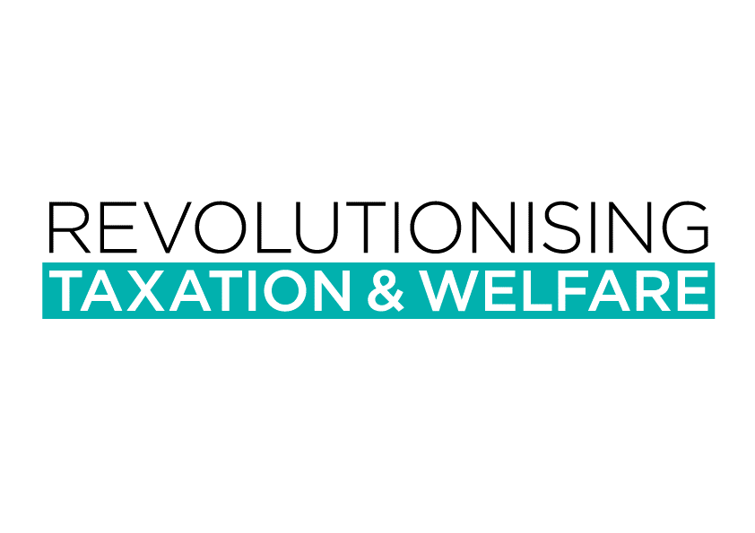

 
\newpage

```{r setup, include=FALSE}
Platform <- "PC" #"PC" "Mac" "HeatherPC" 
if(Platform=="Mac") { 
 setwd("~/Book") 
} else if(Platform=="Mac") { 
  setwd("~/Documents/Book")
} else if(Platform=="HeatherPC") {  
  setwd("~/Github/TaxHeaven/taxheaven")
}

options(htmltools.dir.version = FALSE)
options(scipen=999)

library("tufte")
library("bookdown")
library("knitr")

# invalidate cache when the tufte version changes
knitr::opts_chunk$set(tidy = FALSE, cache.extra = packageVersion('tufte'))
knitr::opts_chunk$set(echo = TRUE)
```

 

# Acknowledgments

The editors would like to extend their gratitude to the authors and to all who have helped in the writing of this draft book, in particular to Heather McKay, Angela Dennis, Chris Crompton, Jiama, Selvin Kwong, Neale Upstone, John McCone, Jasper Sky, Thibault Laurentjoye, Mike Reiss, Sacha Anthony, Mat Sayer, Mark Wadsworth, Tom Ward, Dirk Heine, Drew Jackson, Sarah Hafner, Ian Cook, Jo Wheeler, Raj Ashok, and Christopher Downing for assistance, comments, conversations, support and work. Remembering Adrian Wrigley for introducing Stephen to many of the ideas herein.
\newpage

# **PART I: IDEAS**

The first part of the book is a three-scene drama in time and space. The first scene is set in the mid atlantic in the present day exploring collective risk; the second takes us through history of ideas exploring economic justice; the third is on some imagined island exploring ideas of how our economies work.

\newpage

```{r child = '01-APerfectStorm.Rmd'}
```

\newpage

```{r child = '02-RevolutionsInTheMindsOfMen.Rmd'}
```

\newpage

```{r child = '03-DesertIslandEconomics.Rmd'}
```

\newpage

# **PART II: PRINCIPLES**

The part act defines the questions of this book, tries to answer what might be the principles of a good economy and therefore a good taxation system.

\newpage

```{r child = '04-QuestionsPosedByThisBook.Rmd'}
```

\newpage

```{r child = '05-TaxInPrinciple.Rmd'}
```

\newpage

```{r child = '06-TaxInPractice.Rmd'}
```

\newpage

# **PART III: INDIVIDUALS AND COMPANIES**

\newpage

```{r child = '07-WelfareAndWork.Rmd'}
```

\newpage

```{r child = '08-Inequality.Rmd'}
```

\newpage

```{r child = '09-Corporations.Rmd'}
```


# **PART IV: LAND, FINANCE AND ENVIRONMENT**

\newpage

```{r child = '10-LandAndProperty.Rmd'}
```

\newpage

```{r child = '11-MoneyDebtAndFinance.Rmd'}
```

\newpage

```{r child = '12-EnvironmentAndResources.Rmd'}
```


\newpage

# **PART V: PROPOSALS**

\newpage

```{r child = '14-Conclusions.Rmd'}
```


# BIBLIOGRAPHY